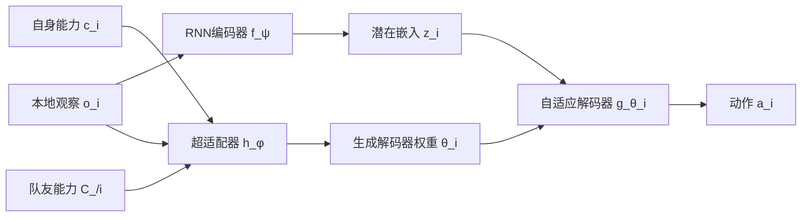

# Capability-Aware Shared Hypernetworks for Flexible Heterogeneous Multi-Robot Coordination

**相关性评分**: 8.0/10

**排名**: #2

---

## 基本信息

- **arXiv ID**: [2501.06058v5](https://arxiv.org/abs/2501.06058v5)
- **发布时间**: 2025-01-10T15:39:39Z
- **相关性评分**: 8.0/10
- **是否相关**: 是

## 作者

Kevin Fu, Shalin Anand Jain, Pierce Howell, Harish Ravichandar

## 关键词

Robot control, quadruped robot locomotion, reinforcement learning (RL), multi-agent RL, CTDE methods, Edge Deployment, humanoid robot, robot dog, mujoco, local observational information

## 一句话总结

该论文提出了一种基于超网络的软权重共享架构CASH，用于异构多机器人协调，通过编码机器人能力实现零样本泛化，并在多种学习范式和平台上验证了其性能优势。

## 摘要

Recent advances have enabled heterogeneous multi-robot teams to learn complex and effective coordination skills. However, existing neural architectures that support heterogeneous teaming tend to force a trade-off between expressivity and efficiency. Shared-parameter designs prioritize sample efficiency by enabling a single network to be shared across all or a pre-specified subset of robots (via input augmentations), but tend to limit behavioral diversity. In contrast, recent designs employ a separate policy for each robot, enabling greater diversity and expressivity at the cost of efficiency and generalization. Our key insight is that such tradeoffs can be avoided by viewing these design choices as ends of a broad spectrum. Inspired by recent work in transfer and meta learning, and building on prior work in multi-robot task allocation, we propose Capability-Aware Shared Hypernetworks (CASH), a soft weight sharing architecture that uses hypernetworks to efficiently learn a flexible shared policy that dynamically adapts to each robot post-training. By explicitly encoding the impact of robot capabilities (e.g., speed and payload) on collective behavior, CASH enables zero-shot generalization to unseen robots or team compositions. Our experiments involve multiple heterogeneous tasks, three learning paradigms (imitation learning, value-based, and policy-gradient RL), and SOTA multi-robot simulation (JaxMARL) and hardware (Robotarium) platforms. Across all conditions, we find that CASH generates appropriately-diverse behaviors and consistently outperforms baseline architectures in terms of performance and sample efficiency during both training and zero-shot generalization, all with 60%-80% fewer learnable parameters.

## 详细分析

## 论文摘要：CASH：面向灵活异构多机器人协调的能力感知共享超网络

### 1. 研究背景和动机
异构多机器人团队（如具有不同速度、载重能力的机器人）在复杂任务中展现出巨大潜力，但现有协调策略的神经网络架构往往在**表达力**和**效率**之间面临权衡。**共享参数**架构样本效率高但限制了行为多样性；**独立策略**架构能实现多样化行为，但参数多、效率低，且无法泛化到未见过的机器人。本文旨在设计一种既能实现**多样化行为**，又能**高效学习**并**零样本泛化**到新机器人或新团队组合的灵活策略。

### 2. 核心方法和技术创新
本文提出了**能力感知共享超网络（CASH）**，这是一种新颖的**软参数共享**架构。其核心创新在于：
- **模块化设计**：包含一个共享的**RNN编码器**、一个由**超网络适配器**动态生成权重的**自适应解码器**。超网络以机器人自身能力、队友能力及局部观察为条件，为每个机器人在每个时间步生成独特的解码器参数。
- **关键技术**：通过**超网络**实现了**软权重共享**，使策略参数能根据机器人能力和上下文动态调整，从而在单一共享架构中编码了多样化和自适应的行为。
- **核心优势**：在保持所有**可学习参数共享**（高样本效率）的同时，允许**策略参数**随机器人和情境变化（高行为多样性），并支持对机器人能力的**在线适应**。

### 3. 主要实验结果
在**JaxMARL**（仿真）和**Robotarium**（实物）平台上，使用灭火、采矿、物料运输、捕食者-猎物等异构任务，并结合模仿学习、QMIX、MAPPO三种学习范式进行验证：
- **性能与效率**：CASH在训练和零样本泛化中，**性能均优于或匹配**独立策略和现有共享参数基线，同时**可学习参数减少60%-80%**，样本效率显著提升。
- **泛化能力**：在**未见过的机器人能力**和**团队组合**上，CASH的成功率下降幅度最小，展现出卓越的零样本泛化能力。
- **实际部署**：在实物机器人实验中，CASH能产生有效的角色分配和协调轨迹，并能更好地适应**在线能力变化**（如故障、电池衰减）。

### 4. 研究意义和价值
CASH在异构多机器人学习领域建立了**软参数共享**这一新范式，有效弥合了共享与独立参数架构之间的鸿沟。其价值在于：
- **理论贡献**：提供了一种灵活、高效的架构，可同时优化行为多样性、样本效率和泛化能力。
- **实用价值**：使学得的策略能直接部署到能力未知或动态变化的真实机器人团队中，提升了多机器人系统的**适应性**和**鲁棒性**。
- **广泛适用性**：架构与学习范式无关，可兼容模仿学习、值函数和策略梯度强化学习，具有广泛的适用前景。

## 问答对

### 问题 1

**Q**: 这篇论文的核心创新点是什么，他想解决什么问题，怎么解决的？

**A**: ## 论文核心分析：CASH（能力感知共享超网络）

### **一、 核心问题**
论文旨在解决**异构多机器人协同学习**中的一个核心矛盾：**行为多样性与学习效率/泛化能力之间的权衡**。

- **现有方法的局限**：
    - **共享参数架构**：所有机器人共享同一套策略网络参数。**优点**：样本效率高、利于合作、能泛化到未见过的机器人。**缺点**：难以学习多样化的角色和行为，限制了异构团队的优势。
    - **独立参数架构**：为每个机器人学习独立的策略。**优点**：能产生高度多样化和鲁棒的行为。**缺点**：样本效率低、参数多、无法泛化到训练中未出现过的机器人或团队组合。
    - **选择性参数共享**：在预设的机器人类型组内共享参数。**优点**：在效率和多样性间取得折中。**缺点**：仍无法泛化到新类型，且需预先定义分组。

论文的核心洞察是，这些方法并非互斥，而是构成了一个**设计谱系**。CASH的目标是建立一种能**自适应地跨越这个谱系**的架构。

### **二、 核心创新点**
提出了 **Capability-Aware Shared Hypernetworks (CASH)**，一种 **“软权重共享”** 的神经网络架构。其创新性体现在：

1.  **架构创新：引入超网络实现动态策略生成**
    - **核心机制**：使用一个**共享的超网络**，根据每个机器人的**实时观察**和**自身及队友的能力向量**，动态生成其策略解码器的权重。
    - **结果**：实现了 **“策略参数因机器人而异，但所有可学习参数（编码器和超网络的参数）在所有机器人间共享”**。这本质上是**软权重共享**在多机器人领域的应用。

2.  **方法创新：显式且动态的能力感知**
    - **显式编码**：将机器人的能力（如速度、载重、感知半径）作为超网络的直接输入，而非仅仅隐含在观察中。
    - **动态适应**：由于策略权重在每个时间步动态生成，CASH能够**在部署后在线适应**机器人能力的突然变化（如故障、电池衰减）。

3.  **性能创新：同时实现多个理想特性**
    CASH旨在**同时获得**：
    - **高样本效率**（得益于参数共享）。
    - **丰富的行为多样性**（得益于动态生成的、机器人特定的策略）。
    - **零样本泛化能力**（能直接部署到能力值在训练分布内但具体组合未见过的新机器人或团队）。
    - **范式通用性**（兼容模仿学习、值函数RL、策略梯度RL）。

### **三、 解决方案：CASH架构详解**
CASH包含三个核心模块，工作流程如下：

1.  **RNN编码器**：处理机器人的局部观察序列，提取与机器人无关的上下文信息，生成潜在嵌入 `z_i`。
2.  **超适配器**：一个**共享的超网络**。输入为：机器人自身的观察 `o_i`、自身能力 `c_i`、所有队友的能力 `C_/i`。输出为当前机器人策略解码器的权重 `θ_i`。
3.  **自适应解码器**：一个结构固定（如MLP）但**权重由超适配器实时生成**的网络。它将编码器的潜在嵌入 `z_i` 映射为最终的动作（或价值估计）。

**关键特性**：
- **共享与个性化的统一**：`f_ψ` 和 `h_φ` 的参数在所有机器人间共享，实现了高效学习；而每个机器人的解码器权重 `θ_i` 是独特的，实现了行为个性化。
- **能力驱动**：能力向量是策略生成的关键条件，使策略能明确地基于物理特性进行推理。
- **完全去中心化执行**：每个机器人仅需本地观察和已知的能力信息即可运行。

### **四、 实际价值与验证**
论文通过大量实验证明了CASH的优越性：

- **实验设置全面**：
    - **任务**：灭火、采矿、物料运输、捕食者-猎物。
    - **学习范式**：QMIX（值函数RL）、MAPPO（策略梯度RL）、DAgger（模仿学习）。
    - **平台**：JaxMARL（高性能仿真）、Robotarium（真实机器人实验平台）。

- **核心结果**：
    1.  **优于独立策略**：在达到相当甚至更高任务性能的同时，**样本效率更高**，且使用参数减少60%-80%，并能**泛化到新机器人**（而独立策略不能）。
    2.  **优于传统共享策略**：在样本效率、最终性能、**零样本泛化到未见过的团队/能力**方面均显著优于基线（RNN-IMP, RNN-EXP）。
    3.  **自动学习适度多样性**：通过SND指标衡量，CASH学习到的行为多样性水平是“适度的”——足以完成任务并支持泛化，但避免了独立策略可能产生的“多余”且无益的多样性。
    4.  **支持在线适应**：在机器人能力发生**在线突变**（如故障）或**渐变**（如电池衰减）的场景下，CASH策略表现出的性能下降远小于基线，证明了其动态适应能力。
    5.  **成功部署于真实机器人**：在Robotarium硬件上的实验验证了CASH在现实物理约束下的有效性和鲁棒性。

**总结**：CASH的核心贡献在于提出并验证了一种**新颖的“软共享”架构范式**，它通过**超网络动态生成机器人特定策略**，巧妙地统一了共享架构的效率/泛化优势与独立架构的多样性优势，为构建**灵活、高效、可泛化的异构多机器人系统**提供了有力的技术工具。

### 问题 2

**Q**: 请用一段话总结这篇论文，明确说明：论文试图解决的核心问题；提出的主要方法或框架；最终取得的主要效果或结论。要求语言简洁、信息密度高，不要复述摘要原文。

**A**: 这篇论文旨在解决异构多机器人协同中**策略架构在表达力与效率之间的权衡问题**。现有方法要么采用共享参数网络（效率高但行为多样性受限），要么为每个机器人训练独立策略（行为多样但效率低且无法泛化）。为此，论文提出了**能力感知共享超网络（CASH）**，这是一种**软参数共享**架构，其核心创新在于使用一个共享的超网络，根据每个机器人的实时观测和自身/团队能力，动态生成其策略解码器的参数。这种方法使得一个共享架构能够编码**机器人特定和上下文特定**的多样化行为。实验表明，CASH在多种任务和学习范式下，不仅**样本效率和参数效率显著更高**（参数减少60%-80%），性能优于基线，而且能实现**对未见过的机器人、团队组合及能力变化的零样本泛化**，同时自动学习到**适度的行为多样性**，其有效性在仿真和真实机器人平台上均得到了验证。

### 问题 3

**Q**: 这篇论文相对于已有工作有哪些明确的创新点？请逐条列出，并对每一条说明：相比以往方法改进或不同之处在哪里，以及该创新解决了什么具体问题或带来了什么优势。

**A**: ## 论文创新点分析

这篇论文提出的 **CASH（Capability-Aware Shared Hypernetworks）** 架构在异构多机器人协调学习领域引入了多项明确的创新。以下是其核心创新点及其与已有工作的对比和优势：

### 1. **提出“软参数共享”架构，填补了“完全共享”与“完全独立”策略之间的空白**
   - **改进/不同之处**：
     - **以往方法**：现有架构通常分为两类：1) **完全共享参数**（所有机器人使用同一网络，通过输入附加信息如唯一ID来区分），牺牲了行为多样性；2) **完全独立参数**（每个机器人有独立策略），牺牲了样本效率和泛化能力。选择性参数共享（按类型分组）是折中方案，但仍无法泛化到新机器人类型。
     - **CASH**：引入**软参数共享**，通过超网络动态生成每个机器人的解码器权重。所有**可学习参数**（编码器和超网络）是共享的，但每个机器人的**策略参数**（解码器权重）是即时生成且独特的。
   - **解决的问题/优势**：
     - 同时实现了**样本效率**（参数共享）和**行为多样性**（动态适应），避免了传统架构的取舍。
     - 建立了从“完全共享”到“完全独立”的连续谱系，为异构协调提供了更灵活的设计范式。

### 2. **利用超网络显式编码机器人能力，实现零样本泛化到未见过的机器人或团队组合**
   - **改进/不同之处**：
     - **以往方法**：共享参数方法通常通过附加**唯一ID**或隐式从观察中推断能力来区分机器人，这无法泛化到训练中未出现的机器人（ID是固定的）或能力分布外的情况。
     - **CASH**：超网络**显式地**以机器人的**能力向量**（如速度、载荷）和当前观察作为输入，动态生成策略权重。能力信息是结构化、可泛化的描述符。
   - **解决的问题/优势**：
     - 实现了**零样本泛化**：训练后，可直接部署到能力值不同或团队构成全新的机器人上，无需重新训练。
     - 解决了实际应用中团队组成运行时才确定、或机器人能力可能退化（如电池耗尽）的关键挑战。

### 3. **实现了策略的动态在线适应能力**
   - **改进/不同之处**：
     - **以往方法**：大多数策略在部署后是静态的。即使参数共享方法能处理不同机器人，也无法在单个任务执行过程中适应机器人能力的**实时变化**（如突发故障）。
     - **CASH**：由于超网络在**每个时间步**都根据当前能力和观察重新生成解码器权重，因此策略可以即时适应能力的在线变化。
   - **解决的问题/优势**：
     - 增强了系统的**鲁棒性**：能够处理任务执行中的机器人故障（如速度下降）、电池衰减等动态变化。
     - 这是向更真实、更灵活的多机器人系统迈出的重要一步。

### 4. **统一的架构兼容多种学习范式，且参数效率极高**
   - **改进/不同之处**：
     - **以往方法**：许多先进架构与特定学习算法（如仅适用于某类RL）紧密耦合。独立策略参数庞大，样本效率低。
     - **CASH**：论文在**模仿学习（DAgger）、值函数RL（QMIX）、策略梯度RL（MAPPO）** 三种不同范式中成功应用了同一CASH架构核心。
     - 同时，CASH使用**少60%-80%的可学习参数**，达到了优于或媲美基线模型的性能。
   - **解决的问题/优势**：
     - **通用性强**：证明了该架构核心不依赖于特定学习算法，具有广泛适用性。
     - **参数高效**：大幅减少了模型参数量，降低了训练计算成本和过拟合风险，尤其在数据稀缺的模仿学习场景中优势明显。

### 5. **通过能力感知实现了“适度”的行为多样性，而非过多样或不足**
   - **改进/不同之处**：
     - **以往方法**：独立策略（INDV）可能产生与任务无关的“多余”行为多样性；而共享参数策略（RNN-IMP/EXP）则多样性不足，难以让异构机器人承担不同角色。
     - **CASH**：通过显式编码能力与行为的关系，CASH学习到的是**与任务绩效相关的、适度的行为多样性**。实验表明，其行为多样性（SND）低于INDV但高于RNN-EXP，同时取得了更高性能。
   - **解决的问题/优势**：
     - 避免了行为多样性的“过拟合”或“欠拟合”，使不同能力的机器人能自动学习到适合其特长的角色和策略，从而提升整体团队效率。

### 总结
CASH的核心创新在于**将超网络作为“策略调制器”**，创造性地将**机器人能力**这一先验知识作为生成动态、适应性策略的条件输入。这从根本上改变了异构多机器人策略的表示和学习方式，使其在**效率、多样性、泛化性和适应性**这几个传统上相互冲突的目标上取得了显著突破，并通过大量仿真和实物实验验证了其综合优势。

### 问题 4

**Q**: 论文在实验或评估中最终实现了怎样的效果？请说明使用了哪些数据集和评价指标，与哪些基线方法进行了对比，以及在关键指标上的主要性能提升或结论。如果论文未给出明确的定量结果，也请说明原因。

**A**: ## 论文实验与评估效果总结

该论文通过广泛的实验验证了**CASH（Capability-Aware Shared Hypernetworks）** 架构在异构多机器人协调任务中的优越性。实验涵盖了多种任务、学习范式和平台，并与主流基线方法进行了全面对比。

### 一、 使用的数据集/任务与评价指标

#### 1. 任务（模拟环境）
论文在两个主流的多智能体仿真平台上进行了评估：
*   **JaxMARL**：基于Jax的高性能MARL框架。
    *   **灭火任务**：3个机器人协作扑灭两处火源。机器人具有不同的**速度**和**水容量**。
    *   **采矿任务**：4个机器人从两个矿区采集两种资源并运送到投放点。机器人具有不同的**资源携带容量**。
*   **Robotarium**：一个公开的多机器人物理测试床及模拟器，提供真实的机器人动力学。
    *   **物料运输任务**：4个机器人从两个装载区卸载物料到投放区。机器人具有不同的**速度**和**载重能力**。
    *   **捕食者-猎物任务**：2个“感知”机器人和2个“捕获”机器人协作捕捉猎物。机器人具有不同的**感知半径**和**捕获半径**。

#### 2. 评价指标
*   **性能指标**：
    *   **训练回报**：训练期间累计奖励的总和（↑ 越高越好）。
    *   **成功率**：任务完成的比率（↑ 越高越好）。
    *   **奖励**：评估期间的平均每回合奖励（↑ 越高越好）。
    *   **完工时间**：完成任务所需的时间步长（↓ 越低越好）。
    *   **碰撞次数**：机器人之间的碰撞次数（↓ 越低越好）。
*   **效率与泛化指标**：
    *   **样本效率**：达到相同或更高性能所需的环境交互数据量（↑ 越少越好）。
    *   **可学习参数量**：策略网络的总参数数量（↓ 越少越好）。
    *   **零样本泛化能力**：在**未见过的机器人**或**团队组合**上部署训练好的策略，无需额外训练。
    *   **在线适应能力**：在策略执行过程中，适应机器人能力（如速度衰减、故障）的动态变化。
*   **行为多样性指标**：
    *   **系统神经多样性**：衡量不同机器人在相同观察下策略输出的差异程度（↕ 适中为好，需与任务性能结合判断）。

### 二、 对比的基线方法

论文将CASH与三类代表性的基线架构进行对比，涵盖了异构多智能体学习的常见设计选择：

1.  **INDV（独立策略）**：为每个机器人训练一个完全独立的策略网络（无参数共享）。**优势**：理论上可实现最大行为多样性。**劣势**：参数多、样本效率低、无法泛化到新机器人。
2.  **RNN-IMP（隐式共享）**：所有机器人共享一个RNN编码器-MLP解码器网络，仅通过观察序列**隐式**推断机器人能力。
3.  **RNN-EXP（显式共享）**：所有机器人共享一个网络，但将机器人能力向量**显式拼接**在观察向量后作为输入。这是许多现有工作中处理异构性的标准方法。
4.  **RNN-ID（ID共享）**：在附录中对比，将机器人唯一ID（如one-hot编码）作为输入，是另一种常见的共享参数方法，但无法泛化到新ID的机器人。

### 三、 关键性能提升与结论

#### 1. **综合性能与样本效率**
*   **结论**：CASH在**所有任务和所有学习范式**（QMIX、MAPPO、DAgger）下，均取得了**最高或相当的性能**（回报/成功率），同时展现出**最优的样本效率**（更快达到高性能）。
*   **数据支持**：如图3所示，CASH的训练回报曲线收敛更快、最终值更高。在模仿学习（数据稀缺）场景下，CASH的优势尤为明显。

#### 2. **参数效率**
*   **结论**：CASH在实现更优性能的同时，使用了**比所有基线少60%-80%的可学习参数**。
*   **数据支持**：论文中多处表格（如Tab. 2）和图示（如Fig. 2底部）明确列出了CASH与基线（RNN-IMP/EXP）的参数数量对比，CASH参数量显著更低（例如，在Robotarium任务中，CASH为~162K，而基线为~401K）。

#### 3. **零样本泛化能力**
*   **结论**：CASH在**泛化到未见过的机器人能力和团队组合**方面**显著优于所有共享参数基线**。
*   **数据支持**：表1是关键证据。在“分布外”测试中，CASH的成功率下降幅度最小。例如，在灭火任务中使用QMIX训练时，RNN-EXP在分布外测试上的成功率从0.97骤降至0.56，而CASH仅从0.96降至0.67。这表明CASH通过超网络对能力进行显式建模，学到了更本质的“能力-行为”映射关系。

#### 4. **行为多样性**
*   **结论**：CASH能够**自动学习到与任务性能相匹配的、适当水平的行为多样性**。
*   **数据支持**：与INDV相比（图2），CASH的SND值更低但任务性能相当甚至更好，说明INDV产生了“多余”的、无助于任务的行为差异。与RNN-EXP相比（表1，SND列），CASH通常能产生更高的行为多样性，且这种多样性伴随着更好的泛化性能，表明多样性是有效泛化的有益条件。

#### 5. **在线适应与硬件部署**
*   **结论**：CASH能够有效适应**执行过程中机器人能力的动态变化**（如故障、电池衰减），并且在**真实物理机器人**上表现优异。
*   **数据支持**：
    *   **在线适应**：表3显示，在“故障”和“电池衰减”场景下，CASH的性能下降幅度小于基线，奖励更高，完工时间更短。
    *   **硬件部署**：表2的“真实”列显示，在Robotarium真实机器人上部署时，CASH在奖励和完工时间上均优于基线的最佳种子模型。

#### 6. **扩展到更大团队**
*   **结论**：CASH可以**零样本部署到更大的团队**（如从4个机器人扩展到12个），并保持竞争力。
*   **数据支持**：附录表16显示，在12个机器人的物料运输和捕食者-猎物任务中，CASH的任务完成率均达到或超过基线。

### 总结
论文通过系统性的实验证明，CASH架构成功地在**表达力**（行为多样性）和**效率**（参数/样本效率）之间取得了最佳平衡，并额外获得了强大的**零样本泛化**和**在线适应**能力。它不仅在模拟环境中全面超越了现有的独立策略和共享策略基线，其优势也成功迁移到了真实的物理机器人系统上，展示了其实际应用价值。

## 相关链接

- [arXiv 页面](https://arxiv.org/abs/2501.06058v5)
- [HTML 版本](https://arxiv.org/html/2501.06058v5)
