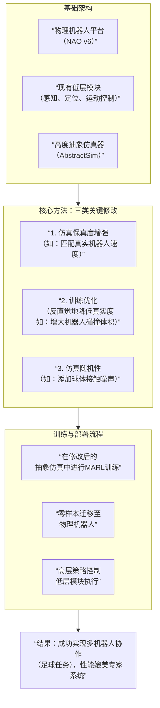

# Multi-Robot Collaboration through Reinforcement Learning and Abstract Simulation

**相关性评分**: 7.0/10

**排名**: #10

---

## 基本信息

- **arXiv ID**: [2503.05092v1](https://arxiv.org/abs/2503.05092v1)
- **发布时间**: 2025-03-07T02:23:24Z
- **相关性评分**: 7.0/10
- **是否相关**: 是

## 作者

Adam Labiosa, Josiah P. Hanna

## 关键词

multi-agent RL, Robot control, Edge Deployment

## 一句话总结

该论文研究通过抽象模拟器进行多智能体强化学习，以训练物理机器人的协作行为，并探讨策略转移的关键修改。

## 摘要

Teams of people coordinate to perform complex tasks by forming abstract mental models of world and agent dynamics. The use of abstract models contrasts with much recent work in robot learning that uses a high-fidelity simulator and reinforcement learning (RL) to obtain policies for physical robots. Motivated by this difference, we investigate the extent to which so-called abstract simulators can be used for multi-agent reinforcement learning (MARL) and the resulting policies successfully deployed on teams of physical robots. An abstract simulator models the robot's target task at a high-level of abstraction and discards many details of the world that could impact optimal decision-making. Policies are trained in an abstract simulator then transferred to the physical robot by making use of separately-obtained low-level perception and motion control modules. We identify three key categories of modifications to the abstract simulator that enable policy transfer to physical robots: simulation fidelity enhancements, training optimizations and simulation stochasticity. We then run an empirical study with extensive ablations to determine the value of each modification category for enabling policy transfer in cooperative robot soccer tasks. We also compare the performance of policies produced by our method with a well-tuned non-learning-based behavior architecture from the annual RoboCup competition and find that our approach leads to a similar level of performance. Broadly we show that MARL can be use to train cooperative physical robot behaviors using highly abstract models of the world.

## 详细分析

## 论文摘要

**1. 研究背景和动机**
当前，为物理机器人训练协作策略的主流方法是使用高保真度模拟器结合强化学习（RL）。然而，构建高保真模拟器成本高昂且需要大量领域知识。受人类通过抽象心智模型进行协作的启发，本研究探索了一个相反方向：**能否使用高度抽象的模拟器进行多智能体强化学习（MARL），并将学到的策略成功部署到物理机器人团队上？** 抽象模拟器对世界进行高层级、简化的建模，忽略了许多低层细节。

**2. 核心方法和技术创新**
本研究提出了一套在抽象模拟器中训练并实现**零次迁移（Zero-Shot Transfer）** 到物理机器人的框架。核心创新在于识别并系统化了三类关键的模拟器与训练调整：
- **模拟保真度增强**：调整关键参数（如机器人速度）以缩小与现实世界的差距。
- **训练优化**：**反直觉地降低某些方面的真实性**（如增大机器人碰撞体积、缩小球门），以简化学习过程、促进协作行为的出现，平衡了模拟中的可学习性与现实中的可迁移性。
- **模拟随机性**：在难以精确建模的环节（如机器人与球的接触）添加噪声，以提升策略的鲁棒性。

**3. 主要实验结果**
在双足机器人（NAO）的协作足球任务上进行了大量实验与消融研究：
- **成功迁移**：在抽象模拟器中训练的MARL策略能够成功迁移到物理机器人，完成基本的协作足球和静态防守任务。
- **性能可比**：训练出的策略在测试场景中达到了与RoboCup标准平台联赛冠军团队（B-Human）精心调校的非学习行为架构相近的性能水平。
- **关键因素**：消融实验表明，**添加球接触噪声**对迁移成功影响最大，而**训练优化**（如增大智能体尺寸）对于学习复杂协作行为至关重要。

**4. 研究意义和价值**
本研究证明了**无需高保真模拟器**，仅利用抽象模型也能通过MARL为物理机器人训练出有效的协作策略。这为多机器人系统提供了一种**更高效、更易开发的范式**：
- **降低开发门槛**：抽象模拟器更易于构建和迭代，减少了对复杂物理建模的依赖。
- **提升学习效率**：简化模型能加速训练，便于算法和奖励函数的调试。
- **启发新方向**：揭示了“为促进学习而适当降低真实性”这一反直觉原则的有效性，为后续的仿真到现实迁移研究提供了新思路。

## 问答对

### 问题 1

**Q**: 这篇论文的核心创新点是什么，他想解决什么问题，怎么解决的？

**A**: ## 论文核心分析

### 一、 研究问题
这篇论文旨在解决一个核心矛盾：**如何利用数据高效但高度抽象的仿真环境来训练多机器人协作策略，并成功将其部署到物理机器人上**。

- **背景与矛盾**：当前多智能体强化学习（MARL）的成功大多依赖于高保真仿真，因为数据收集成本低。然而，为物理机器人构建高保真仿真器需要大量领域知识且计算昂贵。另一方面，人类进行协作规划时，依赖的是对世界动态的**抽象心理模型**，而非精确的物理仿真。
- **核心研究问题**：能否使用这种**抽象仿真器**进行MARL训练，并将学到的协作策略**零样本**迁移到真实的物理机器人团队上？

### 二、 核心创新点
论文的核心创新点不是提出一个新的MARL算法，而是**构建并验证了一套在抽象仿真中进行MARL训练并实现成功Sim2Real迁移的系统性方法框架**。具体包括：

1.  **方法论创新**：明确提出了利用抽象仿真进行多机器人MARL训练并实现迁移的三大关键修改类别，形成了一个可操作的框架。
2.  **反直觉发现**：挑战了“仿真保真度越高，真实世界性能越好”的常见假设。论文发现，有时**故意降低仿真器的某些真实度**（作为“训练优化”），反而能促进MARL学到更好的协作策略，从而提升最终在真实机器人上的性能。
3.  **实证验证**：在真实的足式机器人（NAO）上进行了系统的实验和消融研究，证明了该方法的可行性，并且其性能与经过精心调校的传统非学习方法（RoboCup冠军代码）相当。

### 三、 解决方案
论文的解决方案是一个多层次、系统化的工程与方法论框架，如下图所示：

**具体实施步骤：**

1.  **硬件与架构基础**：
    - 使用NAO v6人形机器人。
    - **分层架构**：利用现成的、鲁棒的低层模块（来自RoboCup冠军团队B-Human）处理感知、定位和底层运动控制。MARL只负责训练**高层决策策略**，输出如“前进”、“转向”、“踢球”等高级指令。

2.  **抽象仿真器**：
    - 使用一个高度简化的仿真器（AbstractSim）。机器人用方块表示，运动是即时的（忽略动量、步态），球体动力学也被大幅简化。
    - **优势**：比高保真仿真快30倍，易于构建和迭代。

3.  **实现Sim2Real迁移的三类关键修改**：
    - **仿真保真度增强**：有选择地增加关键细节的真实性。例如，调整仿真中机器人的移动角速度和线速度，以匹配物理机器人的实际能力。
    - **训练优化**：**（最具创新性）** 为了平衡“仿真中的可学习性”和“真实世界的可迁移性”，故意降低某些方面的真实度。例如：
        - **增大训练中的机器人尺寸**：使智能体更容易学习到保持协作距离。
        - **缩小训练中的球门尺寸**：迫使策略学习更精确的射门。
        - **移除踢球延迟**：简化仿真动力学，帮助智能体更快地学会“踢球”动作而非总是“推球”。
    - **仿真随机性**：在难以精确建模的环节添加噪声以提高策略的鲁棒性。例如，在球与机器人的接触动力学中添加均匀噪声，以模拟真实世界中的不确定性。

4.  **训练与评估**：
    - 使用独立PPO算法在修改后的抽象仿真中训练协作策略。
    - 设计两个足球协作任务进行评估：“基础足球”和“静态防守者”。
    - 通过大量消融实验，验证了每一类修改的必要性。其中，**添加球体接触噪声被证明对迁移成功最为关键**，它能有效防止策略对简化的仿真动力学过拟合。

### 四、 实际价值与意义
- **降低多机器人系统开发门槛**：提供了一条不依赖昂贵高保真仿真或真实世界海量数据采集的路径，使利用MARL开发复杂多机器人协作行为变得更加可行。
- **启发新的研究方向**：关于“**仿真保真度与学习效率/迁移性能的权衡**”的发现，为后续研究提供了重要洞见，即最优的仿真环境不一定是保真度最高的，而是最有利于学习到鲁棒、可迁移策略的。
- **推动机器人智能化**：向让机器人具备类似人类的抽象推理和规划能力迈出了一步，即基于对任务的高层理解进行决策，而非纠缠于底层物理细节。

**总结**：这篇论文的核心贡献在于**实证并方法化地证明了，通过精心设计的、不一定追求高保真的抽象仿真，结合分层控制架构，能够有效地训练出可迁移到真实物理机器人的多智能体协作策略**，为多机器人强化学习的实际应用开辟了一条高效且实用的新路径。

### 问题 2

**Q**: 请用一段话总结这篇论文，明确说明：论文试图解决的核心问题；提出的主要方法或框架；最终取得的主要效果或结论。要求语言简洁、信息密度高，不要复述摘要原文。

**A**: 这篇论文旨在解决一个核心问题：**能否使用高度抽象的仿真器（而非高保真仿真）通过多智能体强化学习（MARL）来训练物理机器人的协作行为，并实现有效的零次策略迁移（sim2real）**。针对此问题，论文提出了一个基于**抽象仿真**的MARL训练框架，其核心方法在于识别并系统性地应用三类仿真与训练修改来弥合“现实鸿沟”：1) **仿真保真度增强**（如调整机器人速度以匹配现实）；2) **训练优化**（反直觉地降低某些仿真真实性以促进协作学习，如增大机器人尺寸、缩小球门）；3) **仿真随机性**（在难以精确建模的交互中引入噪声，如球-机器人接触）。最终，通过在机器人足球任务上的大量消融实验，论文得出结论：该方法成功地将抽象仿真中训练的协作策略部署到双足机器人（NAO）上，其性能与经过精心调校的RoboCup冠军行为架构相当，从而证明了**即使使用高度抽象的世界模型，MARL也能成为开发物理机器人协作行为的有效工具**。

### 问题 3

**Q**: 这篇论文相对于已有工作有哪些明确的创新点？请逐条列出，并对每一条说明：相比以往方法改进或不同之处在哪里，以及该创新解决了什么具体问题或带来了什么优势。

**A**: ## 论文创新点分析

这篇论文的核心是探索使用**高度抽象的仿真器**来训练多机器人协作策略，并实现向物理机器人的零样本迁移。其创新点明确且具有系统性，具体如下：

---

### 1. **研究范式的创新：系统性地论证并验证了“抽象仿真”用于多智能体强化学习的可行性**
- **相比以往方法的改进/不同之处**：
    - **主流方法**：当前机器人学习领域，尤其是涉及Sim2Real（从仿真到现实）的研究，普遍依赖**高保真度仿真器**（如Isaac Gym, MuJoCo）来尽可能逼真地模拟物理细节，以缩小“现实鸿沟”。
    - **本文方法**：反其道而行之，明确提出并系统研究使用**低保真度的抽象仿真器**。这种仿真器仅对任务进行高层级、概念性的建模（例如，将双足机器人简化为可移动的红色矩形框，忽略腿部动力学、动量等细节），而丢弃了大量可能影响决策的低级世界细节。
- **解决的具体问题/带来的优势**：
    - **降低了仿真开发门槛和成本**：抽象仿真器更易于创建，所需的领域专业知识更少，且计算速度极快（比文中的高保真仿真快30倍），便于快速迭代MARL训练设置（如奖励函数设计）。
    - **验证了高层协作对低级细节的鲁棒性**：论文的核心结论是，对于以**高层推理和协作**为核心的任务（如机器人足球），精细的低级物理建模可能并非必要。这为机器人协作学习提供了一条更高效、更易实现的路径。
    - **启发了新的研究方向**：将研究焦点从“如何让仿真无限接近现实”部分转向“如何设计最小化但足够有效的抽象模型”，以完成特定协作任务。

### 2. **方法论的创新：识别并系统归类了实现“抽象仿真到现实”迁移的三类关键修改**
论文没有停留在概念验证，而是深入提炼了使抽象仿真中训练的MARL策略能够成功迁移到物理机器人的具体工程方法，并将其归纳为三个类别：
- **仿真保真度增强**：有选择地增加关键细节的真实性（如调整机器人移动速度以匹配实体机器人）。
- **训练优化**：**反直觉地降低某些方面的真实性**以促进仿真中的有效学习。
- **仿真随机性**：在难以精确建模的环节（如机器人-球接触）添加噪声，以提升策略的鲁棒性。

- **相比以往方法的改进/不同之处**：
    - **系统性归纳**：以往的工作可能零散地使用过其中某些技术（如领域随机化），但本文首次在“抽象仿真”这一特定范式下，系统性地识别、定义并实验验证了这三类修改的必要性和作用。
    - **强调“降低真实性以促进学习”**：第二类“训练优化”是本文一个**尤为突出的发现**。它明确指出，在抽象仿真中，盲目增加真实性有时会阻碍协作行为的学习，而**战略性简化**（如增大训练中的机器人碰撞体积、缩小球门尺寸、移除踢球延迟）反而能让智能体在仿真中学到更鲁棒、更易于迁移的协作策略。
- **解决的具体问题/带来的优势**：
    - **提供了可操作的框架**：为后续研究者利用抽象仿真进行多机器人学习提供了一个清晰的、包含具体措施的“配方”或检查清单。
    - **深化了对Sim2RAI的理解**：揭示了在抽象仿真范式中，仿真设计的核心矛盾不是简单的“真实 vs 不真实”，而是**仿真中的可学习性**与**到现实的迁移性**之间的平衡艺术。
    - **提高了方法实用性**：通过这套方法，成功地在高度抽象的仿真中训练出策略，并在实体NAO机器人上实现了与精心调校的非学习型方法（RoboCup冠军代码）相媲美的协作性能。

### 3. **实验验证的创新：在复杂的多足机器人（双足人形）协作任务上进行全面的消融研究**
- **相比以往方法的改进/不同之处**：
    - **任务与平台复杂度**：许多使用抽象仿真或分层RL的工作聚焦于**轮式机器人导航**或**单智能体**任务。本文则将方法应用于**多智能体、双足人形机器人**的动态协作任务（足球），其动作空间和平衡控制更为复杂。
    - **全面的消融分析**：论文设计了**大量的消融实验**（见文中图表），不仅在实体机器人上测试，还辅以高保真仿真进行大规模验证。实验逐一评估了三类修改中每个具体措施（如是否添加球接触噪声、是否使用大尺寸智能体训练等）对最终任务成功率和得分时间的影响。
- **解决的具体问题/带来的优势**：
    - **提供了坚实的经验证据**：通过消融研究，**量化了**每项修改的贡献。例如，实验明确指出“球接触噪声”是影响迁移成功的最关键因素，而“观察噪声”则影响较小。这使结论非常扎实，超越了单纯的可行性演示。
    - **增强了结论的说服力**：在实体机器人（而非仅仿真中）验证性能，并与领域内顶尖手工设计方法对比，强有力地证明了该方法的**实际价值和应用潜力**。
    - **为社区提供了基准和分析洞见**：详细的实验结果和分析为后续研究提供了宝贵的参考，指明了在类似任务中应优先考虑哪些方面的调整。

---

### **总结**
本文的核心创新在于**范式、方法和验证**三个层面的有机结合：
1.  **提出新范式**：挑战了“高保真仿真为Sim2Real必需”的主流观点，论证了抽象仿真的可行性。
2.  **提炼新方法**：系统总结出平衡学习与迁移的三类关键修改，其中“为学习而简化”的洞见尤为深刻。
3.  **完成新验证**：在复杂多足机器人协作场景中，通过详实的消融实验与实体部署，全面验证了范式的有效性和方法的实用性。

这些创新共同为解决多机器人协作策略的数据收集难题提供了一条**更高效、更低成本**的可行路径，降低了利用MARL训练实体机器人团队的技术门槛。

### 问题 4

**Q**: 论文在实验或评估中最终实现了怎样的效果？请说明使用了哪些数据集和评价指标，与哪些基线方法进行了对比，以及在关键指标上的主要性能提升或结论。如果论文未给出明确的定量结果，也请说明原因。

**A**: ## 论文实验效果总结

该论文通过物理机器人实验和高保真仿真实验，验证了**在高度抽象的仿真环境中使用多智能体强化学习（MARL）训练的策略，能够成功迁移到真实足式机器人上，并实现有效的协作行为**。

### 1. 实验任务与数据集
- **任务**：基于机器人足球的协作任务。
    - **基础足球任务**：两个机器人合作将球踢入空场球门。
    - **静态防守者任务**：在基础任务上增加一个静止的防守机器人作为障碍，任务更具挑战性。
- **数据集/场景**：**无外部数据集**。实验在自定义的物理场地和仿真环境中进行。每个任务设计了**3个不同的初始配置**（如图6所示），以测试不同场景下的协作能力。
- **平台**：
    - **物理机器人**：两个NAO v6仿人机器人。
    - **仿真环境**：
        - **抽象仿真**：用于策略训练的低保真、高度抽象的仿真器（AbstractSim）。
        - **高保真仿真**：基于Open Dynamics Engine的物理仿真器，用于作为真实世界性能的替代评估。

### 2. 评价指标
1.  **成功率**：在限定时间内成功将球踢入球门的试验比例。
2.  **得分时间**：在成功的试验中，从开始到进球所花费的平均时间（单位：仿真步长或秒）。

### 3. 对比的基线方法
论文进行了两类对比：
1.  **内部消融实验**：将提出的完整方法（Full MARL）与移除了某个关键修改的变体进行对比，以验证每个修改的必要性。这些变体对应论文提出的三大类修改：
    - **仿真保真度增强**：例如，使用“大位移”（Large Displacement）参数，使仿真中机器人移动速度远快于真实机器人。
    - **训练优化**：例如，使用“真实尺寸智能体”（Realistic Agent Size），即仿真中机器人尺寸与真实尺寸一致。
    - **仿真随机性**：例如，“无球接触噪声”（No Ball Noise）。
2.  **外部基线对比**：与**B-Human**行为架构进行对比。B-Human是RoboCup标准平台联赛的冠军团队所使用的、经过大量人工精心调校的非学习型行为代码，代表了该领域手工设计方法的最高水平。

### 4. 关键性能结果与结论
综合物理实验（图4）和高保真仿真实验（图5）的结果，主要结论如下：

- **核心验证成功**：在抽象仿真中训练的MARL策略能够**零样本**迁移到物理机器人上，并成功完成协作任务。这是论文最重要的实证贡献。
- **与顶尖手工方法性能相当**：在设计的测试场景中，**Full MARL方法的性能与B-Human基线相当**。例如，在多个测试场景中，两者的成功率都达到或接近100%，且得分时间相近。这证明了基于抽象仿真的MARL方法可以产出具有实用价值的高层协作策略。
- **消融实验揭示关键因素**：
    - **最重要的修改是“仿真随机性”**：**添加球接触噪声**对成功迁移的影响最大。没有它，策略在抽象仿真中过度拟合了完美的物理模型（倾向于推球而非踢球），导致在真实世界中完全失败（成功率接近0%）。
    - **“训练优化”具有反直觉效果**：**有意降低某些方面的仿真保真度反而提升了真实性能**。例如，将仿真中的机器人尺寸**增大四倍**、将球门尺寸**减小一半**，有助于智能体学习更鲁棒、更具协作性的策略（如保持更佳距离、踢球更精准），从而更好地应对真实世界的不确定性。
    - **“仿真保真度增强”需谨慎平衡**：调整机器人的移动速度以匹配真实速度是必要的。但过度追求保真度（如使用“大位移”）会破坏仿真中的可学习性，导致策略无法在仿真中学会协作，进而无法迁移。
- **任务难度影响**：在更简单的“基础足球任务”中，各种方法表现都较好。在更复杂的“静态防守者任务”中，**Full MARL方法的优势更为明显**，其性能下降远小于某些消融变体，显示了其学习到的策略更具适应性和鲁棒性。

**总结**：论文通过系统的实验表明，**无需高保真物理仿真，仅通过精心设计的抽象仿真结合三类关键修改（保真度增强、训练优化、随机性），MARL就能训练出可迁移、且性能媲美顶尖手工代码的多机器人协作策略**。这为降低多机器人系统开发的数据和计算成本提供了可行路径。

## 相关链接

- [arXiv 页面](https://arxiv.org/abs/2503.05092v1)
- [HTML 版本](https://arxiv.org/html/2503.05092v1)
