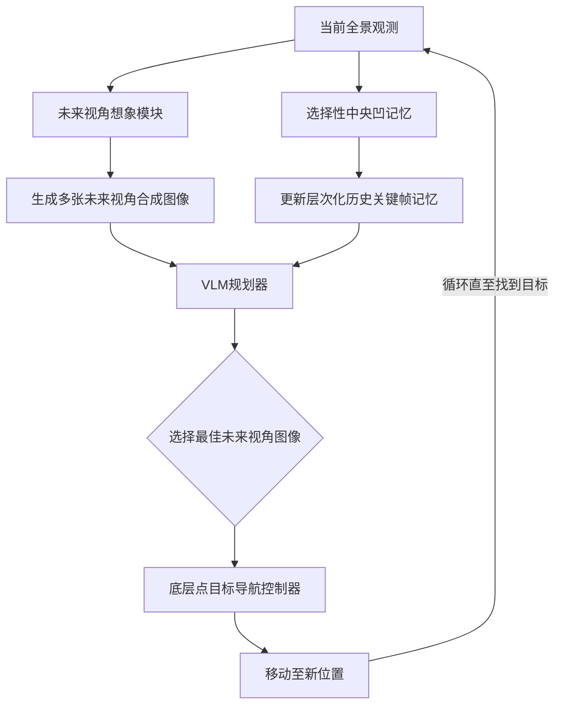

# ImagineNav++: Prompting Vision-Language Models as Embodied Navigator through Scene Imagination

**相关性评分**: 8.0/10

**排名**: #4

---

## 基本信息

- **arXiv ID**: [2512.17435v1](https://arxiv.org/abs/2512.17435v1)
- **发布时间**: 2025-12-19T10:40:16Z
- **相关性评分**: 8.0/10
- **是否相关**: 是

## 作者

Teng Wang, Xinxin Zhao, Wenzhe Cai, Changyin Sun

## 关键词

Vision-Language-Action Model, VLA for Robotics, Inference Efficiency, Lightweight Architecture, Edge Deployment

## 一句话总结

ImagineNav++ 提出一种基于视觉语言模型（VLM）的无地图导航框架，通过场景想象和选择性注视记忆机制，将导航规划转化为简单的视图选择问题，在机器人视觉导航中实现高效推理和空间感知。

## 摘要

Visual navigation is a fundamental capability for autonomous home-assistance robots, enabling long-horizon tasks such as object search. While recent methods have leveraged Large Language Models (LLMs) to incorporate commonsense reasoning and improve exploration efficiency, their planning remains constrained by textual representations, which cannot adequately capture spatial occupancy or scene geometry--critical factors for navigation decisions. We explore whether Vision-Language Models (VLMs) can achieve mapless visual navigation using only onboard RGB/RGB-D streams, unlocking their potential for spatial perception and planning. We achieve this through an imagination-powered navigation framework, ImagineNav++, which imagines future observation images from candidate robot views and translates navigation planning into a simple best-view image selection problem for VLMs. First, a future-view imagination module distills human navigation preferences to generate semantically meaningful viewpoints with high exploration potential. These imagined views then serve as visual prompts for the VLM to identify the most informative viewpoint. To maintain spatial consistency, we develop a selective foveation memory mechanism, which hierarchically integrates keyframe observations via a sparse-to-dense framework, constructing a compact yet comprehensive memory for long-term spatial reasoning. This approach transforms goal-oriented navigation into a series of tractable point-goal navigation tasks. Extensive experiments on open-vocabulary object and instance navigation benchmarks show that ImagineNav++ achieves SOTA performance in mapless settings, even surpassing most map-based methods, highlighting the importance of scene imagination and memory in VLM-based spatial reasoning.

## 详细分析

## 论文摘要：ImagineNav++: Prompting Vision-Language Models as Embodied Navigator through Scene Imagination

**1. 研究背景和动机**
视觉导航是家庭服务机器人执行长时程任务（如物体搜索）的基础能力。现有方法多依赖大型语言模型进行常识推理，但其规划过程受限于文本表示，难以捕捉对导航决策至关重要的空间占用和场景几何信息。本研究旨在探索视觉语言模型是否能够仅依靠机载RGB/RGB-D流实现**无地图视觉导航**，以释放其空间感知与规划潜力。

**2. 核心方法和技术创新**
本文提出了**ImagineNav++**框架，其核心创新在于将复杂的导航规划转化为一个简单的“最佳视角图像选择”问题，供VLM处理。具体包括：
- **未来视角想象模块**：通过**Where2Imagine**模型学习人类导航习惯，预测具有高探索潜力的未来3D路径点，并利用新颖视图合成模型生成对应的未来观测图像，作为VLM的视觉提示。
- **选择性注视记忆机制**：模仿人类注视机制，利用DINOv2模型根据语义相似性，以**从稀疏到密集**的层次化方式整合历史关键帧观测，构建紧凑且全面的场景记忆，以支持长期空间推理。
- **整体流程**：框架将目标导向的导航任务分解为一系列可处理的点目标导航子任务，通过VLM在想象的未来视图和结构化历史记忆中进行推理，选择最佳探索方向。

**3. 主要实验结果**
在开放词汇的物体导航和实例图像导航基准测试上，ImagineNav++在**无地图设置**下取得了领先的性能：
- **物体导航**：在复杂的HM3D和HSSD数据集上，成功率分别大幅提升4.0%和23.5%，甚至在Gibson数据集上超越了多数基于地图的方法。
- **实例导航**：在HM3D数据集上取得了最高的**SPL**（路径长度加权成功率），证明了其卓越的导航效率。
- 消融实验证实了**想象模块**和**记忆模块**对性能提升的关键作用。

**4. 研究意义和价值**
ImagineNav++的创新价值在于：
- **技术范式转变**：成功将VLM转化为高效的具身导航智能体，无需微调，避免了传统级联方法中建图、翻译、规划的复杂流程及其累积误差。
- **实用性强**：纯视觉、无地图的方案降低了对精确传感器和实时计算的依赖，提升了系统的鲁棒性和部署灵活性。
- **启发性**：揭示了**场景想象**与**场景记忆**在基于VLM的空间推理中的重要性，为未来基于基础模型的机器人导航研究提供了新思路。未来工作可向多模态目标指定、降低延迟以实现实时部署等方向拓展。

## 问答对

### 问题 1

**Q**: 这篇论文的核心创新点是什么，他想解决什么问题，怎么解决的？

**A**: ## 论文核心分析：ImagineNav++

### **一、 论文拟解决的核心问题**
论文旨在解决**开放词汇、无地图的视觉导航**问题，特别是**目标导向导航**。传统方法（尤其是基于LLM的）存在以下关键瓶颈：
1.  **依赖复杂的地图构建**：需要精确的深度感知和定位（SLAM），容易产生累积误差，且计算开销大。
2.  **信息损失**：将丰富的视觉场景（几何、空间关系）压缩为文本描述后输入LLM，丢失了关键的细粒度空间和几何信息，导致规划模糊。
3.  **流程繁琐**：典型的“建图 → 文本翻译 → LLM规划 → 路径执行”级联流程脆弱且低效。

**核心研究问题**：能否绕过复杂的建图流程，直接利用预训练的**视觉语言模型**，仅凭机载RGB/RGB-D流实现高效的空间感知与规划？

### **二、 核心创新点**
ImagineNav++ 的核心创新在于提出了一种 **“基于场景想象的视觉提示”** 范式，将复杂的导航规划转化为VLM擅长的**最佳视角图像选择**问题。具体包含三大创新模块：

#### **1. 未来视角想象模块**
- **创新思路**：不直接让VLM输出3D路径点（VLM不擅长），而是让它从一组**想象出的未来观测图像**中做选择。
- **关键技术**：
    - **Where2Imagine模型**：一个轻量级网络，通过**蒸馏人类导航习惯**（使用Habitat-Web的人类演示数据训练），从当前观测预测具有高探索潜力的未来3D路径点（相对位姿 `Δx, Δy, Δθ`）。
    - **新颖视图合成**：使用预训练的扩散模型（如Polyoculus），根据当前图像和预测的位姿，**合成**未来路径点处的观测图像。这些合成图像作为VLM的**视觉提示**。

#### **2. 选择性中央凹记忆机制**
- **创新思路**：模仿人类视觉的“中央凹”机制，构建一个**稀疏到密集的层次化记忆**，以紧凑且全面的方式存储历史观测，支持长期空间推理。
- **关键技术**：
    - **基于DINOv2的关键帧提取**：利用自监督视觉模型DINOv2计算帧间语义相似度，将冗长的观测序列分割成语义段，并选取最具代表性的**关键帧**。
    - **分层记忆结构**：将记忆分为**近期**、**中期**、**远期**三部分，并设置不同的关键帧密度阈值（`τ_r > τ_m > τ_d`）。近期记忆密集，保留细节；远期记忆稀疏，保持全局结构一致性。这有效避免了信息冗余和遗忘。

#### **3. 基于VLM的规划范式转换**
- **创新范式**：将**长视距目标导航**分解为一系列**点目标导航**子任务。在每个规划周期：
    1.  想象模块生成多个未来视角的图像。
    2.  VLM（如GPT-4o-mini）接收**历史关键帧记忆**和**多张想象图像**作为视觉提示，通过设计好的文本指令，**选择**最有利于找到目标的最佳视角图像。
    3.  底层控制器执行标准的点目标导航策略，移动到该视角对应的位置。
- **优势**：充分利用了VLM强大的**多图像判别和分析能力**，规避了其不擅长直接进行3D几何推理的弱点。整个流程**无需对VLM进行微调**，实现了零样本泛化。

### **三、 解决方案总结**
论文通过一个**紧密耦合的三阶段循环**解决了无地图开放词汇导航问题：

**核心解决路径**：**想象 → 选择 → 执行**。通过“想象”提供丰富的空间选项，通过“记忆”维持时空一致性，最终将导航这个复杂的空间决策问题，转化为VLM擅长的多选一视觉问答问题。

### **四、 实际价值与效果**
- **性能**：在多个标准基准测试上达到**SOTA**。在复杂的HM3D和HSSD数据集上，**零样本物体目标导航成功率**显著超过大多数基于地图的方法，在**实例图像目标导航**上取得了最高的路径效率指标。
- **实用性**：
    - **无地图**：降低了对昂贵、易出错的深度传感器和SLAM的依赖，系统更鲁棒。
    - **零样本/开放词汇**：可直接处理未见过的物体类别或特定实例，无需任务特定训练。
    - **计算高效**：记忆机制极度压缩了历史信息（平均仅约20个关键帧），降低了VLM的输入开销。
- **启示**：展示了如何通过**巧妙的提示工程和模块设计**，将现有强大的基础模型（VLMs）的能力“接地”到具体的具身任务中，为机器人灵巧操作等复杂任务提供了新思路。

### 问题 2

**Q**: 请用一段话总结这篇论文，明确说明：论文试图解决的核心问题；提出的主要方法或框架；最终取得的主要效果或结论。要求语言简洁、信息密度高，不要复述摘要原文。

**A**: 这篇论文旨在解决开放词汇目标导航任务中，传统基于大语言模型（LLM）的级联方法因依赖建图和文本表示而导致的效率低下、误差累积及空间感知能力不足的问题。为此，作者提出了 **ImagineNav++** 框架，其核心创新在于将复杂的导航规划转化为一个由视觉语言模型（VLM）执行的“最佳视角图像选择”问题。该方法通过一个从人类导航习惯中学习的 **Where2Imagine** 模块来生成具有高探索价值的未来视点，并利用新视角合成技术生成对应的想象观测图像作为VLM的视觉提示；同时，设计了一个 **选择性中央凹记忆** 机制，以稀疏到密集的方式分层整合历史关键帧，为VLM提供长期空间推理所需的紧凑场景表示。实验结果表明，该框架在无需建图、无需微调VLM的情况下，在多个开放词汇物体导航和实例图像导航基准测试中取得了最先进的性能，甚至在成功率等指标上超越了大多数基于地图的方法，验证了场景想象与记忆在基于VLM的空间推理中的关键作用。

### 问题 3

**Q**: 这篇论文相对于已有工作有哪些明确的创新点？请逐条列出，并对每一条说明：相比以往方法改进或不同之处在哪里，以及该创新解决了什么具体问题或带来了什么优势。

**A**: ## 论文创新点分析

这篇论文《ImagineNav++: Prompting Vision-Language Models as Embodied Navigator through Scene Imagination》提出了一种全新的、无地图的、开放词汇的视觉导航框架。其核心创新在于**将复杂的导航规划问题转化为一个基于视觉语言模型（VLM）的“最佳视角图像选择”问题**，从而绕过了传统方法中繁琐且易出错的建图、翻译、规划级联流程。

以下是其相对于已有工作的明确创新点：

### 1. **“想象-选择”导航范式**
   - **改进/不同之处**：传统基于LLM的导航方法依赖于将环境（通常是语义地图）转换为文本描述，再由LLM生成文本形式的导航计划。本文则完全摒弃了显式建图和文本转换，提出**“未来视角想象”** 模块，直接生成未来潜在视点的**图像**，并让VLM从这些图像中选择最佳探索方向。
   - **解决的问题/优势**：
     - **解决了文本表示的空间信息丢失问题**：文本难以精确描述场景几何、空间占用和细粒度物体细节，而图像作为VLM的提示，能保留丰富的空间和语义信息。
     - **规避了建图误差累积**：无需依赖可能出错的深度估计和定位模块进行实时建图，提高了系统在未知环境中的鲁棒性。
     - **利用了VLM的强项**：VLM擅长图像理解和判别（如多选任务），而非直接进行3D几何推理。本范式将导航规划转化为VLM擅长的任务。

### 2. **基于人类导航习惯的“Where2Imagine”模块**
   - **改进/不同之处**：并非随机或基于简单规则（如均匀采样）生成候选视点，而是**通过从人类演示数据（Habitat-Web）中蒸馏学习**，训练一个轻量级模型（ResNet-18）来预测具有高探索潜力的、符合人类直觉的未来导航路径点。
   - **解决的问题/优势**：
     - **解决了候选视点生成的质量问题**：生成的视点倾向于通往语义上重要的结构（如门、走廊），这些结构通常能促进高效探索，避免了随机采样可能产生的无效或不可达视点。
     - **桥接了高层规划与底层控制**：该模块将任务无关的VLM规划器与具体的、符合人类习惯的导航行为连接起来，使规划更具方向性和效率。

### 3. **选择性中央凹记忆机制**
   - **改进/不同之处**：不同于简单地存储所有历史观测（冗余且低效）或仅存储文本摘要（丢失视觉细节），本文提出一种**分层稀疏-稠密记忆框架**。它利用预训练的视觉基础模型（DINOv2）根据语义相似性提取关键帧，并对近期、中期、远期记忆采用**不同的关键帧密度阈值**（近期最密，远期最稀疏）。
   - **解决的问题/优势**：
     - **解决了长期时空推理中的信息冗余与遗忘问题**：通过语义关键帧提取，构建了一个紧凑且信息丰富的场景表示，大大减少了输入VLM的token数量，提升了推理效率。
     - **模仿了人类的视觉记忆机制**：近期记忆保持高细节以支持精细操作，远期记忆保留全局结构以维持空间一致性，从而支持更鲁棒的长期规划和环路检测。
     - **减轻了对不完美NVS合成的依赖**：历史记忆提供了更可靠的环境表示，部分补偿了由视图合成模型生成图像可能存在的瑕疵。

### 4. **将目标导向导航分解为序列化点目标导航任务**
   - **改进/不同之处**：整个框架的运行机制是迭代式的。在每一轮中，VLM通过“想象-选择”确定一个最佳的子目标（一个3D路径点），然后由**一个成熟、高效的低层点目标导航策略**（如VER）执行到达该点的动作。到达后，更新记忆，开始下一轮循环。
   - **解决的问题/优势**：
     - **将复杂的长视距导航问题简化**：避免了端到端直接学习长序列动作的困难，将规划（由VLM负责）与控制（由专用策略负责）解耦。
     - **实现了训练免费的零样本泛化**：整个高层规划流水线（想象、记忆、VLM选择）无需针对特定导航任务进行微调，直接利用预训练模型，实现了真正的开放词汇和零样本能力。

### 5. **统一的框架适配多任务（ObjectNav 和 InsINav）**
   - **改进/不同之处**：论文展示了同一套ImagineNav++框架，在**仅需最小架构调整**的情况下，即可同时胜任**物体目标导航**（根据类别寻找物体）和**实例图像目标导航**（根据参考图像寻找特定物体实例）两种任务。
   - **解决的问题/优势**：
     - **证明了方法的通用性和可迁移性**：许多先前工作针对单一任务设计。本框架的核心创新（想象、记忆、VLM选择）是任务无关的，只需调整给VLM的提示词中的目标描述（文本类别 vs. 参考图像），即可适应不同任务，展现了强大的灵活性。

**总结**：ImagineNav++的核心创新在于通过 **“场景想象”** 将VLM的视觉理解能力与导航决策直接挂钩，并辅以 **“类人视点预测”** 和 **“仿生分层记忆”** ，构建了一个高效、鲁棒、无需建图、且能零样本泛化的导航智能体。它在多个标准基准测试上达到了领先水平，特别是在**无地图**设置下，其性能甚至超越了大多数依赖地图的方法，凸显了其创新范式的实际价值。

### 问题 4

**Q**: 论文在实验或评估中最终实现了怎样的效果？请说明使用了哪些数据集和评价指标，与哪些基线方法进行了对比，以及在关键指标上的主要性能提升或结论。如果论文未给出明确的定量结果，也请说明原因。

**A**: ## 实验与评估效果总结

### 数据集与评价指标
- **数据集**：
    - **Object-Goal Navigation (ObjectNav)**：Gibson（27个场景，6个对象类别）、HM3D（20个环境，6个对象类别）、HSSD（40个合成场景，6个对象类别）。
    - **Instance-Image-Goal Navigation (InsINav)**：HM3D数据集。
- **评价指标**：
    - **Success Rate (SR)**：代理在目标对象1米内执行`Stop`动作的成功率。
    - **Success weighted by Path Length (SPL)**：结合路径长度的加权成功率，衡量导航效率。

### 基线方法对比
- **ObjectNav**：
    - **非零样本方法**：FBE（基于前沿探索）、SemExp（语义地图探索）、Habitat-Web（模仿学习）、OVRL（视觉表示学习）。
    - **零样本方法**：
        - **基于地图的方法**：ESC、VoroNav、VLFM、Goat、SG-Nav、UniGoal。
        - **无地图方法**：ZSON、PixNav、PSL、ImagineNav（前作）。
- **InsINav**：
    - **监督方法**：Krantz et al.、OVRL-v2-IIN。
    - **零样本方法**：Mod-IIN、Goat、UniGoal、PSL。

### 关键性能提升与结论
#### 1. **ObjectNav任务**
- **主要结果**（见表I）：
    - **HM3D**：ImagineNav++达到**SR 58.5%**、**SPL 26.6%**，在**无地图开放词汇方法中排名第一**，显著超过前作ImagineNav（SR 53.0%）及其他基线（如VoroNav SR 42.0%、UniGoal SR 54.5%）。
    - **HSSD**：达到**SR 64.5%**、**SPL 27.9%**，**均为最高性能**。
    - **Gibson**：达到SR 72.4%、SPL 42.8%，在无地图方法中表现优异（但低于依赖地图的VLFM的84.0% SR）。
- **关键结论**：
    - **无地图优势**：在复杂场景（HM3D、HSSD）中，ImagineNav++的性能**超越多数基于地图的方法**，证明了其鲁棒性和部署灵活性。
    - **想象力模块上限**：使用真实图像替代NVS合成图像（Oracle实验）时，性能进一步提升（HM3D SR 62.5%），表明NVS质量是当前性能瓶颈，未来改进空间大。

#### 2. **InsINav任务**
- **主要结果**（见表II）：
    - **HM3D**：ImagineNav++达到**SR 52.4%**、**SPL 32.8%**。
    - **SPL显著领先**：在**路径效率上达到SOTA**（比UniGoal的23.7%高出9.1个百分点），证明其能减少冗余探索。
    - **无地图对比**：在同等无地图条件下，大幅超过PSL（SR 23.0%）。
- **关键结论**：
    - **任务通用性**：仅需最小架构调整即可适应InsINav，展示了框架的强泛化能力。

#### 3. **消融实验分析**
- **核心模块贡献**（见表III）：
    - **想象力模块**：引入未来视图想象使ObjectNav SR提升12.0%（55.0% → 43.0%）。
    - **Where2Imagine模块**：进一步将SR提升9.0%（使用真实图像时）。
    - **选择性聚焦记忆**：最终将SR提升至67.0%（使用NVS时），并**缓解NVS合成缺陷带来的性能下降**。
- **模块设计分析**：
    - **想象视野T**：T=11时取得最佳平衡（见图5），避免局部陷阱或长程决策错误。
    - **骨干网络**：轻量级ResNet-18在预测和导航性能上均优于ViT、DINOv2等（见表IV）。
    - **记忆配置**：分层阈值策略（近期密、远期疏）在保持高性能的同时，将平均记忆帧数压缩至约20帧，提升推理效率（见表V）。
    - **VLM选择**：GPT-4o-mini在保持高性能的同时，成本比GPT-4-Turbo降低约98%（见表VI）。

#### 4. **失败案例分析**
- **主要失败原因**（见图10）：
    1. **NVS合成错误**：生成虚假物体导致VLM推理错误。
    2. **仿真器标注遗漏**：导致“虚假失败”。
    3. **目标视觉模糊**：代理无法识别目标而提前终止。

### 总结
ImagineNav++在**无地图、开放词汇导航任务中实现了SOTA或竞争性性能**，核心创新点（未来视图想象、选择性聚焦记忆）被实验验证为有效。其**高效路径规划能力（高SPL）和强泛化性**是突出优势，但性能受限于NVS合成质量。未来可通过改进NVS模型或引入终身学习机制进一步提升。

## 相关链接

- [arXiv 页面](https://arxiv.org/abs/2512.17435v1)
- [HTML 版本](https://arxiv.org/html/2512.17435v1)
