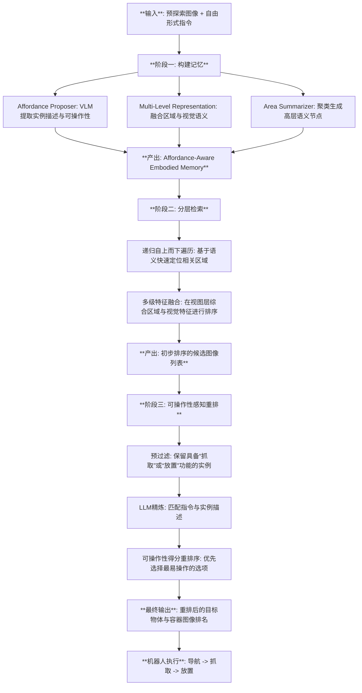

# Affordance RAG: Hierarchical Multimodal Retrieval with Affordance-Aware Embodied Memory for Mobile Manipulation

**相关性评分**: 7.0/10

**排名**: #11

---

## 基本信息

- **arXiv ID**: [2512.18987v1](https://arxiv.org/abs/2512.18987v1)
- **发布时间**: 2025-12-22T02:55:25Z
- **相关性评分**: 7.0/10
- **是否相关**: 是

## 作者

Ryosuke Korekata, Quanting Xie, Yonatan Bisk, Komei Sugiura

## 关键词

Vision-Language-Action Model, VLA for Robotics, Inference Efficiency, Lightweight Architecture, Edge Deployment

## 一句话总结

这篇论文提出了一种基于分层多模态检索和可操作感知记忆的零样本框架，用于开放词汇移动操作任务，通过检索和重排序提高机器人在真实环境中的执行成功率。

## 摘要

In this study, we address the problem of open-vocabulary mobile manipulation, where a robot is required to carry a wide range of objects to receptacles based on free-form natural language instructions. This task is challenging, as it involves understanding visual semantics and the affordance of manipulation actions. To tackle these challenges, we propose Affordance RAG, a zero-shot hierarchical multimodal retrieval framework that constructs Affordance-Aware Embodied Memory from pre-explored images. The model retrieves candidate targets based on regional and visual semantics and reranks them with affordance scores, allowing the robot to identify manipulation options that are likely to be executable in real-world environments. Our method outperformed existing approaches in retrieval performance for mobile manipulation instruction in large-scale indoor environments. Furthermore, in real-world experiments where the robot performed mobile manipulation in indoor environments based on free-form instructions, the proposed method achieved a task success rate of 85%, outperforming existing methods in both retrieval performance and overall task success.

## 详细分析

## 论文摘要：Affordance RAG: 用于移动操作的、具备可供性感知具身记忆的分层多模态检索

### 1. 研究背景和动机
随着机器人在家庭、医院等真实环境中的部署日益增多，对能够理解和执行**自由形式自然语言指令**的系统的需求日益增长。本研究聚焦于**开放词汇移动操作**任务，即机器人需根据语言指令，在环境中识别并操作指定的物体和容器。该任务面临两大核心挑战：**开放词汇的语义理解**（如区分“水瓶”和“乳液瓶”）和**可供性感知推理**（即判断物体是否可被抓取或放置）。现有基于视觉语言模型的检索方法通常缺乏对机器人操作可行性的考量，导致检索出的目标可能在物理上无法操作，从而造成下游执行失败。

### 2. 核心方法和技术创新
本文提出了 **Affordance RAG**，一个**零样本分层多模态检索框架**，其核心创新在于构建了**可供性感知的具身记忆**，并基于此进行检索。主要技术创新点包括：
- **Affordance-Aware Embodied Memory**：在预探索阶段，利用视觉提示技术，通过VLM（如GPT-4o）从图像中提取**实例级描述**（如“红色金属杯”）和预测**机器人可供性**（如“抓取”、“放置”得分），构建一个包含从可供性、实例、视图到区域等多层节点的结构化记忆。
- **分层多模态检索**：检索过程分为三步：1）**递归自上而下遍历**，基于区域语义（如“卧室”）快速筛选候选区域；2）**多级融合**，将高层区域语义特征与低层视觉语义特征（来自BEiT-3等模型）加权融合，实现互补检索；3）**可供性感知重排序**，利用LLM对候选实例进行描述匹配，并最终根据可供性得分重排序，优先选择**语义相关且易于操作**的选项。

### 3. 主要实验结果
- **仿真基准测试**：在新构建的大规模室内环境基准**WholeHouse-MM**上，Affordance RAG在目标物体、容器及整体检索的Recall@10指标上，分别以49.9%、24.3%和37.1%显著优于所有基线方法（如BEiT-3、Embodied-RAG）。
- **真实世界实验**：在真实室内环境中，搭载该方法的移动操作机器人执行了40次自由指令任务。**完整版Affordance RAG取得了85%的任务成功率**，比最佳基线（BEiT-3，45%）高出40个百分点。**消融实验**表明，移除可供性得分重排序模块后，成功率下降至70%，验证了该模块对于提升实际执行成功率的关键作用。

### 4. 研究意义和价值
本研究的意义在于：
- **方法论价值**：首次将**可供性感知**深度集成到具身记忆构建与分层检索框架中，为解决开放词汇移动操作中**语义匹配与物理可行性脱节**的根本问题提供了新思路。
- **实用价值**：所提方法在**无需任务特定训练**（零样本）的情况下，在仿真和真实环境中均实现了优异的检索与任务执行性能，推动了**基于基础模型的机器人系统**向更实用、更鲁棒的方向发展。
- **资源贡献**：公开的WholeHouse-MM基准为社区提供了评估大规模、自由指令下移动操作检索性能的标准平台。

## 问答对

### 问题 1

**Q**: 这篇论文的核心创新点是什么，他想解决什么问题，怎么解决的？

**A**: ## 论文核心分析

### **一、 研究问题**
论文旨在解决 **开放词汇移动操作** 问题。具体场景是：机器人在一个预先探索过的室内环境中，接收一条自由形式的自然语言指令（例如：“请把纸巾拿到厨房台面上”），它需要：
1.  **理解指令**：识别出指令中指定的“目标物体”和“目标容器”。
2.  **检索与决策**：从海量的环境图像记忆中，检索出最合适的物体和容器图像。
3.  **执行操作**：基于检索结果，实际完成“拾取-搬运-放置”的移动操作任务。

**核心挑战**在于：
- **开放词汇理解**：指令中的物体和容器描述是自由、多样的，并非预定义的固定类别。
- **可操作性推理**：检索出的候选物体必须能被机器人实际抓取，候选容器必须有合适的空间放置物体。现有方法常因忽略这种“功能适宜性”而导致下游操作失败。
- **检索效率与精度**：在包含数百张图像的大规模场景中，直接使用视觉语言模型评估所有候选图像计算成本过高，且容易混淆视觉相似但语义不同的物体。

### **二、 核心创新点**
论文提出了 **Affordance RAG** 框架，其创新性主要体现在以下三个层面：

#### **1. 方法框架创新：分层多模态检索**
- **核心思想**：摒弃传统的“扁平化”相似度匹配，构建一个**分层的、具身化的记忆结构**，并在此基础上进行**从粗到细的层次化检索**。
- **关键组件**：
    - **Affordance-Aware Embodied Memory**：一个结构化的环境记忆，节点从低到高包括：**可操作性层**、**实例层**、**视图层**、**区域层**、**建筑层**。这使记忆不仅包含“有什么”，还包含“能做什么”。
    - **递归自上而下遍历**：从高层（如区域）开始，基于语义相似度快速筛选出相关区域，逐步缩小搜索范围，提升效率。
    - **多级特征融合**：在视图层，**融合高层区域语义特征和低层视觉语义特征**进行互补检索，兼顾全局语境和细粒度视觉匹配。

#### **2. 技术模块创新：可操作性感知**
- **Affordance Proposer**：利用**视觉提示技术**，驱动VLM（如GPT-4o）从图像中提取**实例级的描述**（如“红色金属杯”）并预测其**机器人可操作性**（如“可抓取”得分）。这超越了依赖固定类别标签的物体检测方法。
- **Affordance-Aware Reranking**：一个三阶段重排序模块，专门解决“语义相关但不可操作”的问题：
    1.  **可操作性预过滤**：根据任务（抓取/放置）过滤掉不具备相应功能的实例。
    2.  **描述性实例检索**：使用LLM在小规模候选集中精炼匹配指令的实例描述。
    3.  **可操作性得分重排序**：最终根据可操作性得分对顶级候选进行重排序，优先选择**既语义相关又易于操作**的选项。

#### **3. 评估体系创新**
- 提出了 **WholeHouse-MM 基准测试**：基于真实室内场景数据集构建，包含**人工标注的自由形式指令**和**建筑级规模**的图像集，专门用于评估开放词汇移动操作中的多模态检索性能，弥补了现有基准的不足。

### **三、 解决方案总结**
**Affordance RAG 的解决路径可以概括为“建库 -> 检索 -> 重排”：**

### **四、 实际价值**
1.  **提升任务成功率**：在仿真基准测试中，检索性能显著超越所有基线方法；在**真实机器人实验中，任务成功率高达85%**，比最佳基线方法提升40个百分点。这证明了将可操作性推理融入检索流程对实际机器人执行至关重要。
2.  **实现零样本泛化**：框架基于预训练的基础模型，无需针对特定任务或环境进行微调，增强了系统的通用性和部署便捷性。
3.  **提供可解释性**：分层的记忆结构和基于描述的重排序过程，使得机器人的决策依据（为什么选A而不是B）更加透明，便于人类理解和调试。

**简而言之，这篇论文的核心贡献是提出了一个将**环境层次化语义理解**与**机器人可操作性推理**深度融合的检索框架，通过**先理解“是什么”，再判断“能不能做”**，显著提升了机器人在开放词汇指令下完成移动操作任务的鲁棒性和成功率。**

### 问题 2

**Q**: 请用一段话总结这篇论文，明确说明：论文试图解决的核心问题；提出的主要方法或框架；最终取得的主要效果或结论。要求语言简洁、信息密度高，不要复述摘要原文。

**A**: 这篇论文旨在解决**开放词汇移动操作（OVMM）** 中的核心挑战，即机器人如何根据自由形式的自然语言指令，在复杂室内环境中准确识别并成功抓取目标物体、放置到指定容器。现有方法通常缺乏对机器人**可操作性（affordance）** 的考量，导致检索到的物体可能视觉语义正确但物理上无法操作。

为此，论文提出了 **Affordance RAG** 框架。其核心创新在于构建了一个**分层多模态检索系统**，并引入了**可操作性感知的具身记忆（Affordance-Aware Embodied Memory）**。该方法通过视觉语言模型（VLM）预测实例级抓取/放置可操作性分数，并采用**分层检索策略**：先基于区域语义进行粗粒度筛选，再融合视觉语义进行细粒度排序，最后利用可操作性分数对候选目标进行重排序，优先选择更易执行操作的选项。

实验表明，该方法在构建的大规模基准测试（WholeHouse-MM）上，检索性能显著优于现有基线方法。在真实机器人实验中，**任务成功率达到了85%**，验证了其通过可操作性感知提升移动操作任务实际执行成功率的有效性。

### 问题 3

**Q**: 这篇论文相对于已有工作有哪些明确的创新点？请逐条列出，并对每一条说明：相比以往方法改进或不同之处在哪里，以及该创新解决了什么具体问题或带来了什么优势。

**A**: ## 论文创新点分析

这篇论文《Affordance RAG: Hierarchical Multimodal Retrieval with Affordance-Aware Embodied Memory for Mobile Manipulation》针对开放词汇移动操作任务，提出了一个名为 **Affordance RAG** 的零样本分层多模态检索框架。其核心创新点在于将**机器人可操作性** 与**分层语义检索** 深度融合，以解决现有方法在真实世界执行任务时的关键瓶颈。

以下是其相对于已有工作的明确创新点：

---

### 1. **提出了“可操作性感知的具身记忆”**
   - **相比以往方法的改进/不同之处：**
     - **以往方法：** 现有的具身记忆（如Embodied-RAG）或场景图方法（如3D场景图）主要关注环境中“有什么”（物体类别、空间关系），缺乏对机器人能否成功执行操作（如抓取、放置）的评估。
     - **本文方法：** 构建了**Affordance-Aware Embodied Memory**。该记忆不仅存储物体和区域的视觉、语义信息，还通过视觉提示大模型为每个物体实例预测并存储其**可操作性分数**（例如，针对“抓取”和“放置”动作的适合度）。
   - **解决的具体问题/带来的优势：**
     - **问题：** 现有检索方法可能返回语义正确但物理上无法操作的目标（例如，一个被卡住或形状难以抓取的瓶子），导致下游执行失败。
     - **优势：** 将可操作性作为记忆的一级属性，使系统在检索阶段就能优先考虑**可执行性**，从而直接提升后续机器人操作的成功率。

### 2. **设计了“分层多模态检索”框架，融合区域语义与视觉语义**
   - **相比以往方法的改进/不同之处：**
     - **以往方法：** 通常采用“扁平化”的相似度匹配。要么仅依赖**区域级高级语义**（如LLM生成的场景描述）进行粗粒度筛选，要么仅依赖**视觉级低级特征**（如CLIP的图像嵌入）进行细粒度匹配。两者是割裂的。
     - **本文方法：** 提出了**分层检索**与**多级融合**。流程为：1) **自上而下递归遍历**：从建筑、区域、区域等高层节点开始，基于文本嵌入相似度快速缩小搜索范围；2) **多级融合**：在视图级节点，将高层区域语义特征与低层视觉语义特征进行加权融合计算最终相似度。
   - **解决的具体问题/带来的优势：**
     - **问题：** 单一检索模式存在局限。纯视觉检索易混淆视觉相似但语义不同的物体；纯语义检索可能忽略关键的视觉细节。且在大规模场景（数百张图像）中，纯LLM推理选择节点效率低下。
     - **优势：**
       - **效率与精度平衡：** 分层遍历实现了从粗到细的快速筛选，大幅提升搜索效率。
       - **互补性增强：** 融合区域上下文（如“卧室的边桌”）和视觉细节（如“带有垂直板条的复古木制边桌”），使检索既能理解指令的全局语境，又能捕捉细微的指代表达，显著提高检索准确率。

### 3. **引入了“可操作性感知重排序”模块**
   - **相比以往方法的改进/不同之处：**
     - **以往方法：** 检索结果的排序通常只基于与指令的语义/视觉相似度，缺乏从机器人执行角度进行的优化排序。
     - **本文方法：** 在初步检索出Top-K候选后，引入一个三阶段重排序模块：1) **可操作性预过滤**：仅保留具有相关动作（抓取/放置）可操作性的实例；2) **描述性实例检索**：使用LLM在小规模候选集中，根据实例的详细描述评估其与指令的相关性；3) **可操作性分数重排序**：根据可操作性分数对顶级候选进行最终重排序。
   - **解决的具体问题/带来的优势：**
     - **问题：** 当指令存在歧义或环境中有多个语义正确的候选时，机器人可能选择一个难以操作的目标，导致任务失败。
     - **优势：** 在保证**语言相关性**的基础上，进一步优化了**执行适宜性**。实验表明，该模块（特别是ASR步骤）在真实世界实验中能将任务成功率提升15%。

### 4. **利用视觉提示生成实例级描述与可操作性预测**
   - **相比以往方法的改进/不同之处：**
     - **以往方法：** 依赖预定义的对象检测类别（如“杯子”、“桌子”）或通用的图像描述，缺乏对物体**实例特有属性**的细致描述，也无法直接关联到机器人动作。
     - **本文方法：** 通过**视觉提示**（如将分割掩码叠加索引号后输入VLM），让VLM生成丰富的**实例级描述**（如“红色金属马克杯”）并同时预测其对于特定机器人动作的**可操作性分数**。
   - **解决的具体问题/带来的优势：**
     - **问题：** 开放词汇指令常涉及对物体特定属性的指代，类别级标签无法满足需求。同时，可操作性评估需要结合具体物体的状态（如朝向、遮挡）。
     - **优势：**
       - **细粒度接地：** 实例级描述能更好匹配自由形式的语言指令。
       - **灵活可扩展：** 提示工程的方法使其无需重新训练即可轻松扩展到其他原子动作（如“打开”、“关闭”），增强了框架的通用性。

### 5. **构建并发布了“WholeHouse-MM”基准数据集**
   - **相比以往方法的改进/不同之处：**
     - **以往基准：** 现有移动操作基准多使用模板化指令，或场景规模较小（非建筑级），难以评估算法在真实、复杂环境下的检索能力。
     - **本文工作：** 基于Matterport3D数据集，构建了一个包含**建筑级规模**（平均每个环境590张图）、**人类标注自由形式指令**、专门针对**移动操作检索**任务的新基准。
   - **解决的具体问题/带来的优势：**
     - **问题：** 缺乏一个能同时评估开放词汇、细粒度指代、大规模场景下多模态检索性能的标准化基准。
     - **优势：** 为社区提供了一个更贴近真实应用场景的评估平台，促进了相关研究的公平比较与进展。

---

**总结而言**，本文的核心创新是**系统性地将可操作性推理嵌入到分层多模态检索的每一个关键环节**——从记忆构建、分层检索到结果重排序。这解决了现有机器人检索-执行范式中“**检索正确但无法执行**”的根本矛盾，从而在仿真和真实世界实验中均实现了检索精度和最终任务成功率的显著提升。

### 问题 4

**Q**: 论文在实验或评估中最终实现了怎样的效果？请说明使用了哪些数据集和评价指标，与哪些基线方法进行了对比，以及在关键指标上的主要性能提升或结论。如果论文未给出明确的定量结果，也请说明原因。

**A**: ## 实验与评估效果总结

论文通过**仿真基准测试**和**真实世界实验**全面评估了Affordance RAG方法的性能，在开放词汇移动操作任务上取得了显著提升。

### 一、 使用的数据集与评价指标

#### 1. 数据集
*   **WholeHouse-MM基准**：作者新构建的用于评估移动操作任务多模态检索性能的基准。
    *   **来源**：基于**Matterport3D (MP3D)** 数据集构建。
    *   **内容**：包含从真实室内环境采集的2,360张图像和402条**人工标注**的自由形式指令（非模板生成）。
    *   **特点**：模拟了机器人预探索后的大规模（建筑尺度）环境，指令包含丰富的指代表达，词汇量达517，平均句长15.9词。
*   **真实世界实验环境**：
    *   一个5.0m × 7.0m的室内房间，包含办公区和厨房区，10件不同的家具。
    *   使用20个日常物体作为目标物体（14个来自YCB物体集，6个为常见家用物品）。

#### 2. 评价指标
*   **检索性能**：
    *   **召回率@K (Recall@K)**：标准图像检索指标，K取5、10、20。衡量正确图像出现在检索结果前K位的比例。
    *   **任务成功率@K (Success Rate@K, SR@K)**：衡量目标物体**和**容器图像**同时**出现在前K个检索结果中的样本比例。
*   **整体任务成功率 (SR)**：
    *   在真实世界实验中，综合衡量**检索正确**（目标与容器图像均在前5位）**且**后续**抓取与放置动作执行成功**的试验比例。

### 二、 对比的基线方法

论文与8种先进的基线方法进行了对比，涵盖纯视觉语言模型和机器人专用方法：

1.  **通用多模态检索模型**：
    *   **CLIP** (ViT-L/14)
    *   **Long-CLIP** (ViT-L/14)
    *   **BLIP-2** (ViT-g)
    *   **BEiT-3** (large) – 在基线中表现最佳
2.  **机器人移动操作方法**：
    *   **HomeRobot** (基于模板指令的方法)
    *   **NLMap** (用于机器人导航的语义地图方法)
    *   **RelaX-Former** (开放词汇移动操作方法)
    *   **Embodied-RAG** (基于分层具身记忆的检索方法，与本文最相关)
3.  **额外对比**：与同样使用分层记忆的**目标导航方法OSG**进行了SR@K对比。

### 三、 关键性能提升与结论

#### 1. 在WholeHouse-MM基准上的性能（仿真）
*   **主要结论**：Affordance RAG在**所有指标上均显著优于所有基线方法**。
*   **关键数据对比 (Recall@10)**：
    | 方法 | 目标物体 | 容器 | 整体 |
    | :--- | :--- | :--- | :--- |
    | **最佳基线 (BEiT-3)** | 42.1% | 19.8% | 28.7% |
    | **Affordance RAG (Ours)** | **49.9%** | **24.3%** | **37.1%** |
    | **性能提升** | **+7.8 pp** | **+4.5 pp** | **+8.4 pp** |
    *注：pp为百分比点数。*
*   **任务成功率 (SR@K) 对比**：Affordance RAG的SR@20达到**25.2%**，远高于OSG的1.4%，再次验证了其有效性。

#### 2. 在真实世界实验中的性能
*   **主要结论**：方法成功集成到真实机器人系统，实现了**85%的高任务成功率**。
*   **关键数据对比**：
    | 方法 | Recall@5 | 整体任务成功率 (SR) |
    | :--- | :--- | :--- |
    | **BEiT-3 (最佳基线)** | 79% | 45% |
    | **Affordance RAG (不含ASR)** | 94% | 70% |
    | **Affordance RAG (完整版)** | **94%** | **85%** |
*   **核心发现**：
    1.  **检索精度高**：Recall@5达到94%，比基线高15个百分点。
    2.  **功能可供性重排(ASR)至关重要**：引入ASR后，任务成功率从70%提升至**85%**，证明了在模糊指令下优先选择**更易操作**的候选对象能直接提升最终执行成功率。
    3.  **零样本有效性**：方法在未见过的真实环境和物体上表现良好，展示了强大的零样本泛化能力。

#### 3. 消融实验结论
*   **多层次融合 (Multi-Level Fusion)**：同时使用**区域语义**（高层上下文）和**视觉语义**（低层外观）比单独使用任一效果更好，Recall@10分别高出5.0和7.1个百分点。两者具有互补性。
*   **可供性感知重排 (Affordance-Aware Reranking)**：移除重排步骤导致Recall@10下降7.6个百分点，证明了利用实例级和可供性级信息进行精细化排序的有效性。
*   **可供性提议器 (Affordance Proposer)**：使用视觉提示生成结构化的实例描述和可供性分数，比仅使用VLM生成的图像描述进行重排效果更好（Recall@10高5.9个百分点）。

### 总结
论文通过详尽的实验表明，**Affordance RAG通过其分层的、可供性感知的检索框架，在开放词汇移动操作任务上，无论是大规模仿真环境还是复杂真实世界，均在检索精度和最终任务成功率上实现了最先进的性能。** 其核心创新点——融合多层次语义与可供性推理——被实验数据充分验证为有效的。

## 相关链接

- [arXiv 页面](https://arxiv.org/abs/2512.18987v1)
- [HTML 版本](https://arxiv.org/html/2512.18987v1)
