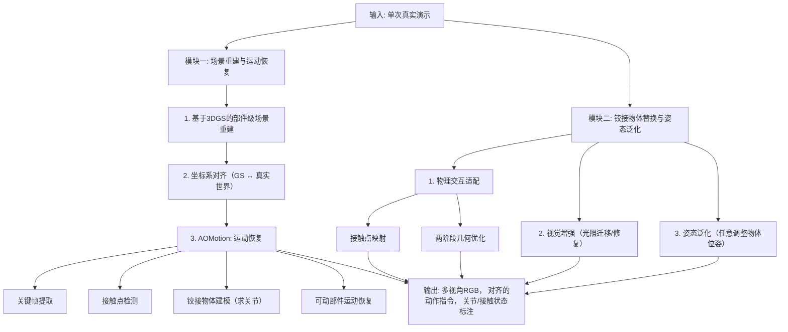

# AOMGen: Photoreal, Physics-Consistent Demonstration Generation for Articulated Object Manipulation

**相关性评分**: 6.0/10

**排名**: #28

---

## 基本信息

- **arXiv ID**: [2512.18396v1](https://arxiv.org/abs/2512.18396v1)
- **发布时间**: 2025-12-20T15:21:25Z
- **相关性评分**: 6.0/10
- **是否相关**: 是

## 作者

Yulu Wu, Jiujun Cheng, Haowen Wang, Dengyang Suo, Pei Ren, Qichao Mao, Shangce Gao, Yakun Huang

## 关键词

Vision-Language-Action Model, VLA for Robotics

## 一句话总结

AOMGen是一个用于生成逼真、物理一致的演示数据的框架，旨在解决机器人操作中真实数据收集成本高的问题，通过微调VLA策略提升任务成功率。

## 摘要

Recent advances in Vision-Language-Action (VLA) and world-model methods have improved generalization in tasks such as robotic manipulation and object interaction. However, Successful execution of such tasks depends on large, costly collections of real demonstrations, especially for fine-grained manipulation of articulated objects. To address this, we present AOMGen, a scalable data generation framework for articulated manipulation which is instantiated from a single real scan, demonstration and a library of readily available digital assets, yielding photoreal training data with verified physical states. The framework synthesizes synchronized multi-view RGB temporally aligned with action commands and state annotations for joints and contacts, and systematically varies camera viewpoints, object styles, and object poses to expand a single execution into a diverse corpus. Experimental results demonstrate that fine-tuning VLA policies on AOMGen data increases the success rate from 0% to 88.7%, and the policies are tested on unseen objects and layouts.

## 详细分析

## 论文摘要：AOMGen: 用于关节物体操作的逼真、物理一致演示生成

**1. 研究背景和动机**
基于视觉-语言-动作（VLA）模型的机器人操作任务，特别是涉及关节物体的精细操作，严重依赖于大量高质量的真实演示数据。然而，收集此类数据成本高昂、费力且场景覆盖有限。现有的物理仿真方法视觉真实性不足，而视频世界模型方法则难以保证物理一致性和动作可执行性。因此，亟需一种能够生成**视觉逼真且物理一致**的关节物体操作演示数据的方法。

**2. 核心方法和技术创新**
本文提出了 **AOMGen** 框架，仅需**单个真实扫描视频和演示**，即可为同一类别的其他关节物体生成大量训练数据。其核心技术创新在于：
- **基于3D高斯溅射（3DGS）的场景重建与运动恢复**：利用3DGS高保真重建静态场景，并通过分割高斯点对物体进行部件级建模。创新性地提出 **AOMotion** 模块，利用真实机械臂轨迹作为物理先验，通过关键帧提取、接触点检测、关节建模和可动部件运动恢复，精确复原出物理一致的关节物体运动。
- **关节物体替换与姿态泛化**：建立原始物体与替换物体（来自同一类别的数字资产）之间的几何与运动映射，通过两阶段优化确保新物体的物理交互合理性。同时，进行**视觉增强**（如光照迁移）和**姿态泛化**（任意调整物体位姿），极大扩展了生成数据的多样性和泛化边界。

**3. 主要实验结果**
- **物理一致性验证**：在仿真器中回放生成数据，对微波炉、抽屉等多种关节物体的操作成功率平均达 **98%**，证明了其物理合理性。
- **VLA模型训练有效性**：使用生成的50-150条数据微调VLA模型（如π0.5和OpenVLA），在仿真测试中将任务成功率从 **0%** 提升至 **88.7%**。
- **泛化能力验证**：模型展现出对**物体尺度变化**、**位姿变化**的良好鲁棒性。更重要的是，使用**混合多个替换物体生成的数据**进行训练后，模型对**未见过的同类物体**的操作成功率可达 **65%**，证明了AOMGen在提升模型类别级泛化能力方面的价值。

**4. 研究意义和价值**
AOMGen为解决机器人操作数据稀缺问题提供了一个**高效、可扩展**的解决方案。它首次实现了从单次真实演示到**类别级**逼真物理操作数据的生成，在保证视觉质量的同时严格遵循物理约束。该框架生成的合成数据能显著提升VLA策略在关节物体操作任务上的性能与泛化能力，对推动**数据驱动的机器人学习**迈向更复杂的交互任务具有重要的实际意义。

## 问答对

### 问题 1

**Q**: 这篇论文的核心创新点是什么，他想解决什么问题，怎么解决的？

**A**: ## 论文核心分析：AOMGen

### **一、 论文旨在解决的核心问题**
当前，基于视觉-语言-动作（VLA）模型的机器人操作任务，其成功严重依赖于**大量、高质量的真实世界演示数据**。对于**铰接物体**（如微波炉门、抽屉）的精细操作任务，由于其复杂的运动学约束，对数据的多样性和精确性要求更高。然而，收集此类真实数据**成本高昂、过程繁琐，且场景覆盖有限**，成为制约模型泛化能力的关键瓶颈。

现有解决方案存在明显不足：
1.  **基于物理仿真的方法**：数据生成效率高，但**视觉真实性差**，存在显著的“仿真到现实”鸿沟。
2.  **基于视频世界模型的方法**：视觉保真度高，但**物理一致性和动作可执行性缺乏保障**，容易产生不真实的交互。
3.  **现有的真实到真实数据生成方法**（如DemoGen, R2RGen）：**无法处理铰接物体的精细操作**，且对象外观、姿态固定，视角单一，泛化能力有限。

### **二、 论文的核心创新点**
AOMGen提出了一种**从单次真实扫描和演示出发，生成海量、高保真、物理一致的铰接物体操作数据**的框架。其核心创新在于：

1.  **数据生成的范式创新**：实现了 **“一次演示，无限生成”**。仅需**一个**真实场景的静态扫描视频、**一段**动态操作视频和机器人关节状态，即可为**同一类别**的任意铰接物体生成多样化的操作数据。
2.  **物理一致性与视觉真实性的统一**：
    *   **物理层面**：利用真实的机器人手臂轨迹作为物理先验，通过提出的 **`AOMotion`** 模块，**无监督地恢复铰接物体的精确运动**（关节中心、方向、运动参数），确保生成的交互动作符合物理规律。
    *   **视觉层面**：基于**3D高斯泼溅（3DGS）** 进行场景重建与编辑，支持多视角、高真实感渲染。通过**光照迁移**和**高斯修复**技术，使替换后的新物体与原始场景在视觉上无缝融合。
3.  **强大的泛化与扩展能力**：
    *   **物体替换**：通过**接触点映射**和**两阶段几何优化**，将原始物体的操作行为准确地迁移到**同一类别但几何形状不同的新物体**上。
    *   **姿态泛化**：支持对目标物体的**位置和朝向进行任意调整**，并相应地生成适配的新机器人轨迹，极大地扩展了数据配置的多样性。
4.  **端到端的实用价值验证**：不仅生成数据，更通过实验证明，使用AOMGen生成的数据微调VLA模型（如π0.5, OpenVLA），能**将任务成功率从0%显著提升至88.7%**，并且模型展现出对**未见过的物体、物体尺度和环境布局**的强鲁棒性。

### **三、 解决方案：AOMGen框架详解**
框架分为两大核心模块，流程如下图所示（基于论文图2）：

**1. 场景重建与运动恢复**
*   **部件级3DGS重建**：使用SAM2获取2D部件级掩码，指导3DGS学习，实现对机器人、铰接物体静态部分和可动部分的高斯点云分割。
*   **坐标系对齐**：通过ICP算法，将3DGS坐标系与真实世界（机器人URDF）坐标系对齐，为物理模拟奠定基础。
*   **`AOMotion`运动恢复**：
    *   **关键帧提取**：分析动态视频中可动部件掩码的变化，计算“运动分数”，自动确定交互的**起始帧和结束帧**。
    *   **接触点检测**：在起始帧，找到机器人末端执行器与物体可动部分的**最近点**，作为交互的接触点。
    *   **铰接物体建模**：通过分析可动与静态部件的包围盒几何关系，**自动推断出关节的中心点和方向轴**，无需预先的关节模型。
    *   **可动部件运动恢复**：以机器人末端接触点的真实轨迹为监督，优化求解可动部件在每一时刻的旋转/平移参数，确保运动物理准确。

**2. 铰接物体替换与姿态泛化**
*   **物理交互适配**：
    *   将新物体（USD资产）转化为3DGS表示。
    *   通过**归一化坐标空间（NOCS）映射**，将原始物体上的接触点映射到新物体上。
    *   设计**两阶段优化**，调整新物体的**尺寸、初始位姿、运动参数**，使其可动部件在机器人轨迹作用下的运动与原始场景物理一致。
*   **视觉增强**：从真实场景中提取光照信息，并“烘焙”到新物体的材质上；使用高斯修复技术填补物体替换后产生的渲染空洞。
*   **姿态泛化**：允许对物体施加任意刚体变换。通过**逆运动学**重新计算机器人轨迹，使其能够操作位于新姿态下的物体。

### **总结**
AOMGen的核心价值在于，它**巧妙地在数据生成的“效率-真实性-物理一致性-泛化性”四维目标中取得了卓越的平衡**。它不依赖于昂贵的物理仿真器或难以控制的世界模型，而是以**数据驱动的方式**，从有限的真实数据中“蒸馏”出可迁移的物理交互知识，并将其与高保真的视觉渲染相结合，从而为数据饥渴的VLA模型提供了**一种可扩展、低成本、高质量的训练数据解决方案**。其实验结果充分证明了生成数据的有效性和对下游任务性能的显著提升。

### 问题 2

**Q**: 请用一段话总结这篇论文，明确说明：论文试图解决的核心问题；提出的主要方法或框架；最终取得的主要效果或结论。要求语言简洁、信息密度高，不要复述摘要原文。

**A**: ## 论文总结

**核心问题**：针对机器人操作中，对铰接物体进行精细操控需要大量高质量、物理真实的演示数据，而真实数据采集成本高昂且难以覆盖多样场景的问题，论文旨在提出一种可扩展的数据生成方案。

**主要方法**：提出了AOMGen框架，其核心思想是**从单次真实扫描和演示中，泛化生成同一类别下其他铰接物体的逼真、物理一致的演示数据**。该方法基于3D高斯溅射（3DGS）进行高保真场景重建与运动恢复，并利用机器人手臂的真实轨迹作为物理先验，监督铰接物体运动参数的估计。随后，通过建立原始物体与替换物体之间的几何与运动映射，并结合光照迁移等视觉增强技术，实现物体替换、姿态泛化与高质量数据合成。

**主要效果**：实验表明，使用AOMGen生成的数据对VLA策略进行微调，能将其在铰接物体操作任务上的成功率从0%显著提升至88.7%。生成的演示数据在模拟器中回放验证了其物理一致性，并且训练后的策略在未见过的物体、姿态和尺度上均展现出良好的泛化能力。

### 问题 3

**Q**: 这篇论文相对于已有工作有哪些明确的创新点？请逐条列出，并对每一条说明：相比以往方法改进或不同之处在哪里，以及该创新解决了什么具体问题或带来了什么优势。

**A**: ## AOMGen论文创新点分析

这篇论文针对**铰接物体操作**的高质量演示数据生成问题，提出了AOMGen框架。其核心创新在于**从单一真实扫描和演示出发，生成具有高视觉真实感和物理一致性的、可泛化的训练数据**。以下是其相对于已有工作的明确创新点：

### 1. **针对铰接物体的、物理一致的运动恢复与建模方法**
- **相比以往方法的改进/不同之处**：
    - **以往方法**：许多基于视频的世界模型或数据生成方法（如DreamGen, RoboDreamer）侧重于视觉真实感，但缺乏对物理交互（特别是铰接运动）的精确监督，导致生成的动作可能物理上不可行。而一些基于仿真的方法虽然物理精确，但视觉真实感差。
    - **AOMGen的创新**：提出了一种名为 **AOMotion** 的**免训练**运动恢复方法。它不依赖物理模拟器，而是利用**真实机器人手臂轨迹作为物理先验**，通过**接触点检测、铰接物体建模**等模块，从单次真实交互中精确推断出铰接部件（如微波炉门、抽屉）的运动参数（关节中心、方向、运动角度）。
- **解决的具体问题/带来的优势**：
    - **解决了“物理一致性”难题**：确保了生成的演示数据中，机器人动作与铰接物体的运动在物理定律上是合理且一致的，这是学习有效操作策略的关键。
    - **降低了对密集观测的依赖**：与需要交互前后多视角观测来建模关节的方法不同，AOMotion在仅有单次交互视频和机器人状态的情况下就能工作，适用性更广。

### 2. **支持类别内物体替换与姿态泛化的数据生成框架**
- **相比以往方法的改进/不同之处**：
    - **以往方法**：如MimicGen、DemoGen等方法主要对**已见物体**进行数据重组或增强，无法泛化到**未见过的、不同几何形状的同类物体**。它们的对象外观和几何通常是固定的。
    - **AOMGen的创新**：框架的核心能力之一是**将学习到的操作技能（运动模式）迁移到同类别的新物体上**。它通过建立**原始物体与新物体模型之间的映射**（包括关节配置、尺寸、初始姿态），并经过一个**两阶段优化过程**来适配几何差异，确保相同的机器人轨迹能对新物体产生有效的物理交互。
- **解决的具体问题/带来的优势**：
    - **解决了数据泛化性的核心瓶颈**：仅需一个真实物体的演示，就能为**整个物体类别**生成大量数据，极大地突破了数据收集的规模限制。
    - **实现了“一次演示，多次生成”**：显著提升了数据生成的效率和可扩展性，为训练具有强泛化能力的模型奠定了基础。

### 3. **基于3D高斯溅射的高保真、可编辑场景重建与视觉增强**
- **相比以往方法的改进/不同之处**：
    - **以往方法**：基于传统体素或隐式神经场的重建方法编辑困难，渲染速度慢。一些使用3DGS的工作（如RobotSplat）未能解决铰接物体操作的泛化问题。
    - **AOMGen的创新**：
        1. **部件级分割的3DGS**：结合SAM2和SAGA，对3D高斯点进行**部件级语义分割**，从而能够精确分离出铰接物体的可动部件和静态部件，这是进行后续运动编辑和物体替换的基础。
        2. **视觉增强管道**：在物体替换后，采用**光照迁移**（从真实场景提取光照并烘焙到新物体材质）和**高斯修复**技术，以消除替换产生的视觉伪影，使新物体与原始场景在光照、材质上无缝融合。
- **解决的具体问题/带来的优势**：
    - **解决了“视觉真实感”与“可编辑性”的矛盾**：3DGS提供了实时、高质量的渲染能力，同时其显式表示使得对场景中特定物体/部件进行几何和运动编辑成为可能。
    - **提升了生成数据的视觉质量**：使得合成数据在视觉上逼近真实拍摄，减少了“模拟到真实”的视觉差异，让基于合成数据训练的视觉策略更容易迁移到真实世界。

### 4. **系统性验证了合成数据对VLA模型性能的提升与泛化增强**
- **相比以往方法的改进/不同之处**：
    - **以往方法**：许多数据生成工作仅验证生成数据本身的逼真度，或在小范围任务上测试策略性能，缺乏对**现代大规模VLA模型**的微调效果及其**系统性泛化能力**（如对物体姿态、尺度、未见物体的泛化）的深入评估。
    - **AOMGen的创新**：论文不仅通过仿真回放验证了数据的物理正确性，更核心的是，**系统性地将生成数据用于微调两个先进的VLA模型**，并设计了多层级的泛化测试：
        1. **基础性能**：数据使模型成功率从**0%提升至88.7%**。
        2. **姿态泛化**：通过改变目标物体的初始位置和朝向进行测试。
        3. **尺度泛化**：测试模型对不同尺寸同类物体的操作能力。
        4. **物体泛化**：测试模型对**训练中未出现过的同类物体**的操作能力（通过混合数据训练实现）。
- **解决的具体问题/带来的优势**：
    - **实证了方法的实用价值**：强有力地证明了AOMGen生成的数据不是“玩具”，而是能直接、显著提升前沿机器人学习模型性能的高质量数据。
    - **明确了泛化边界**：通过严谨的实验，量化展示了该方法能在多大程度上提升模型的鲁棒性和泛化能力，为后续研究提供了清晰的基准。

### 总结
AOMGen的核心创新是一个**闭环**：它创造性地将**高保真3D重建**、**物理引导的运动推理**、**跨实例的几何-运动映射**以及**视觉增强**技术结合在一个框架内。其最大的突破在于，**将数据生成的焦点从“对单个场景的增强”转向“对操作技能的抽象与跨实体迁移”**，从而为解决铰接物体操作数据稀缺这一根本问题，提供了一条高度可扩展且有效的路径。

### 问题 4

**Q**: 论文在实验或评估中最终实现了怎样的效果？请说明使用了哪些数据集和评价指标，与哪些基线方法进行了对比，以及在关键指标上的主要性能提升或结论。如果论文未给出明确的定量结果，也请说明原因。

**A**: ## 论文实验与评估效果分析

### 一、 实验目标与核心问题
论文通过实验旨在验证 **AOMGen** 框架生成的铰接物体操作数据在**物理一致性**、**训练有效性**和**模型泛化能力**三个方面的表现。具体回答以下三个问题：
1.  **物理一致性**：生成的数据是否符合真实的物理交互规律？
2.  **训练有效性**：生成的数据能否直接用于训练视觉-语言-动作模型？
3.  **泛化能力**：数据生成策略能否增强VLA模型的鲁棒性？

### 二、 数据集与评价指标

#### 1. 数据生成与使用
- **输入数据**：仅需**单次真实演示**，包括：
    - 静态场景扫描视频 (`V_static`)
    - 动态操作视频 (`V_dynamic`)
    - 机械臂关节状态序列 (`A`)
- **替换对象库**：使用 **ArtVIP** 数据集中的数字资产，包括：
    - **旋转关节物体**：微波炉、工具箱、电脑。
    - **平移关节物体**：抽屉、橱柜。
- **生成数据规模**：为每个替换物体生成50或150条演示数据用于微调。

#### 2. 主要评价指标
- **成功率**：在模拟器或真实任务中，模型成功完成指定操作（如打开微波炉门、拉开抽屉）的比率。这是核心的定量评估指标。
- **物理验证**：通过在模拟器中“回放”生成的机械臂轨迹和物体运动，观察任务是否能被**物理正确地完成**，以此定性验证数据的物理一致性。

### 三、 基线方法与对比设置
论文的对比实验主要围绕 **VLA模型在不同数据上微调后的性能** 展开，而非与同类数据生成方法进行直接头对头比较。其基线设置如下：

1.  **原始模型**：未使用AOMGen生成数据进行任何微调的预训练VLA模型（`π_0.5` 和 `OpenVLA`）。这代表了“零样本”或“少样本”的基线性能。
2.  **不同数据量的微调模型**：
    - 使用 **50条** AOMGen生成数据微调的模型。
    - 使用 **150条** AOMGen生成数据微调的模型。
    - **对比目的**：验证AOMGen生成数据的**有效性**和**数据效率**。

### 四、 关键性能结果与结论

#### 1. 物理一致性验证（回答问题1）
- **方法**：在 **Isaac Sim** 模拟器中导入优化后的USD资产和生成的动作轨迹进行回放。
- **结果**：如表1所示，对于微波炉、工具箱、电脑、抽屉、橱柜等不同物体，**模拟器回放成功率平均达到98%**（微波炉98%，工具箱96%，电脑96%，抽屉100%，橱柜100%）。
- **结论**：AOMGen生成的数据具有高度的**物理合理性和可执行性**，为后续模型训练提供了可靠基础。

#### 2. 训练有效性验证（回答问题2）
- **方法**：分别用0条、50条、150条AOMGen生成数据微调 `π_0.5` 和 `OpenVLA` 模型，然后在模拟环境中测试。
- **结果**（如图6所示）：
    - **`π_0.5` 模型**：使用150条数据微调后，**平均成功率从0%大幅提升至88.7%**。
    - **`OpenVLA` 模型**：使用150条数据微调后，平均成功率提升至 **81.3%**。
- **结论**：AOMGen生成的数据能**高效地赋予VLA模型操控特定铰接物体的能力**，证明了其作为训练数据的直接价值。

#### 3. 泛化能力验证（回答问题3）
论文通过多种“泛化”测试来评估模型的鲁棒性：

- **姿态泛化**：测试模型在面对物体初始位置和朝向（在预设范围内）变化时的表现。实验表明，经AOMGen数据（已包含姿态变化）微调的模型对此类变化具有鲁棒性。
- **尺度泛化**（如表2所示）：
    - 将测试物体的尺寸缩放至0.6~0.9倍。
    - 微调后的 `π_0.5` 模型在微波炉和抽屉任务上，在0.9倍尺度下仍能保持 **85%** 和 **90%** 的高成功率，显示出良好的尺度适应性。
- **物体类别内泛化**（关键结论，如表3所示）：
    - **单物体数据训练**：模型在**未见过的同类物体**上成功率仅 **15%**，泛化能力差。
    - **混合多物体数据训练**：使用AOMGen为多个不同物体生成的数据混合训练后，模型在未见物体上的成功率提升至 **65%**。
    - **结论**：这是AOMGen的核心优势——**通过替换同类物体生成多样数据，能显著提升VLA模型对同类新物体的泛化能力**。

### 五、 总结
AOMGen在实验中取得了以下关键效果：
1.  **高保真生成**：生成的数据在模拟器中回放成功率极高（~98%），确保了物理正确性。
2.  **高效训练**：仅需150条生成数据，就能将先进VLA模型在铰接物体操作任务上的成功率从**0%提升至接近90%**，数据效率极高。
3.  **强大泛化**：通过其“物体替换”和“姿态泛化”能力生成的数据，能有效提升模型对**物体尺度、初始姿态变化**的鲁棒性，特别是能将模型对**同类未见物体**的操控成功率从15%提升至65%，突破了单一演示数据的局限性。

**论文未与MimicGen、DemoGen等同类数据生成方法进行直接定量对比**，但其通过将VLA模型性能从零提升至高水平，以及展示的跨物体泛化能力，已间接但有力地证明了AOMGen方法在解决“铰接物体操作数据稀缺”问题上的优越性和创新价值。

## 相关链接

- [arXiv 页面](https://arxiv.org/abs/2512.18396v1)
- [HTML 版本](https://arxiv.org/html/2512.18396v1)
