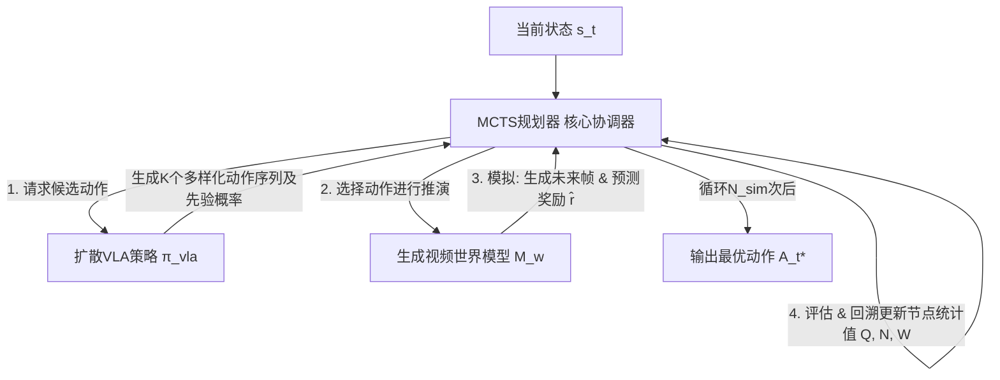

# STORM: Search-Guided Generative World Models for Robotic Manipulation

**相关性评分**: 6.0/10

**排名**: #29

---

## 基本信息

- **arXiv ID**: [2512.18477v1](https://arxiv.org/abs/2512.18477v1)
- **发布时间**: 2025-12-20T19:40:25Z
- **相关性评分**: 6.0/10
- **是否相关**: 是

## 作者

Wenjun Lin, Jensen Zhang, Kaitong Cai, Keze Wang

## 关键词

Vision-Language-Action Model, VLA for Robotics

## 一句话总结

STORM是一个结合扩散动作生成、视频预测和搜索规划的机器人操作框架，通过视觉推演提升推理可解释性，但未直接涉及轻量架构或边缘部署。

## 摘要

We present STORM (Search-Guided Generative World Models), a novel framework for spatio-temporal reasoning in robotic manipulation that unifies diffusion-based action generation, conditional video prediction, and search-based planning. Unlike prior Vision-Language-Action (VLA) models that rely on abstract latent dynamics or delegate reasoning to language components, STORM grounds planning in explicit visual rollouts, enabling interpretable and foresight-driven decision-making. A diffusion-based VLA policy proposes diverse candidate actions, a generative video world model simulates their visual and reward outcomes, and Monte Carlo Tree Search (MCTS) selectively refines plans through lookahead evaluation. Experiments on the SimplerEnv manipulation benchmark demonstrate that STORM achieves a new state-of-the-art average success rate of 51.0 percent, outperforming strong baselines such as CogACT. Reward-augmented video prediction substantially improves spatio-temporal fidelity and task relevance, reducing Frechet Video Distance by over 75 percent. Moreover, STORM exhibits robust re-planning and failure recovery behavior, highlighting the advantages of search-guided generative world models for long-horizon robotic manipulation.

## 详细分析

## 论文摘要：STORM: 用于机器人操作的搜索引导生成世界模型

**1. 研究背景和动机**
当前，基于视觉-语言-动作（VLA）的大模型已成为机器人操作的主流范式。然而，这些模型通常依赖冻结的视觉编码器，并将复杂的时空推理任务委托给语言模型组件。这种设计导致**丰富的连续物理动态信息在转换为离散符号语言时丢失**，使得模型在需要精细物理交互（如物体接触、精确因果推理）的任务中表现不佳。本文旨在克服这一瓶颈，提出一种**基于视觉前瞻**的新范式，让智能体在执行前能够“看到”动作的潜在后果，从而实现更鲁棒的决策。

**2. 核心方法和技术创新**
本文提出了 **STORM** 框架，其核心创新在于将**扩散动作生成、条件视频预测和搜索规划**三者统一在一个闭环中：
- **扩散式VLA策略**：采用扩散模型作为动作解码器，能够生成**多样化、多模态**的候选动作序列，为后续搜索提供高质量的初始提议。
- **生成式视频世界模型**：基于iVideoGPT构建，以动作和指令为条件预测未来的视觉观察和**任务奖励**。通过引入奖励监督损失进行微调，该模型能学习**任务相关的因果动态**，而不仅仅是像素级保真度。
- **蒙特卡洛树搜索规划器**：作为核心协调器，利用VLA提议动作，通过视频世界模型进行视觉推演模拟，并基于模拟结果（预测奖励）评估和选择最优动作序列。其关键创新在于**在显式的视觉推演中进行搜索**，而非抽象的潜在空间，使推理过程更可解释、可验证。

**3. 主要实验结果**
在SimplerEnv机器人操作基准测试中，STORM取得了最先进的性能：
- **平均任务成功率**达到 **51.0%**，超越了CogACT（47.9%）、Octo、OpenVLA等强基线模型。
- **奖励增强的视频预测**显著提升了时空保真度，与仅使用动作条件的模型相比，**Fréchet视频距离降低了超过75%**。
- **案例研究**表明，STORM具备**从失败中恢复和重新规划**的能力。当基线模型陷入重复错误循环时，STORM能通过前瞻性搜索评估替代方案，成功完成任务，展示了其超越反应式策略的显著优势。

**4. 研究意义和价值**
STORM的研究意义在于：
- **范式转变**：它证明了**搜索引导的、基于显式视觉生成的世界模型**在机器人时空推理中优于依赖潜在抽象或纯语言推理的方法，为可解释、前瞻驱动的决策制定建立了新范式。
- **实际价值**：其模块化设计（将VLA视为黑盒提议策略）使其易于与现有VLA模型集成，提升了长时域、接触式操作任务的鲁棒性和成功率。
- **未来方向**：尽管计算成本和对精细操作预测精度存在局限，但该框架指明了通过联合训练、模型蒸馏等方式进一步提升规划效率和性能的清晰路径。

## 问答对

### 问题 1

**Q**: 这篇论文的核心创新点是什么，他想解决什么问题，怎么解决的？

**A**: ## 论文核心分析：STORM

### **一、 论文旨在解决的核心问题**
论文指出，当前主流的**视觉-语言-动作模型**在机器人操作任务中存在一个根本性瓶颈：
- **问题本质**：VLA模型通常依赖冻结的视觉编码器，并将复杂的时空推理任务**委托给语言模型组件**。这导致了一个“**语言抽象鸿沟**”——丰富、连续的物理世界动态（如精确的空间关系、接触力学、动作的因果后果）被**损失性地投影**到离散、符号化的语言空间中。
- **具体表现**：这种设计使得模型在进行**细粒度、物理接地**的推理时能力不足，导致决策不精确、策略次优，尤其是在需要**长时程规划**和**从失败中恢复**的复杂操作任务中。

### **二、 核心创新点**
STORM 提出了一种**范式转变**：从**抽象的、基于语言的推理**转向**显式的、基于视觉前瞻的规划**。其核心创新是一个**三合一**的集成框架：

1.  **架构创新：搜索引导的生成世界模型**
    - 将**扩散模型驱动的VLA策略**、**条件视频预测世界模型**和**蒙特卡洛树搜索规划器**首次统一在一个闭环决策框架中。
    - 关键区别：与MuZero等**在抽象潜在空间中规划**的方法不同，STORM将搜索**扎根于显式的视觉推演**中，使推理过程**可解释、可验证**。

2.  **方法创新：奖励增强的视频预测作为世界模型**
    - 对视频预测模型进行**奖励监督的微调**（`ℒ = ℒ_video + λ_reward * ℒ_reward`）。
    - 这使得模型不仅学习视觉动态，更学习**任务相关的因果结构**，成为一个“**价值感知的模拟器**”，显著提升了推演的任务相关性和保真度（FVD降低超过75%）。

3.  **范式创新：“预测后再行动”的视觉前瞻**
    - 核心理念是 **“预测后再行动”** 。MCTS规划器利用VLA提出的多样化候选动作，通过视频世界模型模拟其视觉结果，并基于模拟的奖励进行评估和回溯，从而选择长期最优策略。
    - 这实现了从**反应式策略**到**前瞻式、可重规划策略**的升级。

### **三、 解决方案的运作流程**
STORM的解决方案是一个紧密协作的循环：

1.  **动作提议**：扩散VLA策略 (`π_vla`) 根据当前状态，采样生成**多个**可能的动作序列，捕捉任务的多模态解空间。
2.  **结果模拟**：生成视频世界模型 (`M_w`) 接收状态和候选动作，**预测执行该动作后的未来视觉帧和即时奖励**，充当可学习的物理模拟器。
3.  **搜索规划**：MCTS规划器作为大脑，协调以上两步。它：
    - **选择**：根据PUCT公式（平衡探索与利用）选择节点。
    - **扩展**：在叶节点调用VLA生成新动作分支。
    - **评估**：调用世界模型模拟该动作结果，获得价值估计。
    - **回溯**：将模拟结果反向传播，更新路径上的动作价值。
    - 经过多次模拟后，选择访问次数最多的动作作为最终执行指令。

### **四、 实际价值与验证**
- **性能提升**：在SimplerEnv基准测试上达到**51.0%**的平均成功率，超越之前最好的CogACT（47.9%），确立了新的SOTA。
- **关键优势体现**：
    - **长时程规划**：通过组合探索未来轨迹，避免反应式策略的“短视”行为。
    - **失败恢复**：案例研究显示，当基线模型陷入重复错误循环时，STORM能通过前瞻性搜索**重新评估并找到新的成功路径**，展示了强大的纠错和适应能力。
    - **可解释性**：规划基于**可见的视觉推演**，而非黑盒的潜在状态，使决策过程更透明。

**总结**：STORM的创新在于**用显式的生成视觉模拟取代隐式的语言抽象**，构建了一个**可解释、能前瞻、善恢复**的机器人决策新范式，为具身智能中生成模型与规划算法的结合开辟了新道路。其局限性主要在于视频模拟的计算成本，这指明了未来在模型蒸馏和联合训练方向上的优化空间。

### 问题 2

**Q**: 请用一段话总结这篇论文，明确说明：论文试图解决的核心问题；提出的主要方法或框架；最终取得的主要效果或结论。要求语言简洁、信息密度高，不要复述摘要原文。

**A**: 这篇论文针对现有视觉-语言-动作（VLA）模型在机器人操作任务中，因依赖抽象语言推理而导致的细粒度时空推理能力不足和失败恢复能力差的核心问题，提出了一个名为STORM的新型搜索引导生成世界模型框架。该框架创造性地将扩散模型驱动的VLA（用于生成多样候选动作）、条件视频预测模型（作为生成式世界模型模拟视觉结果）与蒙特卡洛树搜索（MCTS）规划器三者结合，通过在**显式的视觉推演中进行搜索**来实现可解释的长时程规划。实验表明，该方法在SimplerEnv操作基准上取得了51.0%的平均成功率，超越了包括CogACT在内的强基线模型，并通过奖励增强的视频预测显著提升了时空保真度。其关键优势在于能够通过前瞻性模拟进行重规划，从而从初始失败中恢复，验证了将生成式视觉预见与搜索规划相结合的新范式优于纯粹的隐式抽象或反应式策略。

### 问题 3

**Q**: 这篇论文相对于已有工作有哪些明确的创新点？请逐条列出，并对每一条说明：相比以往方法改进或不同之处在哪里，以及该创新解决了什么具体问题或带来了什么优势。

**A**: ## STORM论文创新点分析

这篇论文提出了一个名为STORM的新框架，其核心创新在于将**生成式世界模型**与**搜索规划**相结合，并**在显式的视觉层面进行推理**，从而解决了现有主流方法的关键瓶颈。以下是其相对于已有工作的明确创新点：

### 1. **范式创新：从“语言抽象推理”转向“视觉前瞻模拟”**
   - **相比以往方法的改进/不同之处**：
     - **以往方法 (如OpenVLA, CogACT)**：主要依赖冻结的视觉编码器和大型语言模型(LLM)进行推理。它们将丰富的、连续的时空动态信息（如物体空间关系、接触力学）**投影到离散的、符号化的语言空间**中进行处理。这是一种**损失性的抽象**。
     - **STORM的做法**：提出“**先预测，后行动**”的核心原则。它不依赖LLM去“想象”可能发生什么，而是让智能体通过生成式视频预测模型“**看到**”行动将导致的**具体视觉未来**。规划过程**根植于显式的视觉推演**。
   - **解决的具体问题/带来的优势**：
     - **解决了信息损失与模糊性问题**：避免了将物理交互的精细、连续信息（如精确的因果后果）压缩到语言描述时产生的歧义和丢失。
     - **提升了可解释性与可验证性**：规划者（MCTS）和研究者都可以“看到”模型模拟的未来，使得决策过程更加透明、可追溯。
     - **实现了更鲁棒的物理推理**：直接在视觉层面模拟，更贴近真实物理世界的表征方式，有助于处理需要精细时空推理的操作任务。

### 2. **架构创新：三模块协同的闭环决策框架**
   - **相比以往方法的改进/不同之处**：
     - **以往方法**：通常是端到端的“感知-动作”映射（反应式策略），或是在**抽象潜在空间**中进行规划的世界模型（如MuZero）。
     - **STORM的做法**：创新性地将三个独立模块**解耦并协同工作**，形成一个搜索引导的闭环：
       1. **扩散式VLA策略 (`π_vla`)**：作为**黑盒提议策略**，生成多样化的候选动作序列。
       2. **生成式视频世界模型 (`M_w`)**：作为**显式的、视觉接地的动力学模型**，模拟候选动作的视觉结果和奖励。
       3. **蒙特卡洛树搜索规划器 (MCTS)**：作为**核心协调器**，利用前两个模块进行前瞻性搜索，选择最优动作。
   - **解决的具体问题/带来的优势**：
     - **解决了动作多模态与模式坍塌问题**：扩散模型能生成多样的有效动作，为搜索提供了丰富的候选集，避免了确定性策略回归到“平均行为”而导致的失败。
     - **实现了模块化与兼容性**：VLA作为黑盒使用，使得STORM可以轻松与任何现有的VLA模型集成，无需修改其内部结构或大量重训练。
     - **结合了生成与搜索的优势**：既利用了生成模型对复杂分布和未来状态的建模能力，又利用了搜索算法对长视野、组合空间的高效探索能力。

### 3. **技术创新：奖励增强的视频预测作为世界模型**
   - **相比以往方法的改进/不同之处**：
     - **以往的视频预测模型**：通常以重建视觉保真度（如像素级精度）为主要目标，或仅以动作为条件。
     - **STORM的做法**：在训练视频预测模型时，引入了**奖励预测的监督信号**，使用混合损失函数：`ℒ = ℒ_video + λ_reward * ℒ_reward`。这使得模型不仅预测画面，还预测任务相关的奖励。
   - **解决的具体问题/带来的优势**：
     - **解决了任务无关模拟的问题**：纯视觉模型可能学会预测所有统计上可能的模式（包括无关的背景细节）。奖励信号作为一个**信息瓶颈**，迫使模型学习**任务相关的因果结构**（如物体接触、位移、目标配置）。
     - **显著提升了预测的时空保真度与任务相关性**：论文中，奖励增强模型将Fréchet视频距离降低了超过75%，并且在所有视频质量指标上全面优于仅以动作为条件的模型。
     - **为基于价值的规划提供了直接支持**：模型直接输出预测的奖励`r̂_t`，使MCTS能够基于价值（而不仅仅是视觉相似性）高效评估不同动作分支的长期收益，实现了“**价值感知的模拟**”。

### 4. **性能创新：实现了基于显式模拟的失败恢复与重规划**
   - **相比以往方法的改进/不同之处**：
     - **以往的反应式策略**：一旦基于当前状态自信地做出了错误决策，很容易陷入**策略局部最小值**，进行重复性错误循环而无法自拔。它们缺乏在失败后重新评估和调整计划的内在机制。
     - **STORM的做法**：通过MCTS的搜索循环，**主动地质疑初始的错误提议**。失败的提议在视频世界模型中被模拟并获得低价值评分后，MCTS会基于UCB规则自然地将搜索重心转向其他未被探索的、可能带来更高回报的动作分支。
   - **解决的具体问题/带来的优势**：
     - **解决了反应式策略的“短视”与脆弱性问题**：STORM能够进行**组合式的未来轨迹探索**，评估动作的长期后果，从而避免选择那些局部看似最优但全局会导致失败的路径。
     - **实现了真正的“失败-适应”能力**：如图4案例所示，当初始抓取失败后，STORM能够利用其前瞻模拟重新规划，找到新的成功轨迹，而基线模型则陷入死循环。这展示了其在复杂、多步骤任务中**卓越的鲁棒性和恢复能力**。

**总结**：STORM的核心创新在于**范式、架构、技术、性能**四个层面的系统性突破。它通过将**视觉接地的生成模拟**与**前瞻性的组合搜索**相结合，创造了一个**可解释、可验证、且更鲁棒**的决策框架，为解决机器人操作中复杂的时空推理和长视野规划问题提供了新的有效范式。其实验结果（在SimplerEnv基准上达到51.0%的平均成功率，超越CogACT等强基线）有力地支撑了这些创新点的有效性。

### 问题 4

**Q**: 论文在实验或评估中最终实现了怎样的效果？请说明使用了哪些数据集和评价指标，与哪些基线方法进行了对比，以及在关键指标上的主要性能提升或结论。如果论文未给出明确的定量结果，也请说明原因。

**A**: ## 论文实验与评估效果总结

### 一、 核心实验效果
论文提出的 **STORM** 框架在机器人操作任务上实现了**新的最先进性能**，其核心效果体现在：
- **平均任务成功率**：在 SimplerEnv 基准测试中达到 **51.0%**，超越了所有对比的基线方法。
- **关键优势**：展示了**前瞻性规划**和**失败后重规划**的能力，克服了反应式策略容易陷入局部最优或错误循环的局限性。
- **世界模型保真度**：通过奖励监督增强的视频预测模型，显著提升了时空预测的准确性。

### 二、 使用的数据集
1.  **主要训练数据**：**Bridge 数据集**。用于训练和微调框架中的生成式视频世界模型。
2.  **评估环境与数据**：**SimplerEnv 模拟器**（使用 WidowX 机械臂）。该环境包含一系列程序化生成的机器人操作任务，其性能与真实世界表现有强相关性，是评估的黄金标准。

### 三、 评价指标
论文使用了**两类评价指标**，分别针对整体任务性能和世界模型质量：

1.  **任务性能指标（主要）**：
    - **平均成功率**：在多个任务变体上执行任务并计算成功比例。这是衡量框架端到端性能的核心指标。

2.  **视频预测质量指标（消融研究）**：
    - **Fréchet Video Distance**：衡量生成视频序列分布与真实视频分布之间的差异，**降低超过75%** 表明预测质量大幅提升。
    - **LPIPS**：感知相似性指标。
    - **PSNR**：峰值信噪比。
    - **SSIM**：结构相似性指数。
    - *这些指标通过雷达图进行综合比较，用于验证奖励监督对学习任务相关因果结构的重要性。*

### 四、 对比的基线方法
论文与多个当前**强力的 Vision-Language-Action 模型和基线**进行了对比：

| 方法 | 说明 |
| :--- | :--- |
| **RT-1-X** | 基于大规模机器人数据训练的模型。 |
| **Octo-Base / Octo-Small** | 开源通用机器人模型的不同规模版本。 |
| **OpenVLA** | 基于开源VLM构建的VLA模型。 |
| **CogACT** | **关键的强基线**，也是STORM框架中VLA模块所采用的基础模型（7B参数）。 |

### 五、 关键性能提升与结论
1.  **整体性能领先**：
    - STORM 在 **SimplerEnv 的四个操作任务**（将勺子放毛巾上、将胡萝卜放盘子上、堆叠积木、将茄子放篮子里）上均取得最佳或并列最佳成绩。
    - **平均成功率51.0%**，比最强的基线CogACT（47.9%）**高出3.1个百分点**。论文指出，在机器人操作领域，这一提升具有显著意义。

2.  **核心结论**：
    - **前瞻性规划优于反应式策略**：实验证明，基于生成式世界模型进行搜索和前瞻性评估的范式，比直接将观测映射到动作的反应式策略更鲁棒、成功率更高。
    - **奖励监督至关重要**：消融实验表明，在训练视频预测模型时加入奖励预测头（`action+reward`），相比仅用动作条件（`action-only`），在所有视频质量指标上都有显著提升。这迫使模型学习**任务相关的因果结构**，而不仅仅是视觉模式，从而为有效的规划提供了基础。
    - **具备失败恢复能力**：案例研究显示，当基线模型CogACT因初始失败而陷入重复错误循环时，STORM能够利用MCTS重新评估和探索替代轨迹，成功实现恢复并完成任务。这体现了其**从错误中学习和适应**的能力。

3.  **性能瓶颈分析**：
    - 在“堆叠绿色积木到黄色积木上”任务中，STORM的性能与CogACT持平（均为12.5%）。论文分析指出，这类任务涉及**精细的接触物理和高度非线性的动力学**，当前视频预测模型的保真度尚不足以完美模拟，这构成了STORM框架在当前实例化下的性能上限。这指明了未来改进的方向：集成保真度更高的世界模型。

**总结**：STORM通过将**扩散动作生成**、**条件视频预测**和**蒙特卡洛树搜索规划**三者结合，在机器人操作任务上实现了最先进的性能，并实证了**基于显式视觉推演的搜索规划**相比**潜在抽象或纯语言推理**更具优势，为可解释、前瞻驱动的决策建立了一个新范式。

## 相关链接

- [arXiv 页面](https://arxiv.org/abs/2512.18477v1)
- [HTML 版本](https://arxiv.org/html/2512.18477v1)
