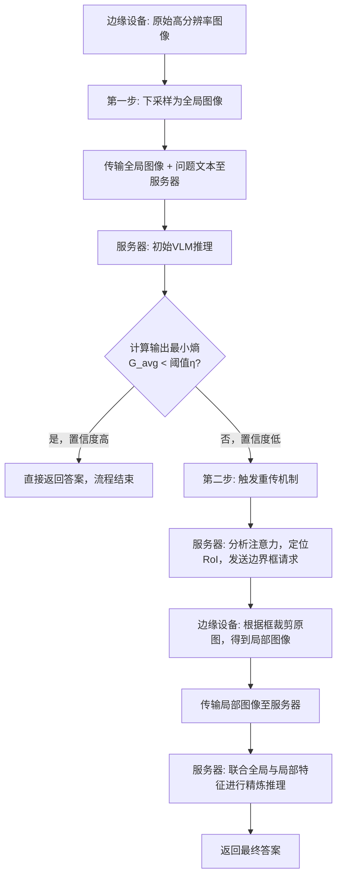

# Collaborative Edge-to-Server Inference for Vision-Language Models

**相关性评分**: 6.0/10

**排名**: #20

---

## 基本信息

- **arXiv ID**: [2512.16349v1](https://arxiv.org/abs/2512.16349v1)
- **发布时间**: 2025-12-18T09:38:18Z
- **相关性评分**: 6.0/10
- **是否相关**: 是

## 作者

Soochang Song, Yongjune Kim

## 关键词

Vision-Language Models, Edge Deployment, Inference Efficiency, Collaborative Inference, Communication Cost Reduction

## 一句话总结

该论文提出了一种协作式边缘到服务器推理框架，通过选择性重传策略减少视觉语言模型的通信成本，同时保持推理精度。

## 摘要

We propose a collaborative edge-to-server inference framework for vision-language models (VLMs) that reduces the communication cost while maintaining inference accuracy. In typical deployments, visual data captured at edge devices (clients) is transmitted to the server for VLM inference. However, resizing the original image (global image) to match the vision encoder's input resolution often discards fine-grained details, leading to accuracy degradation. To overcome this limitation, we design a two-stage framework. In the first stage, the server performs inference on the global image and identifies a region of interest (RoI) using the VLM's internal attention. The min-entropy of the output tokens is then computed as a confidence measure to determine whether retransmission is required. If the min-entropy exceeds a predefined threshold, the server requests the edge device to send a detail-preserved local image of the RoI. The server then refines its inference by jointly leveraging the global and local images. This selective retransmission strategy ensures that only essential visual content is transmitted. Experiments across multiple VLM architectures show that the proposed framework significantly reduces communication cost while maintaining inference accuracy.

## 详细分析

## 论文摘要：面向视觉语言模型的边-端协同推理框架

**1. 研究背景和动机**
随着视觉语言模型（VLM）在视觉问答等任务中的广泛应用，其部署常采用边-端协同模式：边缘设备采集图像并上传至服务器进行推理。然而，为匹配视觉编码器的输入分辨率，原始高分辨率图像常被下采样为低分辨率“全局图像”传输，导致细节丢失和精度下降。反之，传输全分辨率图像则带来巨大的通信开销。因此，如何在保证推理精度的同时，有效降低通信成本成为关键挑战。

**2. 核心方法和技术创新**
本文提出了一种**不确定性感知的两阶段边-端协同推理框架**，其核心创新在于：
- **两阶段自适应传输与推理**：第一阶段，边缘设备传输下采样后的全局图像至服务器进行初始推理。服务器利用VLM内部注意力机制识别任务相关的感兴趣区域（RoI）。
- **基于最小熵的智能重传决策**：服务器计算LLM解码器输出令牌的**最小熵**，作为推理不确定性的度量。仅当最小熵超过预设阈值（即置信度低）时，才触发第二阶段。
- **注意力引导的协同视觉裁剪**：在第二阶段，服务器将RoI边界框信息发回边缘设备。边缘设备从原始图像中裁剪出保留细节的“局部图像”并传回服务器。服务器最终结合全局与局部图像特征进行精细化推理。

**3. 主要实验结果**
在TextVQA、POPE等多个基准数据集及LLaVA-1.5、InstructBLIP等不同VLM架构上的实验表明：
- **通信效率**：在达到与无条件重传（传输所有局部图像）相近的推理精度时，能减少约40%的额外通信开销。
- **计算效率**：相比直接处理高分辨率图像的模型变体（如LLaVA-1.5-HD），在取得更高精度的同时，显著降低了服务器侧的计算负载。
- **指标优越性**：最小熵在区分正确与错误预测样本的分布可分性上，优于香农熵和概率间隔等不确定性度量，实现了最佳的精度-通信成本权衡。
- **兼容性与泛化性**：该框架与JPEG等图像压缩技术兼容，可进一步降低通信成本，且在不同VLM架构和任务上均表现有效。

**4. 研究意义和价值**
本工作为资源受限的边缘场景部署大型VLM提供了一种高效实用的解决方案。其价值体现在：
- **实际应用价值**：通过**选择性重传**机制，在几乎不损失精度的前提下，显著降低了边-端协同推理的通信与计算开销，有利于VLM在带宽和算力受限环境（如移动设备、物联网）中的实际部署。
- **方法论贡献**：创新地将**不确定性估计（最小熵）** 与**模型内部注意力（RoI定位）** 相结合，形成了一套完整的、与模型架构无关的协同推理决策流程，为后续相关研究提供了新思路。
- **系统设计启示**：证明了在服务器端进行智能决策、边缘端执行轻量级操作（裁剪）的协同范式是可行的，为未来边缘AI系统的设计提供了参考。

## 问答对

### 问题 1

**Q**: 这篇论文的核心创新点是什么，他想解决什么问题，怎么解决的？

**A**: ## 论文核心分析

### **核心问题**
在边缘计算场景中部署视觉-语言模型（VLM）时，存在一个根本矛盾：
- **高分辨率图像**：包含丰富的细节，能保证VLM推理的准确性，但**通信成本极高**。
- **低分辨率图像**：通过下采样减少通信开销，但会**丢失关键细节**，导致推理准确性下降。

传统的“全量传输”或“盲目压缩”方案无法在**通信效率**和**推理精度**之间取得良好平衡。

### **核心创新点**
论文提出了一种**基于不确定性的、两阶段协同边缘-服务器推理框架**。其创新性主要体现在以下三个层面：

1.  **不确定性感知的重传机制**：
    - **问题**：服务器无法直接判断初始推理是否正确。
    - **创新**：引入**最小熵**作为VLM输出令牌概率分布的**不确定性度量**。服务器通过计算初始推理输出序列的平均最小熵，来量化本次推理的置信度。
    - **价值**：只有当不确定性高于阈值（即模型“没把握”）时，才触发第二阶段的细节请求，避免了不必要的通信开销。实验证明，最小熵比香农熵、概率间隔等指标更能有效区分正确与错误预测。

2.  **注意力引导的协同视觉裁剪**：
    - **问题**：如果需要重传，应该传图像的哪一部分？
    - **创新**：服务器利用VLM内部（LLM解码器）的**注意力机制**，生成一个针对当前问题的**相对注意力图**，从而定位出与任务最相关的**兴趣区域**。
    - **价值**：服务器仅将RoI的边界框信息（数据量极小）发回边缘设备，由边缘设备从原始高分辨率图像中裁剪出对应的局部图像并传回。这确保了重传的内容是**任务相关且细节保留**的，最大化重传的效益。

3.  **全局与局部特征的联合推理**：
    - **问题**：如何利用新增的局部细节？
    - **创新**：在第二阶段，服务器将**全局图像特征**和**局部图像特征**进行拼接，共同输入LLM进行二次推理。
    - **价值**：模型同时拥有全局上下文和局部高分辨率细节，从而做出更精准的判断。这相当于为模型提供了一个“放大镜”，只在需要时观察细节。

### **解决方案流程**
整个系统是一个紧密协作的两阶段流水线：

### **实际价值与优势**
- **通信效率**：大幅降低平均通信开销（在TextVQA任务上，仅需28%的额外通信成本即可达到接近全重传的精度）。
- **计算效率**：由于VLM的计算开销与视觉令牌数量近似线性相关，选择性增加令牌仅在必要时发生，也降低了服务器的计算负载。
- **精度保持**：在多个VQA基准数据集（TextVQA, POPE, A-OKVQA等）和不同VLM架构（LLaVA, InstructBLIP, Qwen）上，均能维持与高成本方案（如LLaVA-HD）相当甚至更高的推理精度。
- **系统兼容性**：**与现有图像压缩技术正交且互补**。可以先压缩再传输，框架依然有效，能实现进一步的通信节省。
- **边缘设备友好**：绝大部分计算（VLM推理）留在服务器，边缘设备仅需完成简单的图像裁剪和传输任务，对边缘算力和功耗要求极低。

**总结**：该论文的核心创新在于将**主动推理**（不确定性估计）和**语义通信**（注意力引导的RoI提取）的思想深度融合，为边缘-服务器协同下的VLM部署提供了一个高效、精准、且通用的解决方案框架。

### 问题 2

**Q**: 请用一段话总结这篇论文，明确说明：论文试图解决的核心问题；提出的主要方法或框架；最终取得的主要效果或结论。要求语言简洁、信息密度高，不要复述摘要原文。

**A**: 这篇论文旨在解决在边缘-服务器协同部署场景下，视觉语言模型推理时面临的通信成本与精度权衡问题。核心矛盾在于：为满足视觉编码器输入分辨率而压缩图像会丢失细节影响精度，而传输高分辨率图像则通信开销巨大。为此，论文提出了一个**基于不确定性的两阶段选择性重传框架**：服务器首先对边缘传来的低分辨率全局图像进行推理，并计算输出令牌的**最小熵**作为置信度度量；若置信度低（熵值高），则利用模型内部注意力机制定位关键区域，并请求边缘设备仅重传该区域的高质量局部图像，最终结合全局与局部信息进行精炼推理。该方法的核心创新在于将**不确定性估计（最小熵）** 与**注意力引导的区域裁剪**相结合，实现了**按需传输**。实验表明，该框架能在**显著降低通信与计算开销**的同时，维持甚至提升多种VLM在多个视觉问答基准上的推理精度，并且与现有图像压缩技术兼容，可进一步节省带宽。

### 问题 3

**Q**: 这篇论文相对于已有工作有哪些明确的创新点？请逐条列出，并对每一条说明：相比以往方法改进或不同之处在哪里，以及该创新解决了什么具体问题或带来了什么优势。

**A**: ## 论文创新点分析

这篇论文《Collaborative Edge-to-Server Inference for Vision-Language Models》针对边缘-服务器协同推理场景，提出了一套创新的框架。其核心创新点可归纳为以下几条，每条都明确了与以往工作的区别及其带来的具体优势：

### 1. **提出了一个基于不确定性感知的两阶段选择性重传机制**
   - **相比以往方法的改进/不同之处**：
     - **以往方法**：在边缘-服务器协同推理中，常见做法是**要么始终传输低分辨率全局图像（牺牲精度）**，要么**始终传输高分辨率图像或额外局部图像（增加通信开销）**。一些语义通信工作会压缩或选择性地传输特征，但通常**缺乏一个动态的、基于推理置信度的决策机制**来决定是否需要额外数据。
     - **本文方法**：引入了一个**两阶段、条件触发的协议**。第一阶段始终使用低分辨率全局图像进行推理。**仅当**服务器计算出的输出令牌**最小熵（min-entropy）**超过阈值时，才触发第二阶段，请求边缘设备传输高细节的局部图像。这是一个**动态的、数据依赖的**决策过程。
   - **解决的具体问题/带来的优势**：
     - **核心解决问题**：在**通信成本**和**推理精度**之间取得了更优的权衡。避免了简单问题下不必要的重传，同时为复杂问题提供了获取细节信息的通道。
     - **具体优势**：显著降低了平均通信开销，同时保持了与始终使用高细节图像相近的推理精度。实验表明，仅需约28%的额外通信成本即可在TextVQA任务上达到接近全重传的精度。

### 2. **首次将最小熵（Min-Entropy）作为VLM输出不确定性的核心度量，并用于边缘协同决策**
   - **相比以往方法的改进/不同之处**：
     - **以往方法**：在图像分类任务中，常用**香农熵（Shannon Entropy）** 或**概率间隔（Probability Margin）** 来衡量不确定性。在NLP中，不确定性估计也多有研究，但**将其应用于VLM在多模态问答任务中的协同推理决策，并系统比较不同熵度量的工作较少**。
     - **本文方法**：**系统性地提出并验证了最小熵作为VLM不确定性度量的优越性**。论文通过理论分析和实验（计算正确与错误样本的熵分布重叠度、Bhattacharyya距离）证明，最小熵能更清晰地区分可靠与不可靠的推理结果。
   - **解决的具体问题/带来的优势**：
     - **核心解决问题**：解决了在无法得知真实答案的服务器端，如何**可靠地评估自身初次推理的置信度**这一关键问题。
     - **具体优势**：基于最小熵的决策机制，相比香农熵和概率间隔，能实现**更优的精度-通信成本权衡曲线**。这意味着在相同的通信预算下，能做出更准确的“是否需要重传”的判断，从而获得更高的整体精度。

### 3. **设计了一种服务器引导、边缘执行的注意力协同视觉裁剪机制**
   - **相比以往方法的改进/不同之处**：
     - **以往方法**：相关工作如ViCrop，是一种**纯精度导向**的方法，旨在通过裁剪高注意力区域来提升模型性能，但**通常需要在服务器端始终执行裁剪和二次推理，增加了计算和通信负担**。其他一些工作利用VLM提取ROI，但可能在边缘设备上引入非平凡的计算负载。
     - **本文方法**：将ViCrop**无缝集成到两阶段框架中**，并进行了关键改造：1) **条件化执行**：仅当不确定性高时才触发；2) **角色分离**：**服务器**利用VLM内部注意力计算ROI（边界框），**边缘设备**仅执行轻量的裁剪和重采样操作。这实现了“**服务器侧ROI估计 + 边缘侧裁剪**”的协同。
   - **解决的具体问题/带来的优势**：
     - **核心解决问题**：在**最小化边缘设备计算负担**的前提下，实现了对任务关键细节的获取。边缘设备无需运行任何VLM组件，只需基本的图像处理。
     - **具体优势**：**大幅降低了边缘侧的计算和功耗需求**，使框架适用于资源受限的边缘设备。同时，通过选择性触发，也**降低了服务器侧的平均计算开销**（避免了所有样本都进行二次推理）。

### 4. **实现了通信、计算、精度三方面的联合优化，并证明了与现有技术的互补性**
   - **相比以往方法的改进/不同之处**：
     - **以往方法**：一些工作专注于通信压缩（如神经压缩），另一些工作专注于模型效率（如高效编码器），还有一些（如LLaVA-1.5-HD）通过处理多尺度图像来提升精度，但**通常以显著增加计算或通信成本为代价**。这些方法往往是**孤立或替代性**的。
     - **本文方法**：框架本身**同时降低了通信和计算成本**。1) **通信**：通过选择性重传减少数据量。2) **计算**：由于VLM计算量主要与视觉令牌数线性相关，选择性增加令牌（仅当需要时传入局部图像）降低了平均FLOPs。论文还通过实验证明，该框架**与图像压缩技术（如JPEG）是正交且互补的**。
   - **解决的具体问题/带来的优势**：
     - **核心解决问题**：提供了**一个系统级的解决方案**，而非单个组件的优化。它直接针对边缘-服务器部署的核心痛点——资源约束与性能需求的矛盾。
     - **具体优势**：实现了**更优的全局权衡**。实验显示，在相同通信成本下，精度高于高分辨率模型变体（LLaVA-1.5-HD）；在相同精度下，通信和计算成本更低。与压缩技术结合后，可进一步将通信成本降低至原始方案的25%，展现了强大的实用性和可扩展性。

### 总结
本文的核心创新在于**将不确定性估计、注意力机制与边缘-服务器协同架构深度融合**，创造出一个**智能、自适应、资源高效**的推理管道。它不同于以往只关注压缩、或只关注模型结构、或无条件使用多尺度信息的方法，而是通过**基于内容的动态决策**，在系统层面实现了性能与资源消耗的帕累托改进。

### 问题 4

**Q**: 论文在实验或评估中最终实现了怎样的效果？请说明使用了哪些数据集和评价指标，与哪些基线方法进行了对比，以及在关键指标上的主要性能提升或结论。如果论文未给出明确的定量结果，也请说明原因。

**A**: ## 论文实验与评估效果分析

该论文通过系统的实验评估，验证了所提出的协作式边-服务器推理框架在**通信效率、计算效率和推理准确性**三个维度上的综合优势。

### 一、 使用的数据集与评价指标

#### 1. 数据集
论文在五个广泛使用的视觉问答基准数据集上进行了评估：
- **TextVQA**： 包含需要阅读图像中文本进行回答的问题。实验中使用了“TextVQA+OCR”设置，即将OCR提取的文本作为额外输入。
- **POPE**： 专门用于评估模型“幻觉”现象（即生成与图像内容不符的答案）的数据集。
- **A-OKVQA**： 需要外部知识和推理的视觉问答数据集。
- **GQA**： 测试组合推理和空间理解能力的视觉问答数据集。
- **VQAv2**： 大规模通用视觉问答基准数据集。

#### 2. 评价指标
- **主要指标**： 各VQA数据集的**任务准确率**。
- **效率指标**：
    - **额外通信成本**： 定义为 `(总传输数据量 - 仅传输全局图像的数据量) / 仅传输全局图像的数据量`。该值在0（从不重传）到1（全部重传）之间。
    - **相对计算成本**： 定义为总计算负载与在整个数据集上使用基线模型（如LLaVA-1.5-7B）进行初始推理所需计算量的比值。

### 二、 对比的基线方法

论文与以下基线方法进行了全面对比：

1.  **仅全局图像推理**： 仅使用下采样后的全局图像进行单阶段推理，作为**通信成本下限**和**准确性下限**。
2.  **完全重传**： 对所有样本无条件进行两阶段推理（即传输所有局部图像），作为**准确性上限**和**通信/计算成本上限**。
3.  **高分辨率端到端模型**： **LLaVA-1.5-HD (Vicuna-13B)**。该模型通过将高分辨率图像分割处理来提升细节感知能力，是当前提升VLM细粒度理解能力的先进方法。与之对比旨在证明所提框架在效率上的优越性。
4.  **随机重传基线**： 随机选择一部分样本进行第二阶段的局部图像传输和推理，用于证明**不确定性感知机制**的有效性，而非简单的随机策略。

### 三、 关键性能提升与结论

#### 1. 通信-准确性权衡优势显著
- **对比LLaVA-1.5-HD**： 在TextVQA和POPE数据集上，所提框架使用更小的模型（7B vs 13B）达到了**可比甚至更高的准确率**，同时通信成本大幅降低。
    - 例如，在TextVQA上达到相近准确率时，所提框架的额外通信成本仅为**0.28**，而LLaVA-1.5-HD需要**0.78**（见图4）。
- **对比随机重传**： 在相同通信成本下，所提框架的准确率**始终高于**随机重传基线，证明了基于不确定性的决策机制能更智能地分配通信资源（见图4, 6, 9）。

#### 2. 计算-准确性权衡同样出色
- 所提框架在显著降低计算成本的同时，保持了高准确率。
- 在POPE数据集上，框架以**更低的计算成本**达到了比LLaVA-1.5-HD**更高的准确率**（见图5）。这得益于其选择性增加视觉token的策略，避免了不必要的计算开销。

#### 3. 不确定性度量的有效性得到验证
- **最优度量**： 实验证明，**最小熵（Min-Entropy）** 在三种不确定性度量（香农熵、最小熵、概率边际）中表现最佳，能最清晰地区分正确与错误预测的样本分布（见表II），从而在准确率-通信成本权衡曲线上达到最优（见图6）。
- **聚合策略**： 使用**整个输出序列的平均最小熵**作为不确定性指标，比仅使用起始token的熵具有更强的判别力（见表III）。有趣的是，仅平均前5个token的熵即可获得与全序列平均相近的性能，为实际部署提供了加速可能（见图8）。

#### 4. 框架具备良好的通用性和兼容性
- **模型通用性**： 框架在**LLaVA-1.5-7B**、**InstructBLIP**和**Qwen2.5-VL-7B**三种不同的VLM架构上均有效，均能实现优于随机基线的准确率-通信成本权衡（见图10）。
- **任务通用性**： 在A-OKVQA、VQAv2、GQA等多个不同侧重点的VQA数据集上，框架均表现出稳定的性能提升（见图9）。
- **技术兼容性**： 框架可与现有图像压缩技术（如JPEG）**协同工作**。在重度压缩下，通过传输高细节的局部区域，能有效缓解压缩导致的精度下降，实现进一步的通信节省（见图11, 12）。例如，结合压缩可将相对通信成本降至**0.25**，同时保持56.5%的准确率。

### 总结
论文通过详实的实验证明，其提出的协作推理框架**在几乎不损失推理准确性的前提下，显著降低了边-服务器间的通信开销和服务器端的计算负载**。核心创新点——基于**最小熵的不确定性感知重传机制**与**注意力引导的视觉裁剪**——被验证是高效且通用的。该框架为解决资源受限边缘设备部署大型VLM的难题，提供了一个高效、实用的解决方案。

## 相关链接

- [arXiv 页面](https://arxiv.org/abs/2512.16349v1)
- [HTML 版本](https://arxiv.org/html/2512.16349v1)
