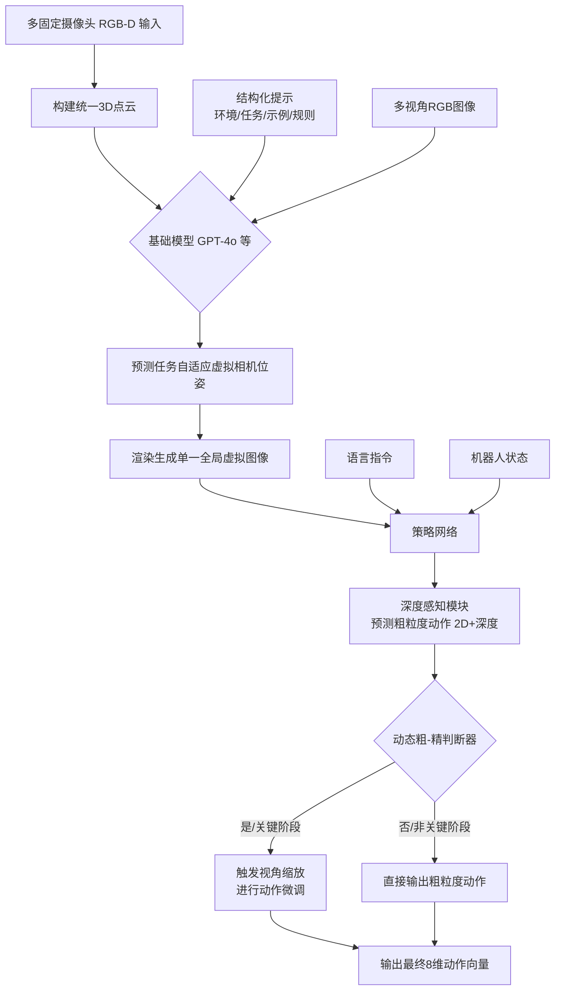

# VERM: Leveraging Foundation Models to Create a Virtual Eye for Efficient 3D Robotic Manipulation

**相关性评分**: 8.0/10

**排名**: #10

---

## 基本信息

- **arXiv ID**: [2512.16724v1](https://arxiv.org/abs/2512.16724v1)
- **发布时间**: 2025-12-18T16:26:17Z
- **相关性评分**: 8.0/10
- **是否相关**: 是

## 作者

Yixiang Chen, Yan Huang, Keji He, Peiyan Li, Liang Wang

## 关键词

Vision-Language-Action Model, VLA for Robotics, Inference Efficiency, Lightweight Architecture, Inference Acceleration, Edge Deployment

## 一句话总结

VERM方法通过利用基础模型创建虚拟任务自适应视图，过滤冗余信息，提升3D机器人操作的训练和推理效率，并实现推理加速。

## 摘要

When performing 3D manipulation tasks, robots have to execute action planning based on perceptions from multiple fixed cameras. The multi-camera setup introduces substantial redundancy and irrelevant information, which increases computational costs and forces the model to spend extra training time extracting crucial task-relevant details. To filter out redundant information and accurately extract task-relevant features, we propose the VERM (Virtual Eye for Robotic Manipulation) method, leveraging the knowledge in foundation models to imagine a virtual task-adaptive view from the constructed 3D point cloud, which efficiently captures necessary information and mitigates occlusion. To facilitate 3D action planning and fine-grained manipulation, we further design a depth-aware module and a dynamic coarse-to-fine procedure. Extensive experimental results on both simulation benchmark RLBench and real-world evaluations demonstrate the effectiveness of our method, surpassing previous state-of-the-art methods while achieving 1.89x speedup in training time and 1.54x speedup in inference speed. More results can be found on our project website at https://verm-ral.github.io .

## 详细分析

## 论文《VERM：利用基础模型为高效3D机器人操作创建虚拟眼》详细摘要

**1. 研究背景和动机**
在3D机器人操作任务中，机器人通常依赖多个固定摄像头的感知信息进行动作规划。这种多摄像头设置会引入大量冗余和无关信息，导致计算成本高昂，并迫使模型花费额外训练时间来提取关键任务细节。现有方法要么处理包含冗余背景的完整3D表示（计算量大），要么依赖人类专家经验预定义虚拟视角（缺乏任务适应性）。为解决这些问题，本文受人类利用知识选择最佳观察视角的认知能力启发，提出了VERM方法。

**2. 核心方法和技术创新**
VERM的核心是构建一个“预测-获取-引导”的流水线，其技术创新主要体现在：
- **基于基础模型的虚拟视角选择**：设计了一个结构化的提示框架，将GPT-4o等大型多模态模型转化为空间推理代理。该模型根据多摄像头观测和文本指令，**推理并输出一个面向任务的自适应虚拟相机位姿**，从而生成一张能捕捉关键信息并减少遮挡的单一虚拟图像。
- **深度感知与动态粗到精机制**：为解决单张2D图像缺乏深度信息和精细操作能力的问题，VERM设计了**深度感知模块**（通过可学习的深度令牌预测动作深度）和一个**动态粗到精过程**。后者能智能识别任务关键阶段（如精确对齐），并自动触发视角缩放以聚焦局部区域，仅在必要时进行动作细化，平衡了精度与效率。

**3. 主要实验结果**
在模拟基准RLBench和真实世界评估中，VERM均表现出色：
- **性能领先**：在RLBench的17个任务中，平均成功率（83.6%）超越之前最优方法（RVT-2），并在11个任务中取得最佳成绩。
- **效率显著提升**：得益于单图像输入，训练时间**加速1.89倍**，推理速度**加速1.54倍**。
- **泛化性强**：方法可兼容GPT-4o、Qwen2.5、Claude 3.5等多种基础模型，验证了其作为即插即用空间推理模块的潜力。
- **真实世界有效**：在仅使用15条演示轨迹的情况下，VERM在8个真实任务上的平均成功率（78.75%）已显著优于对比方法。

**4. 研究意义和价值**
VERM的研究意义在于：
- **方法论创新**：首次系统性地利用基础模型的空间推理能力为机器人操作选择最优感知视角，为“基础模型+机器人”的研究开辟了新方向。
- **实用价值突出**：通过将多摄像头信息压缩为一张任务自适应的虚拟图像，**大幅降低了感知与决策的计算负担**，为实现高效、实时的3D机器人操作提供了可行路径。
- **启发广泛**：其“动态粗到精”和“深度感知”设计为解决其他需要高精度3D理解与操作的问题提供了有价值的参考。

## 问答对

### 问题 1

**Q**: 这篇论文的核心创新点是什么，他想解决什么问题，怎么解决的？

**A**: ## 论文核心分析：VERM

### **一、 想解决的核心问题**
论文旨在解决**3D机器人操作任务中，多固定摄像头感知系统带来的效率瓶颈**。具体问题包括：
1.  **信息冗余与计算负担**：多个固定摄像头（如前、左肩、右肩、手腕）的输入存在大量重叠和与任务无关的背景信息，导致模型需要处理海量数据，训练和推理速度慢。
2.  **遮挡与关键信息提取困难**：固定视角可能无法完整捕捉任务关键区域（如被遮挡的把手、孔洞），迫使模型从冗余的3D表示（如体素、点云）中费力地提取有效特征。
3.  **人工依赖与缺乏适应性**：现有方法（如RVT系列）依赖人类专家预先定义虚拟相机位姿，这些位姿对于新任务可能不是最优的，缺乏任务自适应性。

### **二、 核心创新点**
VERM的核心创新在于**将基础模型（如GPT-4o）作为一个“虚拟眼睛”的空间推理器**，实现任务自适应的视角选择，并配套设计了支持3D精细操作的模块。具体创新如下：

- **1. 基于基础模型的虚拟相机位姿生成**
    - **技术创新**：设计了一套**结构化提示框架**，将GPT-4o等大型多模态模型转化为空间推理智能体。
    - **方法**：通过组合**环境描述**（使用Set-of-Mark可视化）、**任务描述**、**上下文示例**和**规则约束**的文本提示，以及多视角RGB图像，引导模型输出一个面向任务的最优虚拟相机位姿（`elev`和`azim`参数）。
    - **价值**：实现了**任务自适应的视角选择**，无需人工预设，能自动找到最能揭示任务关键信息、减少遮挡的视角。该方法被证明可**即插即用**于GPT-4o、Qwen2.5、Claude 3.5等多种基础模型。

- **2. “预测-获取-引导”的高效感知流水线**
    - **流程**：`预测`虚拟相机位姿 → 从构建的3D点云中`获取`该视角的单一全局图像 → 用此单图像`引导`策略网络生成动作。
    - **价值**：将输入从多幅图像或庞大3D表示**压缩为单张2D图像**，极大减少了模型需要处理的令牌（Token）数量。这是实现**训练速度提升1.89倍、推理速度提升1.54倍**的关键。

- **3. 深度感知模块与动态粗-精调整机制**
    - **深度感知模块**：为了解决单张2D图像缺乏深度信息的问题，在Transformer中引入**可学习的深度令牌**，与图像、语言令牌共同通过注意力机制，预测动作的3D位置（2D热图 + 深度值）和离散化的旋转。
    - **动态粗-精调整机制**：
        - **创新**：不同于传统每步都进行精细调整的方法，VERM引入一个**轻量级预测器**，在训练时自动识别任务关键阶段（如抓取、对齐）。
        - **机制**：仅在预测器判断需要高精度时（粗、精预测差异超过阈值），才触发“缩放”操作，聚焦于局部区域进行动作微调。
        - **价值**：在保证高精度任务（如插桩）成功率的同时，避免了不必要的计算开销，实现了**精度与效率的平衡**。

### **三、 解决方案总结**
VERM通过一个**端到端的框架**系统性地解决了上述问题：

**实际价值**：
1.  **效率大幅提升**：在保持甚至提升任务成功率（RLBench上平均83.6%，超越之前最佳RVT-2）的同时，显著加速训练与推理，使实时控制更可行。
2.  **减少人工干预**：摆脱了对专家定义视角的依赖，使系统更智能、更通用。
3.  **证明基础模型的空间推理能力**：为将大模型用于机器人低层空间感知与规划提供了新范式。
4.  **强泛化性**：在模拟（RLBench）和真实世界任务中均表现优异，且仅需少量演示数据即可达到良好性能。

### 问题 2

**Q**: 请用一段话总结这篇论文，明确说明：论文试图解决的核心问题；提出的主要方法或框架；最终取得的主要效果或结论。要求语言简洁、信息密度高，不要复述摘要原文。

**A**: 这篇论文旨在解决多摄像头3D机器人操作任务中，输入数据存在大量冗余和无关信息，导致计算成本高、训练时间长的问题。为此，作者提出了VERM方法，其核心创新在于利用GPT-4o等基础模型作为“虚拟眼睛”，根据任务指令和多视角观测，推理并生成一个能捕捉关键信息、减少遮挡的单一任务自适应虚拟视角图像，从而极大简化了感知输入。该方法还设计了深度感知模块和动态由粗到精的调整机制，以支持3D空间动作规划和精细操作。实验结果表明，该方法在RLBench仿真基准和真实世界评估中均超越了先前的最优方法，同时在保持高性能的前提下，实现了**1.89倍的训练加速**和**1.54倍的推理加速**，证明了其高效性和有效性。

### 问题 3

**Q**: 这篇论文相对于已有工作有哪些明确的创新点？请逐条列出，并对每一条说明：相比以往方法改进或不同之处在哪里，以及该创新解决了什么具体问题或带来了什么优势。

**A**: ## VERM论文创新点分析

这篇论文针对3D机器人操作中多固定相机带来的信息冗余和计算负担问题，提出了一套创新的解决方案。其核心创新点可归纳为以下四个方面：

### 1. **利用基础模型（GPT-4o）进行任务自适应的虚拟视点选择**
- **相比以往方法的改进/不同之处**：
    - **以往方法**：如RVT系列，依赖于**人工预先定义**的多个虚拟相机平面（如正交视图）来重投影点云。这些视图是固定的、通用的，并非为特定任务优化。
    - **VERM方法**：提出一个**结构化提示框架**，将GPT-4o等大型多模态模型转化为一个**空间推理智能体**。模型根据多视角RGB-D观测和语言指令，动态推理并输出一个最优的**虚拟相机位姿**（`elev`和`azim`参数），从而渲染出单一的任务自适应视图。
- **解决的具体问题/带来的优势**：
    - **解决冗余与遮挡**：自动选择的视点能最大程度捕捉任务关键信息并减少遮挡，避免了多固定相机或固定虚拟视图带来的大量无关背景信息。
    - **减少人力依赖与提升泛化性**：摆脱了对专家知识定义视图的依赖，使系统能自动适应新任务，更具灵活性。
    - **为后续高效处理奠基**：将输入从多幅图像或庞大3D表征压缩为**单张2D图像**，极大减少了模型需要处理的数据量。

### 2. **设计深度感知模块，实现基于单张图像的3D动作规划**
- **相比以往方法的改进/不同之处**：
    - **以往方法**：基于3D体素或点云的方法（如PerAct、Act3D）直接在3D空间进行推理，计算成本高。基于2D图像的方法（如CLIPort）则难以进行精确的3D空间轨迹规划。
    - **VERM方法**：在基于单张虚拟图像预测2D热图（表征末端执行器在图像平面的投影位置）的同时，引入**可学习的深度令牌**。通过Transformer的注意力机制，联合处理图像、语言和深度令牌，从而预测出动作的**深度值**，将2D动作扩展为完整的3D位姿。
- **解决的具体问题/带来的优势**：
    - **解决单视图的深度缺失问题**：使系统仅凭一张2D图像也能进行精确的3D空间动作规划，这是实现高效单图像输入策略的关键技术保障。
    - **保持3D操作能力**：确保了机器人能够在三维空间中规划合理的运动轨迹，而不仅仅是平面操作。

### 3. **提出动态粗到细调整机制，实现高效的高精度操作**
- **相比以往方法的改进/不同之处**：
    - **以往方法**：如C2F-ARM和RVT-2，采用**静态的**粗到细策略，即在每个时间步都执行“先粗后精”的两阶段推理，计算开销固定。
    - **VERM方法**：提出**动态触发**的粗到细机制。首先，策略网络基于全局视图预测一个粗粒度动作。同时，一个轻量级分类器（在训练时通过判断粗、细预测差异是否超过阈值来学习）会**动态判断**当前阶段是否为需要高精度的“任务关键阶段”（如抓取、对齐）。仅在需要时，才触发“缩放”操作，聚焦于局部区域进行动作微调。
- **解决的具体问题/带来的优势**：
    - **平衡精度与效率**：避免了在非关键阶段（如自由空间移动）不必要的精细计算，将计算资源集中用于真正需要高精度的时刻。
    - **提升高精度任务成功率**：在如插桩等任务中，通过局部聚焦和迭代优化，提高了操作的精确度和成功率。

### 4. **验证了作为即插即用空间推理模块的泛化性**
- **相比以往方法的改进/不同之处**：
    - **以往方法**：大多数基于基础模型的工作（如VoxPoser）通常针对特定模型（如GPT-4）进行设计和优化。
    - **VERM方法**：论文不仅使用GPT-4o，还成功验证了将**Qwen2.5**和**Claude 3.5**等不同基础模型接入其提示框架的可行性。通过引入迭代优化和自我验证反馈，即使这些模型初始生成的相机位姿有偏差，最终也能达到接近GPT-4o的性能。
- **解决的具体问题/带来的优势**：
    - **降低依赖与成本**：证明了VERM的核心思想（利用基础模型进行视点选择）不依赖于某个特定、可能昂贵的商业模型，可以兼容开源或替代模型，提高了方法的实用性和可访问性。
    - **模块化设计**：凸显了VERM中“虚拟眼”模块的**即插即用**特性，易于集成和升级。

### **总结：核心优势**
这些创新点共同作用，使得VERM在**性能、效率、泛化性**上实现了显著提升：
- **性能**：在RLBench基准测试中平均成功率（83.6%）超越之前最优方法（RVT-2，82.2%），并在多个任务上领先。
- **效率**：得益于单图像输入和动态计算，实现了**1.89倍**的训练加速和**1.54倍**的推理加速。
- **泛化性**：在少样本（15条示教轨迹）的真实世界评估中表现优异，证明了其数据效率和从模拟到现实的迁移能力。

### 问题 4

**Q**: 论文在实验或评估中最终实现了怎样的效果？请说明使用了哪些数据集和评价指标，与哪些基线方法进行了对比，以及在关键指标上的主要性能提升或结论。如果论文未给出明确的定量结果，也请说明原因。

**A**: ## 论文实验与评估效果总结

### 一、 使用的数据集与评价指标
1.  **数据集**：
    - **主要仿真基准**：**RLBench**（一个包含多样化机器人操作任务的仿真基准）。
    - **真实世界评估**：在真实机器人平台上构建了8个任务（如堆叠积木、按压消毒液、将物体放入抽屉等），每个任务包含1-7个物体变体。

2.  **评价指标**：
    - **核心指标**：**任务成功率**（Success Rate），即机器人根据预定义条件成功完成任务的轨迹比例。
    - **效率指标**：
        - **训练时间**：在指定GPU配置下完成模型训练所需的天数。
        - **推理速度**：模型每秒能处理的帧数（FPS）。
    - **辅助分析**：通过消融实验、定性可视化、跨模型泛化测试和失败案例分析来评估各模块的有效性与鲁棒性。

### 二、 对比的基线方法
论文与8种先进的3D机器人操作方法进行了全面对比，所有方法均使用相同的四台固定RGB-D相机输入以确保公平：
1.  **C2F-ARM-BC**：基于体素和多分辨率粗到细策略的方法。
2.  **PerAct**：使用体素化和Perceiver Transformer的方法。
3.  **HiveFormer**：直接使用原始相机图像的方法。
4.  **PolarNet**：基于密集点云表示的方法。
5.  **RVT**：基于人工预定义多个正交虚拟视图的方法。
6.  **Act3D**：在点云上应用预训练特征和交叉注意力机制的方法。
7.  **3D Diffuser Actor (3DDA)**：在3D点云上使用扩散策略的方法。
8.  **RVT-2**：RVT的改进版，引入了更高效的实现和粗到细策略。

### 三、 关键性能提升与结论
#### 1. 任务成功率（仿真RLBench）
- **整体表现**：VERM在RLBench的17个任务上取得了**83.6%**的平均成功率，超越了之前的最佳方法RVT-2（82.2%），并在**11/17**的任务中取得了最佳性能。
- **具体优势**：在需要处理遮挡或精细对齐的任务（如`open drawer`, `sort shape`, `stack blocks`）上表现突出，证明了其生成的**任务自适应虚拟视图能有效整合关键信息并减少遮挡**。

#### 2. 训练与推理效率
- **显著加速**：
    - **训练时间**：VERM相比RVT-2实现了 **1.89倍的加速**。
    - **推理速度**：VERM相比RVT-2实现了 **1.54倍的加速**。
- **核心原因**：将多相机输入压缩为**单张虚拟图像**，极大减少了模型需要处理的输入令牌（Token）数量，从而降低了计算复杂度。

#### 3. 真实世界评估
- **数据效率与性能**：在仅使用**15条演示轨迹**进行训练时，VERM在8个真实任务上的平均成功率（78.75%）已显著优于RVT（46.25%）和RVT-2（67.5%）。
- **泛化能力**：使用100条轨迹训练后，性能进一步提升至**80%**，表明方法具有良好的数据效率和泛化能力，能适应真实的传感器噪声和场景变化。

#### 4. 其他重要结论
- **模块有效性**：消融实验证实了**GPT-4o生成的虚拟视角**、**动态粗到细模块**和**深度感知模块**均为性能提升的关键。移除任一部分都会导致性能显著下降。
- **方法通用性**：VERM的虚拟视角选择模块具有“即插即用”特性，在**GPT-4o、Qwen2.5和Claude 3.5**三种不同的基础模型上均能取得相近的高成功率（80.3%-83.6%），证明了其不依赖于特定模型。
- **局限性**：当前方法在任务开始时仅查询一次虚拟视角，对于需要中途切换视角的复杂长时程任务（如`put in cupboard`）可能失效。论文通过动态重新查询策略将该任务成功率从55.2%提升至66.4%，但增加了计算成本。

### 总结
VERM通过利用基础模型（如GPT-4o）的视觉-空间推理能力，为机器人**动态生成一个任务自适应的“虚拟眼睛”**，将多视角感知压缩为单张富含信息的图像。该方法在**保持甚至提升任务成功率**的同时，实现了**训练和推理速度的大幅提升**，并在仿真和真实世界中均验证了其有效性和高效性。其核心价值在于**将基础模型的常识推理与机器人精细操作相结合，提供了一种高效、通用的3D操作感知新范式**。

## 相关链接

- [arXiv 页面](https://arxiv.org/abs/2512.16724v1)
- [HTML 版本](https://arxiv.org/html/2512.16724v1)
