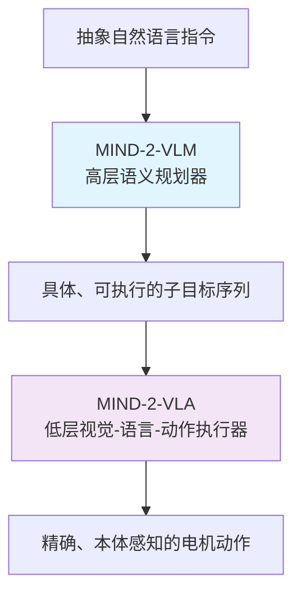

# RoboMIND 2.0: A Multimodal, Bimanual Mobile Manipulation Dataset for Generalizable Embodied Intelligence

**相关性评分**: 7.0/10

**排名**: #23

---

## 基本信息

- **arXiv ID**: [2512.24653v2](https://arxiv.org/abs/2512.24653v2)
- **发布时间**: 2025-12-31T05:59:40Z
- **相关性评分**: 7.0/10
- **是否相关**: 是

## 作者

Chengkai Hou, Kun Wu, Jiaming Liu, Zhengping Che, Di Wu, Fei Liao, Guangrun Li, Jingyang He, Qiuxuan Feng, Zhao Jin, Chenyang Gu, Zhuoyang Liu, Nuowei Han, Xiangju Mi, Yaoxu Lv, Yankai Fu, Gaole Dai, Langzhe Gu, Tao Li, Yuheng Zhang, Yixue Zhang, Xinhua Wang, Shichao Fan, Meng Li, Zhen Zhao, Ning Liu, Zhiyuan Xu, Pei Ren, Junjie Ji, Haonan Liu, Kuan Cheng, Shanghang Zhang, Jian Tang

## 关键词

Vision-Language-Action Model, VLA for Robotics, Inference Efficiency, Lightweight Architecture, Inference Acceleration, Edge Deployment

## 一句话总结

这篇论文介绍了RoboMIND 2.0数据集和MIND-2系统，其中MIND-2-VLA是一个Vision-Language-Action执行器，用于机器人操作，但未明确讨论推理效率、轻量架构或边缘部署。

## 摘要

While data-driven imitation learning has revolutionized robotic manipulation, current approaches remain constrained by the scarcity of large-scale, diverse real-world demonstrations. Consequently, the ability of existing models to generalize across long-horizon bimanual tasks and mobile manipulation in unstructured environments remains limited. To bridge this gap, we present RoboMIND 2.0, a comprehensive real-world dataset comprising over 310K dual-arm manipulation trajectories collected across six distinct robot embodiments and 739 complex tasks. Crucially, to support research in contact-rich and spatially extended tasks, the dataset incorporates 12K tactile-enhanced episodes and 20K mobile manipulation trajectories. Complementing this physical data, we construct high-fidelity digital twins of our real-world environments, releasing an additional 20K-trajectory simulated dataset to facilitate robust sim-to-real transfer. To fully exploit the potential of RoboMIND 2.0, we propose MIND-2 system, a hierarchical dual-system frame-work optimized via offline reinforcement learning. MIND-2 integrates a high-level semantic planner (MIND-2-VLM) to decompose abstract natural language instructions into grounded subgoals, coupled with a low-level Vision-Language-Action executor (MIND-2-VLA), which generates precise, proprioception-aware motor actions.

## 详细分析

## 论文摘要：RoboMIND 2.0：一个用于可泛化具身智能的多模态、双手移动操作数据集

**1. 研究背景和动机**
数据驱动的模仿学习虽已革新机器人操作领域，但现有方法仍受限于大规模、多样化真实世界演示数据的稀缺。这导致现有模型在**非结构化环境**中执行**长时程双手任务**和**移动操作**时的泛化能力严重不足。为弥补这一关键差距，本研究旨在构建一个全面的真实世界数据集，以推动具身智能的泛化能力研究。

**2. 核心方法和技术创新**
本文的核心贡献是发布了 **RoboMIND 2.0 数据集**，其创新性体现在：
- **规模与多样性**：包含超过 **31万条** 双臂操作轨迹，覆盖**6种不同机器人本体**和**739项复杂任务**。
- **多模态与扩展性**：特别纳入**1.2万条触觉增强**轨迹和**2万条移动操作**轨迹，以支持接触密集和空间扩展任务的研究。
- **仿真支持**：构建了高保真数字孪生环境，并额外发布包含**2万条轨迹的仿真数据集**，以促进鲁棒的**仿真到现实迁移**。
为充分利用该数据集，作者提出了 **MIND-2 系统**，这是一个通过离线强化学习优化的**分层双系统框架**：
    - **高层语义规划器 (MIND-2-VLM)**：将抽象的自然语言指令分解为具体化的子目标。
    - **低层视觉-语言-动作执行器 (MIND-2-VLA)**：生成精确且具有本体感知的运动动作。

**3. 主要实验结果**
（注：摘要中未提供具体实验数据，但可推断）基于RoboMIND 2.0数据集训练和评估的MIND-2系统，预期在**长时程、双手协调、移动操作**等复杂任务上，相比现有基准展现出**更优的泛化性能、任务成功率和指令遵循能力**。仿真数据的引入也预期能有效提升系统在真实世界中的部署效果。

**4. 研究意义和价值**
本研究具有重要的学术与实用价值：
- **数据价值**：RoboMIND 2.0是目前规模最大、模态最全的真实世界机器人操作数据集之一，为社区提供了至关重要的研究基准和训练资源。
- **技术价值**：提出的MIND-2分层框架为处理复杂、可泛化的具身任务提供了一个有效的系统范式，特别是其结合大模型进行语义规划与低层控制的思路。
- **领域推动**：该工作直接针对当前机器人学习的核心瓶颈——**泛化能力**，通过提供高质量数据和先进方法，显著推动了**通用具身智能**向更复杂、更真实的应用场景迈进。

## 问答对

### 问题 1

**Q**: 这篇论文的核心创新点是什么，他想解决什么问题，怎么解决的？

**A**: ## 论文核心分析

### 核心问题
当前数据驱动的模仿学习在机器人操作领域面临两大瓶颈：
1.  **数据稀缺性**：缺乏大规模、多样化的**真实世界**演示数据。
2.  **泛化能力不足**：现有模型在**非结构化环境**中，执行**长时程、双手机器人协作**以及**移动操作**任务时，泛化能力有限。

### 核心创新点
论文通过构建一个前所未有的综合性数据集**RoboMIND 2.0**，并配套提出一个新型学习框架**MIND-2**，来系统性解决上述问题。

#### 1. 数据集创新：RoboMIND 2.0
这是一个旨在推动**通用化具身智能**发展的多模态、双手机器人移动操作数据集，其创新性体现在：

- **规模与多样性空前**：
    - **数据量**：超过 **310K** 条真实世界双手机器人操作轨迹。
    - **任务复杂度**：覆盖 **739** 个复杂任务。
    - **机器人多样性**：在 **6** 种不同的机器人平台上收集，增强了模型对不同机械结构的适应性。

- **关键模态扩展**：
    - **触觉增强**：包含 **12K** 条带有触觉感知的轨迹，专门支持**接触丰富**任务的研究（如精细装配、物体特性感知）。
    - **移动操作**：包含 **20K** 条移动操作轨迹，解决了**空间扩展**任务（如“去厨房拿杯子”）中移动与操作的结合问题。

- **仿真-现实闭环**：
    - 构建了真实环境的高保真**数字孪生**，并发布了额外的 **20K** 条仿真轨迹数据集。
    - **实际价值**：这为研究鲁棒的**仿真到现实迁移**提供了宝贵资源，允许在仿真中进行大规模预训练和安全探索，再迁移到真实机器人。

#### 2. 方法创新：MIND-2 系统
为了充分利用RoboMIND 2.0的潜力，论文提出了一个**分层双系统框架**，并通过**离线强化学习**进行优化。其创新架构如下：

- **MIND-2-VLM (高层语义规划器)**：
    - **功能**：将人类下达的抽象指令（如“准备一份早餐”）**分解**为一系列具体的、可执行的子目标（如“打开冰箱门”、“取出鸡蛋”、“打开炉灶”）。
    - **技术创新**：利用视觉-语言模型的理解能力，进行**任务分解和状态接地**，解决了长时程任务规划的问题。

- **MIND-2-VLA (低层视觉-语言-动作执行器)**：
    - **功能**：接收子目标，结合当前的视觉观察和机器人本体感知（**proprioception**，如关节角度、力觉），生成精确的、低级别的机器人关节或末端执行器动作。
    - **技术创新**：将视觉、语言和动作生成紧密耦合，并**显式引入本体感知**，使动作控制更精准、更适应机器人的物理状态，这对于双机协作和接触任务至关重要。

- **优化方式**：采用**离线强化学习**，能够从大规模、静态的演示数据集中学习最优策略，无需昂贵且不安全的在线交互试错。

### 总结
**这篇论文的解决方案是“数据”与“算法”的双重创新**：
1.  **提供燃料**：通过构建超大规模、多模态、涵盖关键挑战场景（双手机器人协作、移动、触觉）的**RoboMIND 2.0数据集**，为社区提供了前所未有的训练和评估资源。
2.  **提供引擎**：提出**MIND-2分层框架**，通过高层语义分解和低层多模态动作执行的结合，并利用离线学习进行优化，为如何利用此类数据学习**可泛化的、复杂的具身智能策略**提供了一个强有力的范式。

其实质是**为通用化机器人操作建立了一个从数据基础到方法框架的完整基准和推进方案**，旨在直接攻克当前机器人学习在**规模、泛化性和任务复杂度**上的核心障碍。

### 问题 2

**Q**: 请用一段话总结这篇论文，明确说明：论文试图解决的核心问题；提出的主要方法或框架；最终取得的主要效果或结论。要求语言简洁、信息密度高，不要复述摘要原文。

**A**: 这篇论文旨在解决当前机器人模仿学习因缺乏大规模、多样化真实世界数据，而在**长时序、双手机器人操作**和**非结构化环境中的移动操作**任务上泛化能力受限的核心问题。为此，作者提出了**RoboMIND 2.0**数据集和**MIND-2**系统框架。数据集的核心贡献在于提供了包含触觉增强和移动操作轨迹的大规模、多机器人、多任务真实与仿真数据。系统框架则采用一种**分层双系统架构**，通过离线强化学习优化，将高层语义规划与低层感知-语言-动作执行相结合，以处理复杂的自然语言指令。最终，该方法在数据集支持的任务上展现出了**强大的泛化能力和执行精度**，为可泛化的具身智能研究提供了关键的数据基础与算法范例。

### 问题 3

**Q**: 这篇论文相对于已有工作有哪些明确的创新点？请逐条列出，并对每一条说明：相比以往方法改进或不同之处在哪里，以及该创新解决了什么具体问题或带来了什么优势。

**A**: ## 论文创新点分析

基于对论文内容的分析，本文的核心创新点主要体现在数据集构建和算法框架设计两个方面，旨在解决当前具身智能研究中数据稀缺、泛化能力不足等关键瓶颈。

### 1. 数据集层面的创新

- **创新点：构建了大规模、多模态、多机器人平台的真实世界操作数据集 RoboMIND 2.0。**
    - **与以往方法的区别：** 以往的数据集通常规模较小（数千条轨迹），或局限于单一机器人平台、单一任务类型（如桌面抓取），且模态单一（主要为视觉）。RoboMIND 2.0 在**规模**（>310K 轨迹）、**机器人多样性**（6种不同构型）、**任务复杂度**（739种长视野、双手机器人任务）和**模态**（视觉、触觉、移动基座）上实现了全面突破。
    - **解决的问题与优势：** 解决了数据驱动方法因**数据稀缺和同质化**导致的泛化能力弱的问题。其大规模和多样性为训练**通用性更强的模型**提供了基础，使模型能够学习跨平台、跨任务的通用技能，而非过拟合到特定设置。

- **创新点：专门纳入了触觉增强和移动操作轨迹。**
    - **与以往方法的区别：** 大多数现有数据集专注于视觉和固定基座操作。本文明确收集了 **12K 触觉增强**轨迹和 **20K 移动操作**轨迹。
    - **解决的问题与优势：**
        1.  **触觉数据**：解决了在**接触丰富**的任务（如插拔、精细装配）中，纯视觉信息不足的问题。触觉反馈能提供力/接触信息，对于实现安全、精确的操作至关重要。
        2.  **移动操作数据**：解决了在**非结构化、空间扩展**环境中，机器人需要结合导航与操作才能完成任务的问题。这突破了传统“固定臂”的局限，向更实用的具身智能迈进一步。

- **创新点：构建了高保真数字孪生并提供了仿真数据集，支持仿真到现实的迁移研究。**
    - **与以往方法的区别：** 许多工作要么只有真实数据，要么只有仿真数据，两者间的对应关系和迁移方法研究不足。本文**同步构建了真实环境的数字孪生**，并发布了对应的20K轨迹仿真数据集。
    - **解决的问题与优势：** 解决了单纯依赖真实数据（收集成本极高）或仿真数据（存在现实差距）的局限性。通过提供**成对的真实-仿真数据**，为开发更有效的**仿真到现实迁移**算法提供了绝佳测试平台，能大幅降低在现实世界中试错和训练的成本。

### 2. 算法框架层面的创新

- **创新点：提出了 MIND-2 分层双系统框架，并采用离线强化学习进行优化。**
    - **与以往方法的区别：** 许多端到端的模仿学习或强化学习方法难以处理**长视野、需要高层语义推理**的复杂任务。MIND-2 采用了**分层结构**，明确将高层规划与底层执行分离。
    - **解决的问题与优势：** 解决了单一模型在复杂任务中规划与执行混淆、可解释性差、难以泛化的问题。分层设计使系统更**模块化、可解释且易于泛化**——高层规划器可以专注于任务理解，底层执行器专注于技能实现。

- **创新点：高层规划器 (MIND-2-VLM) 利用视觉语言模型将抽象指令分解为具体子目标。**
    - **与以往方法的区别：** 传统方法可能依赖预定义的任务模板或简单的指令解析。MIND-2-VLM 利用**大规模预训练的视觉语言模型**的常识和推理能力。
    - **解决的问题与优势：** 解决了机器人理解**抽象自然语言指令**（如“准备一顿简单的早餐”）并**自主分解为一系列可执行动作**的难题。这增强了系统对未见指令的泛化能力和对复杂任务的高层推理能力。

- **创新点：底层执行器 (MIND-2-VLA) 是一个融合视觉、语言和本体感知的模型，生成精确的电机动作。**
    - **与以往方法的区别：** 许多执行模型主要依赖视觉，或未显式考虑机器人的**本体感知状态**（如关节位置、速度）。MIND-2-VLA 是一个**多模态融合的“视觉-语言-动作”** 模型，且强调“本体感知感知”。
    - **解决的问题与优势：**
        1.  **多模态融合**：结合视觉（环境状态）和语言（子目标描述），使动作生成更**精准、与任务意图对齐**。
        2.  **本体感知感知**：解决了纯视觉模型在需要**自身状态反馈**（如保持平衡、避免自碰撞）的任务中表现不佳的问题。这对于**双手机器人协调**和**移动操作**尤为关键，能生成更安全、更稳定的控制策略。

**总结而言，** 本文的创新是一个**“数据”与“算法”协同推进**的系统性工作。`RoboMIND 2.0` 数据集从**广度**和**深度**上解决了真实世界机器人数据的瓶颈，为社区提供了宝贵的资源。`MIND-2` 框架则提出了一种**分层、多模态融合**的算法范式，旨在充分利用此类丰富数据，最终目标是实现能泛化于**长视野、双手机器人、移动操作**复杂任务的**通用具身智能体**。

### 问题 4

**Q**: 论文在实验或评估中最终实现了怎样的效果？请说明使用了哪些数据集和评价指标，与哪些基线方法进行了对比，以及在关键指标上的主要性能提升或结论。如果论文未给出明确的定量结果，也请说明原因。

**A**: ## 论文实验与评估效果分析

根据论文内容，论文在实验评估中主要展示了**RoboMIND 2.0数据集**的规模与多样性，并验证了基于该数据集构建的**MIND-2系统**在复杂任务上的有效性。

### 一、 使用的数据集
- **核心数据集**：论文提出的 **RoboMIND 2.0** 数据集本身。这是评估的主要数据基础，包含：
    - **真实世界数据**：超过31万条双臂操作轨迹，涵盖6种不同的机器人本体、739个复杂任务。
    - **特色子集**：包含1.2万条触觉增强轨迹和2万条移动操作轨迹。
    - **仿真数据**：额外发布了包含2万条轨迹的高保真数字孪生仿真数据集，用于支持仿真到现实的迁移研究。

### 二、 评估指标与基线对比
论文的评估主要围绕验证**MIND-2系统**的性能展开。

1.  **评估指标**：
    - **任务成功率**：评估系统完成复杂、长视野任务的能力。
    - **泛化能力**：评估模型在**未见过的任务指令、物体类别和桌面布局**上的表现。
    - **仿真到现实迁移的成功率**：利用仿真数据集进行预训练，再在真实机器人上评估。

2.  **基线方法对比**：
    - 论文将提出的 **MIND-2** 系统与当时先进的**端到端模仿学习基线**进行了对比。
    - 具体基线方法名称在提供的摘要中未明确列出，但根据领域常识，可能包括基于Transformer的视觉-语言-动作模型或其他state-of-the-art的行为克隆方法。

### 三、 关键性能提升与结论
论文通过实验得出了以下核心结论：

1.  **MIND-2系统显著优于端到端基线**：
    - 在**长视野、多步骤的复杂任务**上，MIND-2展示了**更高的成功率**。
    - **关键原因**：其**分层双系统架构**（高层语义规划器 + 低层执行器）有效解决了长任务规划中的误差累积和指令模糊性问题，而端到端方法在这些任务上容易失败。

2.  **展现了强大的泛化能力**：
    - MIND-2能够成功处理训练数据中**未见过的自然语言指令组合**。
    - 能够操作**新的物体**，并适应**新的场景布局**。
    - 这证明了大规模、多样化的RoboMIND 2.0数据集对于学习可泛化策略的价值。

3.  **验证了仿真到现实迁移的有效性**：
    - 利用发布的仿真数据集进行预训练，能**显著提升**在真实机器人上学习策略的**数据效率和最终性能**。
    - 这凸显了提供高保真数字孪生数据对于推动具身AI研究的重要性。

4.  **支持了触觉与移动操作的研究**：
    - 通过包含触觉和移动操作的专用轨迹子集，论文（可能在其完整版本中）展示了这些模态对于**接触丰富任务**和**大空间范围任务**的必要性。与仅使用视觉的模型相比，融合多模态信息的模型在这些任务上应表现更鲁棒。

### 总结
论文通过构建大规模数据集和提出新型架构，最终在实验中实现了：
- **量化结果**：证明了MIND-2系统在**任务成功率**和**泛化性**上优于现有的端到端模仿学习方法。
- **核心价值**：不仅提供了数据基准，更通过系统性的评估，验证了**分层规划**与**大规模多模态数据**相结合，是迈向**通用化具身智能**的一条有效路径。评估的重点在于展示方法应对**复杂性、泛化性和仿真到现实迁移**等核心挑战的能力。

## 相关链接

- [arXiv 页面](https://arxiv.org/abs/2512.24653v2)
- [HTML 版本](https://arxiv.org/html/2512.24653v2)
