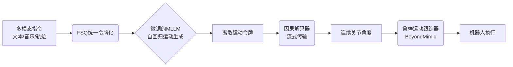

# UniAct: Unified Motion Generation and Action Streaming for Humanoid Robots

**相关性评分**: 8.0/10

**排名**: #6

---

## 基本信息

- **arXiv ID**: [2512.24321v1](https://arxiv.org/abs/2512.24321v1)
- **发布时间**: 2025-12-30T16:20:13Z
- **相关性评分**: 8.0/10
- **是否相关**: 是

## 作者

Nan Jiang, Zimo He, Wanhe Yu, Lexi Pang, Yunhao Li, Hongjie Li, Jieming Cui, Yuhan Li, Yizhou Wang, Yixin Zhu, Siyuan Huang

## 关键词

Vision-Language-Action Model, VLA for Robotics, Inference Efficiency, Lightweight Architecture, Edge Deployment

## 一句话总结

UniAct是一个用于人形机器人的统一运动生成和动作流式处理框架，通过两阶段架构和共享离散码本实现多模态指令的低延迟执行，显著提升推理效率和边缘部署能力。

## 摘要

A long-standing objective in humanoid robotics is the realization of versatile agents capable of following diverse multimodal instructions with human-level flexibility. Despite advances in humanoid control, bridging high-level multimodal perception with whole-body execution remains a significant bottleneck. Existing methods often struggle to translate heterogeneous instructions -- such as language, music, and trajectories -- into stable, real-time actions. Here we show that UniAct, a two-stage framework integrating a fine-tuned MLLM with a causal streaming pipeline, enables humanoid robots to execute multimodal instructions with sub-500 ms latency. By unifying inputs through a shared discrete codebook via FSQ, UniAct ensures cross-modal alignment while constraining motions to a physically grounded manifold. This approach yields a 19% improvement in the success rate of zero-shot tracking of imperfect reference motions. We validate UniAct on UniMoCap, our 20-hour humanoid motion benchmark, demonstrating robust generalization across diverse real-world scenarios. Our results mark a critical step toward responsive, general-purpose humanoid assistants capable of seamless interaction through unified perception and control.

## 详细分析

## 论文摘要：UniAct: 人形机器人的统一运动生成与动作流式传输

**1. 研究背景和动机**
人形机器人领域长期以来的目标是开发能够遵循多样化多模态指令、具备人类水平灵活性的通用智能体。尽管底层控制技术已取得显著进展，但如何将高级的多模态感知（如语言、音乐、轨迹）与全身运动执行无缝桥接，仍是一个关键瓶颈。现有方法通常难以将异构指令稳定、实时地转化为动作，且在遇到分布外（OOD）或不完美的参考运动时表现脆弱。

**2. 核心方法和技术创新**
本文提出了 **UniAct**，一个两阶段统一框架，旨在实现低延迟、鲁棒的多模态人形机器人控制。其核心创新包括：
- **统一的多模态表征与生成**：利用**有限标量量化（FSQ）** 将文本、音乐、轨迹和参考运动映射到共享的离散码本中，实现了跨模态对齐，并将运动生成约束在物理可行的流形上。一个微调后的多模态大语言模型（MLLM）基于此统一表征进行自回归运动生成。
- **因果流式传输架构**：采用解耦的服务器-客户端架构，通过因果解码和流式传输管道，将生成的运动令牌实时转化为关节指令，送达底层跟踪控制器，实现了**低于500毫秒的端到端响应延迟**。
- **鲁棒的全身运动跟踪**：采用改进的BeyondMimic跟踪器作为底层控制器，执行生成的运动并保持动态平衡。
- **UA-Net数据集**：贡献了一个包含20小时高质量运动、涵盖文本、轨迹、音乐多模态标注的大规模人形机器人运动基准数据集，以促进相关研究。

**3. 主要实验结果**
在UA-Net数据集上的综合实验表明，UniAct在多项任务上超越现有方法：
- **多模态控制性能**：在文本、轨迹、音乐到运动的指令跟随任务中，在运动质量（FID）、对齐精度（R-precision）、轨迹跟踪误差（Root error）和任务成功率等指标上均达到最优。例如，在跟踪不完美参考运动时，零样本成功率提升了19%。
- **实时性**：系统在多种硬件配置下均能实现实时控制（20 Hz），模型延迟最低可达约52毫秒。
- **鲁棒性**：离散化表征有效提升了运动跟踪器对带噪声和OOD输入的运动跟踪鲁棒性，成功率显著提高。

**4. 研究意义和价值**
UniAct通过统一的多模态表征和高效的流式生成架构，为人形机器人的**通用、响应式交互**迈出了关键一步。其技术路径成功地将大语言模型的强大推理能力与机器人底层控制的实时性、鲁棒性要求相结合。同时，发布的UA-Net数据集和标准化评估协议为社区提供了宝贵的资源。这项工作推动了具身智能向能够无缝理解和执行复杂多模态指令的通用助手方向发展。

## 问答对

### 问题 1

**Q**: 这篇论文的核心创新点是什么，他想解决什么问题，怎么解决的？

**A**: ## 论文核心分析：UniAct

### **核心问题**
论文旨在解决**人形机器人领域长期存在的“感知-控制鸿沟”**：
- **问题**：如何将**高层、多模态的指令**（如自然语言、音乐、轨迹）实时、鲁棒地**翻译成**稳定、物理可行的**全身运动控制信号**。
- **现有方法的局限**：
    - **端到端方法**：延迟低，但难以处理复杂指令的长期时序依赖和跨模态推理。
    - **分层方法**：理解能力强，但计算开销大，实时规划困难。
    - **共同缺陷**：对分布外（OOD）输入或低质量参考运动敏感，易生成物理不可行动作，导致硬件不稳定。

### **核心创新点**
UniAct 提出了一个**统一的两阶段框架**，其创新主要体现在以下四个方面：

1.  **统一的离散运动表征与跨模态对齐**
    - **技术**：采用 **有限标量量化（FSQ）** 为所有模态（文本、音乐、轨迹、运动）构建一个**共享的离散码本**。
    - **价值**：
        - **统一接口**：将异构输入映射到同一离散令牌空间，使多模态大语言模型（MLLM）能够统一处理。
        - **物理约束**：离散化将生成的运动**约束在一个物理可行的流形上**，从根本上提升了生成动作的稳定性和跟踪鲁棒性。实验表明，这带来了**19%的零样本跟踪成功率提升**。

2.  **基于MLLM的实时运动生成与流式传输**
    - **技术**：对 **Qwen2.5-3B MLLM 进行微调**，使其能够根据多模态上下文**自回归地预测运动令牌**。
    - **价值**：
        - **强大的跨模态推理**：利用MLLM强大的语义理解和生成能力，处理复杂的组合指令。
        - **低延迟流式处理**：设计了**因果解码和客户端-服务器流式架构**，实现**亚500毫秒的端到端响应延迟**，满足实时交互需求。

3.  **解耦的鲁棒跟踪与控制**
    - **技术**：第二阶段使用一个**改进的BeyondMimic运动跟踪器**作为底层控制器，执行MLLM生成的运动序列。
    - **价值**：
        - **鲁棒性**：跟踪器经过强化学习训练，能处理外部扰动，保证动态平衡和物理可行性。
        - **解耦优势**：将高层的“意图生成”与低层的“稳定执行”分离，既利用了MLLM的智能，又保证了控制的确定性。

4.  **大规模多模态人形机器人数据集 UA-Net**
    - **内容**：贡献了一个**20小时**、包含**文本-运动**、**轨迹-运动**、**音乐-运动**配对的高质量数据集。
    - **价值**：
        - **填补空白**：解决了人形机器人领域高质量、多模态标注数据稀缺的问题。
        - **标准化基准**：为多模态指令跟随能力提供了严谨的评估协议和基准。

### **解决方案概览**
UniAct 的解决方案是一个清晰的**三阶段流水线**：

1.  **令牌化**：所有输入通过FSQ编码为共享码本中的离散令牌。
2.  **生成**：MLLM以这些令牌为条件，预测未来的运动令牌序列。
3.  **执行**：令牌被实时解码为关节角度，并流式传输给跟踪控制器驱动机器人。

### **实际价值与意义**
- **技术价值**：首次将MLLM的强大多模态理解能力与实时、鲁棒的全身运动控制无缝结合，为人形机器人的“通用性”提供了可行的技术路径。
- **应用前景**：使得人形机器人能够更自然、灵活地响应人类的复杂指令（如“跟着这段音乐跳舞并走向沙发”），向真正的通用型 embodied AI 助手迈出关键一步。
- **社区贡献**：发布的 **UA-Net 数据集和评估基准** 将极大推动相关领域的研究可复现性和发展。

### 问题 2

**Q**: 请用一段话总结这篇论文，明确说明：论文试图解决的核心问题；提出的主要方法或框架；最终取得的主要效果或结论。要求语言简洁、信息密度高，不要复述摘要原文。

**A**: 这篇论文旨在解决人形机器人领域长期存在的**感知与控制鸿沟**问题，即如何将高层的、异构的多模态指令（如语言、音乐、轨迹）实时、鲁棒地转化为全身协调的物理动作。为此，论文提出了 **UniAct** 框架，其核心是一个**两阶段架构**：首先，通过微调的多模态大语言模型，利用基于有限标量量化的共享离散码本，将各种输入统一为运动令牌；其次，通过一个因果解码与流式传输管道，将这些令牌实时转换为关节指令，并由一个鲁棒的运动跟踪器执行。该方法在自建的20小时人形机器人运动基准数据集UA-Net上验证，实现了**低于500毫秒的响应延迟**，并在零样本跟踪不完美参考运动等任务上取得了显著性能提升（如成功率提升19%），证明了其实现实时、通用人形机器人交互的潜力。

### 问题 3

**Q**: 这篇论文相对于已有工作有哪些明确的创新点？请逐条列出，并对每一条说明：相比以往方法改进或不同之处在哪里，以及该创新解决了什么具体问题或带来了什么优势。

**A**: ## UniAct 论文创新点分析

这篇论文提出了一种名为 **UniAct** 的统一框架，旨在解决人形机器人将高级多模态指令（如语言、音乐、轨迹）实时、鲁棒地转化为全身动作的难题。其核心创新在于将多模态大语言模型与一个因果流式动作生成管道相结合。以下是其相对于已有工作的明确创新点：

### 1. **统一的、基于共享离散码本的多模态指令表征与生成**
   - **改进/不同之处**：
     - **以往方法**：现有方法通常为不同模态（如语言、轨迹、音乐）设计独立的编码和注入机制，导致系统复杂且难以实现跨模态的协同控制。例如，语言指令通常通过独立的潜变量或专门的网络分支处理。
     - **UniAct**：提出使用 **有限标量量化** 将**所有模态**（文本除外）的连续信号（音乐特征、轨迹、机器人关节运动）映射到一个**共享的离散码本**中，形成统一的词汇表。文本则直接使用预训练MLLM（Qwen2.5）的词汇表。所有模态的离散令牌在同一个序列中通过特殊分隔符进行早期融合，由同一个微调后的MLLM进行自回归生成。
   - **解决的问题/带来的优势**：
     - **解决了跨模态对齐与协同的难题**：统一的离散表示使得模型能够在一个共享的语义空间内理解和关联不同模态的指令，例如将“随着音乐节奏挥手”这样的复合指令分解并协调执行。
     - **约束动作空间，提升物理可行性与鲁棒性**：离散码本本质上将生成的动作限制在一个从高质量数据中学到的、物理上合理的流形上。这避免了端到端方法或扩散模型可能产生的物理上不可行、导致机器人失稳的动作。
     - **为MLLM提供了自然的接口**：离散令牌序列与语言模型的next-token预测范式完美契合，使得强大的MLLM能够直接用于复杂动作序列的规划和生成。

### 2. **两阶段解耦架构与因果流式解码，实现低延迟实时控制**
   - **改进/不同之处**：
     - **以往方法**：
       - **一步法（端到端）**：直接将指令映射为底层控制指令，延迟低但难以处理长时依赖和复杂语义，生成质量不稳定。
       - **两步法（分层）**：先离线生成完整动作序列，再交由跟踪器执行。虽然理解能力强，但生成过程（如扩散模型迭代）计算开销大，**无法实现实时流式响应**，且难以处理动态变化的指令。
     - **UniAct**：采用**解耦的两阶段架构**：1) **服务器端**：MLLM根据多模态指令**自回归地流式生成**动作令牌；2) **客户端**：一个**因果解码器**将接收到的令牌实时解码为连续的关节角度，并交由一个鲁棒的运动跟踪器（基于BeyondMimic修改）执行。同时设计了**客户端缓存机制**来平滑服务器生成速率与固定控制频率（50Hz）之间的不匹配。
   - **解决的问题/带来的优势**：
     - **实现了真正的实时交互**：整个系统实现了 **<500ms** 的端到端响应延迟，使得机器人能够对连续、变化的指令做出即时反应，这是许多离线生成方法无法实现的。
     - **平衡了性能与效率**：解耦设计允许在强大的服务器上进行复杂的多模态推理和生成，而在资源受限的机器人端只进行高效的低级控制和状态反馈。因果解码确保了当前动作只依赖于过去和当前的令牌，满足实时性要求。
     - **提升了系统实用性**：流式架构使得机器人可以持续执行动作，并在接收到新指令时平滑过渡，更符合实际交互场景。

### 3. **提出并构建了大规模多模态人形机器人运动数据集 UA-Net**
   - **改进/不同之处**：
     - **以往数据**：现有机器人数据集（如OmniH2O）主要关注物理轨迹，缺乏丰富的语义标注（如详细的语言描述）。而人类动作数据集（如HumanML3D）并非针对机器人形态和物理约束设计，需要复杂的重定向，且通常不包含音乐、轨迹等多模态对齐信息。
     - **UA-Net**：提供了一个**20小时**的高质量、多模态人形机器人运动数据集，包含：
       - **文本-动作对**：覆盖超过1400个常用动词，词汇量是HumanML3D的1.8倍，包含从简单到复杂的组合动作描述。
       - **轨迹-动作对**：通过运动匹配技术将20分钟的真实行走数据扩展至10小时以上，提供多样化的行走路径。
       - **音乐-动作对**：整合并重定向了FineDance数据集，提供不同风格和节奏的舞蹈动作。
       - **所有数据都经过精心重定向和手动校验**，确保符合目标机器人（Unitree G1）的动力学约束。
   - **解决的问题/带来的优势**：
     - **填补了研究空白**：为基于多模态指令的人形机器人控制研究提供了一个标准化的、大规模的基准测试平台。
     - **支持复杂的多模态学习**：丰富的、对齐的多模态标注使得训练像UniAct这样的统一模型成为可能，促进了高级语义理解与低级控制的结合。
     - **提升模型泛化能力**：数据集的多样性和规模有助于模型学习更通用、更鲁棒的动作表示。

### 4. **通过离散化表征增强运动跟踪的鲁棒性**
   - **改进/不同之处**：
     - **以往方法**：运动跟踪器（如BeyondMimic）直接跟踪可能包含噪声、抖动或分布外（OOD）的参考动作，容易导致跟踪失败或机器人摔倒。
     - **UniAct**：在跟踪器之前加入了 **FSQ编码-解码** 步骤。即使输入的是有噪声的或OOD的参考运动（如从互联网视频中提取的不完美人类动作），FSQ的量化过程也会将其**投影到训练好的离散码本所定义的“合理动作流形”上**，从而输出一个平滑、物理可行的版本。
   - **解决的问题/带来的优势**：
     - **显著提升了对不完美输入的鲁棒性**：实验表明，在跟踪添加了噪声和抖动的低质量参考运动时，采用FSQ预处理的方法将**零样本跟踪成功率提升了19%**。
     - **实现了更好的OOD泛化**：使得机器人能够安全地执行从未见过的、来自网络视频的人类动作，通过“动作流形投影”避免了危险动作的产生，拓宽了技能获取的渠道。

### 5. **支持零样本组合式跨模态控制**
   - **改进/不同之处**：
     - **以往方法**：大多数系统要么只能处理单一模态指令，要么需要为特定的动作-轨迹组合收集训练数据，缺乏组合泛化能力。
     - **UniAct**：利用“语义动作主要在上半身，轨迹跟随主要在下半身”的观察，提出了一种**零样本组合方法**：独立生成语言指令驱动的上半身动作和轨迹指令驱动的下半身动作，然后在骨盆关节处进行合成。通过对跟踪策略进行简单的微调（使用随机组合的动作对），即可稳定执行全新的组合指令。
   - **解决的问题/带来的优势**：
     - **实现了组合泛化**：机器人可以执行训练集中从未出现过的“动作+轨迹”组合（例如，“一边打鼓一边走S形路线”），极大地扩展了机器人的行为库，而无需为每一种组合收集数据。
     - **提高了部署的灵活性和可扩展性**：为构建能够处理复杂、复合现实世界任务的多功能人形助手提供了可行的技术路径。

---
**总结**：UniAct的核心创新在于**“统一”**和**“流式”**。它通过一个共享的离散表示空间统一了多模态的理解与生成，通过一个两阶段流式架构统一了高性能推理与实时控制，并通过精心设计的数据集和鲁棒化技术，为解决人形机器人领域长期存在的“感知-控制鸿沟”问题提供了一个强大、实用且可扩展的框架。

### 问题 4

**Q**: 论文在实验或评估中最终实现了怎样的效果？请说明使用了哪些数据集和评价指标，与哪些基线方法进行了对比，以及在关键指标上的主要性能提升或结论。如果论文未给出明确的定量结果，也请说明原因。

**A**: ## 实验与评估效果总结

论文通过全面的实验验证了UniAct框架在**多模态人形机器人控制**上的有效性，实现了**低延迟、高鲁棒性、强泛化**的实时运动生成与执行。

### 一、 使用的数据集
1.  **UA-Net（自建基准数据集）**：
    *   **规模**：20小时高质量人形机器人运动数据。
    *   **模态**：包含**文本-运动**、**轨迹-运动**、**音乐-运动**三种配对数据。
    *   **特点**：
        *   **文本覆盖广**：动词词汇量是HumanML3D数据集的1.8倍。
        *   **高质量MoCap**：使用专业演员和OptiTrack系统采集，并通过GMR方法重定向到Unitree G1机器人模型。
        *   **轨迹数据增强**：通过运动匹配技术将20分钟原始行走数据扩展至10小时以上。
2.  **外部数据集**：
    *   **FineDance**：用于音乐-舞蹈生成任务，将其中的舞蹈序列重定向到人形机器人。

### 二、 评价指标
论文采用了多维度指标进行综合评估：

| 任务类型 | 主要评价指标 | 说明 |
| :--- | :--- | :--- |
| **通用运动质量** | **FID (↓)** | 衡量生成运动分布与真实数据分布的差异，值越低越好。 |
| | **Diversity (↑)** | 衡量生成运动的多样性，值越高越好。 |
| **指令-运动对齐** | **MM-Dist (↓)** | 生成运动特征与对应指令特征的距离，值越低对齐越好。 |
| | **R-Precision@K (↑)** | 检索任务中，真实匹配运动在Top-K结果中的命中率。 |
| **轨迹跟踪** | **Root Error / RMSE (↓)** | 生成运动根轨迹与目标轨迹之间的均方根误差（米）。 |
| **舞蹈生成** | **Genre Fidelity (↑)** | 生成舞蹈动作与音乐流派风格的一致性。 |
| **任务成功率** | **Success Rate (↑)** | 机器人完成任务（不跌倒、无明显指令偏差）的试验百分比。 |
| **跟踪鲁棒性** | **MPJPE (↓)** | 平均关节位置误差（厘米），用于评估运动跟踪精度。 |
| | **Error Velocity (↓)** | 关节速度误差（厘米/秒）。 |
| **系统性能** | **Latency (↓)** | 系统响应延迟，论文核心目标为 **<500 ms**。 |

### 三、 对比的基线方法
论文与当前最先进的几种范式进行了对比：

1.  **端到端语言控制方法**：
    *   **LangWBC**：直接将语言映射到底层控制指令。
    *   **UH-1**：类似的端到端文本到动作生成方法。
2.  **两阶段分层方法**：
    *   **OmniH2O + MDM**：使用MDM扩散模型生成运动，再由OmniH2O跟踪器执行。
    *   **BeyondMimic + MDM**：使用MDM生成运动，由BeyondMimic跟踪器执行。

### 四、 关键性能提升与结论
根据论文中的**表1**和**表2**，UniAct在几乎所有关键指标上均显著优于基线方法：

1.  **多模态控制性能全面领先**：
    *   **文本到运动**：在**R-Precision@1**上达到**41.59%**，远超最佳基线BeyondMimic+MDM的24.53%，**成功率**达到**83.1%**（提升约18%）。
    *   **轨迹到运动**：**根轨迹误差**仅为**0.151米**，远低于基线的~1.3米，**成功率**高达**97.3%**。
    *   **音乐到运动**：**流派保真度**达到**0.97**，**成功率**为**87.4%**，显著高于基线。
    *   **结论**：UniAct的统一表征和生成框架在指令对齐、运动质量和任务成功率方面具有显著优势。

2.  **运动跟踪鲁棒性大幅提升**：
    *   在处理**低质量参考运动**（添加噪声和抖动）时，采用FSQ离散化的跟踪器**成功率**达到**95.4%**，而原始跟踪器仅为**76.2%**。
    *   在**零样本泛化**到未见过的互联网视频动作时，离散化处理同样带来了更高的成功率（95.2% vs 90.5%）。
    *   **结论**：**离散化表征将运动约束在物理可行的流形上**，有效过滤噪声和OOD数据，提升了跟踪器的鲁棒性，实现了**19%** 的零样本跟踪成功率提升。

3.  **实现实时低延迟响应**：
    *   系统整体实现了 **<500 ms** 的端到端响应延迟（模型延迟约52-68 ms，加上网络传输总延迟在264-461 ms之间），满足实时交互需求。
    *   **结论**：因果解码和流式架构成功解决了生成模型的计算延迟问题。

4.  **支持组合式跨模态控制**：
    *   通过独立生成并融合上/下半身动作，UniAct能够实现**零样本**的“**边行走边做动作**”（如边走边挥手），展示了强大的行为组合与泛化能力。

**总结**：UniAct通过**统一的多模态离散表征**、**基于MLLM的生成**和**鲁棒跟踪**的三阶段设计，不仅在多项定量指标上超越了现有方法，更重要的是在**实时性**、**鲁棒性**和**泛化性**这三个机器人实际部署的关键维度上取得了突破性进展，为人形机器人的通用化、交互式应用奠定了坚实基础。

## 相关链接

- [arXiv 页面](https://arxiv.org/abs/2512.24321v1)
- [HTML 版本](https://arxiv.org/html/2512.24321v1)
