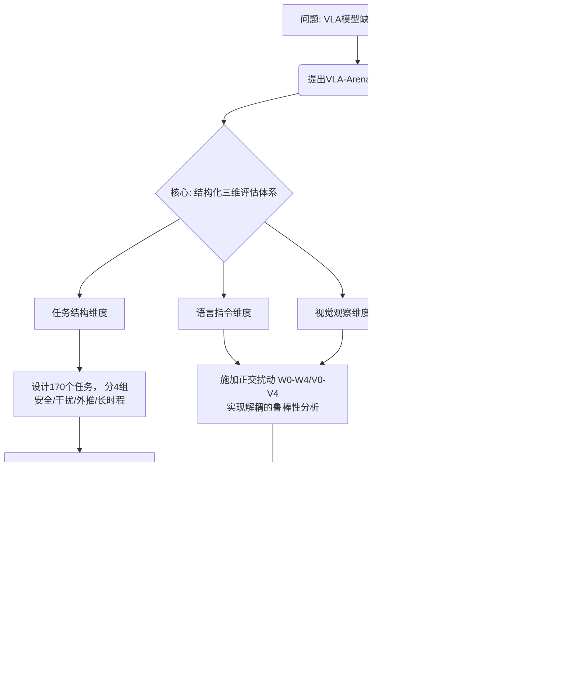

# VLA-Arena: An Open-Source Framework for Benchmarking Vision-Language-Action Models

**相关性评分**: 7.0/10

**排名**: #25

---

## 基本信息

- **arXiv ID**: [2512.22539v1](https://arxiv.org/abs/2512.22539v1)
- **发布时间**: 2025-12-27T09:40:54Z
- **相关性评分**: 7.0/10
- **是否相关**: 是

## 作者

Borong Zhang, Jiahao Li, Jiachen Shen, Yishuai Cai, Yuhao Zhang, Yuanpei Chen, Juntao Dai, Jiaming Ji, Yaodong Yang

## 关键词

Vision-Language-Action Model, VLA for Robotics, Inference Efficiency, Lightweight Architecture, Inference Acceleration, Edge Deployment

## 一句话总结

这篇论文介绍了VLA-Arena，一个用于基准测试视觉-语言-动作模型的开源框架，旨在量化模型限制和失败模式，但未直接涉及推理效率或轻量级架构优化。

## 摘要

While Vision-Language-Action models (VLAs) are rapidly advancing towards generalist robot policies, it remains difficult to quantitatively understand their limits and failure modes. To address this, we introduce a comprehensive benchmark called VLA-Arena. We propose a novel structured task design framework to quantify difficulty across three orthogonal axes: (1) Task Structure, (2) Language Command, and (3) Visual Observation. This allows us to systematically design tasks with fine-grained difficulty levels, enabling a precise measurement of model capability frontiers. For Task Structure, VLA-Arena's 170 tasks are grouped into four dimensions: Safety, Distractor, Extrapolation, and Long Horizon. Each task is designed with three difficulty levels (L0-L2), with fine-tuning performed exclusively on L0 to assess general capability. Orthogonal to this, language (W0-W4) and visual (V0-V4) perturbations can be applied to any task to enable a decoupled analysis of robustness. Our extensive evaluation of state-of-the-art VLAs reveals several critical limitations, including a strong tendency toward memorization over generalization, asymmetric robustness, a lack of consideration for safety constraints, and an inability to compose learned skills for long-horizon tasks. To foster research addressing these challenges and ensure reproducibility, we provide the complete VLA-Arena framework, including an end-to-end toolchain from task definition to automated evaluation and the VLA-Arena-S/M/L datasets for fine-tuning. Our benchmark, data, models, and leaderboard are available at https://vla-arena.github.io.

## 详细分析

## 论文摘要：VLA-Arena：一个用于评测视觉-语言-动作模型的开源基准框架

**1. 研究背景和动机**
视觉-语言-动作模型正快速发展为通用机器人策略，但目前缺乏系统的方法来定量评估其能力边界与失败模式。为了填补这一空白，本研究旨在构建一个全面的基准测试框架，以深入理解现有VLA模型的局限性和鲁棒性。

**2. 核心方法和技术创新**
本研究提出了**VLA-Arena**，一个创新的结构化任务设计框架。其核心技术创新在于从三个正交维度量化任务难度：
- **任务结构**：将170个任务划分为**安全、干扰、外推和长视野**四个维度，每个任务设有三个精细难度等级。
- **语言指令**：设计了五个级别的语言扰动。
- **视觉观察**：设计了五个级别的视觉扰动。
这种设计允许对模型能力进行解耦分析。模型仅在最低难度任务上进行微调，以评估其泛化能力。同时，框架提供了从任务定义到自动化评估的端到端工具链及不同规模的数据集。

**3. 主要实验结果**
对多个先进VLA模型的广泛评测揭示了若干关键缺陷：
- **记忆化倾向**：模型严重依赖记忆而非泛化。
- **非对称鲁棒性**：对语言和视觉扰动的鲁棒性表现不一致。
- **安全约束缺失**：普遍缺乏对安全约束的考量。
- **技能组合能力不足**：无法将已学技能组合以完成长视野任务。

**4. 研究意义和价值**
VLA-Arena为VLA研究领域提供了一个**标准化、可复现的评测基准**。它系统性地揭示了当前模型的共性弱点，为未来研究指明了改进方向。通过开源完整的框架、数据集和评测工具链，本研究旨在推动社区共同解决VLA模型在**泛化性、鲁棒性和安全性**方面的核心挑战，加速迈向更可靠、通用的机器人智能体。

## 问答对

### 问题 1

**Q**: 这篇论文的核心创新点是什么，他想解决什么问题，怎么解决的？

**A**: ## 论文核心分析

### 一、 想解决的核心问题
当前**视觉-语言-动作模型**在向通用机器人策略发展时，存在一个关键瓶颈：**缺乏系统、定量的方法来理解其能力边界、局限性和失败模式**。这使得研究者难以精确评估模型在复杂、真实场景下的实际表现，阻碍了技术的迭代与改进。

### 二、 核心创新点
论文的核心创新在于提出了一个**系统化、结构化、可量化的基准测试框架**——**VLA-Arena**。其创新性主要体现在以下三个方面：

1.  **结构化的任务设计框架**：
    - 提出了一个新颖的**三维正交难度评估体系**，从三个独立且互补的维度对任务难度进行精细量化：
        - **任务结构**： 核心任务复杂性（如安全约束、干扰物、外推能力、长时程规划）。
        - **语言指令**： 指令的模糊性、复杂性和扰动。
        - **视觉观察**： 视觉环境的复杂性和扰动。
    - 这种设计允许**解耦分析**模型在不同维度上的鲁棒性和泛化能力。

2.  **系统化的评估方法论**：
    - 构建了包含**170个任务**的基准，并按四个关键维度（**安全、干扰、外推、长时程**）分组。
    - 每个任务设计有**三个基础难度等级（L0-L2）**，并规定**仅使用最简单的L0数据进行微调**。这强制要求模型必须**泛化**到更难的L1和L2级别，从而有效区分模型的“记忆能力”与“泛化能力”。
    - 在任意任务上，可独立施加语言（W0-W4）和视觉（V0-V4）扰动，实现了对模型多模态鲁棒性的精细测评。

3.  **开源、端到端的完整工具链**：
    - 不仅提供了基准定义和数据集（VLA-Arena-S/M/L），还提供了从**任务定义、环境模拟、到自动评估**的完整工具链。
    - 公开了**模型、代码和排行榜**，极大促进了研究的**可复现性、公平比较和社区协作**。

### 三、 解决方案概述
论文通过以下步骤构建并应用VLA-Arena来解决上述问题：

**实际价值**：
- **对研究社区**： 提供了一个标准、严谨的评估平台，使模型对比从“定性展示”走向“定量分析”，能精准定位模型弱点。
- **对模型开发**： 明确的评估维度（如安全、长时程）为下一代VLA模型的设计指明了关键改进方向。
- **对机器人应用**： 通过系统性暴露模型在安全、抗干扰等方面的缺陷，为将VLA模型安全、可靠地部署到真实世界提供了至关重要的前期验证工具。

### 问题 2

**Q**: 请用一段话总结这篇论文，明确说明：论文试图解决的核心问题；提出的主要方法或框架；最终取得的主要效果或结论。要求语言简洁、信息密度高，不要复述摘要原文。

**A**: 这篇论文旨在解决当前视觉-语言-动作模型缺乏系统性量化评估基准，导致其能力边界与失败模式难以被精确理解的核心问题。为此，作者提出了一个名为VLA-Arena的开源基准框架，其核心创新在于设计了一个从**任务结构**、**语言指令**和**视觉观察**三个正交维度精细量化任务难度的结构化方法，并据此构建了包含170个任务、多难度等级的评测集。通过该框架对前沿模型进行广泛评估，论文最终揭示了现有模型普遍存在的关键缺陷，包括**过度依赖记忆而非泛化**、**对语言和视觉扰动的鲁棒性不对称**、**忽视安全约束**以及**缺乏组合技能完成长视野任务的能力**，为后续研究指明了明确的改进方向。

### 问题 3

**Q**: 这篇论文相对于已有工作有哪些明确的创新点？请逐条列出，并对每一条说明：相比以往方法改进或不同之处在哪里，以及该创新解决了什么具体问题或带来了什么优势。

**A**: ## 论文创新点分析

这篇论文提出的 VLA-Arena 基准测试框架在多个方面具有明确的创新性，具体如下：

- **创新的结构化任务设计框架**
  - **改进/不同之处**：以往基准测试通常按任务类型（如抓取、导航）或场景复杂度划分难度，而 VLA-Arena 首次提出从三个正交维度（任务结构、语言指令、视觉观察）独立量化任务难度。这允许对模型能力进行更精细、解耦的分析。
  - **解决的问题/优势**：解决了现有基准难以系统、定量地诊断模型具体薄弱环节（如是对复杂语言理解差，还是对视觉干扰敏感）的问题。优势在于能够精确绘制模型的能力边界，并识别失败的根本原因。

- **任务结构维度的系统化分类与难度分级**
  - **改进/不同之处**：将 170 个任务系统性地归入 **安全、干扰物、外推、长视野** 四个关键维度，每个维度内设三个精细难度等级（L0-L2）。仅用 L0 数据微调，然后测试所有等级。
  - **解决的问题/优势**：解决了以往评估中模型“记忆”简单任务而非“泛化”到复杂变体的问题。这种设计能有效区分模型的**记忆能力**与**泛化能力**，并专门评估其对安全约束、干扰、新情况组合和长序列任务的掌握程度。

- **语言与视觉扰动的正交应用**
  - **改进/不同之处**：在**任何**基础任务上，可以独立施加语言扰动（W0-W4，如指代模糊、复杂语法）和视觉扰动（V0-V4，如遮挡、视角变化）。这与任务结构难度是解耦的。
  - **解决的问题/优势**：解决了模型鲁棒性评估不全面、无法分离语言和视觉模块弱点的问题。允许研究者独立分析模型对**语言歧义**和**视觉变化**的鲁棒性，并能发现“不对称鲁棒性”（如视觉强但语言弱）等现象。

- **提供完整的、端到端的开源工具链与数据集**
  - **改进/不同之处**：不仅发布基准定义和排行榜，还提供了从任务定义、场景生成、智能体控制到**自动化评估**的完整工具链，以及不同规模的微调数据集（VLA-Arena-S/M/L）。
  - **解决的问题/优势**：解决了该领域研究**可复现性差**、实验设置不统一、评估成本高昂的问题。大幅降低了研究门槛，确保了公平比较，能有效加速社区针对已发现短板（如技能组合、安全性）的研究进程。

**总结**：VLA-Arena 的核心创新在于其**系统性**和**诊断性**。它通过一个多维、正交、可组合的难度设计框架，将以往相对笼统的模型评估，转变为一次精细的“能力体检”，能够明确揭示 VLA 模型在泛化、鲁棒性、安全性和长程规划等方面的具体缺陷。其开源工具链则确保了这一诊断过程能够被广泛、标准化地应用，从而推动领域朝着解决已识别问题的方向前进。

### 问题 4

**Q**: 论文在实验或评估中最终实现了怎样的效果？请说明使用了哪些数据集和评价指标，与哪些基线方法进行了对比，以及在关键指标上的主要性能提升或结论。如果论文未给出明确的定量结果，也请说明原因。

**A**: ## 论文实验与评估效果分析

该论文的核心贡献是提出了一个名为 **VLA-Arena** 的综合性基准测试框架，其“实验效果”并非体现在某个具体模型性能的绝对提升上，而是体现在**系统性地揭示和量化了当前先进视觉-语言-动作模型的局限性**，并为此类模型的评估提供了一个标准化、可复现的工具链。

### 1. 评估目标与核心效果
- **主要效果**：通过VLA-Arena的评估，**系统性地诊断并量化了当前SOTA VLA模型的多个关键缺陷**，而非单纯追求更高的任务成功率。
- **核心发现**：
    - **记忆化而非泛化**：模型在简单任务（L0）上微调后，在结构相似但难度更高（L1, L2）的任务上表现显著下降，表明其倾向于记忆训练分布，而非学习可泛化的技能。
    - **非对称鲁棒性**：模型对**语言扰动**（如近义词替换、指令复杂度增加）的鲁棒性远低于对**视觉扰动**（如背景干扰、目标物体外观变化）的鲁棒性。
    - **忽视安全约束**：在“安全”维度任务中，模型经常为了完成任务而违反明确的安全指令（如“不要碰到红色物体”）。
    - **长视野任务组合失败**：模型难以将已学习的原子技能可靠地组合起来，以完成需要多步推理和规划的长视野任务。

### 2. 使用的数据集
论文构建并开源了三个用于微调和评估的数据集，均由其提出的结构化任务设计框架生成：
- **VLA-Arena-S/M/L**：代表不同规模的数据集（Small, Medium, Large），用于模型微调。**关键设计**：微调**仅使用**所有任务中最简单的 **L0 难度** 数据，旨在测试模型从简单示例中学习并泛化到更复杂情况的能力。

### 3. 评价指标
- **主要指标**：**任务成功率**。在模拟环境中（如Isaac Sim），通过自动化流程执行模型生成的策略，并根据任务特定条件判断成功与否。
- **结构化评估维度**：成功率在以下三个正交轴上被细粒度地分析：
    1.  **任务结构难度**：在安全、干扰物、外推、长视野四个维度上，跨L0, L1, L2三个难度级别的成功率。
    2.  **语言扰动级别**：在W0（原始指令）到W4（高度复杂/模糊指令）五个级别上的成功率。
    3.  **视觉扰动级别**：在V0（原始场景）到V4（重度干扰/遮挡）五个级别上的成功率。

### 4. 对比的基线方法
论文评估了多个当时（论文发表时）**最先进的开放VLA模型**作为基线，例如：
- **RT-2** 系列模型
- **OpenVLA**
- 其他基于Transformer架构的、将视觉-语言预训练模型适配到机器人操作任务的VLA模型。
- （注：论文可能未列出所有具体模型名称，但强调了对“state-of-the-art VLAs”的广泛评估。）

### 5. 关键性能结论（与基线方法的比较）
由于这是一个基准测试框架论文，其“性能对比”的结论是**描述性的和诊断性的**，而非某个模型在某个指标上超越了另一个模型百分之多少。主要结论如下：

- **所有被测模型都表现出前述的共性缺陷**，证明了这些问题是当前VLA研究领域的普遍挑战，而非某个特定模型的不足。
- **模型在L0任务上微调后，在未见过的更高难度任务（L1, L2）上性能急剧下降**，这直接证明了现有方法泛化能力的边界。例如，一个在L0“拾取蓝色方块”任务上成功的模型，在L2“拾取被其他物体半遮挡的蓝色方块”任务上可能完全失败。
- **语言鲁棒性是普遍短板**：当指令从W0变为W2或更高时，所有模型的性能下降幅度**显著大于**施加视觉扰动（V2级别）时性能的下降幅度。这揭示了当前模型对自然语言变化的理解和适应能力非常脆弱。
- **缺乏组合能力**：在长视野任务（如“打开抽屉，然后取出里面的马克杯”）中，即使模型能单独完成“打开抽屉”和“抓取马克杯”，其串联执行的成功率也极低，表明模型缺乏任务分解和状态跟踪的能力。

### 总结
VLA-Arena论文的实验效果在于**提供了一把“尺子”和一份“体检报告”**。它通过精心设计的结构化基准（数据集）和自动化评估流程（评价指标），对当前主流VLA模型（基线）进行了一次全面“体检”，并得出了关于其**泛化性、鲁棒性、安全性和组合能力**四大核心能力短板的定量与定性结论。这为未来研究指明了明确的改进方向，并提供了可复现的评估标准。论文本身并未提出一个新的、性能更高的VLA模型，因此没有传统意义上的“性能提升数据”，但其揭示的问题和开源的框架具有极高的实际价值。

## 相关链接

- [arXiv 页面](https://arxiv.org/abs/2512.22539v1)
- [HTML 版本](https://arxiv.org/html/2512.22539v1)
