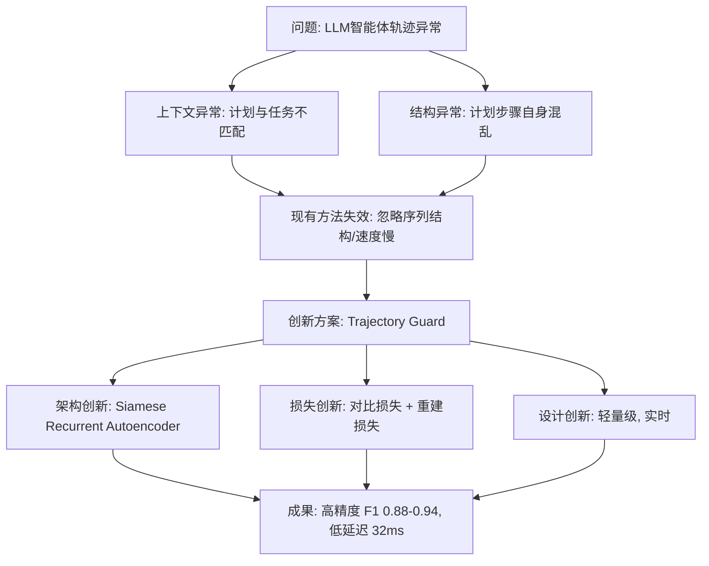

# Trajectory Guard -- A Lightweight, Sequence-Aware Model for Real-Time Anomaly Detection in Agentic AI

**相关性评分**: 6.0/10

**排名**: #18

---

## 基本信息

- **arXiv ID**: [2601.00516v1](https://arxiv.org/abs/2601.00516v1)
- **发布时间**: 2026-01-02T00:27:11Z
- **相关性评分**: 6.0/10
- **是否相关**: 是

## 作者

Laksh Advani

## 关键词

Lightweight Architecture, Inference Efficiency, Inference Acceleration, Edge Deployment

## 一句话总结

该论文提出了一种轻量级、序列感知的实时异常检测模型，专注于提高推理效率，适用于边缘部署，但与视觉-语言-动作模型或机器人应用无直接关联。

## 摘要

Autonomous LLM agents generate multi-step action plans that can fail due to contextual misalignment or structural incoherence. Existing anomaly detection methods are ill-suited for this challenge: mean-pooling embeddings dilutes anomalous steps, while contrastive-only approaches ignore sequential structure. Standard unsupervised methods on pre-trained embeddings achieve F1-scores no higher than 0.69. We introduce Trajectory Guard, a Siamese Recurrent Autoencoder with a hybrid loss function that jointly learns task-trajectory alignment via contrastive learning and sequential validity via reconstruction. This dual objective enables unified detection of both "wrong plan for this task" and "malformed plan structure." On benchmarks spanning synthetic perturbations and real-world failures from security audits (RAS-Eval) and multi-agent systems (Who\&When), we achieve F1-scores of 0.88-0.94 on balanced sets and recall of 0.86-0.92 on imbalanced external benchmarks. At 32 ms inference latency, our approach runs 17-27$\times$ faster than LLM Judge baselines, enabling real-time safety verification in production deployments.

## 详细分析

## 论文摘要：《Trajectory Guard —— 一种用于智能体AI实时异常检测的轻量级、序列感知模型》

**研究背景和动机：**
随着基于大语言模型（LLM）的自主智能体日益普及，其生成的多步骤“轨迹”（即行动计划）在执行复杂任务时，可能因上下文错位或结构不连贯而失败，带来显著的安全风险。现有异常检测方法（如基于平均池化嵌入或纯对比学习的方法）无法有效捕捉智能体计划特有的上下文和序列结构特性，导致检测性能不佳（F1分数≤0.69），而高精度的LLM法官方法则因延迟过高（>550毫秒）无法满足实时部署需求。因此，亟需一种轻量级、序列感知的实时检测模型。

**核心方法和技术创新：**
本文提出了 **Trajectory Guard**，一种新颖的**孪生循环自编码器**模型，其核心创新在于一个**混合损失函数**，该函数联合优化两个目标：
- **对比学习损失**：学习任务描述与轨迹之间的上下文对齐（判断“计划是否适合该任务”）。
- **重构损失**：通过GRU编码器-解码器学习轨迹序列的结构有效性（判断“计划结构是否合理”）。
这种双目标设计使模型能够统一检测“任务-计划不匹配”的**上下文异常**和“计划结构畸形”的**结构异常**，同时保持了模型的轻量级特性。

**主要实验结果：**
1.  **检测性能**：在合成的基准测试集（Galileo, AgentAlign）上，模型取得了**0.88–0.94的F1分数**（加权平均0.92）。在包含真实世界故障的外部基准（RAS-Eval, Who&When）上，取得了**0.86–0.92的高召回率**，证明了其强大的泛化能力。
2.  **效率优势**：模型单次推理延迟仅为**32毫秒**，比最快的LLM法官基线（Deepseek）快**17倍**，比Phi-3-mini快**27倍**，完全满足实时部署要求。
3.  **消融实验**：验证了混合损失的必要性，仅使用对比损失或重构损失的模型F1分数分别降至0.82和0.75，显著低于完整模型的0.92。

**研究意义和价值：**
本研究为智能体AI的安全部署提供了一个高效、实用的解决方案。Trajectory Guard 填补了现有方法在**轻量级、实时、序列感知的智能体轨迹验证**方面的空白。它不仅在检测精度上接近或超越了重型LLM基线，更在延迟上实现了数量级的优化，使得在生产系统中进行实时的安全护栏（Safety Guardrail）部署成为可能，对推动可信、可靠的自主智能体应用具有重要的实际价值。

## 问答对

### 问题 1

**Q**: 这篇论文的核心创新点是什么，他想解决什么问题，怎么解决的？

**A**: ## 论文核心分析

### **核心问题**
论文旨在解决**自主LLM智能体（Agentic AI）在生成多步骤行动计划（轨迹）时可能出现的异常问题**。这些异常主要分为两类：
1.  **上下文异常**：计划步骤本身合理，但与当前任务目标不匹配（“错误的计划”）。
2.  **结构异常**：计划步骤本身存在逻辑混乱、顺序错误或格式问题（“畸形的计划结构”）。

现有方法（如基于预训练嵌入的均值池化、对比学习或传统无监督检测）无法有效捕捉智能体轨迹特有的**上下文相关性和序列结构**，导致检测效果不佳（F1分数≤0.69）且无法满足实时部署的低延迟要求。

### **核心创新点**
论文提出了 **“Trajectory Guard”** 模型，其创新性体现在以下三个紧密关联的方面：

- **新颖的模型架构：Siamese Recurrent Autoencoder**
    - **双塔设计**：一个塔（Task Tower）处理任务描述，另一个塔（Trajectory Tower）处理行动步骤序列。
    - **序列感知**：轨迹塔使用**GRU编码器-解码器**来建模步骤的顺序和依赖关系，克服了将轨迹视为“无序步骤包”的局限性。

- **创新的混合损失函数**
    - **对比损失**：学习任务与轨迹之间的**上下文对齐**。确保生成的计划与用户意图匹配（解决“上下文异常”）。
    - **重建损失**：学习轨迹的**结构有效性**。确保步骤序列本身在逻辑和语法上是连贯的（解决“结构异常”）。
    - **联合优化**：通过公式 `ℒ = ℒ_contrastive + α · ℒ_reconstruction` 将两个目标统一，使模型能同时检测两种异常。

- **轻量级与实时性设计**
    - 整个模型基于轻量级句子嵌入模型（all-MiniLM-L6-v2）和紧凑的GRU网络构建。
    - 实现了**32毫秒**的单样本推理延迟，比基于LLM的评判基准快**17-27倍**，满足了生产环境实时安全验证的需求。

### **解决方案路径**
论文通过一个清晰的“假设-验证-最终方案”路径来构建并论证其解决方案：

1.  **假设1（失败）**：将异常轨迹视为预训练嵌入空间中的**点异常**。使用均值池化+传统无监督检测器（VAE、孤立森林）。结果：F1 < 0.70，因池化操作稀释了异常步骤的信号。
2.  **假设2（部分成功）**：将异常视为任务与轨迹间的**上下文失配**。使用对比学习微调嵌入模型。结果：F1 ≈ 0.82，虽有提升但忽略了序列结构，且泛化性差。
3.  **最终方案（成功）**：**Trajectory Guard**。将轨迹视为**结构化序列**，并设计**双目标模型**来共同捕捉**上下文匹配度**和**结构连贯性**。

### **实际价值与意义**
- **技术价值**：为LLM智能体安全领域提供了一个**专门化、高效**的异常检测模型，填补了现有方法在**序列感知**和**实时性**方面的空白。
- **应用价值**：模型**轻量、快速**的特性使其能够无缝集成到智能体工作流中，进行**在线、实时的轨迹验证**，防止错误或有害计划被执行，提升了智能体系统的可靠性和安全性。
- **方法论价值**：提出的**混合损失函数**和**序列感知的孪生网络架构**，为其他需要同时考虑语义对齐和结构合规性的序列数据异常检测任务提供了新思路。

### 问题 2

**Q**: 请用一段话总结这篇论文，明确说明：论文试图解决的核心问题；提出的主要方法或框架；最终取得的主要效果或结论。要求语言简洁、信息密度高，不要复述摘要原文。

**A**: 这篇论文旨在解决自主LLM智能体生成的多步行动轨迹（计划）中存在的**上下文错位**和**结构不连贯**这两类异常问题，以提升智能体部署的安全性。针对现有异常检测方法（如均值池化嵌入或纯对比学习）无法有效捕捉轨迹序列语义和结构的缺陷，论文提出了 **Trajectory Guard**——一个**轻量级的孪生循环自编码器模型**。该模型通过一个**混合损失函数**，将用于学习任务-轨迹对齐的对比学习与用于学习序列有效性的重构学习相结合，从而统一检测“错误计划”和“畸形计划结构”。实验表明，该方法在合成与真实世界异常基准测试中取得了**0.88-0.94的F1分数**和**0.86-0.92的召回率**，同时推理延迟低至**32毫秒**，比基于LLM的评判基线快**17-27倍**，实现了高效、实时的轨迹安全验证。

### 问题 3

**Q**: 这篇论文相对于已有工作有哪些明确的创新点？请逐条列出，并对每一条说明：相比以往方法改进或不同之处在哪里，以及该创新解决了什么具体问题或带来了什么优势。

**A**: ## 论文创新点分析

这篇论文《Trajectory Guard》针对自主LLM智能体轨迹的实时异常检测问题，提出了一个轻量级、序列感知的模型。其核心创新点在于**模型架构**、**训练目标**和**实际部署性能**三个方面，具体如下：

### 1. **创新的序列感知架构：Siamese Recurrent Autoencoder**
   - **相比以往方法的改进/不同之处**：
     - **传统方法**：将轨迹视为无序的“步骤包”（bag of steps），通过平均池化预训练嵌入后，使用标准无监督方法（如VAE、孤立森林）进行检测。这**忽略了步骤的顺序和结构**。
     - **对比学习方法**：仅关注任务与轨迹之间的上下文匹配，**忽略了轨迹内部的结构连贯性**。
     - **Trajectory Guard**：提出一个**孪生循环自编码器**，包含两个并行的“塔”：
       1.  **任务塔**：一个MLP，将任务描述编码为潜在向量 `v_t`。
       2.  **轨迹塔**：一个GRU编码器-解码器，将轨迹步骤序列编码为“思想向量” `v_s`，并尝试重建原序列。
   - **解决的具体问题/带来的优势**：
     - **统一检测两类异常**：该架构能够同时建模**上下文匹配**（任务与计划是否一致）和**结构有效性**（计划内部步骤顺序是否连贯）。这解决了以往方法只能处理单一类型异常的局限。
     - **保留序列信息**：GRU编码器显式地处理步骤的顺序，避免了平均池化对异常步骤信息的稀释，从而能更敏感地检测出序列中的结构性问题。

### 2. **混合损失函数：结合对比学习与重建损失**
   - **相比以往方法的改进/不同之处**：
     - **单一损失方法**：要么只使用对比损失来学习任务-轨迹对齐（如Hypothesis 2），要么只使用重建损失来学习序列模式（如标准自编码器）。
     - **Trajectory Guard**：引入一个**混合损失函数**：`ℒ = ℒ_contrastive + α · ℒ_reconstruction`。
       - `ℒ_contrastive`（三元组边际损失）：确保任务向量 `v_t` 与对应正确轨迹向量 `v_s` 接近，而与批次内其他轨迹向量远离。负责学习**“这是否是正确的计划？”**。
       - `ℒ_reconstruction`（均方误差损失）：确保轨迹塔的GRU解码器能够从 `v_s` 有效重建原始步骤序列。负责学习**“这个计划是否连贯？”**。
   - **解决的具体问题/带来的优势**：
     - **协同学习，性能提升**：如消融实验所示（表5），混合损失（F1=0.92）显著优于仅使用对比损失（F1=0.82）或仅使用重建损失（F1=0.75）。这证明了联合学习上下文和结构对于检测智能体轨迹异常至关重要。
     - **解决负迁移问题**：论文指出，仅使用对比学习的方法在不同轨迹格式（如自然语言命令 vs. JSON工具调用）间会出现**负迁移**，性能下降。混合损失通过重建目标增强了模型对轨迹本身“语法”的鲁棒性，减轻了此问题。

### 3. **面向生产部署的轻量级与实时性设计**
   - **相比以往方法的改进/不同之处**：
     - **LLM Judge基线**：使用大型语言模型（如GPT-4o、Gemini）作为评判员，虽然准确率高（F1可达0.95），但**推理延迟极高**（556-734毫秒），无法满足实时交互需求。
     - **其他专业模型**：针对多智能体或机器人领域的异常检测模型（如基于时空图自编码器）不适用于单智能体的语言计划，且通常**未报告或优化延迟**。
     - **Trajectory Guard**：模型基于小型编码器（all-MiniLM-L6-v2）和轻量级GRU，**专为低延迟设计**。
   - **解决的具体问题/带来的优势**：
     - **实现实时安全验证**：在T4 GPU上达到**32毫秒/样本**的推理速度，比最快的LLM Judge（Deepseek，557毫秒）快**17倍**，比Phi-3-mini（892毫秒）快**27倍**（表4）。这使得它能够集成到生产环境的智能体循环中，进行**实时**的轨迹安全校验，而不会引入显著的系统延迟。
     - **效率与效果的平衡**：在实现接近LLM Judge的检测性能（合成基准F1 0.88-0.94，真实基准召回率0.86-0.92）的同时，获得了数量级的**速度优势**和**极低的计算成本**。

### 总结
Trajectory Guard的核心创新在于**将序列建模能力（通过GRU自编码器）与上下文感知能力（通过对比学习）在一个统一的轻量级框架中结合**，并**通过混合损失进行协同优化**。这直接解决了现有方法在检测LLM智能体轨迹异常时面临的三大痛点：1) 忽略步骤顺序；2) 无法统一检测上下文和结构异常；3) 计算开销大，无法实时运行。其成果是一个**高效、专用于智能体、且可投入实际应用的**安全护栏（Guard）。

### 问题 4

**Q**: 论文在实验或评估中最终实现了怎样的效果？请说明使用了哪些数据集和评价指标，与哪些基线方法进行了对比，以及在关键指标上的主要性能提升或结论。如果论文未给出明确的定量结果，也请说明原因。

**A**: ## 论文实验与评估效果分析

### 一、 核心评估效果
论文提出的 **Trajectory Guard** 模型在**实时异常检测**任务上取得了显著效果，主要体现在**高精度、高召回和极低延迟**三个方面。

1.  **检测性能优异**：
    *   在**平衡的合成基准测试集**上，加权平均 **F1 分数达到 0.92**（Galileo: 0.88, AgentAlign: 0.94）。
    *   在**高度不平衡的真实世界外部测试集**上，以**召回率**作为关键安全指标，表现强劲：
        *   **RAS-Eval**（安全漏洞）：召回率 **0.86**
        *   **Who&When**（多智能体故障）：召回率 **0.92**

2.  **推理速度极快**：
    *   单样本推理延迟仅为 **32 毫秒**（在 NVIDIA T4 GPU 上）。
    *   相比基线方法，实现了 **17 至 27 倍的加速**，证明了其**实时部署**的可行性。

### 二、 使用的数据集
论文构建了一个综合性的基准测试集，用于训练、验证和评估。

| 数据集类型 | 名称 | 用途与描述 |
| :--- | :--- | :--- |
| **训练与合成数据集** | **Galileo** (`galileo-ai/agent-leaderboard-v2`) | 核心训练数据。包含企业领域（银行、电信等）的自然语言命令序列轨迹。 |
| | **AgentAlign** | 核心训练数据。包含结构化 JSON 工具调用序列的轨迹。从“良性”类别中提取。 |
| **外部评估数据集** | **RAS-Eval** | **真实世界测试集**。包含 3,802 个**异常轨迹**，用于评估模型在安全漏洞场景下的泛化能力。 |
| | **Who&When** | **真实世界测试集**。包含 127 个多智能体系统的 184 个**故障日志**，用于评估模型对复杂多智能体失败原因的检测能力。 |

**数据合成方法**：使用 **GPT-5** 对 Galileo 和 AgentAlign 中的部分“良性”轨迹进行受控扰动，注入 **1-3 个异常步骤**，生成包含**上下文异常**（步骤与任务不匹配）和**结构异常**（步骤本身畸形或顺序不合理）的合成测试数据。

### 三、 使用的评价指标
论文根据数据集特性采用了不同的核心指标：

1.  **对于平衡的合成数据集**：报告**异常类**的 **精确率、召回率和 F1 分数**，以全面衡量模型性能。
2.  **对于高度不平衡的真实世界数据集**：主要报告**召回率**。原因是**漏报**（将异常误判为正常）在实际安全部署中带来的操作风险远高于误报。

### 四、 对比的基线方法
论文与两大类基线方法进行了全面对比：

| 基线类别 | 具体方法 | 特点与定位 |
| :--- | :--- | :--- |
| **轻量级基线** | **变分自编码器**、**孤立森林**、**单类SVM** | 代表传统的无监督异常检测方法，应用于预训练嵌入（如 `bge-large`）。它们**效率高但性能差**，证明了通用方法在此任务上的不足。 |
| **重量级基线** | **LLM Judge**：包括 Gemini Flash 1.5, GPT-4o Mini, Deepseek v3.2-exp, Phi-3-mini | 代表使用大语言模型作为评判员的方法。它们**准确率高但延迟极高**，不适合实时场景。 |

### 五、 关键性能提升与结论

1.  **性能远超传统轻量方法**：
    *   Trajectory Guard 在合成数据集上的 **F1 分数（0.92）** 远高于最好的传统方法 VAE（F1 0.69），证明了其**专门化架构的有效性**。

2.  **性能媲美重量级 LLM，但速度极快**：
    *   在合成数据集上，Trajectory Guard 的 F1 分数（0.92）与顶级 LLM Judge（如 Gemini Flash 1.5， F1 0.95）**处于同一水平**，部分指标甚至更优。
    *   **关键优势在于速度**：Trajectory Guard 的推理延迟（**32 ms**）比最快的 LLM Judge（Deepseek, 557 ms）**快 17 倍**，比 Phi-3-mini（892 ms）**快 27 倍**。这实现了从“不可实时”到“可实时”的跨越。

3.  **在真实世界异常上泛化能力强**：
    *   在从未见过的 RAS-Eval 和 Who&When 数据集上，Trajectory Guard 保持了**高召回率**（0.86, 0.92），显著优于轻量基线，并与部分 LLM Judge 表现相当或接近（如优于 Phi-3-mini）。这验证了模型对**真实安全风险和复杂故障**的检测能力。

4.  **混合损失函数的关键作用**：
    *   **消融实验**证明，同时使用对比损失和重构损失的**混合损失函数**是性能提升的关键。单独使用任一损失，F1 分数分别降至 0.82 和 0.75，而混合损失达到 0.92。这证实了**同时建模任务-轨迹上下文对齐和轨迹内部结构有效性**的必要性。

**总结**：Trajectory Guard 在**不显著牺牲检测精度**的前提下，通过创新的**孪生循环自编码器架构**和**混合损失函数**，实现了相比 LLM Judge **数量级级别的速度提升**，成功解决了智能体轨迹**实时安全验证**的难题，在关键指标（F1, 召回率，延迟）上均取得了优越的综合表现。

## 相关链接

- [arXiv 页面](https://arxiv.org/abs/2601.00516v1)
- [HTML 版本](https://arxiv.org/html/2601.00516v1)
