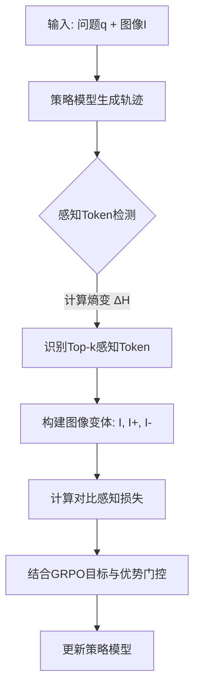

# CPPO: Contrastive Perception for Vision Language Policy Optimization

**相关性评分**: 6.0/10

**排名**: #10

---

## 基本信息

- **arXiv ID**: [2601.00501v1](https://arxiv.org/abs/2601.00501v1)
- **发布时间**: 2026-01-01T22:48:26Z
- **相关性评分**: 6.0/10
- **是否相关**: 是

## 作者

Ahmad Rezaei, Mohsen Gholami, Saeed Ranjbar Alvar, Kevin Cannons, Mohammad Asiful Hossain, Zhou Weimin, Shunbo Zhou, Yong Zhang, Mohammad Akbari

## 关键词

Vision-Language-Action Model, VLA for Robotics, Inference Efficiency, Lightweight Architecture, Inference Acceleration, Edge Deployment

## 一句话总结

CPPO是一种用于微调视觉语言模型的对比感知策略优化方法，通过检测扰动输入下的熵移来改进感知和推理，提高训练效率，但与机器人应用和边缘部署的直接关联有限。

## 摘要

We introduce CPPO, a Contrastive Perception Policy Optimization method for finetuning vision-language models (VLMs). While reinforcement learning (RL) has advanced reasoning in language models, extending it to multimodal reasoning requires improving both the perception and reasoning aspects. Prior works tackle this challenge mainly with explicit perception rewards, but disentangling perception tokens from reasoning tokens is difficult, requiring extra LLMs, ground-truth data, forced separation of perception from reasoning by policy model, or applying rewards indiscriminately to all output tokens. CPPO addresses this problem by detecting perception tokens via entropy shifts in the model outputs under perturbed input images. CPPO then extends the RL objective function with a Contrastive Perception Loss (CPL) that enforces consistency under information-preserving perturbations and sensitivity under information-removing ones. Experiments show that CPPO surpasses previous perception-rewarding methods, while avoiding extra models, making training more efficient and scalable.

## 详细分析

## CPPO论文详细摘要

### 1. 研究背景和动机
强化学习（RL）在提升语言模型推理能力方面取得了显著成功，但将其扩展到视觉语言模型（VLM）的多模态推理任务中仍面临挑战。核心难点在于，VLM的输出同时包含依赖于图像的**感知令牌**和基于内部知识的**推理令牌**。传统的基于最终答案正确性的RL奖励无法区分这两种错误：错误的感知令牌即使后续推理正确也会导致最终答案错误。先前的工作试图通过引入显式的感知奖励来解决此问题，但存在诸多局限，例如需要强制分离感知与推理、依赖额外的LLM或真实数据、或对所有输出令牌无差别地施加奖励，导致训练效率低下、易受奖励攻击或过正则化。

### 2. 核心方法和技术创新
本文提出了**对比感知策略优化（CPPO）**方法，其核心创新在于：
- **基于熵的感知令牌检测**：通过计算模型在原始图像和信息移除扰动图像下输出概率分布的**熵变**，自动识别出对视觉信息最敏感的令牌（即感知令牌），无需人工标注或强制分离。
- **对比感知损失（CPL）**：一种无监督的、令牌级别的对比损失。对于每个输入图像，构建**信息保留**和**信息移除**两种扰动版本。CPL以原始图像输出为锚点，鼓励其与信息保留扰动下的输出分布相似，而与信息移除扰动下的输出分布相异。该损失**仅应用于检测到的感知令牌**，且通过优势门控机制仅作用于优势为正的轨迹，实现了精准的感知能力优化。
- CPPO将CPL集成到GRPO等RL目标函数中，在保持模型自然推理流程的同时，有针对性地提升其视觉感知的鲁棒性和准确性。

### 3. 主要实验结果
在多个数学和视觉推理基准（如MathVista、LogicVista等）上的实验表明：
- **性能领先**：在Qwen2.5-VL-3B和7B模型上，CPPO均超越了包括GRPO、PAPO、Visionary-R1在内的所有基线方法，取得了最优的平均性能。
- **高效性**：CPPO避免了使用额外的LLM作为评判器或依赖真实链式思考数据，训练更高效、可扩展。尽管每个训练步增加了两次前向传播（用于计算扰动图像下的输出），但其在2个epoch内达到的性能，即使GRPO训练4个epoch（耗时翻倍）也无法超越。
- **泛化能力强**：CPPO在训练早期即展现出比GRPO更快的学习速度和更强的域外泛化能力。
- **消融实验验证**：感知令牌检测、CPL损失以及优势门控机制均为CPPO性能提升的关键组成部分。

### 4. 研究意义和价值
CPPO为VLM的RL微调提供了一种新颖且有效的范式。其核心价值在于：
- **方法学创新**：首次提出利用模型自身的输出不确定性（熵）来无监督地解耦感知与推理，并设计了针对性的对比损失进行优化，思路巧妙。
- **实用性强**：方法完全无监督、无需额外模型或标注，显著提升了训练效率和可扩展性，为大规模VLM的RL微调提供了实用方案。
- **性能提升显著**：通过精准提升模型的视觉感知能力，从根本上改善了多模态推理的性能，在多个具有挑战性的基准上达到了新的先进水平。这项工作推动了感知与推理协同优化的研究，对开发更可靠、更强大的多模态AI系统具有重要意义。

## 问答对

### 问题 1

**Q**: 这篇论文的核心创新点是什么，他想解决什么问题，怎么解决的？

**A**: ## CPPO论文核心分析

### **一、 论文拟解决的核心问题**

论文旨在解决**视觉语言模型在强化学习微调中，感知与推理错误难以分离**的问题。具体而言：

- **问题根源**：在仅使用最终答案正确性作为奖励信号的RL微调中，模型无法区分错误是源于**视觉感知错误**（从图像中提取了错误事实）还是**逻辑推理错误**。惩罚所有输出token会阻碍策略优化。
- **现有方法的局限**：
    1.  **强制分离法**：要求模型用特定标签（如 `<perception>`）分隔感知与推理内容，破坏了自然生成流程，易导致奖励黑客行为。
    2.  **外部模型评估法**：依赖额外的LLM或真实标注的思维链来评估感知部分，计算开销大、可扩展性差。
    3.  **无差别惩罚法**：对**所有**输出token施加感知损失（如KL散度），导致对推理token的过度正则化，甚至可能强化错误的感知输出。

### **二、 核心创新点**

CPPO的核心创新在于提出了一套**无监督、自识别、对比式**的感知优化框架，包含两个关键组件：

1.  **基于熵变的感知Token自识别机制**
    - **方法**：通过比较模型在**原始图像**和**信息移除扰动图像**下生成每个token时的**熵值变化**，来识别哪些token最依赖视觉信息。熵增加越大的token，被视为“感知token”。
    - **创新性**：无需人工标注或强制格式，模型**利用自身输出分布动态识别**感知部分，保持了自然推理流程。

2.  **面向感知Token的对比感知损失**
    - **方法**：为每个输入图像创建三个变体：**原始图像**、**信息保留扰动图像**、**信息移除扰动图像**。以原始图像下的token概率分布为锚点，信息保留下的分布为正样本，信息移除下的分布为负样本，构建**InfoNCE对比损失**。
    - **创新性**：
        - **针对性**：损失**仅应用于识别出的感知token**，避免干扰推理过程。
        - **对比性**：通过拉近锚点与正样本、推远锚点与负样本，使模型学会对**无关扰动保持鲁棒**，对**关键信息移除保持敏感**。
        - **优势门控**：仅对优势值为正的成功轨迹应用CPL，确保感知优化与正确的推理行为对齐。

### **三、 解决方案概述**

CPPO将上述两个创新点集成到GRPO强化学习框架中，形成端到端的解决方案：

**关键流程**：
1.  **采样**：策略模型根据原始图像生成多条推理轨迹。
2.  **检测**：对每条轨迹，计算每个token在信息移除扰动下的熵变 `ΔH`，选取`ΔH`最大的前`k%`作为感知token。
3.  **对比学习**：对每个感知token，计算其在原始图像、信息保留图像、信息移除图像下的概率分布，应用InfoNCE损失。
4.  **优化**：将CPL作为额外项加入GRPO目标函数，并通过优势门控（仅对优势为正的轨迹）进行加权，共同更新模型参数。

### **四、 实际价值与优势**

- **性能提升**：在多个数学与视觉推理基准上，CPPO显著超越了GRPO及所有之前的感知奖励方法，在3B和7B模型上均实现了SOTA性能。
- **效率与可扩展性**：**无需额外标注数据、外部模型或强制输出格式**，降低了训练复杂度和成本，更具可扩展性。
- **泛化能力**：训练动态显示，CPPO能实现更快的收敛和更强的**域外泛化能力**。
- **原理优势**：通过**对比学习**和**针对性惩罚**，更精准地提升了模型的视觉感知能力，避免了过度正则化。

**总结**：CPPO的核心贡献是提出了一种**让VLM在RL微调中“自我诊断”感知依赖，并通过对比学习“自我提升”视觉感知能力**的优雅方法，有效解决了感知与推理错误混杂的难题，推动了多模态推理模型的高效优化。

### 问题 2

**Q**: 请用一段话总结这篇论文，明确说明：论文试图解决的核心问题；提出的主要方法或框架；最终取得的主要效果或结论。要求语言简洁、信息密度高，不要复述摘要原文。

**A**: ## 论文总结

本文旨在解决**视觉语言模型（VLM）在强化学习微调中，感知错误与推理错误难以区分**的核心问题。现有方法通常依赖额外模型、真实数据或对全部输出施加惩罚，导致训练效率低、易过正则化或奖励崩溃。

为此，论文提出了 **CPPO（对比感知策略优化）框架**。其核心创新在于：1）提出一种**基于熵的无监督感知令牌检测方法**，通过比较模型在原始图像与信息移除扰动图像下输出分布的熵增，自动识别出最依赖视觉信息的“感知令牌”；2）设计了一种**令牌级别的对比感知损失（CPL）**，该损失仅作用于检测到的感知令牌，鼓励模型对信息保留扰动保持输出一致性，而对信息移除扰动保持敏感性，从而针对性提升视觉感知能力。

实验表明，CPPO在多项数学与视觉推理基准测试中**超越了所有先前的感知奖励方法**，且无需额外模型或真实链式思维数据，实现了更高效、可扩展的训练。即使与训练时间翻倍的基线方法相比，CPPO仍能取得更优性能，证明了其方法在提升VLM感知-推理解耦能力上的有效性。

### 问题 3

**Q**: 这篇论文相对于已有工作有哪些明确的创新点？请逐条列出，并对每一条说明：相比以往方法改进或不同之处在哪里，以及该创新解决了什么具体问题或带来了什么优势。

**A**: ## CPPO论文创新点分析

这篇论文提出的CPPO方法在视觉语言模型（VLM）的强化学习微调领域引入了多项关键创新，旨在解决现有方法在分离感知与推理、提供有效感知监督方面的核心挑战。

### 主要创新点

1.  **基于熵的感知令牌自动检测机制**
    *   **改进/不同之处**： 以往方法（如Visionary-R1, Vision-SR1）**强制**模型在输出中使用特殊标签（如 `<perception>` 和 `<think>`）来分离感知与推理内容。Perception-R1则依赖**人工标注的真实思维链（CoT）**来识别感知部分。CPPO摒弃了这些需要外部干预或强制结构的方法，提出了一种**无监督、自识别**的机制。它通过计算模型在原始图像和信息移除扰动图像下输出概率分布的**熵变（ΔH）**，自动识别出对视觉信息依赖度最高的令牌（即感知令牌）。
    *   **解决的问题/优势**：
        *   **保持自然推理流程**： 无需破坏模型原有的、交织的推理生成模式，使其更适用于复杂图像和多样化任务。
        *   **避免奖励黑客**： 消除了模型通过将答案放入“感知”部分来骗取奖励的风险。
        *   **无需额外标注或模型**： 降低了数据依赖和计算开销，方法更高效、可扩展。

2.  **面向感知的对比损失（CPL）**
    *   **改进/不同之处**： 先前感知奖励方法主要依赖**另一个LLM作为评判员**来评估感知输出的质量，或像PAPO那样，在所有输出令牌上**无差别地**应用基于KL散度的感知损失。CPL则是一种**令牌级、对比式**的损失函数。它以原始图像输出为锚点，以信息保留扰动图像输出为正样本，以信息移除扰动图像输出为负样本，构建InfoNCE损失。
    *   **解决的问题/优势**：
        *   **针对性监督**： 通过对比学习，明确鼓励模型对**信息保留**扰动保持输出一致性，对**信息移除**扰动表现出敏感性，从而直接优化视觉 grounding 能力。
        *   **有界且稳定**： 相比PAPO使用的无界KL散度，InfoNCE损失更稳定，缓解了奖励崩溃和超参数敏感问题。
        *   **无额外模型依赖**： 无需调用外部LLM进行评判，训练更高效。

3.  **“感知令牌检测 + 对比损失”的协同框架**
    *   **改进/不同之处**： CPPO不是孤立地应用上述两个创新，而是将它们**紧密结合**成一个完整框架。首先通过熵变检测出感知令牌，然后**仅对这些令牌**施加CPL。此外，还引入了**优势门控**机制，只对优势值为正（即优于平均）的轨迹应用CPL。
    *   **解决的问题/优势**：
        *   **避免过度正则化**： 防止将感知损失错误地应用于推理令牌（如数学公式、常识），从而保护模型的推理能力。
        *   **避免强化错误**： 防止在错误的感知令牌上最大化差异（这会巩固错误）。通过只对正确轨迹中的感知令牌应用CPL，确保了监督信号的质量。
        *   **对齐奖励与感知**： 优势门控确保感知优化与整体推理成功的行为保持一致，使训练更稳定、目标更明确。

4.  **完全无监督的感知优化范式**
    *   **改进/不同之处**： 综合来看，CPPO整个感知优化流程（检测+损失）**完全不需要**人工标注的CoT数据、额外的评判模型，或强制的输出格式。它仅利用模型自身的输出分布和经过精心设计的图像扰动。
    *   **解决的问题/优势**：
        *   **可扩展性**： 摆脱了对稀缺、昂贵标注数据的依赖，使得方法能够轻松应用于大规模数据集。
        *   **效率与通用性**： 简化了训练流程，降低了计算成本，并使其成为一个更通用的VLM微调解决方案。

### 总结
CPPO的核心创新在于，它**巧妙地利用模型自身对输入扰动的敏感性变化（熵）来定位需要优化的视觉依赖部分（感知令牌），并采用对比学习提供精准、稳定的监督信号**。这一套组合拳有效解决了以往方法在分离感知与推理时面临的**不自然、易被攻击、依赖外部资源、信号粗糙或不稳定**等问题，最终在多个数学和视觉推理基准上取得了更优的性能，且训练更高效、可扩展性更强。

### 问题 4

**Q**: 论文在实验或评估中最终实现了怎样的效果？请说明使用了哪些数据集和评价指标，与哪些基线方法进行了对比，以及在关键指标上的主要性能提升或结论。如果论文未给出明确的定量结果，也请说明原因。

**A**: ## 论文实验与评估效果分析

### 一、 实验设置概述

#### 1. **训练数据集**
- **ViRL39K**： 包含 38.8K 个多模态问答对，涵盖广泛领域（小学数学、STEM、社会科学等），涉及图表、图解、表格、文档和空间关系推理。

#### 2. **评估基准与指标**
- **评估基准**： 使用7个主流多模态推理基准进行综合评估：
    - **数学推理**： MathVista (MVista), DynaMath (DMath), WeMath, MathVision (MVision), MathVerse (MVerse)
    - **视觉与逻辑推理**： LogicVista, MMMU-Pro-Vision (MMMU-P)
- **评价指标**： **平均准确率@8**，即在推理温度=1.0下，对每个问题采样8个回答计算的平均准确率。该指标旨在提供更一致、可靠的性能度量。

#### 3. **基线方法**
论文与近年来针对VLM的多种强化学习方法进行了全面对比，所有方法均基于相同的骨干模型以保证公平性：
- **骨干模型**： Qwen2.5-VL-3B 和 Qwen2.5-VL-7B。
- **对比的RL方法**：
    - **通用RL方法**： GRPO (基础RL方法)、OpenVLThinker、Look-Back、Vision-Matters、NoisyRollout。
    - **感知感知型RL方法（主要竞品）**： Visionary-R1、Vision-SR1、Perception-R1、**PAPO**（最相关的感知感知基线）。
- **闭源模型参考**： GPT-4o、Gemini-2.0-Flash（作为性能上限参考）。

### 二、 主要实验结果与性能提升

#### 1. **整体性能对比（核心结论）**
CPPO在**所有测试基准上均超越了先前的感知奖励方法**，并在多个基准上达到了最佳或次佳性能。

**具体数据对比（来自Table 1）：**

- **在Qwen2.5-VL-3B模型上**：
    - **CPPO平均得分**： **40.0%**
    - **vs. 基础GRPO**： 37.8% （**相对提升 5.8%**）
    - **vs. 主要竞品PAPO**： 38.1% （**相对提升 5.0%**）
    - CPPO在3B模型上相比GRPO实现了**11.2%**的平均性能增益（根据上下文推断为绝对增益计算方式不同）。

- **在Qwen2.5-VL-7B模型上**：
    - **CPPO平均得分**： **48.2%**
    - **vs. 基础GRPO**： 46.7% （**相对提升 3.2%**）
    - **vs. 主要竞品PAPO**： 46.8% （**相对提升 3.0%**）
    - CPPO在7B模型上相比GRPO实现了**5.9%**的平均性能增益。
    - CPPO在7B模型的所有基准上均优于现有方法（仅WeMath一项略低于Perception-R1，但整体平均最高）。

#### 2. **关键优势体现**
- **有效性**： CPPO的改进并非源于更多训练数据或步数。在相同数据集（ViRL39K）和训练步数下，CPPO显著优于PAPO和GRPO。
- **效率与可扩展性**： CPPO**无需引入额外的LLM作为评判器**，也**不依赖难以扩展的链式思维监督数据**，训练更加高效。
- **泛化能力**： 如图4所示，CPPO在训练初期就展现出比GRPO更快的奖励增长和更好的**领域外泛化能力**，在多个未见过的视觉推理基准上表现更优。

#### 3. **感知令牌检测的有效性**
- **定性分析**（图3）： 通过熵变方法检测出的Top 40%感知令牌，能够准确捕获解决几何问题或解读图表所需的关键视觉信息（如角度值、数据点）。
- **定量分析**（补充材料图6）： 使用GPT-4o-mini提取的感知文本作为近似真值，计算ROUGE-1 F1分数。结果表明，基于熵的检测方法显著优于随机选择令牌的基线，验证了该方法的有效性。

### 三、 消融实验与参数分析

#### 1. **核心组件贡献**（Table 2）
在Geometry3K数据集上，逐项添加CPPO组件，性能持续提升：
- **GRPO基线**： 34.7%
- **+ CPL应用于所有令牌**： 35.0% （提升有限，说明无差别应用可能带来噪声）
- **+ CPL仅应用于Top-k感知令牌**： 36.6% （显著提升，证明针对性优化的必要性）
- **+ 优势门控**： **38.6%** （最佳，确保损失只作用于高质量轨迹）

#### 2. **关键参数分析**
- **Top-k 比例**（Table 3）： 比例设为50%时取得最佳平均性能（38.6%）。比例过低（5%）或过高（100%）都会导致性能下降，说明需要平衡感知令牌的覆盖范围与信号纯度。
- **损失权重 λ**（Table 4）： λ=0.02时取得最佳性能（38.6%）。权重过大（0.04）或过小（0.01）都会影响效果，表明需要适度调整感知约束的强度。

#### 3. **计算效率分析**
- **训练时间**： CPPO因需要两次额外前向传播（计算`I+`和`I-`下的分布），训练时间比GRPO增加**39%**。
- **性能与时间的权衡**（Table 7）： 即使将GRPO的训练时间**延长100%**（训练4个周期），其性能（38.8%）仍**低于**CPPO训练2个周期的性能（40.0%）。这证明CPPO的性能增益源于其**更优的学习信号**，而非简单的更长时间训练。

### 总结
CPPO通过其创新的**基于熵的感知令牌检测**和**对比感知损失**，在多项多模态推理基准上实现了**稳定且显著的性能提升**。它成功解决了先前方法中感知与推理令牌难以分离、需要额外模型或监督数据、损失函数设计不合理等问题，在保持较高训练效率的同时，提升了模型的视觉感知能力和最终推理精度。实验充分验证了CPPO作为VLM微调方法的有效性和优越性。

## 相关链接

- [arXiv 页面](https://arxiv.org/abs/2601.00501v1)
- [HTML 版本](https://arxiv.org/html/2601.00501v1)
