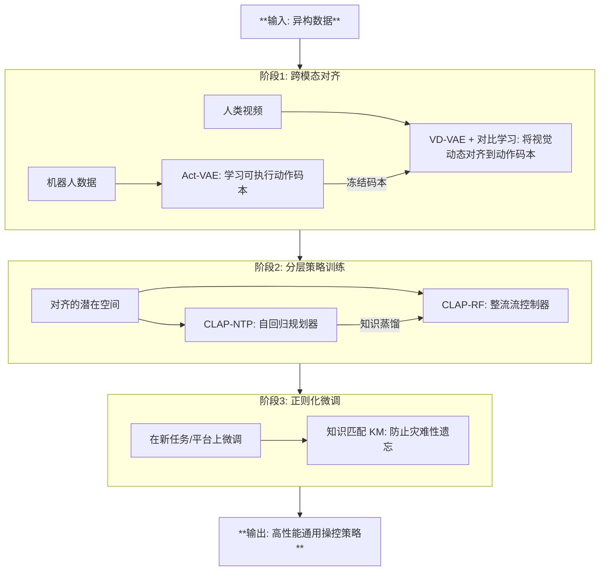

# CLAP: Contrastive Latent Action Pretraining for Learning Vision-Language-Action Models from Human Videos

**相关性评分**: 8.0/10

**排名**: #17

---

## 基本信息

- **arXiv ID**: [2601.04061v1](https://arxiv.org/abs/2601.04061v1)
- **发布时间**: 2026-01-07T16:26:33Z
- **相关性评分**: 8.0/10
- **是否相关**: 是

## 作者

Chubin Zhang, Jianan Wang, Zifeng Gao, Yue Su, Tianru Dai, Cai Zhou, Jiwen Lu, Yansong Tang

## 关键词

Vision-Language-Action Model, VLA for Robotics, Inference Efficiency, Lightweight Architecture, Inference Acceleration, Edge Deployment

## 一句话总结

CLAP提出了一种对比潜在动作预训练框架，通过从人类视频中学习视觉-语言-动作模型，以解决机器人数据稀缺问题，并引入双框架设计提升推理效率和精确操作能力。

## 摘要

Generalist Vision-Language-Action models are currently hindered by the scarcity of robotic data compared to the abundance of human video demonstrations. Existing Latent Action Models attempt to leverage video data but often suffer from visual entanglement, capturing noise rather than manipulation skills. To address this, we propose Contrastive Latent Action Pretraining (CLAP), a framework that aligns the visual latent space from videos with a proprioceptive latent space from robot trajectories. By employing contrastive learning, CLAP maps video transitions onto a quantized, physically executable codebook. Building on this representation, we introduce a dual-formulation VLA framework offering both CLAP-NTP, an autoregressive model excelling at instruction following and object generalization, and CLAP-RF, a Rectified Flow-based policy designed for high-frequency, precise manipulation. Furthermore, we propose a Knowledge Matching (KM) regularization strategy to mitigate catastrophic forgetting during fine-tuning. Extensive experiments demonstrate that CLAP significantly outperforms strong baselines, enabling the effective transfer of skills from human videos to robotic execution. Project page: https://lin-shan.com/CLAP/.

## 详细分析

## 论文《CLAP：基于对比潜在动作预训练从人类视频中学习视觉-语言-动作模型》详细摘要

### 1. 研究背景和动机
构建通用的**视觉-语言-动作（VLA）模型**是机器人领域的重要目标，但其发展受限于**机器人数据稀缺**，而人类视频数据则极为丰富。现有的**潜在动作模型（LAM）** 试图利用人类视频，但通常存在**视觉纠缠**问题，即学到的潜在表示混杂了背景变化等视觉噪声，而非纯粹的操控技能，导致难以直接迁移到机器人执行。本文旨在解决这一核心挑战，提出一种能够有效利用大规模无标签人类视频来学习可执行机器人技能的方法。

### 2. 核心方法和技术创新
本文提出了**对比潜在动作预训练（CLAP）** 框架，其核心创新在于：
- **跨模态对齐**：通过**对比学习**，将人类视频中的**视觉状态转移**与机器人轨迹的**本体感知动作空间**进行显式对齐，迫使模型将视频动态映射到一个**量化、物理上可执行的代码本**上，从而过滤掉视觉噪声。
- **双框架VLA模型**：基于对齐的表示，构建了两个互补的策略：
    - **CLAP-NTP**：一种自回归模型，擅长指令跟随和任务规划，能实现**零样本物体泛化**。
    - **CLAP-RF**：一种基于**整流流（Rectified Flow）** 的连续策略，专为**高频、高精度**的操控设计，推理速度快（183 ms）。
- **知识匹配（KM）正则化**：在微调阶段，通过约束当前策略与预训练参考模型输出分布的KL散度，有效防止**灾难性遗忘**，保留语义知识。

### 3. 主要实验结果
在真实世界机器人（Astribot S1）和仿真（LIBERO）基准上的广泛实验表明：
- **性能领先**：CLAP-RF在多项复杂双手操控任务（如叠衣服、包装玩偶）中取得了**最佳平均成功率（61.0%）**，超越了强大的基线模型（如 π₀, π₀.₅）。
- **有效泛化**：CLAP-NTP仅通过观看人类视频，就能成功将技能**零样本迁移到新物体**上。在LIBERO基准上，CLAP-RF作为单一通用模型，取得了**91.0%** 的平均成功率，优于其他通用模型。
- **鲁棒性**：在背景变化、光照干扰等环境扰动下，CLAP-RF表现出更强的鲁棒性。
- **验证对齐有效性**：消融实验证实，**对比学习损失**和**引入人类视频数据**对于实现良好的跨域泛化至关重要。

### 4. 研究意义和价值
本研究的意义在于：
- **理论价值**：首次系统性地提出并解决了LAM中的视觉纠缠问题，通过对比学习实现了视觉动态与物理动作空间的**同构映射**，为从异构数据源学习提供了新范式。
- **实践价值**：CLAP框架成功地将海量、易得的人类视频数据转化为可指导机器人执行的技能，显著**缓解了机器人数据瓶颈**。其双框架设计平衡了高层推理与底层控制，KM策略保障了知识迁移的稳定性，为构建真正通用、实用的机器人智能体迈出了关键一步。

## 问答对

### 问题 1

**Q**: 这篇论文的核心创新点是什么，他想解决什么问题，怎么解决的？

**A**: ## 论文核心分析：CLAP

### **一、 核心问题**
当前通用型**视觉-语言-动作模型**面临一个根本性矛盾：
- **优势**：人类视频数据（如Ego4D）**规模巨大、语义丰富、任务多样**。
- **劣势**：机器人操控数据**稀缺、收集成本高、多样性有限**。

现有方法（如潜在动作模型）试图利用人类视频，但存在**视觉纠缠**问题：模型从视频帧间变化中学习到的潜在表示，混杂了大量与操控技能无关的视觉噪声（如背景变化、物体形变），导致其无法直接用于精确的机器人控制，需要复杂的后处理映射。

**简言之，问题是如何将海量、无动作标签的人类视频中的“技能”有效、干净地迁移到机器人的物理动作空间。**

### **二、 核心创新点**
论文提出了 **CLAP** 框架，其创新是一个**系统性的解决方案**，包含四个层层递进的核心贡献：

1.  **对比潜在动作预训练**：
    - **创新**：不再仅从视觉重建中学习潜在动作，而是通过**对比学习**，显式地将**人类视频的视觉动态空间**与**机器人轨迹的 proprioceptive 空间**进行对齐。
    - **机制**：训练一个视觉动态VQ-VAE，强制其将视频帧间变化映射到一个**冻结的、由机器人动作量化得到的码本**上。同时使用对比损失（SigLIP）拉近视觉潜在表示与真实动作潜在表示的距离。
    - **效果**：过滤了视觉噪声，确保了从人类视频中提取的潜在表示与可执行的机器人命令**同构**。

2.  **双模态VLA框架**：
    - **创新**：提出了两种互补的模型架构，以平衡**高层推理**和**高频控制**。
    - **CLAP-NTP**：**自回归模型**。将动作令牌作为语言序列的延续进行预测，继承了基础VLM强大的指令遵循和推理能力，擅长任务规划和零样本物体泛化。
    - **CLAP-RF**：**基于整流流的策略**。将CLAP-NTP的能力蒸馏到一个扩散Transformer中，通过**绝缘注意力机制**查询VLM的语义特征，实现**高速（183ms）、高精度**的连续动作生成，特别擅长精细操作。

3.  **知识匹配正则化**：
    - **创新**：针对大模型微调中的**灾难性遗忘**问题，提出了一种正则化方法。
    - **机制**：在微调时，用一个冻结的参考模型来约束当前策略的令牌输出分布（通过KL散度），将策略更新锚定在预训练知识的可信区域内。
    - **效果**：在适应新 embodiment（如从仿真到真实）时，能有效保留预训练获得的语义知识和技能先验。

4.  **系统性的数据利用与对齐流程**：
    - 构建了从**动作量化**到**跨模态对齐**，再到**分层策略训练**的完整流程，为利用异构数据（机器人数据+人类视频）学习通用操控策略提供了一个可复现的范式。

### **三、 解决方案路径**
论文通过一个**三阶段流程**系统性地解决了上述问题：

### **四、 实际价值**
1.  **数据效率与泛化能力**：**成功实现了仅通过观看人类视频，就能让机器人学会操作新物体**（如在“制作花束”任务中泛化到未见过的花朵组合），极大降低了对昂贵机器人演示数据的依赖。
2.  **性能提升**：在真实机器人任务和LIBERO仿真基准上，CLAP-RF取得了**最先进或极具竞争力的性能**，尤其在需要长时程规划和精细操作的任务上优势明显。
3.  **实用性**：CLAP-RF实现了**高速推理（183ms）**，满足了动态操控对实时性的要求，使其具备实际部署的潜力。
4.  **方法论贡献**：为整个VLA领域提供了如何**构建、对齐与利用跨模态潜在空间**的清晰蓝图，以及如何**平衡大模型能力与实时控制需求**的有效架构设计。

**总结**：CLAP的核心突破在于通过**对比学习**实现了**视觉动态与物理动作的干净对齐**，并在此基础上设计了一个**兼顾“大脑”与“小脑”的双层架构**，从而高效地将海量人类知识注入机器人控制系统中，显著提升了模型的泛化性、精确性和实用性。

### 问题 2

**Q**: 请用一段话总结这篇论文，明确说明：论文试图解决的核心问题；提出的主要方法或框架；最终取得的主要效果或结论。要求语言简洁、信息密度高，不要复述摘要原文。

**A**: 这篇论文旨在解决通用视觉-语言-动作模型因机器人数据稀缺而难以利用海量人类视频数据的关键问题。现有潜在动作模型直接从视频学习动作表示，但存在**视觉纠缠**，即学到的特征混杂了背景变化等噪声，而非纯粹的操控技能，导致难以直接迁移到机器人执行。为此，论文提出了**对比潜在动作预训练**框架，其核心创新是通过对比学习，将人类视频中的视觉状态变化与机器人轨迹编码的**可执行潜在动作空间**进行显式对齐，从而学习到一个量化、物理可执行的共享动作表示。基于此，论文构建了一个双框架VLA模型：**CLAP-NTP**（自回归模型，擅长指令跟随和物体泛化）和**CLAP-RF**（基于整流流的高频精确控制器）。此外，还提出了**知识匹配**正则化策略以防止微调时的灾难性遗忘。实验表明，该方法在真实世界机器人任务和LIBERO仿真基准上均显著优于现有强基线，成功实现了从人类视频到机器人执行的技能有效迁移，尤其在物体泛化和精细操控任务上表现出色。

### 问题 3

**Q**: 这篇论文相对于已有工作有哪些明确的创新点？请逐条列出，并对每一条说明：相比以往方法改进或不同之处在哪里，以及该创新解决了什么具体问题或带来了什么优势。

**A**: ## 论文创新点分析

这篇论文《CLAP: Contrastive Latent Action Pretraining for Learning Vision-Language-Action Models from Human Videos》针对如何有效利用海量人类视频数据来训练机器人视觉-语言-动作模型这一核心挑战，提出了一套完整的创新框架。其相对于已有工作的明确创新点如下：

---

### 1. **提出对比性潜在动作预训练框架**
- **改进/不同之处**： 现有潜在动作模型通常通过视觉重建或逆动力学来学习潜在空间，但这种方法学习的表示容易与背景变化、物体形变等视觉噪声**纠缠**。CLAP的核心创新是引入**对比学习**，显式地将人类视频中的**视觉状态转移**与机器人轨迹中的**本体感知动作空间**进行对齐。
- **解决的问题/优势**： 直接解决了现有方法中“视觉纠缠”的根本问题。通过强制视觉动态映射到一个**物理可执行的、量化的码本**上，确保了从人类视频中提取的潜在表示与机器人可执行命令是同构的。这使得模型能够直接从人类视频中学习到纯净的操控技能，而无需复杂的后处理映射，实现了技能从人类视频到机器人执行的有效迁移。

### 2. **设计双模态VLA框架：CLAP-NTP 与 CLAP-RF**
- **改进/不同之处**： 论文没有采用单一的模型架构，而是提出了一个**双公式VLA框架**，包含两个协同进化的策略：
    - **CLAP-NTP**： 基于自回归的“下一令牌预测”模型，将动作令牌作为语言序列的延续进行建模。
    - **CLAP-RF**： 基于**整流流**的连续流策略，用于高频、精确的控制。
- **解决的问题/优势**：
    - **CLAP-NTP** 保留了骨干VLM强大的推理和指令跟随能力，在仅观察人类视频的情况下，就能实现对新物体的**零样本泛化**。
    - **CLAP-RF** 解决了自回归推理速度慢（~788ms）的问题，实现了**低延迟（183ms）和高精度控制**，在布料折叠、礼品包装等需要精细操作的任务上表现优异。这种分层设计平衡了**高层语义规划**和**底层高频控制**的需求。

### 3. **引入知识匹配正则化策略**
- **改进/不同之处**： 在微调通用模型以适应特定机器人平台时，传统的微调容易导致**灾难性遗忘**，丢失预训练阶段获得的有价值先验知识。CLAP提出了**知识匹配**策略，通过计算当前策略与一个冻结的参考模型（预训练模型）输出分布之间的KL散度，作为正则化项。
- **解决的问题/优势**： 有效缓解了灾难性遗忘和误差累积问题。它确保模型在适应新 embodiment（如从仿真到真实机器人，或更换机器人平台）的低层控制动态时，能够**锚定在预训练模型的可信区域内**，从而保留在大规模预训练阶段获得的高层推理和指令跟随能力。

### 4. **构建跨模态动态对齐的VD-VAE**
- **改进/不同之处**： 在利用未标记视频数据时，论文设计了**视觉动态VQ-VAE**。其关键创新在于，逆动力学编码器将帧间转移分解为**动作相关**和**动作无关**两个解耦的潜在流。动作相关流使用**冻结的Act-VAE码本**进行量化，并通过对比损失与机器人动作潜在表示对齐；动作无关流则使用独立码本捕捉视觉噪声。
- **解决的问题/优势**：
    - **实现解耦**： 通过L1正则化鼓励动作无关流的稀疏性，迫使模型将动作相关信息集中在`z_v,a`中，有效过滤了视觉噪声。
    - **处理无标签数据**： 对于人类视频，采用自监督对比学习，将`z_v,a`作为自身的正样本与批次内负样本进行对比。这种方法克服了监督方法无法处理缺失动作标签的局限，使得能够利用大规模无标签人类视频进行训练。

### 5. **系统性验证了利用人类视频实现物体泛化的能力**
- **改进/不同之处**： 论文不仅提出了方法，还通过精心设计的实验（如“制作花束”任务）**实证**了CLAP框架如何利用人类视频数据解决机器人数据中的物体过拟合问题。
- **解决的问题/优势**： 实验表明，仅使用机器人遥操作数据训练的模型在面对新物体组合时成功率极低（<10%）。而引入通过VD-VAE生成伪标签的人类视频数据进行微调后，**CLAP-NTP**在未见过的物体组合上取得了与已见组合相近的成功率（35%）。这直接证明了CLAP的**对齐机制能够将人类视频中的可操控性先验有效地迁移到机器人控制中**，为解决机器人数据稀缺和多样性不足的问题提供了切实可行的路径。

---

**总结**： CLAP的创新是一个**体系化**的贡献，从**预训练对齐机制**（解决视觉纠缠）、到**模型架构**（平衡规划与控制）、再到**训练策略**（防止遗忘），环环相扣，共同解决了利用人类视频学习通用VLA模型的核心瓶颈。其实验在真实机器人和仿真基准上的优异表现，特别是**在物体泛化和精细操作上的优势**，强有力地支撑了这些创新的价值。

### 问题 4

**Q**: 论文在实验或评估中最终实现了怎样的效果？请说明使用了哪些数据集和评价指标，与哪些基线方法进行了对比，以及在关键指标上的主要性能提升或结论。如果论文未给出明确的定量结果，也请说明原因。

**A**: ## 论文实验与评估效果总结

该论文通过一系列精心设计的实验，全面评估了所提出的 **CLAP** 框架在机器人操作任务上的性能、泛化能力和鲁棒性。实验表明，CLAP 在多个关键指标上超越了现有先进方法。

### 一、 使用的数据集

论文使用了**异构数据源**进行预训练和评估，以验证其跨模态、跨具身（embodiment）学习的能力：

1.  **预训练数据集**：
    *   **机器人数据**：
        *   **Curated AgiBot World Beta**： 约10万条高质量双手机器人轨迹（约1500小时），涵盖217个任务和106个场景。
        *   **自采集的 Astribot S1 数据**： 约2.7万条轨迹（约50小时），专注于拾放任务，用于跨具身适应。
    *   **人类视频数据**：
        *   **Ego4D 人类数据**： 从大规模人类自我中心视频数据集Ego4D中选取的90小时与操作任务相关的视频。

2.  **评估数据集**：
    *   **真实世界任务**： 在Astribot S1机器人平台上设计了5个任务进行评估。
    *   **仿真基准**： **LIBERO** 基准测试套件，包含4个子套件（Spatial, Object, Goal, Long），共40个任务，用于评估长期规划、泛化和跨域适应能力。

### 二、 评价指标

*   **主要指标**： **任务成功率**。对于多步骤任务，有时会报告子任务的成功率（如“拾取成功率”、“放置成功率”、“关闭成功率”）。
*   **其他分析指标**：
    *   **推理速度**： 在单张NVIDIA RTX 3090 GPU上测量模型生成动作的延迟（毫秒）。
    *   **模型参数量与内存占用**。
    *   **定性分析**： 可视化学习的潜在动作空间的语义对齐情况（如图1所示）。

### 三、 对比的基线方法

论文与多个当前最先进的通用机器人策略进行了对比：

1.  **π₀ 和 π₀.₅**： 基于大规模公开和私有机器人数据集训练的最先进的通用VLA模型，作为性能上限参考。
2.  **UniVLA**： 同样使用潜在动作令牌的近期VLA方法。与它的对比旨在**凸显CLAP中对比对齐和分层控制策略的独特优势**。
3.  **LIBERO基准上的其他方法**：
    *   **专家模型**： LAPA, Diffusion Policy, Octo, OpenVLA。
    *   **通用模型**： π₀ (Paligemma), SmolVLA。

### 四、 关键性能提升与结论

#### 1. 真实世界任务性能（表 I）
*   **CLAP-RF 达到最佳平均性能**： 在5个真实世界任务的平均成功率上，**CLAP-RF (61.0%)** 超越了最强的通用基线 **π₀.₅ (60.0%)** 和 **π₀ (54.0%)**，并大幅领先 **UniVLA (35.0%)**。
*   **分层设计的有效性**：
    *   **CLAP-NTP** 在指令跟随和物体泛化（OOD拾放）上表现出色，证明了其强大的高层推理能力。
    *   **CLAP-RF** 在需要高精度、连续控制的任务（如“折叠T恤”、“包装玩偶-关闭”）上显著优于CLAP-NTP，验证了Rectified Flow专家在精细操作上的优势。
*   **泛化能力**： 在未见过的物体（OOD）上进行拾放任务时，CLAP-NTP保持了高成功率（拾取85%，放置80%），表明其学习到的是可操作的通用表征，而非记忆特定物体。

#### 2. 利用人类视频进行泛化（图 8）
*   **核心发现**： 仅使用机器人遥操作数据训练，所有模型在未见过的物体组合上均严重过拟合（成功率<10%）。
*   **CLAP的独特优势**： 当加入**CLAP生成的伪标签人类视频**进行微调后，**CLAP-NTP在未见过的物体组合上达到了35%的成功率**，与在见过的组合上性能相当。而UniVLA的泛化能力有限（仅10%）。这**强有力地证明了CLAP的对比对齐机制能够有效将人类视频中的操作先验迁移到机器人控制中**。

#### 3. 鲁棒性评估（表 II）
*   **CLAP-RF 最具鲁棒性**： 在背景变化、光照变化和引入新物体/干扰物的扰动下，CLAP-RF的平均成功率（66.7%）显著高于 **π₀.₅ (56.7%)** 和 **UniVLA (16.7%)**。
*   **结论**： CLAP的对比目标有效地将动作相关特征与视觉噪声解耦，使得策略在面对感知干扰时仍能保持稳定的运动控制。

#### 4. 仿真基准结果（表 III）
*   **通用模型中的最优表现**： 在更具挑战性的“**单模型训练，评估所有任务**”的设置下，**CLAP-RF取得了91.0%的平均成功率**，超越了 **SmolVLA (88.8%)** 和 **π₀ (86.0%)**。
*   **长时程规划优势突出**： 在最具挑战性的LIBERO-Long套件上，CLAP-RF取得了**82%**的成功率，显著优于其他通用模型，证明了其分层设计有效保留了VLM骨干的高层规划能力。
*   **知识匹配（KM）的有效性**： 在从真实世界、双手机器人数据到仿真、单手机器人数据的巨大领域差距下，KM正则化策略成功防止了灾难性遗忘，是取得优异跨域性能的关键。

#### 5. 推理速度（表 VII）
*   **CLAP-RF实现低延迟控制**： CLAP-RF的推理延迟为**183毫秒**，与高度优化的 **π₀ (169毫秒)** 相当，并远快于 **OpenVLA (454毫秒)** 和 **FAST (834毫秒)**，满足了动态操作对实时性的要求。

### 总结
论文通过定量和定性实验全面验证了CLAP框架的有效性。**核心结论是**：通过**对比潜在动作预训练（CLAP）** 实现的视觉-动作空间显式对齐，使得模型能够**高效利用大规模人类视频数据**，学习到**物理可执行、语义清晰**的操作表征。在此基础上构建的**双配方VLA框架（CLAP-NTP 和 CLAP-RF）** 分别在高层推理/指令跟随和低层高频/精密控制上表现出色，并在**任务性能、物体泛化、环境鲁棒性和跨域适应**等多个维度上超越了现有的先进基线方法。

## 相关链接

- [arXiv 页面](https://arxiv.org/abs/2601.04061v1)
- [HTML 版本](https://arxiv.org/html/2601.04061v1)
