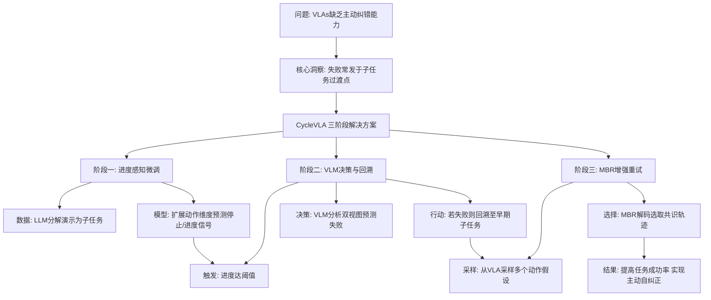

# CycleVLA: Proactive Self-Correcting Vision-Language-Action Models via Subtask Backtracking and Minimum Bayes Risk Decoding

**相关性评分**: 8.0/10

**排名**: #21

---

## 基本信息

- **arXiv ID**: [2601.02295v1](https://arxiv.org/abs/2601.02295v1)
- **发布时间**: 2026-01-05T17:31:01Z
- **相关性评分**: 8.0/10
- **是否相关**: 是

## 作者

Chenyang Ma, Guangyu Yang, Kai Lu, Shitong Xu, Bill Byrne, Niki Trigoni, Andrew Markham

## 关键词

Vision-Language-Action Model, VLA for Robotics, Inference Efficiency, Lightweight Architecture, Inference Acceleration, Edge Deployment

## 一句话总结

CycleVLA 是一种通过子任务回溯和最小贝叶斯风险解码实现主动自校正的视觉-语言-动作模型，旨在提升机器人执行效率和可靠性。

## 摘要

Current work on robot failure detection and correction typically operate in a post hoc manner, analyzing errors and applying corrections only after failures occur. This work introduces CycleVLA, a system that equips Vision-Language-Action models (VLAs) with proactive self-correction, the capability to anticipate incipient failures and recover before they fully manifest during execution. CycleVLA achieves this by integrating a progress-aware VLA that flags critical subtask transition points where failures most frequently occur, a VLM-based failure predictor and planner that triggers subtask backtracking upon predicted failure, and a test-time scaling strategy based on Minimum Bayes Risk (MBR) decoding to improve retry success after backtracking. Extensive experiments show that CycleVLA improves performance for both well-trained and under-trained VLAs, and that MBR serves as an effective zero-shot test-time scaling strategy for VLAs. Project Page: https://dannymcy.github.io/cyclevla/

## 详细分析

## CycleVLA 论文详细摘要

### 1. 研究背景和动机
当前机器人失败检测与纠正的研究大多采用**事后处理**模式，即在失败发生后才进行分析和修正。然而，许多关键错误一旦完全发生便无法挽回（如物体摔碎）。受人类在执行过程中主动调整行为的启发，本文旨在为通用机器人基础模型——**视觉-语言-动作模型**——赋予**主动自纠正**能力，使其能够在执行过程中预判即将发生的失败，并在失败完全显现前进行恢复。

### 2. 核心方法和技术创新
本文提出了 **CycleVLA** 系统，其核心创新在于将**进度感知、失败预测与回溯、以及测试时扩展**三者结合：
- **进度感知的VLA微调**：通过LLM将演示轨迹分解为对齐的子任务，并扩展VLA的动作维度，使其能同时预测**停止信号**和**子任务进度**。这解决了现有VLA缺乏停止或进度估计机制的关键限制。
- **基于VLM的失败预测与子任务回溯**：在测试时，当VLA预测的进度达到阈值时，调用一个现成的视觉语言模型作为零样本失败预测器和规划器。VLM根据全局和腕部摄像头视图，决定是**过渡到下一个子任务**还是**回溯到最早能恢复缺失前提条件的子任务**并重试。
- **基于最小贝叶斯风险的测试时扩展**：在回溯重试时，从VLA策略中采样多个动作序列假设，并采用**MBR解码**选择共识轨迹（即在高密度策略输出区域中的轨迹），从而在不依赖外部验证器的情况下提高重试成功率。

### 3. 主要实验结果
在LIBERO仿真基准测试中进行了广泛实验：
- **任务成功率**：CycleVLA在具有挑战性的长视野任务上表现突出，平均成功率从基线（如OpenVLA）的76.5%提升至**95.3%**。
- **对欠训练VLA的有效性**：即使应用于训练不充分的VLA，CycleVLA也能带来一致的性能提升，缩小了不同容量模型之间的差距。
- **MBR解码分析**：验证了MBR作为VLA零样本测试时扩展策略的有效性。`L2`距离度量表现最佳，且假设数量`N=8`时已能获得大部分收益。MBR对较弱模型的提升更为显著。
- **组件消融研究**：移除非关键组件（如MBR、停止信号）会导致性能下降，证明了各模块的必要性。

### 4. 研究意义和价值
- **范式转变**：将机器人失败处理从“事后纠正”推向“**事前预防**”，更符合实际应用中对鲁棒性和安全性的需求。
- **方法创新**：首次将**子任务进度感知**与**基于VLM的零样本失败预测/规划**相结合，并为VLA引入了**MBR解码**这一高效的测试时扩展策略。
- **实用价值**：系统显著提升了VLA在长视野、复杂任务上的成功率，且对模型训练状态不敏感，增强了VLA作为通用机器人策略的实用性和可靠性。为未来研发具备端到端失败推理能力的VLA奠定了基础。

## 问答对

### 问题 1

**Q**: 这篇论文的核心创新点是什么，他想解决什么问题，怎么解决的？

**A**: ## CycleVLA 论文分析

### **核心问题**
当前机器人失败检测与纠正方法通常是**事后（post hoc）**的，即在失败完全发生后才进行分析和纠正。这类似于“杯子摔碎后才去捡”，往往为时已晚。论文旨在为**视觉-语言-动作模型（VLAs）** 赋予**主动自纠正（proactive self-correction）** 能力，使其能够在执行过程中**预见即将发生的失败**，并在失败完全显现之前进行恢复。

### **核心创新点**
CycleVLA 是一个集成系统，其创新性体现在三个紧密耦合的组件上，共同实现了从“被动响应失败”到“主动预防失败”的范式转变：

1.  **赋予VLA子任务进度感知能力**
    -   **问题**：现有VLAs缺乏明确的停止机制或进度估计能力，无法判断何时该完成一个子任务并过渡到下一个。
    -   **解决方案**：
        -   **数据构建**：利用LLM将演示轨迹分解为对齐的子任务序列（含起止时间戳和语言指令）。
        -   **模型微调**：扩展VLA的动作输出维度（从7维到9维），新增**停止信号（`s_t`）** 和**进度信号（`p_t`）** 的预测。无需改变模型架构，仅通过数据标注和损失函数调整即可实现。

2.  **基于VLM的失败预测与子任务回溯机制**
    -   **问题**：如何在子任务即将完成的关键节点（失败高发点）做出“继续”还是“干预”的决策。
    -   **解决方案**：
        -   **触发**：当VLA预测的进度达到阈值（如90%）时，触发检查。
        -   **决策**：使用一个**现成的视觉语言模型（VLM）** 作为零样本的失败预测器和规划器。VLM同步分析第三人称和腕部摄像头视图，结合当前子任务和任务列表，输出决策：`transit`（继续到下一子任务）或 `backtrack`（回溯）。
        -   **回溯**：如果预测失败，系统将**回溯到最早能恢复缺失前提条件的子任务**（例如，物体中途掉落，则回溯到抓取子任务），通过反向执行记录的动作来恢复机器人状态。

3.  **基于最小贝叶斯风险解码的零样本测试时扩展策略**
    -   **问题**：回溯后重试时，如何提高成功率？
    -   **解决方案**：
        -   从VLA策略中采样多个动作序列假设。
        -   采用**最小贝叶斯风险（MBR）解码**，选择那个在给定距离度量下**期望风险最小**的假设（即与所有其他假设平均距离最小的那个）。这实质上是在策略输出空间中选择**高密度区域**的“共识”轨迹，其成功概率更高。
        -   这是一种**无需训练**的测试时增强方法，尤其对欠训练的VLA模型效果提升显著。

### **技术解决路径总结**

### **实际价值**
1.  **性能提升**：在LIBERO等机器人基准测试中，显著提高了长视野任务的成功率，即使对于**欠训练的VLA模型**也能带来一致性的性能增益。
2.  **范式创新**：推动了机器人失败处理从“事后补救”到“事中预防”的转变。
3.  **方法通用**：提出的MBR解码作为一种**零样本测试时扩展策略**，为VLA的推理过程提供了一种简单有效的性能提升方法，无需额外训练验证器或奖励模型。
4.  **系统集成**：展示了如何将**大模型（LLM/VLM）的推理能力**与**具身模型（VLA）的控制能力**有机结合，构建更智能、更鲁棒的机器人系统。

**局限性**：依赖于可逆的状态回溯（在高度动态或不可逆环境中可能不适用），且测试时多次采样会增加推理时间。

### 问题 2

**Q**: 请用一段话总结这篇论文，明确说明：论文试图解决的核心问题；提出的主要方法或框架；最终取得的主要效果或结论。要求语言简洁、信息密度高，不要复述摘要原文。

**A**: 这篇论文旨在解决机器人视觉-语言-动作模型在执行长视野任务时，只能在失败发生后进行被动纠错的问题。其核心是赋予模型**主动自校正**能力，即在错误完全发生前预测并恢复。为此，论文提出了 **CycleVLA** 框架，它通过三个关键组件实现：1）一个微调流程，使VLA能预测子任务进度和停止信号；2）一个基于视觉语言模型的失败预测与规划器，用于在子任务边界触发**回溯**；3）一种基于**最小贝叶斯风险解码**的零样本测试时缩放策略，以提高回溯后重试的成功率。实验表明，该方法显著提升了VLA在模拟基准上的任务成功率，尤其对长视野任务和训练不足的模型效果显著，同时验证了MBR解码作为VLA测试时缩放策略的有效性。

### 问题 3

**Q**: 这篇论文相对于已有工作有哪些明确的创新点？请逐条列出，并对每一条说明：相比以往方法改进或不同之处在哪里，以及该创新解决了什么具体问题或带来了什么优势。

**A**: ## CycleVLA 论文创新点分析

这篇论文提出了一种名为 **CycleVLA** 的系统，旨在为视觉-语言-动作模型赋予**主动自校正**能力。其核心创新点在于将**任务进度感知、基于视觉语言模型的失败预测与回溯、以及基于最小贝叶斯风险的测试时扩展**三者结合，形成了一个闭环的自我纠正框架。以下是其相对于已有工作的明确创新点：

---

### 1. **从“事后”纠正到“事前”预防的范式转变**
- **改进/不同之处**：现有的大多数机器人失败检测与纠正工作（如基于保形预测、状态异常检测或事后残差策略）都是在失败**发生之后或发生之时**进行识别和纠正。CycleVLA 则提出了 **“主动自校正”** ，在失败**完全显现之前**（即处于萌芽状态时）就进行预测和干预。
- **解决的问题/优势**：解决了“亡羊补牢”的局限性。一旦失败完全发生（如物体被打翻），往往无法挽回或需要极高成本恢复。主动预防能在执行过程中避免灾难性失败，提高任务完成的**单次尝试成功率**，减少对外部干预的依赖。

### 2. **为VLA模型显式注入“进度感知”能力**
- **改进/不同之处**：现有VLA模型通常缺乏明确的**停止机制或进度估计能力**。CycleVLA 设计了一个微调流程，通过**扩展动作维度**（在原有的7维动作上增加`停止信号`和`进度信号`），使VLA能够预测当前子任务的进度和终止点。
- **解决的问题/优势**：
    - **解决了子任务边界模糊的问题**：使模型能明确知道“何时完成一个子任务并切换到下一个”，这对于长视野任务至关重要。
    - **为失败预测提供了关键线索**：论文指出，失败常发生在子任务转换点附近，进度信号（如`pt ≥ 0.9`）是触发失败预测检查的可靠时机。

### 3. **基于VLM的零样本失败预测与子任务回溯规划**
- **改进/不同之处**：
    - **零样本与通用性**：使用一个**现成的、未针对特定任务微调的视觉语言模型**作为失败预测器和规划器。这与需要额外训练失败检测模型或价值函数的方法不同。
    - **细粒度多视角推理**：VLM同时接收**第三人称视角和腕部相机视角**的图像，结合全局场景理解和局部接触细节进行链式推理，做出“继续”或“回溯”的决策。
    - **智能回溯目标选择**：当预测失败时，不是简单重试当前步骤，而是**回溯到能够恢复缺失前提条件的最早子任务**（例如，物体中途掉落，则回溯到“抓取”子任务）。
- **解决的问题/优势**：
    - **降低对失败数据标注的依赖**：利用大模型的常识和推理能力进行零样本预测，无需收集难以获取的机器人失败数据。
    - **实现更根本的恢复**：智能回溯解决了错误累积问题，通过恢复到更早的、正确的状态来从根本上纠正错误，而非在错误状态上打补丁。

### 4. **将最小贝叶斯风险解码首次作为VLA的零样本测试时扩展策略**
- **改进/不同之处**：
    - **方法迁移**：将成功应用于大语言模型的**MBR解码**策略，创新性地引入到VLA的决策过程中。这与之前VLA测试时扩展工作（如使用扰动采样+VLM筛选，或使用学习到的奖励模型评分）有本质不同。
    - **无需训练验证器**：MBR通过从策略中采样多个动作轨迹假设，并选择**在度量空间下具有最小期望风险（即最接近其他样本共识）** 的轨迹。这是一个完全**无需训练**的共识选择过程。
    - **密度感知选择**：论文采用了基于`r-NN`半径的**密度估计变体**，选择高密度区域的中心点（medoid），增强了鲁棒性。
- **解决的问题/优势**：
    - **提升重试成功率**：在回溯后重试时，MBR能从多个随机采样中选出更可靠、更一致的动作序列，显著提高了恢复尝试的成功率。
    - **对欠训练模型友好**：实验表明，MBR对能力较弱的（欠训练的）VLA模型提升效果更明显，因为它能过滤掉低质量、离群的策略输出。
    - **提供了一种新的VLA性能提升范式**：证明了测试时扩展同样适用于机器人策略模型，且MBR是一种有效的零样本实现方式。

### 5. **系统级整合与端到端评估**
- **改进/不同之处**：CycleVLA 不是单一技术的改进，而是将**进度感知微调、VLM规划、MBR解码**无缝整合到一个完整的推理循环中（算法1）。论文在具有挑战性的长视野任务套件上进行了系统评估，并专门分析了**在欠训练VLA上的有效性**。
- **解决的问题/优势**：
    - **验证了模块组合的有效性**：通过消融实验证明了每个组件的贡献，表明这种整合产生了`1+1+1>3`的效果。
    - **提升了实用性和鲁棒性**：系统不仅对训练良好的模型有效，更能显著提升**欠训练模型**的性能，这在计算资源有限或任务难度高的实际场景中极具价值。
    - **明确了效率开销**：对运行时各组件开销进行了详细分析，表明其增加的推理时间（约30%）在可接受范围内，为实际部署提供了参考。

---

**总结**：CycleVLA 的核心创新在于**理念上**转向主动预防，**方法上**创造性地融合了进度感知、大模型零样本推理和基于共识的测试时决策优化。它解决了现有VLA缺乏执行过程监控与自我调整能力的关键短板，特别是在处理长视野、易出错任务时，提供了一种系统性的、数据高效的自我纠正解决方案。

### 问题 4

**Q**: 论文在实验或评估中最终实现了怎样的效果？请说明使用了哪些数据集和评价指标，与哪些基线方法进行了对比，以及在关键指标上的主要性能提升或结论。如果论文未给出明确的定量结果，也请说明原因。

**A**: ## 实验与评估效果总结

### 数据集与评价指标
- **数据集**：主要使用 **LIBERO** 机器人操作基准测试套件，包含四个任务组：
  - **Spatial**（空间任务）
  - **Object**（物体任务）
  - **Goal**（目标任务）
  - **Long**（长视野任务）
- **评价指标**：**任务成功率**（Success Rate），即成功完成任务的轨迹比例。

### 基线方法对比
论文与多种先进的视觉-语言-动作模型（VLA）和机器人策略方法进行了对比，包括：
- **Diffusion Policy**（扩散策略）
- **Octo-Base**
- **OpenVLA**
- **TraceVLA**
- **SpatialVLA**
- **ThinkAct**
- **CoT-VLA**
- **FPC-VLA**
- **GR00T N1**

### 关键性能提升与结论
#### 1. **整体任务成功率显著提升**
- **CycleVLA 在 LIBERO 基准测试中取得了最高平均成功率（95.3%）**，显著优于所有基线方法。
- 在最具挑战性的 **LIBERO-Long** 任务组上，CycleVLA 取得了 **93.6%** 的成功率，比表现次优的 GR00T N1（90.6%）高出近 3 个百分点，凸显了其在长视野任务中通过主动自我纠正防止错误累积的优势。

#### 2. **对欠训练 VLA 的有效提升**
- 实验测试了在不同训练步数（200K、350K、500K）的 VLA 上应用 CycleVLA 的效果。
- **CycleVLA 显著提升了欠训练模型（200K、350K 步）的性能**，使其成功率接近甚至超过更高训练步数的基线模型。
- 例如，200K 步的模型应用 CycleVLA 后，平均成功率从 73.2% 提升至 80.0%（+6.8%），证明了该方法对模型能力不足的鲁棒性。

#### 3. **MBR 解码作为零样本测试时扩展策略的有效性**
- **MBR 解码显著提高了从多个动作假设中选择成功动作块的概率**。
- 在多个 VLA 检查点上，MBR 解码相比随机选择均带来稳定提升（提升幅度 3.3% 至 11.9%）。
- **关键发现**：模型能力越弱（欠训练），从 MBR 解码中获益越大。
- **最佳配置**：使用 `L2` 距离度量，假设数量 `N=8` 或 `16` 时达到性能与计算成本的较好平衡。

#### 4. **各组件贡献的消融研究**
- **移除 MBR 解码**：成功率从 95.3% 降至 92.5%，说明 MBR 对提升重试成功率有明确贡献。
- **更换 VLM 骨干网络**：使用较小的 LLaMA-3.2-11B 导致成功率轻微下降（92.8%），但推理时间大幅减少，表明系统对 VLM 选择有一定鲁棒性。
- **移除停止信号和最后动作过采样**：成功率降至 91.1%，证明了精确的停止信号预测对正确子任务转换至关重要。
- **始终开启 MBR（理论上界）**：成功率提升至 96.9%，但推理时间增加一倍以上，说明有选择性地在回溯后使用 MBR 是效率与效果的更好权衡。

#### 5. **推理时间开销分析**
- 在 NVIDIA A10 GPU 上，CycleVLA 的端到端推理时间比基线 VLA 增加约 **30%**。
- 主要开销来自 **动作采样（22.2%）** 和 **VLM API 调用（6.0%）**，而 MBR 自身的距离计算开销可忽略不计（<0.1%）。
- 论文认为此开销在可接受范围内，与大型语言模型中测试时扩展策略的开销趋势一致。

### 总结
CycleVLA 通过其**主动自我纠正机制**——结合**进度感知 VLA 微调**、**VLM 驱动的失败预测与回溯规划**以及**MBR 解码重试**——在标准机器人操作基准测试上实现了**最先进的性能**。它不仅提升了成熟 VLA 的性能，更重要的是为**欠训练或能力有限的 VLA 提供了一种有效的“能力增强”手段**，同时验证了 MBR 解码作为 VLA 零样本测试时扩展策略的有效性。这些结果证明了在机器人执行过程中进行**前瞻性错误干预**的实用价值。

## 相关链接

- [arXiv 页面](https://arxiv.org/abs/2601.02295v1)
- [HTML 版本](https://arxiv.org/html/2601.02295v1)
