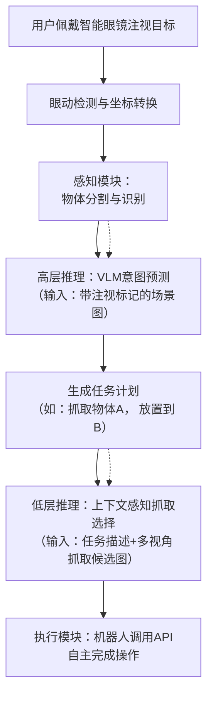

# Intent at a Glance: Gaze-Guided Robotic Manipulation via Foundation Models

**相关性评分**: 7.0/10

**排名**: #35

---

## 基本信息

- **arXiv ID**: [2601.05336v1](https://arxiv.org/abs/2601.05336v1)
- **发布时间**: 2026-01-08T19:33:03Z
- **相关性评分**: 7.0/10
- **是否相关**: 是

## 作者

Tracey Yee Hsin Tay, Xu Yan, Jonathan Ouyang, Daniel Wu, William Jiang, Jonathan Kao, Yuchen Cui

## 关键词

Vision-Language-Action Model, VLA for Robotics, Inference Efficiency, Lightweight Architecture, Edge Deployment

## 一句话总结

这篇论文提出了一种结合眼动追踪和视觉语言模型来推断用户意图并执行机器人操作任务的系统，与视觉-语言-动作模型和机器人应用相关，但未明确强调推理效率或轻量级架构。

## 摘要

Designing intuitive interfaces for robotic control remains a central challenge in enabling effective human-robot interaction, particularly in assistive care settings. Eye gaze offers a fast, non-intrusive, and intent-rich input modality, making it an attractive channel for conveying user goals. In this work, we present GAMMA (Gaze Assisted Manipulation for Modular Autonomy), a system that leverages ego-centric gaze tracking and a vision-language model to infer user intent and autonomously execute robotic manipulation tasks. By contextualizing gaze fixations within the scene, the system maps visual attention to high-level semantic understanding, enabling skill selection and parameterization without task-specific training. We evaluate GAMMA on a range of table-top manipulation tasks and compare it against baseline gaze-based control without reasoning. Results demonstrate that GAMMA provides robust, intuitive, and generalizable control, highlighting the potential of combining foundation models and gaze for natural and scalable robot autonomy. Project website: https://gamma0.vercel.app/

## 详细分析

## 论文摘要

**论文标题**：Intent at a Glance: Gaze-Guided Robotic Manipulation via Foundation Models

**研究背景和动机**：
在辅助护理等场景中，设计直观的人机交互界面是核心挑战。传统控制方式（如操纵杆）对行动不便的用户存在认知和身体负担。**眼动追踪**作为一种快速、非侵入且富含意图的输入方式，为传达用户目标提供了极具潜力的通道。本研究旨在探索如何利用眼动信号，结合强大的基础模型，实现无需任务特定训练的、直观的机器人操控。

**核心方法和技术创新**：
本文提出了 **GAMMA**（Gaze Assisted Manipulation for Modular Autonomy）系统，其核心创新在于**将眼动信号与视觉语言模型（VLM）深度结合**，实现从意图理解到任务执行的端到端零样本操控。具体技术路径如下：
- **模块化感知**：利用商用智能眼镜（Meta Aria）进行自我中心视角的眼动追踪，并通过特征匹配将注视点映射到机器人视角。使用SAM2进行基于注视点的物体分割，并利用Contact-GraspNet生成抓取位姿候选集。
- **VLM驱动的双层推理**：
    1.  **高层意图预测**：将带有顺序编号的注视点图像作为视觉提示，引导VLM（如Gemini Pro）识别注视物体并推理用户可能的操作意图（如“拿起A放入B”）。
    2.  **低层抓取选择**：将多个候选抓取位姿以多视角图像或视频形式提示给VLM，使其结合任务上下文（如避免碰撞）选择最优抓取方式。
- **零样本与通用性**：整个系统无需针对特定任务或物体进行训练，完全依赖预训练基础模型的泛化能力，展现了强大的可扩展性。

**主要实验结果**：
- **VLM性能基准测试**：在实验室桌面和野外（DROID）数据集上的意图推理任务中，Gemini Pro模型平均准确率最高（84%）。在抓取选择任务中，视频提示能提升VLM对3D位姿的理解能力。
- **用户研究**：与传统的**面板式眼动控制基线**相比，GAMMA在**任务完成时间上减少了一半以上**，且用户认知负荷和挫败感更低，验证了其高效性和易用性（支持假设H1）。
- **有趣的发现**：尽管GAMMA更高效，但多数健康被试**更偏好基线方法**，因为他们认为直接控制能带来更强的**掌控感和代理感**（拒绝假设H2）。这揭示了辅助系统设计中**自动化与用户控制权之间需要权衡**的重要问题。

**研究意义和价值**：
本研究成功展示了**基础模型与眼动输入结合**在实现自然、可扩展的辅助机器人操控方面的巨大潜力。其价值在于：
1.  **技术贡献**：提供了一套完整的、模块化的框架，利用现有VLM和视觉模型，实现了从人类注视到机器人动作的零样本映射。
2.  **人机交互启示**：研究结果超越了单纯追求自动化，深刻指出**用户对代理感和控制权的需求**与系统效率同等重要，为未来设计**混合控制**或可调节自主度的系统指明了方向。
3.  **应用前景**：为行动不便的用户提供了一种潜在的、高度直观的交互方式，推动了以人为本的辅助机器人技术发展。

## 问答对

### 问题 1

**Q**: 这篇论文的核心创新点是什么，他想解决什么问题，怎么解决的？

**A**: ## 论文核心分析

### **研究问题**
论文旨在解决**人机交互（HRI）中，特别是辅助护理场景下，如何设计直观、低负担的机器人控制接口**这一核心挑战。传统控制方式（如操纵杆、触摸屏）对行动不便的用户存在认知和身体负担。论文探索利用**眼动注视**这一快速、非侵入性且富含意图的输入模态，来传达用户目标，实现自然的机器人操控。

### **核心创新点**
论文的核心创新在于提出了 **`gamma` 系统**，这是一个**首次将可穿戴设备的自我中心眼动追踪与视觉语言模型（VLM）深度结合，实现零样本、仅凭注视即可完成复杂机器人操作任务的框架**。其创新性具体体现在：

1.  **意图理解的范式转变**：
    - **传统方法**：通常需要额外的输入设备（如操纵杆）进行直接控制，或依赖手工制作的、针对特定任务的意图预测模型。
    - **`gamma` 的创新**：**仅凭用户的注视序列**，利用VLM的常识推理能力，在无需任何任务特定训练的情况下，将低级的注视点映射为高级的语义理解和任务规划。这实现了从“用户控制机器人每个动作”到“用户表达意图，机器人自主规划执行”的转变。

2.  **利用基础模型实现端到端推理**：
    - **双重VLM推理**：系统创新性地将VLM应用于两个层面：
        - **高层意图预测**：根据注视点序列和场景图像，推断用户想要执行的任务（如“拿起植物放入托盘”）。
        - **低层抓取姿态选择**：在多个几何可行的抓取姿态中，结合任务上下文（如避免与障碍物碰撞）选择最优的一个。例如，为放入微波炉的杯子选择侧向抓取，而非顶部抓取。
    - **模块化集成**：系统巧妙地集成了多个现成的感知模型（如SAM2用于分割，Contact-GraspNet用于生成抓取候选），并通过VLM作为“大脑”进行协调和决策，实现了**模块化、零样本的自主性**。

3.  **解决6自由度操控的固有难题**：
    - **注视的局限性**：注视仅提供2D点估计，难以指定方向（6自由度中的旋转）。
    - **`gamma`的解决方案**：通过VLM对场景和任务进行语义理解，**自动补全了方向信息**。系统不是用注视直接控制末端姿态，而是用注视指定目标物体和任务，由VLM和抓取预测模型共同决定具体的6自由度抓取和放置姿态。

### **解决方案与技术路径**
`gamma` 系统通过以下流程解决上述问题：

1.  **感知**：
    - 使用Meta Aria眼镜进行自我中心眼动追踪。
    - 通过特征点（ArUco标记）将用户注视点转换到机器人相机坐标系。
    - 使用SAM2基于注视点进行实例分割，获取目标物体的点云。
    - 使用Contact-GraspNet生成多个候选抓取姿态。

2.  **推理**：
    - **意图预测VLM**：输入带有序号标记的注视点场景图，通过思维链提示，先识别物体，再推理可能任务。
    - **抓取选择VLM**：输入任务描述和候选抓取姿态的多视角图像或视频，分析每个姿态的稳定性、碰撞风险等，选择最佳姿态。

3.  **执行**：
    - 系统将VLM输出的意图和选定的抓取姿态，编译成可执行的机器人技能序列（如 `pick(object_A, grasp_pose_5)`, `place(object_B)`），并调用相应的机器人API完成操作。

### **实际价值与启示**
- **辅助技术潜力**：为行动不便的用户提供了一种极其自然、低物理负担的机器人控制方式，有望增强其独立性和生活品质。
- **人机交互新范式**：展示了**基础模型作为“通用意图解释器”** 在连接人类自然行为（注视）与机器动作方面的强大能力，为实现更通用、可扩展的服务机器人提供了技术路径。
- **重要的用户体验发现**：实验揭示了一个关键设计权衡——**自动化效率与用户控制感（Agency）之间的平衡**。尽管 `gamma` 更高效、省力，但多数健康被试更偏好能直接控制的基线方法，因为他们“感觉更有控制力”。这提示未来的辅助系统应是**混合型**的，允许用户在自主模式和手动微调模式间流畅切换。

**总结**：本文的核心创新是提出了一个**利用VLM解析眼动注视以实现零样本机器人任务自主执行的集成框架**。它成功地将一个模糊的输入（注视点）转化为精确的机器人操作指令，解决了仅凭注视进行6自由度操控的难题，并引发了关于如何在追求自动化效率的同时保障用户控制感的重要设计思考。

### 问题 2

**Q**: 请用一段话总结这篇论文，明确说明：论文试图解决的核心问题；提出的主要方法或框架；最终取得的主要效果或结论。要求语言简洁、信息密度高，不要复述摘要原文。

**A**: 这篇论文旨在解决**如何为辅助机器人设计直观、无需特定任务训练的控制接口**这一核心问题，尤其关注行动不便的用户。为此，作者提出了 **GAMMA** 系统，其核心方法是**结合可穿戴设备的眼动追踪与视觉语言模型**：系统首先将用户的注视点映射到机器人视角的场景中，然后利用VLM对注视序列进行语义推理，以零样本方式推断用户意图（如“拿起A放入B”），并进一步结合场景几何信息为机器人选择合适的具体抓取位姿。实验表明，该方法相比传统的面板式眼动控制**效率更高、用户认知负担更低**，但用户研究揭示了一个关键矛盾：尽管自动化程度高，**用户可能更偏爱能提供更强控制感和直接干预能力的交互方式**，这凸显了在辅助机器人系统中平衡自主性与用户能动性的重要性。

### 问题 3

**Q**: 这篇论文相对于已有工作有哪些明确的创新点？请逐条列出，并对每一条说明：相比以往方法改进或不同之处在哪里，以及该创新解决了什么具体问题或带来了什么优势。

**A**: ## 论文创新点分析

这篇论文提出的 **GAMMA** 系统在“基于眼动引导的机器人操作”领域，相对于已有工作，具有以下几个明确的创新点：

---

### 1. **首次将眼动追踪与视觉语言模型（VLM）深度融合，实现零样本意图推断与任务执行**
   - **相比以往方法的改进/不同之处**：
     - **以往方法**：多数眼动控制研究依赖于**硬编码的意图预测模型**或需要**任务特定训练**。例如，系统需要预先定义“看瓶子身体=抓取瓶身，看瓶盖=拧开”等规则，缺乏泛化能力。一些工作将眼动作为**辅助输入**，仍需配合操纵杆、触摸屏等物理控制器进行低级运动控制。
     - **GAMMA 的做法**：直接利用**预训练的通用VLM（如Gemini Pro）**，将用户的注视点序列（作为视觉提示）与场景图像结合，通过自然语言推理直接推断用户的**高级任务意图**（例如，“把植物放到托盘里”）。**无需任何任务特定训练或手工规则**。
   - **解决的具体问题/带来的优势**：
     - **解决了意图推断的泛化与可扩展性问题**。系统可以处理未见过的物体、场景和任务组合，适应真实世界的复杂性。
     - **实现了真正的“眼动即命令”**。用户仅通过注视即可指定复杂任务，无需学习复杂的低级控制界面，极大降低了认知与物理负担，尤其适用于行动不便的用户。

### 2. **利用VLM同时进行高级意图推断和低级抓取姿态选择，实现端到端的上下文感知规划**
   - **相比以往方法的改进/不同之处**：
     - **以往方法**：高级任务规划和低级运动规划通常是**解耦**的。眼动可能用于选择物体，但抓取姿态由传统的几何抓取预测模型（如Contact-GraspNet）生成，**缺乏任务上下文考虑**（例如，抓取杯子时需考虑后续放入微波炉的碰撞风险）。一些并发研究结合眼动与语言模型，但**主要聚焦于高级任务推理**。
     - **GAMMA 的做法**：构建了一个**两级VLM推理框架**。
       1.  **意图预测VLM**：根据注视点推断要执行的动作序列（如“拿起A，放入B”）。
       2.  **抓取选择VLM**：接收任务上下文和多个候选抓取姿态（由传统模型生成），通过分析**稳定性、碰撞风险、可达性**，选择最适合**当前任务**的抓取姿态。
   - **解决的具体问题/带来的优势**：
     - **解决了任务感知的抓取规划问题**。抓取选择不再是孤立的几何问题，而是与最终任务目标紧密关联，提高了复杂操作（如避障放置）的成功率。
     - **实现了模块化与零样本的自主性**。系统通过组合不同的预训练基础模型（分割、抓取预测、VLM）完成整个感知-规划-执行流程，无需针对抓取选择进行额外训练。

### 3. **设计了鲁棒的、基于基础模型的感知与映射流程，以处理眼动信号的不确定性和视角差异**
   - **相比以往方法的改进/不同之处**：
     - **以往方法**：将第一人称眼动坐标映射到机器人第三人称视角是一个挑战。许多系统**假设用户头部静止**或依赖**精确的3D视线估计**，这在动态场景中容易出错且计算昂贵。
     - **GAMMA 的做法**：
       - **使用轻量级可穿戴设备（Meta Aria眼镜）进行实时眼动追踪**。
       - **采用特征点（ArUco标记）进行相机姿态估计**，将用户注视点从自我中心视角**转换到机器人相机视角**。
       - **利用SAM2进行基于点的实例分割**，即使注视点略有偏差，也能通过寻找最近邻分割掩码来鲁棒地识别目标物体。
       - **对抓取预测点云进行多视角旋转增强**，以补偿Contact-GraspNet对俯视视角的依赖，提升抓取生成质量。
   - **解决的具体问题/带来的优势**：
     - **解决了眼动信号噪声大、映射困难的实际问题**。提高了在真实、动态环境中意图识别的**准确性和鲁棒性**。
     - **降低了系统对硬件和环境的苛刻要求**。通过算法改进，减少了对超高精度眼动仪或固定用户姿势的依赖，提升了实用性。

### 4. **通过系统的用户研究，揭示了在辅助机器人系统中“自主性”与“用户控制感”之间的重要权衡**
   - **相比以往方法的改进/不同之处**：
     - **以往评估**：许多研究主要关注技术性能指标（如成功率、任务时间），或假设更高的自动化程度必然带来更好的用户体验。
     - **GAMMA 的发现**：尽管GAMMA在**客观指标**上更优（任务时间减半、认知负荷更低），但多数（4/6）健康被试却**更喜欢传统的面板控制基线**，原因是后者给予了他们**更强的控制感和直接干预能力**。
   - **解决的具体问题/带来的优势**：
     - **指出了一个关键的设计悖论**：对于辅助机器人，**效率与用户期望的“代理感”（Agency）可能并不一致**。这超越了单纯的技术创新，为HRI（人机交互）社区提出了一个深刻的**设计哲学问题**。
     - **为未来研究指明了方向**：论文据此建议，未来的系统应设计**混合控制机制**，允许用户在自主模式和手动干预模式间流畅切换，以平衡自动化效率与用户的心理需求。

---

**总结**：GAMMA的核心创新在于**系统性**地利用**眼动+基础模型**这一组合，构建了一个**零样本、可泛化、上下文感知**的机器人操作框架。它不仅**在技术上**通过VLM桥接了低级感知与高级语义，实现了更自然的交互；更**在理念上**通过严谨的用户研究，揭示了辅助机器人设计中自动化与用户控制之间的微妙平衡，具有重要的学术价值和实际指导意义。

### 问题 4

**Q**: 论文在实验或评估中最终实现了怎样的效果？请说明使用了哪些数据集和评价指标，与哪些基线方法进行了对比，以及在关键指标上的主要性能提升或结论。如果论文未给出明确的定量结果，也请说明原因。

**A**: ## 论文实验与评估效果分析

### 一、 实验效果概述
论文提出的 **GAMMA** 系统在实验评估中，成功证明了其能够利用用户注视和视觉语言模型实现**零样本**的机器人操作任务。系统在**效率**和**用户认知负荷**方面显著优于传统的注视控制基线方法，但在**用户偏好**和**完全自主执行成功率**方面揭示了重要的权衡。

### 二、 使用的数据集
论文使用了两个数据集来评估系统的核心模块（意图推理）：
1.  **实验室桌面任务数据集**：作者自行设计了30个不同难度的桌面操作场景（如浇水、整理物品、制作咖啡），用于评估VLM的意图识别能力。难度通过场景复杂度（杂乱程度、视线序列长度、视觉干扰）进行分级。
2.  **DROID 野外数据集**：从大规模的 `DROID` 机器人操作数据集中随机采样并标注了45个“野外”操作场景，用于测试系统在更真实、复杂环境下的泛化能力。

### 三、 评价指标
1.  **VLM推理能力评估**：
    *   **主要指标**：**意图预测准确率**。在给定注视点序列和场景图像的情况下，VLM输出正确操作意图（动作序列和对象）的比例。
    *   **次要指标**：**抓取姿态选择成功率**。VLM从多个候选抓取姿态中，选出符合任务上下文（如避免碰撞）的最佳姿态的成功率。
2.  **用户研究评估**：
    *   **客观指标**：
        *   **任务完成时间**：用户使用不同方法完成指定任务所需的时间。
        *   **任务成功率**：系统成功推断用户意图并执行任务的比例。
    *   **主观指标**：采用改编的 **NASA TLX** 问卷，测量用户的：
        *   心理需求
        *   体力需求
        *   总需求
        *   自我感知的性能
        *   挫败感
    *   **用户偏好**：直接询问用户更喜欢哪种控制方式及其原因。

### 四、 对比的基线方法
论文与一个**基于面板的注视控制方法**进行了对比。
*   **基线方法描述**：该方法灵感来源于注视打字系统。用户在屏幕上看到一个虚拟控制面板（包含移动机器人在X/Y/Z轴、旋转以及开合夹爪的按钮），通过注视特定的按钮来直接、逐轴地控制机器人末端执行器的位姿。
*   **对比意义**：此基线代表了传统的、**直接控制**的注视交互范式。与GAMMA的**基于推理的自主执行**范式形成鲜明对比，用于评估自动化带来的效率提升与用户控制感丧失之间的权衡。

### 五、 关键性能结果与结论
1.  **VLM意图推理性能**：
    *   **结果**：在实验室数据集上，最佳模型（Gemini Pro）的意图预测准确率达到 **94%**；在更难的野外数据集上，准确率为 **73%**。这表明VLM能够有效理解注视背后的语义意图。
    *   **结论**：**基础模型，特别是Gemini系列，在结合视觉和语言进行注视意图推理方面表现出强大的零样本能力。**

2.  **系统整体性能（用户研究）**：
    *   **效率显著提升**：使用GAMMA完成任务所需的**时间不到基线方法的一半**（p-value << 0.01）。用户轨迹更短、更干净。
    *   **认知负荷降低**：用户主观反馈表明，GAMMA在**心理需求、体力需求和挫败感**方面的评分均显著低于基线方法。支持了 **H1** 假设。
    *   **执行可靠性存在挑战**：虽然GAMMA的意图推断成功率很高，但**整体任务成功率并未显著超越基线**。问题主要出在**零样本抓取预测和VLM抓取选择模块的累积误差**上，导致执行阶段可能出现失败。
    *   **用户偏好出现反转**：尽管GAMMA更省力、更快，但**6名参与者中有4人最终更喜欢基线面板控制方法**。原因在于用户认为基线能提供 **“更直接的控制感”、“交互性更强”、“更一致”** 。这推翻了 **H2** 假设。
    *   **核心结论**：实验揭示了一个关键的设计洞见——**在辅助机器人系统中，用户不仅看重自动化和易用性，同样高度重视对机器人行为的“代理感”和直接影响力**。完全的自动化在失败时难以挽回，而直接控制允许用户实时纠错。

### 六、 总结
论文通过定量（准确率、时间）和定性（用户问卷、偏好）指标，全面评估了GAMMA系统。其核心贡献在于**技术上验证了“注视+基础模型”实现零样本机器人操作的可行性**，并在**人机交互层面深刻揭示了“自动化效率”与“用户控制感”之间的重要权衡**。未来的方向不是追求完全自主，而是设计**混合控制机制**，允许用户在自主模式和手动干预之间流畅切换。

## 相关链接

- [arXiv 页面](https://arxiv.org/abs/2601.05336v1)
- [HTML 版本](https://arxiv.org/html/2601.05336v1)
