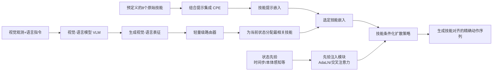

# Learning Diffusion Policy from Primitive Skills for Robot Manipulation

**相关性评分**: 7.0/10

**排名**: #38

---

## 基本信息

- **arXiv ID**: [2601.01948v1](https://arxiv.org/abs/2601.01948v1)
- **发布时间**: 2026-01-05T09:56:24Z
- **相关性评分**: 7.0/10
- **是否相关**: 是

## 作者

Zhihao Gu, Ming Yang, Difan Zou, Dong Xu

## 关键词

Vision-Language-Action Model, VLA for Robotics, Lightweight Architecture, Edge Deployment

## 一句话总结

该论文提出了一种基于技能条件的扩散策略（SDP），通过视觉语言模型提取离散表示，结合轻量级路由器网络实现机器人操作，与视觉-语言-动作模型和边缘部署相关，但未直接强调推理效率或加速。

## 摘要

Diffusion policies (DP) have recently shown great promise for generating actions in robotic manipulation. However, existing approaches often rely on global instructions to produce short-term control signals, which can result in misalignment in action generation. We conjecture that the primitive skills, referred to as fine-grained, short-horizon manipulations, such as ``move up'' and ``open the gripper'', provide a more intuitive and effective interface for robot learning. To bridge this gap, we propose SDP, a skill-conditioned DP that integrates interpretable skill learning with conditional action planning. SDP abstracts eight reusable primitive skills across tasks and employs a vision-language model to extract discrete representations from visual observations and language instructions. Based on them, a lightweight router network is designed to assign a desired primitive skill for each state, which helps construct a single-skill policy to generate skill-aligned actions. By decomposing complex tasks into a sequence of primitive skills and selecting a single-skill policy, SDP ensures skill-consistent behavior across diverse tasks. Extensive experiments on two challenging simulation benchmarks and real-world robot deployments demonstrate that SDP consistently outperforms SOTA methods, providing a new paradigm for skill-based robot learning with diffusion policies.

## 详细分析

## 论文摘要

**论文标题：** 从原始技能中学习扩散策略用于机器人操作

**研究背景和动机：**
在机器人操作领域，基于扩散模型（Diffusion Policy）的策略在动作生成方面展现出巨大潜力。然而，现有方法通常依赖**全局、高层级的语言指令**来生成**短期、细粒度的控制信号**，这种粒度上的不匹配容易导致动作生成出现偏差或模糊。作者认为，将复杂任务分解为一系列可解释、可复用的**原始技能**（Primitive Skills，如“向上移动”、“打开夹爪”），能为机器人学习提供更直观、更有效的接口。

**核心方法和技术创新：**
本文提出了**技能条件扩散策略**，其核心创新在于将可解释的技能学习与条件化的动作规划相结合：
1.  **技能抽象与分配**：从多样任务中抽象出8个可跨任务复用的原始技能。利用视觉语言模型从视觉观测和语言指令中提取特征，并通过一个轻量级的**路由器网络**为每个状态动态分配最合适的单一技能。
2.  **技能条件策略学习**：设计了一种**单技能扩散策略**。通过将分配到的技能嵌入动态参数化到扩散策略的FFN层中，建立了原始技能与底层控制信号之间的显式依赖关系，确保生成的动作与技能意图高度对齐。
3.  **组合提示集成**：设计了统一的文本模板和组合提示集成方法，将技能转化为具体的文本提示，增强了技能表示的明确性和可重用性。

**主要实验结果：**
在CALVIN和LIBERO两个具有挑战性的仿真基准测试以及真实机器人部署中进行了广泛评估：
*   **性能领先**：在CALVIN的ABC→D零样本泛化设置中，SDP在完成连续5个任务的成功率达到76.9%，显著超过之前的SOTA方法（如MoDE和UniVLA）。在LIBERO基准的所有四个测试套件（空间、物体、目标、长时程）上均达到最佳性能，平均成功率高达96.9%。
*   **真实世界验证**：在涉及空间感知、工具使用和语义理解的多任务学习，以及对未见物体和视觉干扰物的泛化测试中，SDP均表现出更强的鲁棒性和泛化能力。
*   **可解释性**：可视化分析表明，SDP能够自动将复杂任务分解为原始技能序列，并且生成的技能与观察到的机器人状态高度一致，验证了其决策过程的可解释性。

**研究意义和价值：**
本研究提出了一种将高层指令、可解释的中间技能与底层扩散策略生成相结合的新范式。它有效解决了指令与动作之间的粒度不匹配问题，通过引入结构化的技能空间，不仅提升了策略在复杂、长时程任务中的性能和泛化能力，还增强了机器人决策过程的透明度和可理解性，为基于技能的机器人学习提供了新的思路。

## 问答对

### 问题 1

**Q**: 这篇论文的核心创新点是什么，他想解决什么问题，怎么解决的？

**A**: ## 论文核心分析

### **一、 研究问题**
论文旨在解决**基于扩散模型的机器人策略中，高层指令与短期动作之间的粒度不匹配问题**。现有方法直接将抽象的语言指令（如“拿起柠檬放进锅里”）映射到低层控制信号，导致动作生成模糊、不精确，难以实现精准的短时程操作。

### **二、 核心创新点**
论文提出了 **SDP**，一个**基于技能的扩散策略**。其创新性体现在一个**三层解耦与融合**的框架上：

1.  **技能抽象与显式化**：
    - **问题**：现有方法（如VQ-VAE）隐式地学习技能表示，可解释性差。
    - **创新**：**显式地定义了8个可重用、可解释的原始技能**（如“移动向上”、“打开夹爪”、“旋转”等）。这些技能构成了一个结构化的、跨任务通用的动作空间。

2.  **动态技能路由**：
    - **问题**：如何根据当前状态和任务，动态选择最合适的技能？
    - **创新**：设计了一个**轻量级路由器网络**。它利用视觉-语言模型提取的观测和指令表征，为每个状态动态计算并分配一个最相关的原始技能。这使得任务执行过程对人类而言是**可解释、可追踪**的。

3.  **技能条件化的动作生成**：
    - **问题**：如何确保生成的低层动作与指定的技能严格对齐？
    - **创新**：提出了**单技能扩散策略**。通过一个**技能依赖的前馈网络层**，将分配到的技能嵌入动态地参数化策略网络。这建立了技能与底层控制信号之间的**显式依赖关系**，确保动作生成与技能意图一致。

### **三、 解决方案（技术路径）**
整体流程如图3所示，是一个端到端的“**感知-规划-执行**”闭环：

**关键技术细节**：
- **组合提示集成**：为每个技能设计统一的文本模板（如“机械臂即将{skill}”），并通过CLIP文本编码器生成可复用的技能嵌入。
- **参数合成**：受超网络启发，使用一个MLP根据技能嵌入动态生成FFN层的权重（`W_z1, W_z2`），实现高效的技能条件化。
- **训练目标**：在标准去噪分数匹配损失基础上，增加了**正交损失**，以鼓励不同技能嵌入之间的差异性，提升路由器的判别能力。

### **四、 实际价值与意义**
1.  **性能提升**：在CALVIN和LIBERO两大仿真基准测试及真实机器人实验中，SDP均显著超越现有SOTA方法，尤其在**长时程任务**和**零样本泛化**（如ABC→D）场景下优势明显。
2.  **可解释性与可控性**：通过显式的技能分配，人类可以理解机器人每一步在“想”做什么（如“现在在执行‘移动向上’技能”），便于调试和信任建立。
3.  **泛化与鲁棒性**：技能库的通用性使其能组合应对未见任务；实验表明其对**未见物体**和**视觉干扰物**具有更强的鲁棒性。
4.  **新范式**：为基于技能的机器人学习提供了一个将**高层任务规划**（通过VLM和路由器）与**低层鲁棒控制**（通过扩散模型）紧密结合的新范式。

**总结**：SDP的核心贡献在于**通过引入一个显式、可解释的原始技能层，作为高层指令与低层动作之间的“桥梁”**，并设计了一套完整的机制（路由+条件化生成）来利用这个桥梁，从而解决了指令-动作粒度失配的根本问题，实现了更精确、更可靠、更可理解的机器人操作。

### 问题 2

**Q**: 请用一段话总结这篇论文，明确说明：论文试图解决的核心问题；提出的主要方法或框架；最终取得的主要效果或结论。要求语言简洁、信息密度高，不要复述摘要原文。

**A**: 这篇论文针对现有扩散策略在机器人操作中直接将高层指令映射为短期动作，导致动作生成粒度不匹配、行为不精确的问题，提出了一种**基于技能条件的扩散策略（SDP）**。其核心方法是**将复杂任务分解为一组可解释、可复用的基础技能（如“移动”、“抓取”），并设计一个轻量级路由器网络，根据当前视觉-语言表征动态选择最合适的技能，进而利用该技能参数化扩散策略中的网络层，生成与技能严格对齐的精确动作序列**。实验表明，该方法在多个仿真基准测试和真实机器人部署中均显著超越了现有最优方法，在长视野任务、多任务学习和视觉泛化能力上表现出色，为基于技能的机器人学习提供了新的有效范式。

### 问题 3

**Q**: 这篇论文相对于已有工作有哪些明确的创新点？请逐条列出，并对每一条说明：相比以往方法改进或不同之处在哪里，以及该创新解决了什么具体问题或带来了什么优势。

**A**: ## 论文创新点分析

这篇论文《Learning Diffusion Policy from Primitive Skills for Robot Manipulation》提出了一种名为SDP（Skill-conditioned Diffusion Policy）的新方法。其核心创新在于将**可解释的、细粒度的技能学习**与**基于扩散模型的动作生成**相结合，以解决现有方法中高层指令与短期动作之间的粒度不匹配问题。以下是其相对于已有工作的明确创新点：

---

### 1. **引入可重用、可解释的原始技能（Primitive Skills）作为中间表示**
- **改进/不同之处**：
    - **以往方法**：大多数语言条件扩散策略（如DiffPolicy、MDT）直接将高层语言指令（如“拿起柠檬放入锅中”）映射到原始动作序列。这种映射过于抽象，缺乏对短期动作的明确指导。
    - **本文方法**：预先定义了**八个可重用的原始技能**（如“移动向上”、“打开夹爪”、“平移”等），作为连接高层指令与底层动作的**中间层**。这些技能是人类可理解的、细粒度的操作单元。
- **解决的问题/带来的优势**：
    - **解决指令-动作粒度不匹配**：高层指令通常描述长期目标，而机器人控制需要精确的短期信号。原始技能提供了具体的短期操作指导，减少了动作生成的歧义和对齐错误。
    - **提高可解释性**：技能是人类可理解的，使得策略决策过程更透明，便于调试和分析。
    - **增强可组合性与泛化性**：复杂任务可以被分解为这些原始技能的序列。这些技能在不同任务间可重用，提高了策略跨任务的泛化能力。

### 2. **设计轻量级路由器网络，实现基于状态的动态技能分配**
- **改进/不同之处**：
    - **以往方法**：一些工作（如SkillDiffuser）使用VQ-VAE等方法**隐式地**学习技能表示，技能是潜在空间中的离散代码，缺乏明确语义。另一些方法（如GSC）虽然显式参数化技能，但为每个技能训练独立模型，效率低。
    - **本文方法**：提出一个**轻量级路由器网络**。它接收来自视觉-语言模型（VLM）的观测和指令嵌入，为每个状态计算所有候选技能的重要性分数，并动态选择最合适的单一技能（`top-1`选择）。
- **解决的问题/带来的优势**：
    - **实现显式、动态的技能规划**：技能分配是显式的、基于当前状态感知的，而非固定的或隐式的。这使得策略能根据环境变化自适应选择技能。
    - **保持高效与统一**：所有技能在一个统一模型中学习，路由器网络参数少，相比训练多个独立策略更高效。
    - **提升动作对齐精度**：为每个状态分配最相关的技能，确保了生成的动作与该技能意图严格对齐。

### 3. **提出技能依赖的FFN层，构建技能与动作生成的强依赖关系**
- **改进/不同之处**：
    - **以往方法**：条件信息（如语言指令）通常通过交叉注意力（Cross-Attention）或特征拼接/相加等方式注入到扩散模型中。这些方式对细粒度技能的控制不够直接和紧密。
    - **本文方法**：设计了一个**技能依赖的前馈网络层**。该层类似于LoRA，其权重矩阵（`W_z1, W_z2`）由一个MLP根据当前分配的技能嵌入`z`动态生成。该层与原始FFN并行工作（见公式4）。
- **解决的问题/带来的优势**：
    - **建立技能-动作的强条件依赖**：技能信息直接参数化了策略网络的一部分，使动作生成过程与特定技能紧密耦合。这比简单的特征相加或拼接更能捕捉技能特有的控制模式。
    - **实现“单一技能策略”**：该设计实质上为每个时间步创建了一个针对当前技能的定制化策略模块，确保输出的动作序列与该技能要求高度一致。
    - **兼顾效率与性能**：采用低秩适配风格，在增加少量参数的情况下，显著提升了条件控制的效果。

### 4. **提出组合提示集成方法，提升技能嵌入质量**
- **改进/不同之处**：
    - **以往方法**：技能的文本描述可能单一，或未经过特殊设计，其嵌入表示可能区分度不够。
    - **本文方法**：设计了统一的文本模板（“the robot arm is going to {skill}.”），并对其进行**组合提示集成**，生成更丰富的技能提示嵌入。此外，在训练中引入了**正交损失**，以最大化不同技能嵌入之间的区分度。
- **解决的问题/带来的优势**：
    - **获得更具判别性的技能表示**：通过提示集成和正交约束，使得八个技能在嵌入空间中彼此分离，帮助路由器更准确地进行分类和选择。
    - **提升泛化与鲁棒性**：更好的技能表示有助于模型在未见过的任务或环境中仍能做出合理的技能分解。

### 5. **整体架构创新：端到端的技能条件扩散策略框架**
- **改进/不同之处**：
    - **以往范式**：要么是“指令 → 动作”的端到端映射（易失准），要么是“指令 → 子目标 → 动作”的两阶段规划（子目标标注成本高或隐式不可控）。
    - **本文整体框架**：构建了 **“观测/指令 → VLM → 路由器 → 技能分配 → 技能条件扩散模型 → 动作”** 的端到端训练框架。它**同时**完成了技能分解（规划）和技能执行（控制）。
- **解决的问题/带来的优势**：
    - **解决长期任务规划与短期精确控制的统一**：框架将高层任务理解、中层技能规划和底层动作生成无缝集成在一个模型中。
    - **实现卓越的性能**：在CALVIN和LIBERO等多个仿真基准测试及真实机器人实验中，SDP在**多任务学习、零样本泛化到新环境、长视野任务完成**等方面均显著超越现有SOTA方法（如MoDE、UniVLA）。
    - **提供机器人学习新范式**：展示了将**显式、可解释的技能抽象**与**强大的生成式动作模型**相结合的有效性，为基于技能的机器人学习提供了新思路。

---

**总结**：本文的核心创新在于**通过显式、可解释的原始技能桥接了高层指令与底层动作之间的语义鸿沟**。其技术贡献体现在**技能定义、动态分配机制、网络条件化方法**等多个层面，共同解决了现有扩散策略在机器人操控中存在的**指令模糊、动作失准、泛化能力有限**等关键问题，最终实现了更精确、更鲁棒、更可解释的机器人策略学习。

### 问题 4

**Q**: 论文在实验或评估中最终实现了怎样的效果？请说明使用了哪些数据集和评价指标，与哪些基线方法进行了对比，以及在关键指标上的主要性能提升或结论。如果论文未给出明确的定量结果，也请说明原因。

**A**: ## 论文实验与评估效果总结

该论文通过全面的实验，在模拟和真实机器人平台上验证了所提出的**技能条件扩散策略（SDP）** 的优越性能。其核心结论是：SDP通过引入可解释的原始技能作为中间层指导，显著提升了扩散策略在复杂、长视野任务中的执行精度、泛化能力和鲁棒性。

### 一、 使用的数据集与评价指标

1.  **模拟基准测试数据集**：
    *   **CALVIN**：包含34个不同任务，24,000条语言标注的演示数据。论文采用两种具有挑战性的评估设置：
        *   **ABCD → D**：在环境A、B、C、D上训练，在环境D上零样本评估。
        *   **ABC → D**：在环境A、B、C上训练，在未见过的环境D上零样本评估（更具挑战性）。
    *   **LIBERO**：包含四个任务套件，每个套件10个任务，每个任务50条演示。
        *   **LIBERO-Spatial**：测试空间关系理解。
        *   **LIBERO-Object**：测试对不同物体的操作。
        *   **LIBERO-Goal**：测试不同目标的操作。
        *   **LIBERO-Long**：测试长视野、复杂任务。

2.  **真实世界评估**：
    *   设计了**9个任务**，用于评估**多任务学习**（空间感知、工具使用、语义理解）和**视觉泛化**能力（操作未见过的物体、在复杂视觉干扰物下完成任务）。

3.  **主要评价指标**：
    *   **任务成功率**：在CALVIN和真实世界评估中，报告单个任务或任务链的成功率（%）。
    *   **平均连续任务完成长度**：在CALVIN中，评估机器人能连续成功完成多少个任务（1-5个），并计算平均长度。这是衡量长视野规划能力的关键指标。
    *   **消融实验中的性能对比**：通过移除或替换模型组件，验证各模块的有效性。
    *   **模型复杂度**：对比参数量（#Params）、浮点运算量（FLOPS）和推理时间（Infer. Time）。

### 二、 对比的基线方法

论文与当前最先进的多种策略进行了广泛对比，主要分为两类：

1.  **基于扩散的策略**：
    *   **DiffPolicy**：扩散策略的开创性工作。
    *   **Octo**：使用统一动作表示处理异构动作空间。
    *   **MDT**：利用扩散模型生成以多模态目标为条件的灵活动作序列。
    *   **MoDE**：结合稀疏专家和噪声条件自注意力机制，实现跨不同噪声水平的有效去噪。

2.  **视觉语言动作（VLA）策略**：
    *   **RoboFlamingo**：使用连续动作头预测的VLA模型。
    *   **GR-1**：通过预测未来帧和动作进行预训练。
    *   **OpenVLA**：在大规模数据集上预训练以实现通用机器人策略。
    *   **UniVLA**：从视频中推导任务中心化的动作表示。
    *   **MaIL, UniActions**：在LIBERO基准上的其他先进方法。

### 三、 关键性能提升与结论

1.  **在CALVIN基准上的卓越表现**：
    *   **ABC → D 设置（最具挑战性）**：SDP在完成**5个连续任务**的成功率达到 **76.9%**，显著超越了之前最好的方法MoDE（62.4%）和UniVLA（56.5%）。平均连续任务完成长度达到 **4.49**，远高于其他方法（如UniVLA的3.80），证明了其强大的**零样本泛化**和**长视野任务规划**能力。
    *   **ABCD → D 设置**：SDP同样取得最佳成绩，5任务成功率达 **86.5%**，平均长度 **4.67**，全面优于MDT、MoDE等基线。

2.  **在LIBERO基准上的全面领先**：
    *   SDP在全部四个套件上均取得最高成功率，**平均成功率高达96.9%**。
    *   尤其在最具挑战性的**LIBERO-Long**套件上，SDP成功率 **93.8%**，是**唯一超过90%** 的策略，而其他通用方法（如OpenVLA 53.7%）在此类复杂长视野任务上表现挣扎。这凸显了SDP技能分解机制在处理复杂任务序列时的优势。

3.  **真实世界机器人部署的有效性**：
    *   **多任务学习**：在6个设计任务上，SDP的成功率**全面且显著高于**MoDE和OpenVLA，特别是在“打开微波炉放入薯片”、“倒水”等复杂任务上优势明显。
    *   **视觉泛化**：
        *   对于**形状相似**的未见物体（苹果），SDP能成功操作（成功率75%），而基线方法失败，证明了其基于技能的泛化能力。
        *   对于**形状差异大**的未见物体（香蕉），所有方法性能均下降，表明泛化仍存在挑战。
        *   在存在**复杂视觉干扰物**的场景中，SDP性能仅从75%小幅下降至65%，而基线方法性能崩溃，证明了SDP基于技能决策的**强鲁棒性**。

4.  **消融实验验证设计有效性**：
    *   逐步添加**交叉注意力**、**先验注入（AdaLN）**、**技能抽象**和**组合提示集成（CPE）** 等组件，性能持续显著提升（见表3a），证明了每个模块的必要性。
    *   对比不同的技能条件化策略（加法、拼接、FiLM），论文提出的**参数化FFN层（公式4）** 效果最佳（见表3b），验证了其建立技能与底层控制信号依赖关系的有效性。

5.  **效率与性能的权衡**：
    *   虽然SDP的模型参数量（1017M）和计算量高于部分基线（如DiffPolicy的286M），但其带来的性能提升是巨大的。在推理时间上仅增加了约14.6毫秒（从MoDE的30.5ms到45.1ms），在机器人控制的可接受范围内，实现了**性能与效率的有利权衡**。

**总结**：论文通过严格的实验证明，SDP通过引入**可解释的原始技能**作为高层指令与底层动作之间的桥梁，有效解决了传统扩散策略中存在的“粒度不匹配”问题。其在多个模拟基准和真实机器人任务中均取得了**新的最先进性能**，特别是在**长视野任务、零样本泛化到新环境、以及对视觉干扰的鲁棒性**方面表现突出。可视化分析进一步证实了其技能分配的合理性和模型的可解释性。

## 相关链接

- [arXiv 页面](https://arxiv.org/abs/2601.01948v1)
- [HTML 版本](https://arxiv.org/html/2601.01948v1)
