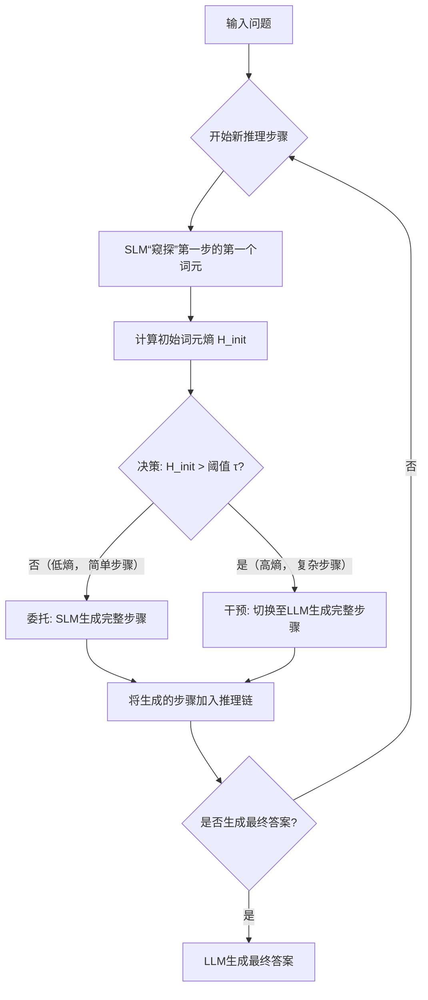

# GlimpRouter: Efficient Collaborative Inference by Glimpsing One Token of Thoughts

**相关性评分**: 8.0/10

**排名**: #8

---

## 基本信息

- **arXiv ID**: [2601.05110v1](https://arxiv.org/abs/2601.05110v1)
- **发布时间**: 2026-01-08T16:58:07Z
- **相关性评分**: 8.0/10
- **是否相关**: 是

## 作者

Wenhao Zeng, Xuteng Zhang, Yuling Shi, Chao Hu, Yuting Chen, Beijun Shen, Xiaodong Gu

## 关键词

Inference Efficiency, Lightweight Architecture, Inference Acceleration, Edge Deployment

## 一句话总结

GlimpRouter 是一种无需训练的协作推理框架，通过分析推理步骤的第一个令牌的熵来预测难度，从而在轻量级和大模型之间动态分配计算，显著提升推理效率并保持准确性。

## 摘要

Large Reasoning Models (LRMs) achieve remarkable performance by explicitly generating multi-step chains of thought, but this capability incurs substantial inference latency and computational cost. Collaborative inference offers a promising solution by selectively allocating work between lightweight and large models, yet a fundamental challenge remains: determining when a reasoning step requires the capacity of a large model or the efficiency of a small model. Existing routing strategies either rely on local token probabilities or post-hoc verification, introducing significant inference overhead. In this work, we propose a novel perspective on step-wise collaboration: the difficulty of a reasoning step can be inferred from its very first token. Inspired by the "Aha Moment" phenomenon in LRMs, we show that the entropy of the initial token serves as a strong predictor of step difficulty. Building on this insight, we introduce GlimpRouter, a training-free step-wise collaboration framework. GlimpRouter employs a lightweight model to generate only the first token of each reasoning step and routes the step to a larger model only when the initial token entropy exceeds a threshold. Experiments on multiple benchmarks demonstrate that our approach significantly reduces inference latency while preserving accuracy. For instance, GlimpRouter attains a substantial 10.7% improvement in accuracy while reducing inference latency by 25.9% compared to a standalone large model on AIME25. These results suggest a simple yet effective mechanism for reasoning: allocating computation based on a glimpse of thought rather than full-step evaluation.

## 详细分析

## 论文摘要：GlimpRouter: 通过“一瞥”思维实现高效协同推理

### 1. 研究背景和动机
大型推理模型通过生成多步思维链取得了卓越性能，但这也带来了显著的推理延迟和计算成本。协同推理通过在轻量级模型和大型模型之间选择性分配工作来缓解这一问题，但一个根本挑战在于：如何判断一个推理步骤是需要大型模型的能力，还是小型模型的效率即可胜任。现有的路由策略要么依赖局部令牌概率，要么依赖事后验证，都引入了显著的推理开销。

### 2. 核心方法和技术创新
本文提出了一种新颖的视角：**推理步骤的难度可以从其第一个令牌推断出来**。受大型推理模型中“顿悟时刻”现象的启发，研究发现初始令牌的熵是步骤难度的强预测指标。基于此，提出了 **GlimpRouter**，一个无需训练的、基于步骤的协同推理框架。其核心创新在于 **“探测-再调度”机制**：在每个推理步骤开始时，仅使用轻量级模型生成该步骤的第一个令牌，并计算其熵值。若熵值低于预设阈值，则认为该步骤是常规的，由小模型完成；若熵值较高，则表明该步骤是关键的认知转折点，立即将上下文切换给大模型处理。这种方法仅需“一瞥”思维，即可做出路由决策，开销极低。

### 3. 主要实验结果
在数学推理、通用推理和代码生成等多个基准测试上的实验表明，GlimpRouter 在效率和性能之间取得了优越的权衡。例如，在 AIME25 基准上，与单独使用大型模型相比，GlimpRouter 在**准确率提升 10.7% 的同时，推理延迟降低了 25.9%**。研究还表明，GlimpRouter 的步骤级路由策略与令牌级推测解码技术是正交的，二者结合可实现互补的复合加速效果。

### 4. 研究意义和价值
GlimpRouter 为部署高效的大型推理模型提供了一个简单而实用的解决方案。其价值在于：
*   **高效性**：通过极低开销的初始令牌探测，避免了生成整个步骤后再验证的“沉没成本”，实现了显著的延迟降低。
*   **有效性**：不仅保持了推理质量，在某些情况下甚至通过大模型的**隐式自我纠正能力**提升了最终答案的准确性。
*   **通用性**：该方法无需训练，且与底层模型加速技术兼容，为动态计算分配和高效推理开辟了新的研究方向。

## 问答对

### 问题 1

**Q**: 这篇论文的核心创新点是什么，他想解决什么问题，怎么解决的？

**A**: ## 论文核心分析：GlimpRouter

### **一、 论文旨在解决的核心问题**
大型推理模型（LRMs）通过生成多步思维链（Chain-of-Thought）取得了卓越性能，但这也带来了**极高的推理延迟和计算成本**，严重限制了其在延迟敏感和资源受限场景下的实用性。

**现有协作推理方案的瓶颈：**
- **词元级方法**（如推测解码）：依赖局部词元概率，模型切换频繁，开销大。
- **步骤级方法**（如后验验证）：需要生成完整推理步骤后才能评估其难度，再进行路由决策，产生了巨大的“沉没成本”。

**根本挑战**：如何在推理步骤的**最开始**，就以极低的成本准确判断该步骤的难度，从而在轻量模型（SLM）和大型模型（LLM）之间做出最优的分配决策？

### **二、 核心创新点**
论文提出了一个名为 **GlimpRouter** 的**免训练、步骤级协作推理框架**。其核心创新在于一个新颖的视角和一种高效的实现机制：

1. **核心洞察（理论创新）**：
   - 发现推理步骤的难度信息高度集中在**第一个词元**上。
   - 受LRMs中“顿悟时刻”现象的启发，提出并验证了 **“初始词元熵”** 是步骤难度的强预测指标。高熵意味着步骤处于关键的认知转折点（复杂推理），低熵则对应常规推导。

2. **关键技术机制（方法创新）**：
   - **“窥探-后分发”机制**：在每个推理步骤开始时，仅用轻量模型（SLM）生成该步骤的**第一个词元**，并计算其熵值。
   - **基于熵的动态路由**：若熵值低于阈值 `τ`，则认为步骤简单，由SLM完成剩余生成；若高于阈值，则立即将上下文切换给LLM来生成整个步骤。
   - **层级加速**：GlimpRouter的步骤级路由与词元级推测解码技术正交，可以结合使用，实现“全局规划”与“局部执行”的复合加速。

### **三、 解决方案的详细阐述**
GlimpRouter的工作流程如下：

**关键优势**：
- **极低决策开销**：仅需生成1个词元即可做出路由决策，避免了生成整个无效步骤的“沉没成本”。
- **隐含纠错能力**：当LLM被调用处理高熵步骤时，它不仅完成生成，还能重新评估上下文，**纠正之前步骤可能累积的逻辑偏差**，这甚至使得协作系统的准确率可能超过单独的LLM。
- **训练免费与高效切换**：无需训练任何路由器或奖励模型；利用KV缓存等技术，模型间切换开销极低。

### **四、 实际价值与实验效果**
论文在数学推理（AIME）、通用推理（GPQA）和代码生成（LiveCodeBench）等多个基准上进行了验证，结果表明GlimpRouter在**效率与性能的权衡上建立了更优的帕累托前沿**。

**代表性结果**（以DeepSeek-R1-32B为LLM， Qwen3-4B为SLM）：
- **在AIME25上**：相比单独使用LLM， **准确率提升10.7%（46.67% → 51.67%）**，同时**推理延迟降低25.9%（220秒 → 163秒）**。
- **超越现有基线**：在相同或更高准确率下，延迟显著低于SpecReason、SpecCoT等步骤级协作方法。
- **复合加速**：与推测解码结合后，在AIME25上延迟进一步降至130秒，展示了其作为“全局规划器”与底层加速技术良好的正交性。

### **五、 总结**
GlimpRouter通过一个简单而深刻的洞察——**“一瞥见全局”**，革新了协作推理的范式。它将路由决策的时机从“事后验证”提前到“事前窥探”，从根本上消除了现有方法的主要开销来源。这项工作不仅为部署高效的大型推理模型提供了一个实用的解决方案，也为理解模型内部的推理动态提供了新的视角。其**免训练、低开销、能纠错**的特性，使其具有很高的实际应用价值。

### 问题 2

**Q**: 请用一段话总结这篇论文，明确说明：论文试图解决的核心问题；提出的主要方法或框架；最终取得的主要效果或结论。要求语言简洁、信息密度高，不要复述摘要原文。

**A**: 这篇论文旨在解决大型推理模型（LRMs）因生成多步思维链而导致的高推理延迟和计算成本问题。核心挑战在于如何高效地在轻量级模型和大模型之间分配推理步骤。论文提出了 **GlimpRouter** 框架，其核心创新在于发现并利用推理步骤的第一个令牌的熵（**𝐇_init**）作为该步骤难度的强预测指标。基于此，GlimpRouter 采用了一种免训练的“窥探-调度”机制：在每一步开始时，先用小模型生成第一个令牌并计算其熵；若熵低于阈值，则由小模型完成该步骤；若熵高（表明是复杂的“顿悟时刻”），则切换到大模型处理。实验表明，该方法在多个推理基准测试上，能在保持甚至提升准确率的同时，显著降低推理延迟（例如在AIME25上，准确率提升10.7%，延迟降低25.9%），实现了效率与性能的优越权衡。

### 问题 3

**Q**: 这篇论文相对于已有工作有哪些明确的创新点？请逐条列出，并对每一条说明：相比以往方法改进或不同之处在哪里，以及该创新解决了什么具体问题或带来了什么优势。

**A**: ## GlimpRouter 论文创新点分析

这篇论文提出了一种新颖的协作推理框架 **GlimpRouter**，其核心创新在于通过“瞥见”推理步骤的第一个令牌来预测其难度，并据此动态分配计算资源。以下是其相对于已有工作的明确创新点：

### 1. **基于“初始令牌熵”的难度预测机制**
   - **改进/不同之处**：
     - **以往方法**：现有的协作推理方法（如 SpecReason、RSD）通常依赖**事后验证**（生成完整步骤后由大模型评判）或**步骤级平均不确定性指标**（如平均困惑度或熵）。这些方法要么引入显著的验证开销，要么因“信号稀释”效应（关键决策令牌的信号被大量语法令牌平均掉）而无法准确区分难度。
     - **GlimpRouter**：提出**仅使用推理步骤的第一个令牌的熵（𝐇init）** 作为难度预测器。论文通过实证分析发现，𝐇init 呈现**双峰分布**，能清晰区分“常规推导”（低熵）和“关键认知转折”（高熵），而步骤级平均指标（𝐇step、𝐏𝐏𝐋step）则呈单峰分布，区分度差。
   - **解决的问题/优势**：
     - **解决了“信号稀释”问题**：聚焦于推理步骤起始的“认知支点”（如“Wait”、“But”、“So”等话语线索），捕获了步骤难度的本质信号。
     - **实现了“探针-调度”范式**：仅需生成一个令牌即可做出路由决策，**避免了生成完整无效草稿步骤的沉没成本**，决策开销极低（约1个令牌的解码成本）。
     - **训练免费**：无需训练专门的难度预测器或奖励模型，直接利用模型内部置信度（熵）作为信号，简单易部署。

### 2. **“探针-调度”的步级协作框架**
   - **改进/不同之处**：
     - **以往方法**：主流步级协作框架（如 SpecCoT、SpecReason）遵循 **“生成-后验证”** 流程。小模型先生成完整步骤（或多个候选），再由大模型验证或选择。这导致**即使步骤被拒绝，小模型的生成成本也已完全沉没**。
     - **GlimpRouter**：提出 **“探针-调度”** 流程。在每个推理步骤开始时，小模型仅生成第一个令牌并计算其熵。基于阈值 𝜏 立即决定由小模型继续生成（委托）还是切换到大模型生成（干预）。**决策先于完整生成**。
   - **解决的问题/优势**：
     - **极大降低了路由决策开销**：将路由决策的开销从“生成整个步骤（L≫1 个令牌）”降低到“生成1个令牌”，显著提升了协作效率。
     - **避免了沉没成本**：对于被判定为困难的步骤，直接交由大模型生成，避免了小模型生成无效草稿的完全浪费。
     - **建立了更优的帕累托前沿**：如图4和表5所示，在相同准确率下，GlimpRouter 的延迟远低于基于事后验证的 SpecReason，证明了其效率优势。

### 3. **利用大模型的隐式自我纠正能力提升准确性**
   - **改进/不同之处**：
     - **以往方法**：大多数协作框架的目标是**在保持大模型准确率的同时提升速度**，或最多做到不损失准确率。它们通常将大模型视为一个更可靠的“完成者”或“验证者”。
     - **GlimpRouter**：论文发现并利用了大型推理模型（LRM）的**隐式自我纠正能力**。当初始令牌熵高时，往往意味着前序推理轨迹中积累了潜在的不一致或逻辑漂移。此时切换到大模型，**大模型不仅仅是继续生成文本，而是会重新评估上下文并纠正之前的逻辑错误**（见附录F案例研究）。
   - **解决的问题/优势**：
     - **实现了准确率的超越**：如表1所示，GlimpRouter 在多个基准测试（如 AIME25）上**准确率甚至超过了单独使用大模型**（51.67% vs. 46.67%）。这是协作推理中一个反直觉但强有力的结果。
     - **将路由机制从“效率工具”提升为“质量增强器”**：干预机制不仅分配计算资源，还充当了**动态的质量检查与修正点**，提升了整体推理链的鲁棒性。

### 4. **与词元级加速技术的正交性与层次化加速**
   - **改进/不同之处**：
     - **以往方法**：步级协作和词元级加速（如推测解码）通常是独立研究或相互竞争的范式。
     - **GlimpRouter**：明确提出了**层次化加速策略**，将两者结合：
       1.  **步级（GlimpRouter）**：作为全局规划器，将常规逻辑步骤分配给 SLM，避免调用昂贵的 LLM。
       2.  **词元级（推测解码）**：当必须调用 LLM 时，使用 SLM 作为草案模型，加速 LLM 自身的生成过程。
   - **解决的问题/优势**：
     - **实现了复合加速**：如表3和表7所示，`GlimpRouter + 推测解码` 实现了最低的端到端延迟。两种技术从不同粒度（步级和词元级）攻击效率瓶颈，产生**乘数效应**。
     - **证明了框架的兼容性与扩展性**：GlimpRouter 的步级路由设计与底层词元级优化是正交的，可以轻松集成现有及未来的低层加速技术，为系统级优化提供了灵活框架。

### 5. **对“初始令牌信息浓度”的实证分析与理论支撑**
   - **改进/不同之处**：
     - **以往方法**：对于“如何衡量推理步骤难度”缺乏深入的数据分析和可解释的理论洞察。大多依赖启发式或训练得到的指标。
     - **GlimpRouter**：论文第2节进行了系统的**实证研究**，分析了超过1000万令牌的推理步骤，通过分布图（图1）和相关性分析（图2）证明了：
       - 𝐇init 具有独特的双峰重尾分布，是有效的区分信号。
       - 𝐇init 与大小模型输出对齐度（BLEU, SBERT）呈严格单调负相关，验证了其作为路由预测器的可靠性。
   - **解决的问题/优势**：
     - **为方法提供了坚实的经验基础**：创新点不是纯粹的架构设计，而是源于对模型推理过程中不确定性分布的深刻观察。
     - **提出了“信号稀释”假设**：解释了为何步骤级平均指标效果不佳，从而反衬出聚焦初始令牌的科学性。
     - **增强了工作的可信度和可解释性**：使“瞥见一个令牌”这一简单想法背后的原理变得清晰且有数据支持。

### 总结
GlimpRouter 的核心创新在于将 **“认知支点”理论**（推理难度集中在步骤开头）转化为一个**极简、高效、且功能强大的工程机制**。它通过 **“一个令牌的熵”** 这一巧妙代理，一举解决了现有协作推理中**决策开销大**和**信号不精准**两大核心问题，同时意外地通过大模型的自我纠正能力**提升了最终答案的质量**。其与底层加速技术的正交性设计，使其成为一个实用的、可部署的高效推理系统核心组件。

### 问题 4

**Q**: 论文在实验或评估中最终实现了怎样的效果？请说明使用了哪些数据集和评价指标，与哪些基线方法进行了对比，以及在关键指标上的主要性能提升或结论。如果论文未给出明确的定量结果，也请说明原因。

**A**: ## 论文实验与评估效果分析

### 一、 实验数据集与评价指标

#### 1. 数据集
论文在三个复杂推理任务上进行了评估：
- **数学推理**：AIME24 和 AIME25（美国数学邀请赛题目）。
- **通用推理**：GPQA-Diamond（专家编写的生物学、物理学、化学多选难题）。
- **代码生成**：LiveCodeBench v5 和 v6（解决竞争性编程问题）。

#### 2. 评价指标
- **准确性**：Pass@1（首次尝试正确解决问题的百分比）。
- **效率**：**平均延迟**（每个问题的端到端墙钟时间，单位：秒），作为推理效率的主要指标。

### 二、 基线方法对比
论文将 **GlimpRouter** 与以下方法进行了全面对比：

1.  **独立模型**：
    - **SLM only**：仅使用小型模型（Qwen3-4B）。
    - **LLM only**：仅使用大型模型（DeepSeek-R1-Distill-Qwen-32B 或 Qwen3-32B）。

2.  **协作推理基线**：
    - **Random**：使用随机分数（0-9）选择由哪个模型进行推理。
    - **RSD**：使用训练好的过程奖励模型评估步骤质量，决定是否调用大模型。
    - **SpecCoT**：小模型并行生成多个候选推理步骤，大模型作为判别器选择最优步骤。
    - **SpecReason**：小模型生成步骤，大模型作为“法官”进行验证；若拒绝，则回退到大模型生成。

### 三、 关键性能提升与结论

#### 1. 主要性能结果（基于表1）
在默认配置（SLM: Qwen3-4B, LLM: DeepSeek-R1-Distill-Qwen-32B）下，GlimpRouter 在所有基准测试中均实现了 **最优的准确性与延迟权衡**。

**核心结论**：
- **同时提升准确性并降低延迟**：与仅使用大模型相比，GlimpRouter 在保持甚至提升准确性的同时，显著降低了端到端延迟。
- **关键数据示例（AIME25）**：
    - **准确性**：达到 **51.67%**，相比大模型基线（46.67%）**相对提升 10.7%**。
    - **延迟**：降至 **163秒**，相比大模型基线（220秒）**降低 25.9%**。
- **效率优势**：相比其他协作方法（如 SpecReason），GlimpRouter 的延迟显著更低。例如在 GPQA 任务上，SpecReason 的延迟（213秒）甚至超过了单独使用大模型（176秒），而 GlimpRouter 仅为 129秒。

#### 2. 性能优势归因
- **“先探测再分发”机制**：仅基于**第一个令牌的熵**做出路由决策，避免了生成整个步骤再进行验证的“沉没成本”。
- **大模型的自我纠正能力**：当初始令牌熵高（表示认知转折点）时，调用大模型不仅能完成生成，还能**隐式地重新评估上下文并纠正之前累积的逻辑偏差**，从而可能获得比单独使用大模型更高的准确性。

#### 3. 消融与分析验证
- **指标有效性**：与使用步骤平均熵或困惑度的变体相比，使用初始令牌熵的 GlimpRouter 在准确性和延迟上均有显著优势（例如在 AIME25 上，准确性领先 10.7%，延迟更低），验证了“信号稀释”假说。
- **阈值敏感性**：通过调整熵阈值 τ 可以平滑地权衡准确性与延迟，GlimpRouter 的帕累托前沿始终优于 SpecReason。
- **正交加速**：GlimpRouter 可以与**推测解码**正交结合，实现复合加速。结合后，在 AIME25 上延迟进一步降至 130秒，同时保持 51.67% 的准确性。

#### 4. 可扩展性验证
- **模型配对**：在另一组配对（SLM: DeepSeek-R1-Distill-Qwen-1.5B, LLM: DeepSeek-R1-Distill-Qwen-32B）中，GlimpRouter 同样展现出优越的权衡性能，证明了其机制在不同模型家族间的鲁棒性。

### 总结
GlimpRouter 通过一种**无需训练、基于初始令牌熵的步骤级协作推理框架**，在多个复杂的推理基准测试上，**同时实现了显著的延迟降低（最高达~27%）和准确性提升（相对提升最高达10.7%）**。其核心创新在于利用推理步骤起始点的“一瞥”来高效预测步骤难度，从而动态分配计算资源，在效率和性能之间建立了新的最优平衡。

## 相关链接

- [arXiv 页面](https://arxiv.org/abs/2601.05110v1)
- [HTML 版本](https://arxiv.org/html/2601.05110v1)
