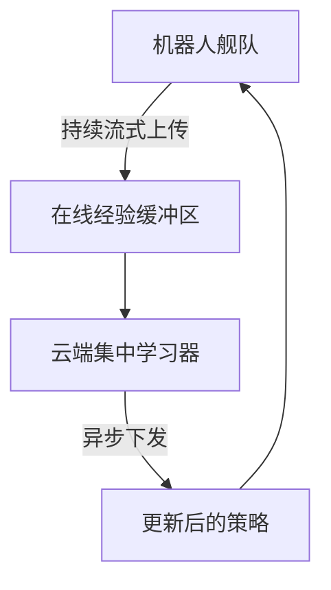

# SOP: A Scalable Online Post-Training System for Vision-Language-Action Models

**相关性评分**: 9.0/10

**排名**: #3

---

## 基本信息

- **arXiv ID**: [2601.03044v1](https://arxiv.org/abs/2601.03044v1)
- **发布时间**: 2026-01-06T14:25:11Z
- **相关性评分**: 9.0/10
- **是否相关**: 是

## 作者

Mingjie Pan, Siyuan Feng, Qinglin Zhang, Xinchen Li, Jianheng Song, Chendi Qu, Yi Wang, Chuankang Li, Ziyu Xiong, Zhi Chen, Yi Liu, Jianlan Luo

## 关键词

Vision-Language-Action Model, VLA for Robotics, Inference Efficiency, Lightweight Architecture, Inference Acceleration, Edge Deployment

## 一句话总结

SOP系统通过在线、分布式、多任务的后训练方法，提升视觉-语言-动作模型在机器人任务中的性能和可扩展性，支持边缘部署和高效推理。

## 摘要

Vision-language-action (VLA) models achieve strong generalization through large-scale pre-training, but real-world deployment requires expert-level task proficiency in addition to broad generality. Existing post-training approaches for VLA models are typically offline, single-robot, or task-specific, limiting effective on-policy adaptation and scalable learning from real-world interaction. We introduce a Scalable Online Post-training (SOP) system that enables online, distributed, multi-task post-training of generalist VLA models directly in the physical world. SOP tightly couples execution and learning through a closed-loop architecture in which a fleet of robots continuously streams on-policy experience and human intervention signals to a centralized cloud learner, and asynchronously receives updated policies. This design supports prompt on-policy correction, scales experience collection through parallel deployment, and preserves generality during adaptation. SOP is agnostic to the choice of post-training algorithm; we instantiate it with both interactive imitation learning (HG-DAgger) and reinforcement learning (RECAP). Across a range of real-world manipulation tasks including cloth folding, box assembly, and grocery restocking, we show that SOP substantially improves the performance of large pretrained VLA models while maintaining a single shared policy across tasks. Effective post-training can be achieved within hours of real-world interaction, and performance scales near-linearly with the number of robots in the fleet. These results suggest that tightly coupling online learning with fleet-scale deployment is instrumental to enabling efficient, reliable, and scalable post-training of generalist robot policies in the physical world.

## 详细分析

## 论文《SOP：一种用于视觉-语言-动作模型的可扩展在线后训练系统》详细摘要

### 1. 研究背景和动机
通用机器人部署不仅需要广泛的泛化能力，还要求具备专家级的任务熟练度。现有的视觉-语言-动作模型通过大规模预训练获得了强大的泛化能力，但其后训练方法通常是**离线、单机器人或任务特定**的，这限制了有效的在线策略适应和从真实世界交互中进行可扩展学习。因此，亟需一种能够支持**在线、分布式、多任务**后训练的系统框架。

### 2. 核心方法和技术创新
本文提出了**可扩展在线后训练系统**。其核心创新在于一个**紧密耦合执行与学习的闭环架构**：
- **系统架构**：一个机器人舰队持续将**在线策略经验**和**人工干预信号**流式传输到集中的云端学习器，并异步接收更新后的策略，形成一个低延迟的“收集-训练-部署”循环。
- **算法无关性**：SOP是一个系统级框架，可与多种后训练算法（如交互式模仿学习HG-DAgger和强化学习RECAP）结合，将其升级为在线、分布式版本。
- **关键技术**：设计了**分布式数据基础设施**以实现弹性扩展和容错，并采用了**任务平衡的自适应采样策略**，在加速适应新数据的同时保持多任务覆盖。

### 3. 主要实验结果
在包括**衣物折叠、纸箱组装、货架补货**在内的多种真实世界操作任务上进行了评估：
- **性能提升**：SOP显著提升了预训练VLA模型的性能。结合HG-DAgger时，在多个任务上实现了**2倍或更高的成功率提升**，部分任务接近完美性能。
- **可扩展性**：性能随舰队规模**接近线性增长**。将机器人数量从1台增至4台，达到目标性能所需的墙上时钟时间减少了约2.4倍。
- **数据效率**：仅需**数小时的实时世界交互**即可实现有效后训练，其边际效用远高于增加同等时长的静态离线演示数据。
- **保持通用性**：使用**单一共享策略**在所有任务上进行联合后训练，成功率的提升并未以牺牲模型的通用性为代价。

### 4. 研究意义和价值
SOP首次实现了在物理世界中对通用VLA模型进行**在线、分布式、多任务后训练**的系统框架。其价值在于：
- **系统贡献**：证明了**紧密耦合部署与学习的系统级设计**对于后训练成功至关重要，其价值不亚于算法本身的改进。
- **实践路径**：为通过**机器人舰队共享经验**来实现可扩展的机器人学习提供了一条切实可行的路径。将机器人部署规模扩大，可视为一种为学习“扩展算力”的形式。
- **未来方向**：推动了朝着由机器人舰队共同维护、通过部署经验持续进化的共享策略这一愿景迈进，为构建高效、可靠、可扩展的通用机器人策略奠定了基础。

## 问答对

### 问题 1

**Q**: 这篇论文的核心创新点是什么，他想解决什么问题，怎么解决的？

**A**: ## 论文核心分析：SOP系统

### **论文拟解决的核心问题**
当前视觉-语言-动作（VLA）模型在**现实世界机器人部署**中面临一个关键矛盾：
- **广度 vs. 深度**：大规模预训练赋予了模型广泛的**通用性**（能处理多种任务），但缺乏在**特定任务**上达到专家级的**熟练度**。
- **现有方法的局限**：现有的VLA后训练方法通常是**离线的、单机器人的、任务特定的**。这导致了：
    1.  **策略-数据失配**：离线训练存在分布偏移，小错误在长时程任务中会累积。
    2.  **学习效率低下**：单机器人数据收集限制了经验多样性和学习速度。
    3.  **牺牲通用性**：针对特定任务微调会损害模型的广泛适应能力。

### **核心创新点：SOP系统**
论文提出了 **“可扩展的在线后训练”（Scalable Online Post-training, SOP）系统**，这是一个**系统级框架**创新，而非单纯的算法创新。

**1. 核心架构创新：执行与学习的紧耦合闭环**

- **关键设计**：将分布在物理世界中的机器人舰队（**执行者**）与一个集中的云端**学习器**通过低延迟数据流紧密连接。
- **工作流程**：机器人持续执行最新策略，将**在线轨迹**（包括自主运行和**人工干预信号**）流式上传至云端；云端学习器混合在线/离线数据，异步更新策略并广播回所有机器人。

**2. 三大核心特性**
- **在线与即时性**：支持**即时、在策略的纠正**。人类干预能直接纠正当前策略的失败模式，并快速反馈到模型更新中，极大缓解分布偏移。
- **分布式与可扩展**：通过**并行机器人舰队**收集经验，实现了**近线性 scaling**。增加机器人数量能几乎按比例减少达到目标性能所需的墙钟时间。
- **多任务与通用性保持**：使用**任务平衡的自适应采样策略**，在联合后训练多个任务的同时，确保一个**共享的通用策略**不会过度偏向某个任务，从而保持泛化能力。

**3. 算法无关性**
- SOP是一个**系统框架**，与具体的后训练算法解耦。论文实例化了两种算法：
    - **HG-DAgger**（交互式模仿学习）：利用人类实时干预提供纠正监督。
    - **RECAP**（强化学习）：将原本离线的RL方法转变为在线流程。
- 这表明SOP的核心价值在于**为现有算法提供了一个高效、可扩展的“运行环境”**。

### **解决方案的实施与验证**
**1. 如何实现？**
- **分布式数据基础设施**：设计了包含边缘客户端、对象存储、消息队列和云学习器的健壮架构，支持弹性扩展和容错。
- **自适应采样策略**：根据在线/离线数据的近期损失动态调整采样比例，优先学习当前策略表现不佳的部分，加速适应。

**2. 验证结果**
在**布料折叠、纸箱组装、货架补货**三个真实的机器人操作任务族上验证：
- **性能大幅提升**：SOP + HG-DAgger将成功率提升至0.94-0.98，相比非SOP方法通常有**2倍或更高**的吞吐量提升。
- **高效学习**：仅需**数小时**的真实世界交互即可实现有效后训练，而非传统的多日周期。
- **线性扩展**：机器人数量从1台增加到4台，达到目标性能的时间缩短了约**2.4倍**。
- **长期稳定性**：在长达36小时的连续运行中未出现性能退化。

### **实际价值与意义**
1.  **为通用机器人学习提供新范式**：将机器人舰队部署本身转化为一种“学习计算”的扩展方式，**规模化部署与算法进步同等重要**。
2.  **打通从预训练到部署的最后一公里**：使强大的通用VLA模型能够快速、经济地适应具体的现实世界场景，并达到可靠、专业的性能水平。
3.  **系统先行的思路**：证明了在机器人学习领域，一个设计精良的**系统框架**可以释放和放大现有算法的潜力，是推动进展的关键互补因素。

**总结**：SOP的核心创新在于构建了一个**紧耦合的在线分布式系统框架**，它通过**规模化机器人部署与即时反馈的闭环**，高效地解决了通用VLA模型在现实世界中追求**专家级熟练度**的难题，同时保持了其宝贵的**通用性**。

### 问题 2

**Q**: 请用一段话总结这篇论文，明确说明：论文试图解决的核心问题；提出的主要方法或框架；最终取得的主要效果或结论。要求语言简洁、信息密度高，不要复述摘要原文。

**A**: 这篇论文针对现有视觉-语言-动作模型在真实世界部署中面临的**核心问题**——即离线、单机器人、任务特定的后训练方式无法实现高效、可扩展的在线策略适应——提出了一个名为**SOP**的可扩展在线后训练系统框架。该框架的核心创新在于构建了一个**紧密耦合执行与学习的闭环架构**：一个机器人舰队持续将在线策略经验流式传输至中央云学习器，并异步接收更新后的策略，从而实现了分布式、多任务的在线后训练。实验表明，SOP能**在数小时的真实交互内显著提升预训练VLA模型在多项复杂操作任务上的性能**，且性能提升与舰队规模呈近线性扩展，同时保持了单一通用策略的多任务泛化能力，证明了将舰队规模部署与在线学习相结合是实现机器人策略高效、可靠后训练的关键。

### 问题 3

**Q**: 这篇论文相对于已有工作有哪些明确的创新点？请逐条列出，并对每一条说明：相比以往方法改进或不同之处在哪里，以及该创新解决了什么具体问题或带来了什么优势。

**A**: ## SOP论文的核心创新点分析

这篇论文提出的SOP系统在机器人学习领域，特别是在视觉-语言-动作模型的部署后训练方面，做出了多项明确的系统性创新。其核心在于**将算法创新与系统工程紧密结合**，解决了现有方法在现实世界部署中的根本性瓶颈。

以下是其相对于已有工作的主要创新点：

### 1. **首创在线、分布式、多任务的后训练系统框架**
   - **相比以往方法的改进/不同之处**：
     - **以往方法**：绝大多数VLA后训练方法是**离线的**（如RECAP）、**单机器人的**（如HG-DAgger, SERL）和**任务特定的**。数据收集与策略改进在时间和空间上是解耦的。
     - **SOP的创新**：提出了一个**统一的系统框架**，首次将**在线学习**、**分布式数据收集**和**多任务训练**这三个维度整合在一起。它建立了一个由机器人执行器（Actor）和云端学习器（Learner）组成的闭环架构。
   - **解决的具体问题/带来的优势**：
     - **解决了“策略-数据陈旧性”问题**：通过在线流式传输最新策略产生的经验，学习器可以基于当前策略的失败模式进行即时更新，极大缓解了离线训练中的分布偏移。
     - **实现了规模化经验收集**：利用机器人舰队并行收集数据，突破了单机器人数据吞吐量的瓶颈，加速了学习过程。
     - **保持了模型的通用性**：通过对多任务经验进行联合训练，使用单一共享策略同时优化多个任务，避免了为每个任务单独微调导致的“灾难性遗忘”或泛化能力下降。

### 2. **系统与算法解耦的模块化设计**
   - **相比以往方法的改进/不同之处**：
     - **以往方法**：特定的后训练算法（如模仿学习DAgger、强化学习RECAP）通常与特定的数据收集和训练流程紧密绑定，难以扩展或与其他算法结合。
     - **SOP的创新**：SOP将**系统级的数据流和同步机制**与**算法级的参数更新方法**明确分离。SOP框架本身不规定具体的更新算法，而是提供了一个“插件”接口。
   - **解决的具体问题/带来的优势**：
     - **提升了灵活性和通用性**：论文展示了可以将HG-DAgger（交互式模仿学习）和RECAP（离线RL）两种截然不同的算法无缝接入SOP框架，并将它们从原本的离线、单任务模式“升级”为在线、多任务模式。
     - **明确了系统贡献**：这种设计使得能够清晰评估**系统架构本身**带来的收益，而非特定算法的改进。实验表明，同一算法在SOP框架下性能得到显著提升。

### 3. **面向现实世界机器人舰队的低延迟闭环基础设施**
   - **相比以往方法的改进/不同之处**：
     - **以往方法**：类似Fleet-DAgger的工作探索了分布式交互学习，但主要局限于**仿真环境**，且未针对大型VLA模型设计。其他分布式RL系统（如IMPALA）也主要面向仿真。
     - **SOP的创新**：设计并实现了一套专为**物理世界机器人舰队**和**大模型**优化的分布式数据基础设施。包括边缘客户端、云对象存储、消息队列和发布-订阅信道，确保了从数据收集、上传、训练到模型分发的全流程低延迟（秒级到数十秒级）和鲁棒性。
   - **解决的具体问题/带来的优势**：
     - **实现了“及时的策略校正”**：低延迟闭环使得机器人能快速获得针对其刚刚产生的错误而改进的策略，这对于长视野任务中防止错误累积至关重要。这从**系统层面**保障了理论（如DAgger）所强调的“及时性”得以实现。
     - **支持弹性扩展与容错**：新机器人可无缝加入，数据持久化存储和消息队列保证了在网络波动或节点故障下的数据不丢失和训练连续性。

### 4. **自适应的、任务平衡的在线经验采样策略**
   - **相比以往方法的改进/不同之处**：
     - **以往方法**：在多任务学习中，通常使用固定比例混合离线演示数据和在线数据，或简单均匀采样，可能无法动态应对不同任务的学习进度和分布偏移程度。
     - **SOP的创新**：提出了一个双层采样策略。**层间**：强制对所有任务均匀采样，保证多任务覆盖。**层内**：为每个任务动态调整在线缓冲区和离线缓冲区数据的采样比例，该比例由近期在线/离线数据的训练损失驱动，并引入提升因子优先在线数据。
   - **解决的具体问题/带来的优势**：
     - **平衡了适应性与稳定性**：均匀任务采样防止模型偏向于数据量多或简单的任务。基于损失的动态混合比例使学习资源更集中于当前策略表现不佳（在线损失高）的任务区域，加速了对分布偏移的适应，同时利用离线数据稳定训练。

### 5. **实证验证了舰队规模与学习效率的近线性缩放关系**
   - **相比以往方法的改进/不同之处**：
     - **以往方法**：缺乏在**物理世界**中系统性地研究机器人数量对VLA模型后训练效率影响的实证工作。
     - **SOP的创新**：通过控制实验（1、2、4台机器人）量化了舰队规模对性能提升速度和最终性能的影响，并明确给出了“达到目标性能所需时间”随机器人数量增加而近似线性减少的结论。
   - **解决的具体问题/带来的优势**：
     - **为规模化部署提供了实证依据**：证明了增加机器人数量不仅是增加数据吞吐量，更能通过提供更多样化的在线经验（减少对单工作站特定噪声的过拟合）来提升学习的天花板。这标志着**机器人部署规模本身成为一种可扩展的“计算资源”**，用于加速策略学习，与算法改进同等重要。

---

**总结**：SOP的核心创新并非提出一个全新的学习算法，而是构建了一个**革命性的学习范式系统**。它将机器人舰队从被动的“数据收集器”和“策略执行器”，转变为主动参与“持续学习闭环”的智能体网络。其创新点环环相扣，共同解决了将大规模预训练VLA模型高效、可靠地适配到复杂现实世界场景中的根本性系统难题，为实现规模化、持续进化的机器人智能奠定了关键的工程与架构基础。

### 问题 4

**Q**: 论文在实验或评估中最终实现了怎样的效果？请说明使用了哪些数据集和评价指标，与哪些基线方法进行了对比，以及在关键指标上的主要性能提升或结论。如果论文未给出明确的定量结果，也请说明原因。

**A**: ## 论文实验与评估效果总结

### 一、 实验效果概述
论文提出的**SOP系统**在真实世界机器人操作任务中，显著提升了预训练视觉-语言-动作模型的性能。核心结论是：**SOP能够通过在线、分布式、多任务的后训练，在数小时内高效地将通用VLA模型提升至接近专家级的熟练度，同时保持其通用性。**

### 二、 使用的数据集与任务
论文**未使用**传统的静态基准数据集，而是在**真实物理世界**中构建了三个具有挑战性的操作任务族进行评估：
1.  **杂货补货**：涉及500+种不同商品，包含4种子场景（平面货架补货、纠错、带开门的冷柜补货、纸箱处理）。
2.  **衣物折叠**：需要双手协调操作可变形物体（T恤）。
3.  **纸箱组装**：需要精确的多步骤程序化执行，将平板纸板折叠成3D盒子。

**数据来源**：
*   **离线缓冲区**：包含约160小时的人类演示数据（杂货补货100小时，衣物折叠30小时，纸箱组装30小时），用于初始化预训练模型和混合训练。
*   **在线缓冲区**：由机器人舰队在执行当前策略时实时流式上传的交互数据（包括自主运行轨迹和人工干预信号）构成。

### 三、 评价指标
论文采用了两个核心指标：
1.  **成功率**：成功完成任务的试验次数占总试验次数的比例。
2.  **吞吐量**：在固定时间预算内，每小时完成的试验次数（成功、失败或超时均计为一次完成）。**注意**：此指标仅计算策略执行时间，不包括人工重置环境的时间，以确保对比公平。

### 四、 对比的基线方法
论文将SOP系统与两种主流后训练算法的**非SOP（即离线、单机器人）版本**进行了对比：
1.  **HG-DAgger**：一种交互式模仿学习算法，依赖人工实时干预进行纠正。
2.  **RECAP**：一种结合奖励反馈和人类干预的离线强化学习方法。
    *   为进行公平的多任务对比，论文将RECAP扩展为支持多任务条件的变体，并验证其性能与单任务版本相当。

此外，实验还设置了**预训练模型基线**作为起点，并分析了**不同舰队规模**（1、2、4台机器人）下的性能差异。

### 五、 关键性能提升与结论
#### 1. 多任务后训练性能显著提升
*   **总体效果**：结合SOP系统后，两种后训练算法（HG-DAgger和RECAP）的性能均大幅超越其离线、单机器人的版本。
*   **具体数据**（基于SOP + HG-DAgger，3小时在线训练后）：
    *   **杂货补货**：成功率从预训练基线大幅提升至 **0.94**。
    *   **衣物折叠**：成功率提升至 **0.96**。
    *   **纸箱组装**：成功率提升至 **0.98**。
*   **吞吐量**：SOP通常能将吞吐量提高约 **2倍**，这得益于及时的在线策略纠正减少了失败和循环时间。
*   **关键结论**：SOP提供了一种系统级机制，能有效利用分布式机器人舰队的实时交互数据，快速提升通用VLA模型在特定任务上的熟练度。

#### 2. 舰队规模带来近线性加速
*   **效果**：增加机器人数量能**加速学习过程并提升最终性能**。
*   **具体数据**（以杂货补货任务为例，目标成功率0.8）：
    *   **1台机器人**：达到目标需173.6分钟，最终成功率0.805。
    *   **2台机器人**：达到目标需126.5分钟（**加速1.4倍**），最终成功率0.887。
    *   **4台机器人**：达到目标需71.7分钟（**加速2.4倍**），最终成功率0.925。
*   **关键结论**：SOP能将机器人并行性有效转化为后训练速度的提升，表明**扩展机器人部署规模与改进算法同等重要**。

#### 3. 预训练质量与数据效率分析
*   **效果**：更大规模的预训练数据为后训练提供了更好的起点和更高的性能上限。然而，**在线策略数据的效率远高于离线数据**。
*   **具体数据**：对于“Base-1/2”模型（使用一半预训练数据），增加80小时离线演示数据仅将成功率从0.576微升至0.612。而使用SOP进行**3小时在线交互**，成功率则从0.571大幅提升至0.800。
*   **关键结论**：大规模预训练提供了必要的先验知识，而SOP的在线后训练能**高效地针对已部署策略的失败模式进行针对性改进**，填补最后的性能差距，其数据效率远超堆砌离线数据。

#### 4. 长期运行稳定性
*   **效果**：在长达36小时以上的连续运行评估中，衣物折叠和纸箱组装任务未出现性能下降。
*   **关键结论**：SOP支持**持续、稳定的长周期部署**，其收益超越了单纯的算法后训练。

### 总结
论文通过详实的真实世界实验证明，**SOP系统框架本身（即在线、分布式、多任务的闭环学习架构）是提升VLA模型后训练效率与效果的关键创新**。它将现有的后训练算法（如HG-DAgger、RECAP）升级为实用的在线学习流程，实现了**小时级的高效适应、接近线性的舰队规模扩展，以及在提升任务熟练度的同时保持模型通用性**。这为未来通过大规模机器人舰队共享经验进行持续学习奠定了系统基础。

## 相关链接

- [arXiv 页面](https://arxiv.org/abs/2601.03044v1)
- [HTML 版本](https://arxiv.org/html/2601.03044v1)
