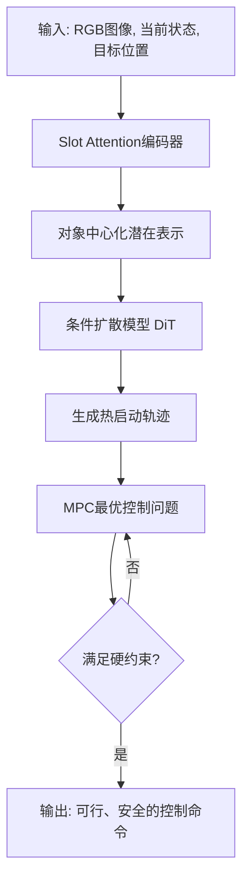

# Warm-Starting Collision-Free Model Predictive Control With Object-Centric Diffusion

**相关性评分**: 6.0/10

**排名**: #93

---

## 基本信息

- **arXiv ID**: [2601.02873v1](https://arxiv.org/abs/2601.02873v1)
- **发布时间**: 2026-01-06T10:02:54Z
- **相关性评分**: 6.0/10
- **是否相关**: 是

## 作者

Arthur Haffemayer, Alexandre Chapin, Armand Jordana, Krzysztof Wojciechowski, Florent Lamiraux, Nicolas Mansard, Vladimir Petrik

## 关键词

Vision-Language-Action Model, VLA for Robotics, Inference Efficiency, Lightweight Architecture, Inference Acceleration, Edge Deployment

## 一句话总结

该论文提出了一种结合对象中心扩散模型和模型预测控制的混合方法，用于在复杂环境中高效生成无碰撞运动轨迹，但未直接涉及视觉-语言-动作模型或边缘部署。

## 摘要

Acting in cluttered environments requires predicting and avoiding collisions while still achieving precise control. Conventional optimization-based controllers can enforce physical constraints, but they struggle to produce feasible solutions quickly when many obstacles are present. Diffusion models can generate diverse trajectories around obstacles, yet prior approaches lacked a general and efficient way to condition them on scene structure. In this paper, we show that combining diffusion-based warm-starting conditioned with a latent object-centric representation of the scene and with a collision-aware model predictive controller (MPC) yields reliable and efficient motion generation under strict time limits. Our approach conditions a diffusion transformer on the system state, task, and surroundings, using an object-centric slot attention mechanism to provide a compact obstacle representation suitable for control. The sampled trajectories are refined by an optimal control problem that enforces rigid-body dynamics and signed-distance collision constraints, producing feasible motions in real time. On benchmark tasks, this hybrid method achieved markedly higher success rates and lower latency than sampling-based planners or either component alone. Real-robot experiments with a torque-controlled Panda confirm reliable and safe execution with MPC.

## 详细分析

## 论文详细摘要

**1. 研究背景和动机**
在杂乱、非凸的环境中生成无碰撞且动力学可行的运动轨迹是机器人操作的核心挑战。传统的基于优化的控制器（如模型预测控制，MPC）虽能处理物理约束，但在复杂场景中高度依赖初始化，容易陷入局部最优，难以快速找到可行解。另一方面，扩散模型能够生成多样的轨迹，但先前的方法缺乏一种通用且高效的方式来根据场景结构对其进行条件化，限制了其在实时闭环控制中的应用。

**2. 核心方法和技术创新**
本文提出了一种两阶段混合框架，将**场景条件化的扩散模型**与**基于约束的MPC**相结合。
- **对象中心化的场景表征**：采用基于Slot Attention的编码器，从RGB图像中提取紧凑、无序的潜在对象（障碍物）表征，为扩散模型提供泛化能力强、信息丰富的条件信号。
- **条件化轨迹扩散**：训练一个扩散Transformer模型，以系统状态、任务目标和上述场景表征为条件，生成高质量的热启动轨迹。
- **MPC实时精炼**：将扩散模型生成的轨迹作为MPC求解器的初始猜测。MPC求解一个包含刚体动力学、碰撞（基于符号距离的硬约束）和扭矩限制的最优控制问题，将热启动轨迹精炼为严格可行、安全的运动轨迹。

**3. 主要实验结果**
在模拟的桌面、抽屉和货架三个杂乱场景基准测试中，该方法取得了显著优于基线方法的表现：
- **成功率最高**：在三个场景中分别达到82%、79%和83%，明显高于纯MPC、基于采样的规划器（如RRT-Connect）及其他扩散方法（如PRESTO, MPD）。
- **计算效率高**：平均计算时间低于72毫秒，满足实时控制要求。
- **消融实验验证**：对象中心化（Slot Attention）的场景表征在低计算预算下性能最优；同时，实验表明在结合MPC精炼后，在扩散过程中添加基于成本的梯度引导并无益处。
- **真机验证**：在Franka Panda机器人上成功实现了在动态变化杂乱环境中的实时、安全、无碰撞操作。

**4. 研究意义和价值**
本研究的主要贡献在于：
- **技术整合**：首次将对象中心化的扩散模型与一个执行硬约束的实时MPC紧密集成，兼具了数据驱动方法的全局推理能力和模型驱动方法的精确约束满足能力。
- **实用性强**：提供了从感知到控制的完整、高效的机器人流水线，并在真实机器人上验证了其可靠性和安全性。
- **开源贡献**：提供了开源实现，为后续研究奠定了基础。该框架为在更复杂动态环境中实现鲁棒、高效的机器人运动规划与控制提供了新思路，并有望与大型视觉-语言-动作模型结合，拓展其应用范围。

## 问答对

### 问题 1

**Q**: 这篇论文的核心创新点是什么，他想解决什么问题，怎么解决的？

**A**: ## 论文核心分析

### **核心问题**
在**杂乱、非凸的障碍物环境**中，机器人需要实时生成**动态可行且无碰撞**的运动轨迹。传统的基于优化的控制器（如MPC）虽然能处理物理约束，但在复杂场景下对初始值敏感，容易陷入局部最优，导致求解失败或效率低下。

### **核心创新点**
本文提出了一种**混合架构**，将**基于学习的生成式轨迹先验**与**基于模型的优化控制**相结合，以解决上述问题。其创新主要体现在以下三个层面的整合：

1.  **对象中心化的场景表示与条件化扩散模型**
    - **创新点**：采用**Slot Attention**机制，从RGB图像中提取**对象中心化的潜在表示**作为扩散模型的**条件输入**。
    - **解决什么问题**：传统方法（如点云、深度图、占用栅格）对场景的表示要么高维、有噪声，要么缺乏结构化信息，导致扩散模型泛化能力差、推理速度慢。
    - **如何解决**：Slot Attention将场景分解为一组无序的“槽”（slots），每个槽对应一个物体或障碍物。这种表示**紧凑、结构化、排列不变**，使扩散模型能更好地理解场景的碰撞结构，并泛化到未见过的物体布局。

2.  **用于MPC的扩散模型热启动**
    - **创新点**：训练一个**条件扩散模型**，根据当前状态、任务目标和场景表示，直接从噪声中生成**高质量的热启动轨迹**，作为后续MPC求解器的初始猜测。
    - **解决什么问题**：MPC在复杂环境中严重依赖初始猜测，差的初始值会导致收敛失败或陷入局部最优（如撞向障碍物）。
    - **如何解决**：扩散模型能够捕捉可行轨迹的**多模态分布**（即绕过障碍物的多种可能路径），生成接近可行解区域的轨迹提议，从而将MPC引导至有希望的搜索空间。

3.  **基于MPC的轨迹精炼与实时闭环控制**
    - **创新点**：将扩散模型生成的轨迹作为**热启动**，输入到一个**具有硬性碰撞约束的MPC求解器**中进行精炼和闭环执行。
    - **解决什么问题**：扩散模型生成的轨迹可能**不严格满足动力学约束或安全边界**，无法直接安全执行。而纯优化方法又无法保证找到全局可行的解。
    - **如何解决**：
        - **MPC作为投影器**：MPC求解一个最优控制问题，严格强制执行机器人刚体动力学、关节限位以及基于**符号距离的硬性碰撞约束**，将“近似可行”的扩散轨迹投影到“严格可行”的轨迹上。
        - **实时闭环**：在真实机器人上以**100Hz**频率进行重新规划，结合底层反馈控制，实现**安全、反应式的实时操作**。

### **解决方案流程总结**

**关键整合优势**：该框架结合了**扩散模型的全局推理和创造性**（生成多样化的避障路径）与**MPC的局部精确性和安全性保证**（强制执行物理约束），实现了在严格时间限制（<72ms）内的高成功率、低延迟运动生成。

### **实际价值**
1.  **性能提升**：在基准测试中，该方法取得了**最高成功率（~80%+）**，同时保持了**最低的计算延迟**，显著优于单独的采样规划器、扩散模型或MPC。
2.  **系统实用性**：在**真实扭矩控制的Franka Panda机器人**上得到验证，能够在动态变化的杂乱货架环境中进行安全、可靠的避障操作。
3.  **开源贡献**：提供了开源实现，为社区提供了结合生成式模型与模型预测控制的可复现研究平台。
4.  **扩展性**：框架设计允许替换不同的场景表示、扩散架构或MPC成本函数，为未来集成更复杂的感知模型（如大视觉-语言-动作模型）奠定了基础。

### 问题 2

**Q**: 请用一段话总结这篇论文，明确说明：论文试图解决的核心问题；提出的主要方法或框架；最终取得的主要效果或结论。要求语言简洁、信息密度高，不要复述摘要原文。

**A**: 这篇论文旨在解决在复杂、非凸的杂乱环境中，机器人实时生成**动态可行且无碰撞**运动轨迹的难题。传统基于优化的控制器（如MPC）虽能处理物理约束，但对初始解敏感，在复杂场景中易陷入局部最优且求解缓慢。

为此，论文提出了一个**两阶段混合框架**：第一阶段，利用一个以**物体为中心的Slot Attention机制**对场景进行紧凑编码，并以此条件化一个扩散变换器（DiT），快速生成多样化的轨迹建议作为“热启动”；第二阶段，将这些建议轨迹输入一个**模型预测控制器（MPC）**，求解一个包含刚体动力学和符号距离碰撞约束的最优控制问题，从而将学习到的先验严格投影到动态可行且安全的解空间。

实验表明，该方法在多个基准任务上取得了**最高的成功率（约80%）和最低的延迟（<72ms）**，显著优于纯采样规划器、纯优化方法或其他学习基线，并在真实扭矩控制的Panda机器人上验证了其**实时、安全、可靠的闭环控制能力**。

### 问题 3

**Q**: 这篇论文相对于已有工作有哪些明确的创新点？请逐条列出，并对每一条说明：相比以往方法改进或不同之处在哪里，以及该创新解决了什么具体问题或带来了什么优势。

**A**: ## 论文创新点分析

这篇论文提出了一种结合扩散模型与模型预测控制（MPC）的机器人运动规划框架，其核心创新点主要体现在以下几个方面：

### 1. **基于物体中心（Object-Centric）的场景表示与条件化机制**
- **改进/不同之处**：以往方法通常使用图像（RGB/深度）、点云或占用栅格等非结构化或高维表示作为扩散模型的场景条件输入。本文创新性地采用**Slot Attention**机制，从RGB图像中提取一组紧凑的、物体中心的潜在嵌入（“slots”），每个slot对应一个独立的障碍物或物体。
- **解决的问题/优势**：
    - **解决**：传统图像或点云表示**几何保真度低、维度高、噪声敏感**的问题，以及它们难以泛化到未见过的杂乱场景的问题。
    - **优势**：
        - **紧凑高效**：提供低维、结构化的场景编码，显著降低了扩散模型条件输入的维度，**加快了推理速度**（实现亚毫秒级生成）。
        - **泛化能力强**：Slot Attention的置换不变性使其不依赖于固定的物体顺序或数量，能更好地**泛化到具有不同障碍物数量、布局的新场景**。
        - **信息丰富**：捕获了场景中障碍物的**本质碰撞结构**，为轨迹生成提供了更具信息量的指导。

### 2. **扩散模型生成的轨迹作为MPC的“热启动”（Warm-Start），并进行严格的OCP投影优化**
- **改进/不同之处**：先前工作（如Diffusion Seeder, MPD）通常将扩散模型生成的轨迹作为开环指令直接由底层控制器跟踪，或仅使用简单的基于梯度的后处理。本文则**将扩散输出作为初始猜测，输入到一个完整的、带硬约束的最优控制问题（OCP）求解器（即MPC）中进行实时精炼**。
- **解决的问题/优势**：
    - **解决**：扩散模型生成的轨迹可能**不严格满足动力学约束（如扭矩、速度限制）或安全约束（如碰撞距离）**，直接执行不安全。同时，纯优化方法（MPC）在复杂场景中**对初始值敏感，容易陷入局部最优**。
    - **优势**：
        - **保证安全与可行性**：MPC阶段**强制执行刚体动力学和带符号距离的硬碰撞约束**，确保最终轨迹是动态可行且绝对安全的。
        - **提升收敛性与成功率**：扩散模型提供的优质“热启动”将MPC求解器**引导至有希望的搜索区域**，大幅提高了在非凸、杂乱环境中的**收敛速度和成功率**（在基准测试中达~80%，远超无热启动的OCP基线<10%）。
        - **实现闭环实时控制**：整个框架以**滚动时域（Receding Horizon）方式运行**，结合高频反馈，实现了**实时、闭环的碰撞感知控制**，这是许多先前扩散方法未能展示的。

### 3. **面向控制的高质量数据集生成流程**
- **改进/不同之处**：论文设计了一套**系统的数据生成流程**，并非直接使用几何规划器（如RRT）产生的轨迹，而是将其作为**初始化**，再通过求解OCP得到平滑、动态可行的“专家轨迹”用于训练扩散模型。
- **解决的问题/优势**：
    - **解决**：直接从RRT等采样规划器获得的轨迹通常**不平滑、不动态可行**，不适合作为学习动态运动先验的训练数据。
    - **优势**：确保了训练数据的**高质量**，使扩散模型能够学习到既**几何合理**又**符合动力学**的运动模式，为生成有效的MPC热启动轨迹奠定了基础。

### 4. **完整的机器人系统集成与实证验证**
- **改进/不同之处**：与许多仅在仿真中验证的工作不同，本文在**真实的扭矩控制Franka Panda机器人**上实现了完整系统，并在**动态变化**的杂乱场景中进行了验证。
- **解决的问题/优势**：
    - **解决**：证明了方法能**跨越仿真到现实的鸿沟**，处理真实的感知噪声、动力学模型误差和实时计算限制。
    - **优势**：
        - **实用性强**：展示了**实时性能**（OCP求解在72ms内），并能根据在线感知（如AprilTags）**动态重新规划**。
        - **提供开源实现**：增强了工作的可复现性和对社区的贡献价值。

### 5. **通过消融实验明确架构选择与性能权衡**
- **改进/不同之处**：论文没有简单地提出方法，而是通过系统的消融实验，定量比较了不同场景表示（Slot Attention vs. 图像 vs. 占用栅格 vs. 配置空间）、以及**成本梯度引导（Cost Gradient Guidance）的必要性**。
- **解决的问题/优势**：
    - **解决**：明确了在**与MPC联用**的框架下，哪些组件是关键的（如物体中心表示），哪些可能是不必要甚至有害的（如额外的梯度引导）。
    - **优势**：为后续研究提供了清晰的工程见解和设计指南，例如证明了在计算预算有限时，**物体中心表示显著优于其他方法**，以及**当有后续OCP精炼时，扩散过程中的梯度引导收益甚微**。

---

**总结**：本文的核心创新在于**创造性地将物体中心的场景理解、生成式轨迹先验学习、与基于模型的严格约束优化三者无缝结合**。它既利用了扩散模型在**多模态、全局探索**方面的优势，又通过MPC保留了**模型的安全性、精确性和闭环反馈**能力，从而在**实时性、成功率和安全性**上实现了对已有单一类别方法（纯学习或纯优化）或简单组合方法的显著超越。

### 问题 4

**Q**: 论文在实验或评估中最终实现了怎样的效果？请说明使用了哪些数据集和评价指标，与哪些基线方法进行了对比，以及在关键指标上的主要性能提升或结论。如果论文未给出明确的定量结果，也请说明原因。

**A**: ## 论文实验与评估效果总结

### 一、 实验设置与数据集
- **机器人平台**：Franka Emika Panda 机械臂（7自由度）。
- **实验环境**：三个具有挑战性的非凸、杂乱环境基准任务：
    1.  **Table**：桌面环境，最多3个随机放置的障碍物。
    2.  **Drawer**：抽屉环境，最多3个随机放置的障碍物。
    3.  **Shelf**：货架环境（最复杂），最多5个随机放置的障碍物。
- **训练数据集生成**：
    - 通过**仿真**随机生成场景、起始位姿和目标末端位置。
    - 使用**RRT**生成几何路径，再用**最优控制问题（OCP）** 求解器进行平滑和优化，得到高质量、动力学可行的专家轨迹。
    - 数据规模：Shelf环境30,000条轨迹，Table和Drawer环境各10,000条轨迹。每条轨迹时间步长 `T=50`。

### 二、 评价指标
论文使用三个核心指标进行定量评估：
1.  **成功率（Success Rate）**：轨迹无碰撞到达目标点的百分比。**越高越好**。
2.  **穿透深度（Penetration Depth）**：轨迹中机器人与障碍物累计的穿透距离。**越低越好**，成功轨迹应为零。
3.  **平均成本（Average Cost）**：对应OCP求解的总成本，反映轨迹的可行性（如目标跟踪、控制消耗）和最优性。**越低越好**。
4.  **计算时间（Computation Time）**：生成可行轨迹所需的时间。**越低越好**，以满足实时控制要求。

### 三、 对比的基线方法
论文与以下五类方法进行了全面对比：

| 方法类别 | 具体方法 | 特点 |
| :--- | :--- | :--- |
| **学习型扩散方法** | **PRESTO** [[Seo et al., 2025]] | 在构型空间操作的扩散模型，使用预定义构型的碰撞指示向量进行场景编码。 |
| | **运动规划扩散（MPD）** [[Carvalho et al., 2023]] | 无条件扩散模型，通过**基于成本梯度的引导**在扩散过程中鼓励避障。 |
| **经典/优化型规划器** | **RRT-Connect** [[Kuffner & LaValle, 2000]] | 经典双向采样规划器，探索能力强，但不考虑动力学。 |
| | **cuRobo** [[Sundaralingam et al., 2023]] | GPU加速的轨迹优化框架，结合了采样策略。 |
| | **纯OCP（无热启动）** [[Mastalli et al., 2020]] | 使用DDP直接求解OCP，**没有扩散模型提供热启动**，易陷入局部极小值。 |

### 四、 关键性能结果与结论

#### 1. **整体性能对比（图4）**
- **成功率**：本文方法在三个环境上均取得**最高成功率**（Table: **82%**, Drawer: **79%**, Shelf: **83%**），显著优于MPD（<10%）和纯OCP（<10%），也略优于PRESTO、cuRobo和RRT-Connect（后三者成功率>70%）。
- **轨迹质量**：本文方法取得了**最低的平均OCP成本**，表明生成的轨迹不仅成功，而且在目标跟踪、平滑性和控制效率方面更优。
- **计算效率**：本文方法平均运行时间 **<72 ms**，满足实时控制要求（100Hz），计算速度略快于其他基线，而RRT-Connect耗时更长。

**核心结论**：结合**基于槽注意力的对象中心扩散模型**和**模型预测控制（MPC）** 的混合方法，在高度杂乱的非凸环境中，实现了**成功率、轨迹质量和计算速度的最佳平衡**。

#### 2. **消融实验关键发现**
- **场景表示对比（图5）**：
    - **最佳**：**槽注意力（Slot Attention）** 对象中心表示。在有限计算预算（20-60 ms）下成功率最高（50 ms内达80%），且碰撞率和穿透深度最低。
    - **次优**：PRESTO的**构型空间表示**和**占据栅格表示**性能接近，但需要更长时间达到相近成功率。
    - **最差**：**基于图像的表示**（ResNet-18编码）性能最差，成功率低于50%，证明了**结构化、对象中心的场景编码对于控制任务至关重要**。
- **梯度引导的影响（图6）**：
    - 在**没有OCP细化**时，MPD使用的成本梯度引导能在低计算预算下提升成功率。
    - **在本文的完整流程（扩散+OCP）中，梯度引导反而带来不必要的开销，甚至损害性能**。因此最终方案**未采用**该引导。
- **计算预算权衡（图7）**：
    - 成功率随**扩散去噪步数**和**OCP迭代次数**增加而提升，但在约10步扩散和15次OCP迭代后达到平台期（~80%成功率）。
    - 计算时间几乎随扩散步数线性增长。论文指出，需要根据可用计算预算和任务需求选择最优的步数/迭代数组合。

#### 3. **真实机器人验证（图8）**
- **系统实现**：在真实Panda机械臂上部署，使用AprilTags进行实时障碍物位姿估计，MPC在 **100 Hz** 下运行重规划。
- **效果**：
    - 系统能够成功在杂乱货架中规划并执行**无碰撞运动**。
    - 展示了**动态场景适应性**：当障碍物被实时移走后，机器人能无缝地重新优化轨迹，以更高效的路径到达目标。
    - 证明了整套管道（感知-扩散热启动-MPC）在**真实硬件上可实现可靠、安全的实时闭环控制**。

### 总结
本文通过系统的实验证明，所提出的 **“对象中心扩散热启动 + 碰撞感知MPC”** 框架，在仿真和真实机器人实验中，均能**以毫秒级延迟（<72ms）生成高质量、动力学可行、严格无碰撞的轨迹**，在成功率等关键指标上**全面超越**了纯学习型扩散方法、经典采样规划器以及无热启动的优化方法。其成功关键在于**槽注意力提供的紧凑、泛化性强的场景表示**，以及**扩散模型与模型预测控制在生成全局先验与保证局部可行性方面的优势互补**。

## 相关链接

- [arXiv 页面](https://arxiv.org/abs/2601.02873v1)
- [HTML 版本](https://arxiv.org/html/2601.02873v1)
