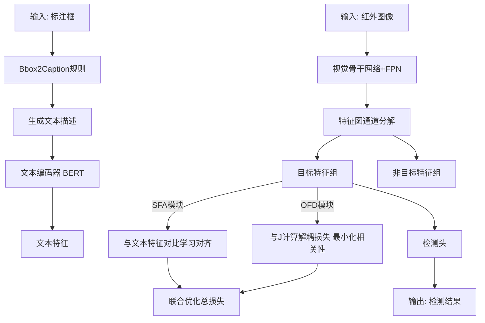

# Disentangle Object and Non-object Infrared Features via Language Guidance

**相关性评分**: 6.0/10

**排名**: #41


---


## 基本信息

- **arXiv ID**: [2601.09228v1](https://arxiv.org/abs/2601.09228v1)
- **发布时间**: 2026-01-14T06:59:54Z
- **相关性评分**: 6.0/10
- **是否相关**: 是

## 作者

Fan Liu, Ting Wu, Chuanyi Zhang, Liang Yao, Xing Ma, Yuhui Zheng

## 关键词

Vision-Language-Action Model, VLA for Robotics, Inference Efficiency, Lightweight Architecture, Inference Acceleration, Edge Deployment

## 一句话总结

该论文提出了一种基于语言引导的红外目标检测方法，通过语义特征对齐和对象特征解耦来提升检测性能，但未明确涉及推理效率、轻量架构或边缘部署等技术。

## 摘要

Infrared object detection focuses on identifying and locating objects in complex environments (\eg, dark, snow, and rain) where visible imaging cameras are disabled by poor illumination. However, due to low contrast and weak edge information in infrared images, it is challenging to extract discriminative object features for robust detection. To deal with this issue, we propose a novel vision-language representation learning paradigm for infrared object detection. An additional textual supervision with rich semantic information is explored to guide the disentanglement of object and non-object features. Specifically, we propose a Semantic Feature Alignment (SFA) module to align the object features with the corresponding text features. Furthermore, we develop an Object Feature Disentanglement (OFD) module that disentangles text-aligned object features and non-object features by minimizing their correlation. Finally, the disentangled object features are entered into the detection head. In this manner, the detection performance can be remarkably enhanced via more discriminative and less noisy features. Extensive experimental results demonstrate that our approach achieves superior performance on two benchmarks: M\textsuperscript{3}FD (83.7\% mAP), FLIR (86.1\% mAP). Our code will be publicly available once the paper is accepted.

## 详细分析

## 论文摘要：《通过语言指导解耦红外图像中的目标与非目标特征》

**1. 研究背景和动机**
红外目标检测在低光照、雨雪等复杂环境中具有重要应用价值。然而，红外图像普遍存在**对比度低、边缘信息弱**的问题，导致难以提取具有判别性的目标特征，检测性能受限。现有方法或依赖成本高昂的成对可见光-红外数据，或仅通过卷积模块分离特征，效果有限且缺乏可解释性。本文旨在利用**文本模态的丰富语义信息**，以可解释的方式指导红外图像中目标与非目标特征的有效解耦。

**2. 核心方法和技术创新**
本文提出了一种新颖的**语言引导特征解耦**框架，将传统视觉检测流程转化为**视觉-语言表征学习范式**。主要技术创新包括：
- **辅助文本生成**：提出`Bbox2Caption`规则，利用边界框标注自动生成包含目标类别、数量和空间信息的描述性文本。
- **语义特征对齐模块**：设计**SFA模块**，通过对比学习将分解出的目标视觉特征与对应的文本特征在统一空间中对齐，使模型从文本中学习目标语义信息。
- **目标特征解耦模块**：设计**OFD模块**，通过最小化目标特征与非目标特征之间的相关性，迫使两者在特征空间中分离，从而抑制背景噪声。
- 最终，仅将解耦后的纯净目标特征送入检测头进行预测，在推理阶段无需文本输入。

**3. 主要实验结果**
在**FLIR**和**M³FD**两个主流红外数据集上进行了广泛实验：
- 性能领先：在FLIR数据集上达到**86.1% AP50**，在M³FD数据集上达到**83.7% AP50**，超越了所有现有的**纯红外检测方法**，甚至优于许多需要成对RGB数据的**红外-可见光融合检测框架**。
- 模块有效性：消融实验证实，SFA和OFD模块均能带来显著性能提升（例如在M³FD上AP50分别提升4.6%和0.8%）。
- 特征可视化：可视化结果显示，解耦后的目标特征能更聚焦于前景目标，而非目标特征则主要关注背景，验证了方法的有效性。

**4. 研究意义和价值**
- **学术创新**：首次将视觉-语言表征学习范式引入红外目标检测任务，为领域提供了新的研究思路。
- **性能突破**：仅使用单模态红外数据，即可达到甚至超越多模态融合方法的性能，降低了数据获取成本和模型部署复杂度。
- **实用价值**：所提方法不增加推理开销，且通过文本监督增强了特征学习的可解释性，为在安防监控、自动驾驶等实际场景中实现更鲁棒的红外感知提供了有效方案。

## 问答对

### 问题 1

**Q**: 这篇论文的核心创新点是什么，他想解决什么问题，怎么解决的？

**A**: ## 论文核心分析

### 一、 拟解决的核心问题
论文旨在解决**红外目标检测（IROD）**中的一个关键挑战：由于红外图像**对比度低、边缘信息弱、缺乏颜色和纹理**，导致从复杂背景中提取具有判别力的目标特征非常困难。传统仅依赖视觉卷积的方法难以充分分离目标与背景（非目标）特征，导致检测性能受限且特征缺乏可解释性。

### 二、 核心创新点
论文提出了一个名为 **语言引导的特征解耦（Language-guided Feature Disentanglement, LGFD）** 的全新范式。其核心创新在于：

1.  **范式创新**：首次将**视觉-语言表征学习范式**引入红外目标检测领域。利用富含语义信息的文本监督来引导模型学习，将传统的纯视觉检测流程转变为多模态学习任务。
2.  **方法创新**：设计了一个可解释的LGFD框架，包含两个关键模块：
    - **语义特征对齐模块（Semantic Feature Alignment, SFA）**：通过对比学习，将分解出的**目标视觉特征**与**自动生成的文本描述特征**在统一空间中对齐，迫使视觉特征学习文本中的对象语义信息。
    - **目标特征解耦模块（Object Feature Disentanglement, OFD）**：通过最小化目标特征与非目标特征之间的相关性（如余弦相似度），强制两者在特征空间中分离，从而抑制背景噪声。
3.  **监督信号创新**：提出 **`Bbox2Caption`** 规则，利用现有的边界框标注自动生成图像描述文本（如“图像左上方有一辆汽车”），为训练提供了**免费的、富含语义的辅助监督信号**，无需额外人工标注。

### 三、 解决方案与技术路径
论文通过以下系统性方案解决上述问题：



**关键步骤详解：**

1.  **特征分解**：将骨干网络提取的特征图（如FPN的P3、P4层）在通道维度上均匀分割为两组，分别初始化为目标和非目标特征。
2.  **语义对齐（SFA）**：
    ```python
    # 核心思想：拉近匹配的图像-文本对，推远不匹配的对
    # f_obj_proj: 投影后的目标视觉特征
    # f_text: 文本特征（来自BERT）
    similarity = cosine_similarity(f_obj_proj, f_text) # 计算相似度矩阵
    loss_align = ContrastiveLoss(similarity) # 使用对比损失（如InfoNCE）
    ```
    这使得目标特征能够吸收“汽车”、“行人”等类别和位置语义。
3.  **特征解耦（OFD）**：
    ```python
    # 核心思想：降低目标与非目标特征的互信息
    loss_dis = cosine_similarity(Pooling(f_obj), Pooling(f_nobj))
    # 总损失函数
    total_loss = loss_det + α * loss_align + β * loss_dis
    ```
4.  **训练与推理**：
    - **训练阶段**：联合优化检测损失、对齐损失和解耦损失。
    - **推理阶段**：**仅需红外图像**，丢弃非目标特征，仅将解耦后的纯净目标特征送入检测头，在提升性能的同时略微降低了计算复杂度。

### 四、 实际价值与贡献
- **性能提升**：在仅使用红外数据的情况下，在FLIR和M3FD基准上达到了最先进的检测精度（例如，FLIR上86.1% AP50），甚至超越了许多需要配对可见光图像的融合方法。
- **实用性与可解释性**：
    - 避免了昂贵/难以获取的配对多模态数据。
    - 利用现有标注生成文本监督，成本低廉。
    - 特征可视化表明，模型能明确地将激活区域聚焦于目标，抑制背景。
- **泛化意义**：为数据受限、特征模糊的检测任务（不仅是红外）提供了一种利用语言先验知识来增强特征判别力和模型可解释性的新思路。


### 问题 2

**Q**: 请用一段话总结这篇论文，明确说明：论文试图解决的核心问题；提出的主要方法或框架；最终取得的主要效果或结论。要求语言简洁、信息密度高，不要复述摘要原文。

**A**: 这篇论文旨在解决红外图像中由于低对比度和弱边缘信息导致的目标特征提取困难、检测性能不佳的核心问题。为此，作者提出了一种名为**语言引导特征解耦**的新范式，通过引入文本模态的语义信息来指导模型分离目标与非目标特征。该方法包含两个核心模块：**语义特征对齐模块**用于将视觉目标特征与文本描述特征对齐，以学习更具判别性的目标语义；**目标特征解耦模块**则通过最小化目标与非目标特征之间的相关性，进一步纯化目标特征。实验结果表明，该方法在仅使用红外图像的情况下，在FLIR和M3FD等基准数据集上取得了优异的检测性能（如86.1%和83.7%的mAP），甚至超越了部分需要配对可见光图像的融合方法，验证了其有效性和实际价值。


### 问题 3

**Q**: 这篇论文相对于已有工作有哪些明确的创新点？请逐条列出，并对每一条说明：相比以往方法改进或不同之处在哪里，以及该创新解决了什么具体问题或带来了什么优势。

**A**: ## 论文创新点分析

本文《Disentangle Object and Non-object Infrared Features via Language Guidance》针对红外目标检测任务，提出了一种新颖的视觉-语言表征学习范式。其核心创新点可归纳为以下三条，每条均明确了与以往方法的差异、改进之处以及解决的具体问题或带来的优势。

---

### 1. **首次将视觉-语言学习范式引入纯红外目标检测任务**

- **相比以往方法的改进/不同之处**：
    - **以往方法**：主流红外目标检测方法主要分为两类：1) **红外-可见光融合方法**：依赖成本高昂、难以精确配对的跨模态数据；2) **纯红外方法**：通常直接在可见光预训练模型上微调，或设计卷积模块（如坐标注意力）来增强特征，**仅依赖视觉模态的监督信号**。
    - **本文方法**：提出了一种全新的**语言引导的特征解缠**框架。它**首次**在纯红外目标检测中引入了**文本模态**作为监督信号，将传统的视觉检测流程转变为**视觉-语言表征学习范式**。

- **解决的具体问题/带来的优势**：
    - **问题**：红外图像对比度低、边缘信息弱，仅从视觉模态中学习判别性特征非常困难。现有纯红外方法缺乏足够丰富和语义明确的监督来有效分离前景（目标）和背景（非目标）特征。
    - **优势**：
        1. **提供丰富的语义监督**：通过从标注自动生成的文本描述（如“图像左上方有一辆汽车”），为模型提供了**对象类别和空间位置**的明确语义信息，指导模型学习“什么才是目标”。
        2. **突破数据限制**：无需配对可见光图像，仅利用红外图像及其标注（可自动转为文本）即可实现性能提升，**实用性更强，成本更低**。
        3. **实现性能超越**：实验表明，仅使用红外数据的LGFD方法，其性能甚至超过了需要双模态数据的红外-可见光融合方法（如在FLIR数据集上mAP超越最佳融合方法2.2%），这证明了语言引导范式的强大有效性。

### 2. **设计了语义特征对齐与对象特征解缠双模块，实现可解释的特征分离**

- **相比以往方法的改进/不同之处**：
    - **以往方法**：如引用的YOLO-CIR等工作，主要依靠**卷积注意力机制**在特征空间内隐式地聚焦于目标区域。这种方法缺乏明确的监督来确保特征分离的彻底性，且分离出的特征**可解释性较差**。
    - **本文方法**：提出了两个核心模块，形成明确的监督和解耦机制：
        1. **语义特征对齐模块**：通过对比学习损失，**显式地**将分解出的“对象特征”与对应的文本描述特征在嵌入空间中对齐。
        2. **对象特征解缠模块**：通过一个额外的损失函数，**最小化“对象特征”与“非对象特征”之间的相关性**，强制两者在特征空间中分离。

- **解决的具体问题/带来的优势**：
    - **问题**：在特征空间中，目标与背景特征高度纠缠，导致检测器容易受到背景噪声干扰，并可能激活虚假区域。
    - **优势**：
        1. **实现彻底的特征解缠**：SFA模块确保“对象特征”通道真正编码与文本语义相关的目标信息；OFD模块则进一步将残留的目标信息从“非对象特征”中剥离出去。可视化结果（论文图4）清晰显示，解缠后的对象特征响应集中于前景，非对象特征响应集中于背景。
        2. **增强特征判别性与鲁棒性**：经过解缠，送入检测头的“对象特征”**噪声更少、判别性更强**。这直接带来了更强的真实目标激活和更少的错误激活（论文图3），从而提升了检测精度。
        3. **提升模型可解释性**：整个特征学习过程由文本语义明确引导，使得“对象特征”的学习具有明确的语义对应关系，增强了模型决策过程的透明度。

### 3. **提出了一种高效且鲁棒的规则化文本监督生成方法**

- **相比以往方法的改进/不同之处**：
    - **潜在替代方案**：可以直接使用大型视觉-语言模型根据图像生成描述。
    - **本文方法**：采用了一种**基于规则的Bbox2Caption方法**，直接利用目标检测的边界框和类别标注，自动生成结构化的自然语言描述（例如，“There are two persons and one car in the image. The persons are located at the top left and bottom right. The car is at the center.”）。

- **解决的具体问题/带来的优势**：
    - **问题**：LVLM通常针对可见光图像训练，对红外图像存在**领域差距**，容易产生**幻觉**，生成包含虚假或错误信息的描述，从而误导模型。
    - **优势**：
        1. **保证监督信号的准确性与可靠性**：规则生成的方法完全基于真实标注，**避免了幻觉噪声**，为特征对齐提供了干净、准确的语义监督。
        2. **简单高效，成本低廉**：无需训练或调用复杂的大模型，计算开销小，且与标注流程无缝衔接。
        3. **实验验证有效性**：消融实验（论文表6）表明，规则化方法在检测性能上**优于LVLM生成方法**，验证了其在当前任务中的优越性。

---

## 总结
本文的核心创新在于**范式创新**（引入语言引导）、**机制创新**（设计可解释的双模块解缠）和**工程创新**（采用鲁棒的规则化文本生成）。这些创新共同解决了红外目标检测中**特征判别性弱、背景干扰强**的核心难题，最终在仅使用红外单模态数据的情况下，实现了对现有方法（包括多模态融合方法）的性能超越，为低质量成像条件下的目标检测提供了新思路。


### 问题 4

**Q**: 论文在实验或评估中最终实现了怎样的效果？请说明使用了哪些数据集和评价指标，与哪些基线方法进行了对比，以及在关键指标上的主要性能提升或结论。如果论文未给出明确的定量结果，也请说明原因。

**A**: ## 论文实验与评估效果分析

该论文通过系统的实验验证了所提出的**语言引导特征解耦（LGFD）** 方法在红外目标检测任务上的有效性，取得了显著的性能提升。

### 一、 使用的数据集与评价指标
- **数据集**：
    1.  **FLIR**：包含5,142张精确对齐的红外-可见光配对图像。实验仅使用红外数据，其中4,129张用于训练，1,013张用于测试。
    2.  **M³FD**：包含4,200对车载相机拍摄的可见光-热成像图像。实验仅使用红外数据，按原始设置，80%用于训练，20%用于评估。
- **评价指标**：
    - **mAP**：平均精度均值（IoU阈值从0.5到0.95，步长0.05）。
    - **AP₅₀**：IoU阈值为0.5时的平均精度。
    - **AP₇₅**：IoU阈值为0.75时的平均精度。
    - **APₛ, APₘ, APₗ**：分别针对小、中、大尺度目标的平均精度。

### 二、 对比的基线方法
论文与两大类先进的基线方法进行了全面对比：
- **红外-可见光融合方法**：这些方法需要成对的RGB和红外图像作为输入，代表了利用多模态信息的SOTA性能。对比方法包括：GAFF, CFT, IGT, CrossFormer, YOLO-Fusion, FD²-Net, RFN, DeFusion, TarDAL, IGNet, MetaF等。
- **纯红外方法**：这些方法仅使用红外图像，与本文的设置完全一致。对比方法包括：SSD, Faster R-CNN, SMG-Y, YOLOv5m, YOLO-ACN, RGBT, YOLO-CIR, CenterNet2, Sparse R-CNN, YOLOv7-tiny, Swin Transformer等。

### 三、 关键性能提升与结论
论文在多个关键指标上实现了超越现有方法的性能，主要结论如下：

#### 1. **总体性能超越SOTA**
- **在FLIR数据集上**：
    - LGFD取得了 **86.1%的AP₅₀** 和 **45.8%的mAP**。
    - **相较于纯红外方法中的次优方法（YOLO-CIR， AP₅₀ 84.9%）**，LGFD在AP₅₀上提升了 **1.2个百分点**。
    - **更值得注意的是，LGFD甚至超越了所有需要额外可见光数据的红外-可见光融合方法**。例如，相比表现优异的IGT方法（AP₅₀ 85.0%），LGFD在AP₅₀上提升了 **1.1个百分点**，在mAP上提升了 **2.2个百分点**。
- **在M³FD数据集上**：
    - LGFD取得了 **83.7%的AP₅₀** 和 **51.7%的mAP**。
    - **相较于纯红外方法中的次优方法（YOLOv7-tiny， AP₅₀ 78.1%）**，LGFD在AP₅₀上大幅提升了 **5.6个百分点**。
    - 在AP₅₀指标上，LGFD也**超越了所有列出的红外-可见光融合方法**（最优的MetaF为81.6% AP₅₀）。

#### 2. **核心结论**
- **有效性证明**：实验结果表明，**仅使用红外图像**的LGFD方法，其性能可以**媲美甚至超越需要昂贵配对数据的红外-可见光融合方法**。这充分证明了引入语言语义信息进行特征引导和解耦的有效性。
- **泛化能力**：在两个不同的公开数据集上均取得领先，证明了方法的鲁棒性和泛化能力。
- **多尺度性能提升**：补充实验（表3）显示，LGFD在**小目标（APₛ）**、**中目标（APₘ）** 和**大目标（APₗ）** 上的检测精度均有全面提升，尤其是在M³FD数据集上，小目标检测精度提升了 **6.4个百分点**，解决了红外图像中小目标检测的难点。

#### 3. **消融实验的关键发现**
- **模块有效性**：SFA（语义特征对齐）模块和OFD（目标特征解耦）模块均对性能有正向贡献，两者结合时效果最佳。
- **特征分析**：实验证明，**仅使用解耦后的目标特征（`f_obj`）送入检测头效果最好**。若同时使用目标和非目标特征（`f_obj` + `f_nobj`），性能反而会下降，这验证了非目标特征确实包含干扰噪声，丢弃它们有利于提升性能。
- **可视化验证**：特征激活图可视化表明，LGFD能产生**更强、更集中的目标区域激活**，同时**减少背景区域的错误激活**，直观解释了性能提升的原因。

### 总结
该论文通过严谨的实验设计，在主流红外目标检测数据集上验证了LGFD框架的优越性。其核心价值在于：**开创性地将视觉-语言表示学习范式引入纯红外目标检测，通过廉价的文本语义监督（由标注自动生成），实现了对目标与背景特征的高效解耦，从而在无需配对可见光数据的情况下，达到了行业领先的检测精度。** 这一成果对于降低实际应用（如夜间自动驾驶、安防监控）的系统成本和复杂度具有重要意义。


## 相关链接

- [arXiv 页面](https://arxiv.org/abs/2601.09228v1)
- [HTML 版本](https://arxiv.org/html/2601.09228v1)
