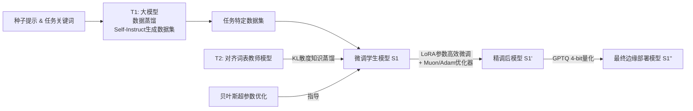

# Advancing Model Refinement: Muon-Optimized Distillation and Quantization for LLM Deployment

**相关性评分**: 6.0/10

**排名**: #50

---

## 基本信息

- **arXiv ID**: [2601.09865v1](https://arxiv.org/abs/2601.09865v1)
- **发布时间**: 2026-01-14T20:50:30Z
- **相关性评分**: 6.0/10
- **是否相关**: 是

## 作者

Jacob Sander, Brian Jalaian, Venkat R. Dasari

## 关键词

Inference Efficiency, Inference Acceleration, Lightweight Architecture

## 一句话总结

该论文提出了一种结合量化、蒸馏和优化的集成框架，以压缩大型语言模型，提高推理效率并支持边缘部署。

## 摘要

Large Language Models (LLMs) enable advanced natural language processing but face deployment challenges on resource-constrained edge devices due to high computational, memory, and energy demands. Optimizing these models requires addressing three key challenges: acquiring task-specific data, fine-tuning for performance, and compressing models to accelerate inference while reducing resource demands. We propose an integrated framework combining GPTQ-based quantization, low-rank adaptation (LoRA), and a specialized data distillation process to significantly reduce model size and complexity while preserving or enhancing task-specific performance. By leveraging data distillation, knowledge distillation via Kullback-Leibler divergence, Bayesian hyperparameter optimization, and the Muon optimizer, our pipeline achieves up to 2x memory compression (e.g., reducing a 6GB model to 3GB) and enables efficient inference for specialized tasks. Empirical results demonstrate superior performance on standard LLM benchmarks compared to GPTQ quantization alone, with the Muon optimizer notably enhancing fine-tuned models' resistance to accuracy decay during quantization.

## 详细分析

## 论文摘要

**论文标题：** Advancing Model Refinement: Muon-Optimized Distillation and Quantization for LLM Deployment

**1. 研究背景和动机**
大型语言模型（LLM）在自然语言处理任务中表现出色，但其巨大的计算量、内存占用和能耗使其难以部署在资源受限的边缘设备上。因此，如何在保持模型性能的同时，显著压缩模型规模并加速推理，成为当前研究的关键挑战。

**2. 核心方法和技术创新**
本文提出了一个**端到端的集成优化框架**，旨在为特定任务生成高效、可部署的压缩模型。其核心技术创新在于将多种先进技术无缝整合：
- **数据蒸馏与知识蒸馏**：首先，利用一个强大的教师模型（T1，如Llama 4 109B）通过自指令（Self-Instruct）流程生成高质量、任务特定的合成数据集。然后，使用另一个与目标学生模型词表对齐的教师模型（T2，如Llama 3.3 70B），通过**Kullback-Leibler散度**进行知识蒸馏，将知识迁移到学生模型。
- **参数高效微调与量化**：使用**低秩适应（LoRA）**对学生模型进行参数高效的微调。微调后，应用**GPTQ后训练量化**将模型压缩至4位精度（W4A16）。
- **Muon优化器的关键应用**：本框架的一个关键创新是引入了**Muon优化器**来替代传统的Adam优化器进行LoRA微调。Muon通过对梯度进行谱范数优化，能产生激活值分布更集中、异常值更少的模型，这被证明能增强模型对量化误差的鲁棒性。
- **贝叶斯超参数优化**：使用Optuna进行贝叶斯超参数优化，自动寻找最佳的超参数组合（如LoRA秩、蒸馏温度α、学习率等）。

**3. 主要实验结果**
在MMLU、ARC-e等8个标准基准测试上的实验表明：
- **性能提升**：该集成框架（无论是使用Adam还是Muon优化）在6/8个任务上超越了仅使用GPTQ量化的基线模型。
- **量化鲁棒性**：**Muon优化器展现出显著优势**。与Adam优化的模型相比，Muon优化的模型在后续4位量化过程中**精度下降更少**（在6/8个任务上）。例如在ARC-e任务上，Adam模型量化后精度下降3.16%，而Muon模型仅下降0.55%。
- **优化洞察**：超参数优化 consistently 选择 `α=1`，表明**纯KL散度损失（完全依赖教师T2的软标签）比交叉熵损失更有效**。
- **部署收益**：最终量化模型实现了约**2倍的内存压缩**（例如从6GB减至3GB），并且**每令牌生成时间（TPOT）降低了约50%**，显著提升了推理速度。

**4. 研究意义和价值**
本研究的意义和价值体现在：
- **实践价值**：提供了一个完整、可复现的管道，用于生产面向边缘设备的、任务专用的高效LLM，平衡了性能、尺寸和速度。
- **技术创新**：首次系统地将Muon优化器与知识蒸馏、LoRA微调和量化相结合，并实证了Muon在**提升模型量化鲁棒性**方面的有效性，即使是在微调阶段使用也有效。这为“量化感知”的模型优化提供了新的工具。
- **学术洞察**：揭示了在基于合成数据的蒸馏中，教师模型的软标签比原始数据标签包含更丰富的监督信号。同时，强调了**优化器选择**不仅是训练细节，更是影响最终压缩模型性能的关键设计决策。

## 问答对

### 问题 1

**Q**: 这篇论文的核心创新点是什么，他想解决什么问题，怎么解决的？

**A**: ## 论文核心分析

### **核心问题**
论文旨在解决**大型语言模型（LLM）在资源受限的边缘设备上部署的挑战**。具体表现为：
- **高计算、内存和能耗需求**，与边缘设备的有限资源（如1-8GB内存、低算力、严格能耗限制）形成矛盾。
- **任务专业化需求**：通用LLM在特定任务上可能效率低下，需要针对性地优化。
- **压缩与性能的权衡**：传统压缩方法（如量化）常导致模型精度显著下降。

### **核心创新点**
论文提出一个**集成化、端到端的模型精炼框架**，其创新性主要体现在 **“多技术协同优化”** 和 **“优化器选择对量化鲁棒性的新发现”**。

1.  **集成化框架设计**：
    - **创新性地将数据蒸馏、知识蒸馏、参数高效微调、贝叶斯超参数优化与后训练量化串联**，形成一个完整流水线。
    - 关键整合：使用**大模型（T1）通过Self-Instruct生成高质量任务特定合成数据**，以解决边缘场景数据稀缺问题；随后用**对齐词表的教师模型（T2）通过KL散度进行知识蒸馏**；结合**LoRA进行参数高效微调**；最后用**GPTQ进行4比特量化**。

2.  **引入并验证了Muon优化器的独特价值**：
    - **核心技术创新**：论文首次系统地将**Muon优化器**应用于结合了知识蒸馏损失和LoRA的微调场景，并验证了其对**量化鲁棒性的提升作用**。
    - **关键发现**：即使仅进行一个epoch的Muon优化微调，所得模型在后续进行GPTQ量化时，**精度下降幅度显著小于使用传统Adam优化器微调的模型**。例如，在ARC-e基准上，Muon模型的量化精度损失仅为0.55%，而Adam模型损失高达3.16%。
    - **理论联系**：这验证了先前研究（Park et al., 2025）的推测——Muon通过优化权重更新的谱范数，能产生**激活值分布更集中、异常值更少的模型**，从而降低了量化引入的舍入误差。

3.  **超参数优化的洞察**：
    - 贝叶斯超参数优化（Optuna）在所有任务中一致地选择 **`α = 1`** ，即**完全依赖教师模型（T2）的KL散度损失，而舍弃了监督交叉熵损失**。
    - 这表明在采用高质量合成数据的蒸馏框架中，**与强大教师模型的概率分布对齐是驱动性能提升的主导信号**。

### **解决方案（方法论）**
论文通过一个六步流水线解决问题：

1.  **数据准备**：使用超大规模教师模型（Llama 4 Scout 109B作为T1）和Self-Instruct流程，根据任务关键词生成高质量、多样化的问答对数据集。
2.  **模型蒸馏与微调**：
    - 选择词表对齐的教师模型（Llama 3.3 70B作为T2）和学生模型（Llama 3.2 3B作为S1）。
    - 使用**LoRA**对学生模型进行参数高效微调，损失函数为 `ℒ = α * ℒ_KL + (1-α) * ℒ_CE`。
    - 引入**Muon优化器**作为Adam的对比方案进行微调。
3.  **超参数优化**：使用**Optuna**进行贝叶斯优化，自动搜索LoRA秩、缩放因子、学习率、蒸馏温度等最优组合。
4.  **模型压缩**：对微调后的模型使用**GPTQ**进行W4A16（权重4比特，激活16比特）量化，实现约**2倍的内存压缩**。
5.  **评估**：在8个标准基准（MMLU, ARC-e等）上全面评估精度、量化后精度损失以及推理速度（吞吐量、延迟）。

### **实际价值**
- **为边缘AI部署提供了可复现的先进方案**：框架集成并验证了当前多项前沿技术（Self-Instruct, LoRA, GPTQ, Muon）的组合有效性。
- **显著提升了压缩模型的可用性**：在实现**2倍内存节省**和**~50%每令牌延迟降低**的同时，**模型精度超越基线GPTQ方法**，在多数任务上甚至优于未压缩的原始小模型。
- **指明了优化器研究的新方向**：证明了**优化器选择是量化感知微调的关键设计杠杆**，Muon在提升模型量化鲁棒性方面具有实用潜力，为后续研究和工程实践提供了重要参考。
- **解决了数据稀缺问题**：通过大模型生成合成数据的流程，降低了对大量标注数据的依赖，使针对长尾任务的边缘模型定制成为可能。

### 问题 2

**Q**: 请用一段话总结这篇论文，明确说明：论文试图解决的核心问题；提出的主要方法或框架；最终取得的主要效果或结论。要求语言简洁、信息密度高，不要复述摘要原文。

**A**: 这篇论文旨在解决大型语言模型（LLM）在资源受限的边缘设备上部署时面临的高计算、内存和能耗挑战。为此，作者提出了一个集成的模型精炼框架，该框架将**数据蒸馏**（通过自指导流程生成高质量任务数据）、**知识蒸馏**（基于KL散度对齐教师与学生模型）、**参数高效微调**（使用LoRA）与**贝叶斯超参数优化**相结合，最后应用**GPTQ后训练量化**进行压缩。核心创新在于将新兴的**Muon优化器**引入该流程进行微调。实验结果表明，该框架不仅实现了约2倍的内存压缩和高达50%的推理延迟降低，更重要的是，**使用Muon优化器微调的模型在后续4位量化过程中表现出更强的抗精度衰减能力**，在多数基准测试上取得了优于单独使用GPTQ或Adam优化器的最终精度。

### 问题 3

**Q**: 这篇论文相对于已有工作有哪些明确的创新点？请逐条列出，并对每一条说明：相比以往方法改进或不同之处在哪里，以及该创新解决了什么具体问题或带来了什么优势。

**A**: ## 论文核心创新点分析

这篇论文提出了一种用于大型语言模型（LLM）在资源受限边缘设备上部署的集成优化框架。其创新点并非单一技术的突破，而在于**将多种现有技术进行系统性整合与优化**，并在此过程中验证和拓展了特定优化器（Muon）的新特性。以下是其明确的创新点：

---

### 1. **集成化、端到端的优化流水线**
- **改进/不同之处**：以往的研究通常孤立地探索模型压缩（如量化）、知识蒸馏或参数高效微调（如LoRA）等方法。本文首次将**GPTQ量化、LoRA微调、知识蒸馏（KD）、数据蒸馏（Self-Instruct）以及贝叶斯超参数优化（HPO）** 系统地整合到一个统一的端到端框架中。该框架明确了从数据生成到模型压缩部署的完整流程（如算法1所示）。
- **解决的问题/优势**：
    - **解决了** 边缘部署中需要同时应对“**数据稀缺**”、“**模型庞大**”和“**任务专业化**”三大挑战的综合性问题。
    - **带来了** **可复现的工程化方案**，为在特定任务上获得高性能、小体积的模型提供了一个标准化的操作流程，避免了方法组合的随意性。

### 2. **针对量化鲁棒性，引入并验证了Muon优化器在微调阶段的价值**
- **改进/不同之处**：
    - **背景**：已有工作（如Park et al., 2025）发现，使用**Muon优化器进行预训练**的模型，因其产生的激活值异常值较少，从而对量化更鲁棒。
    - **本文创新**：本文首次在**结合了知识蒸馏损失和LoRA的微调场景**中，系统地验证了Muon优化器的这一优势。论文比较了使用Adam和Muon进行微调后，模型在经历GPTQ量化时的精度下降程度。
- **解决的问题/优势**：
    - **解决了** 传统优化器（如Adam）微调后的模型在量化时**精度损失较大**的问题。
    - **带来了** **更高的量化后模型精度**。如表4所示，在大多数基准测试上，Muon优化的模型量化后精度下降远小于Adam优化的模型（例如ARC-e任务：3.16% vs 0.55%）。这意味着仅通过优化器的选择，就能在相同压缩率下获得性能更优的边缘部署模型。

### 3. **通过超参数优化揭示了纯KL散度蒸馏的优越性**
- **改进/不同之处**：在传统的知识蒸馏中，损失函数通常是**交叉熵（CE）损失和KL散度损失的加权和**（公式5）。本文通过贝叶斯超参数优化（Optuna）自动搜索最佳损失权重α。
- **解决的问题/优势**：
    - **发现了关键规律**：优化器在几乎所有任务上都**一致地选择了α=1**（见表6）。这表明，**仅使用KL散度对齐教师模型（T2）的输出分布，完全舍弃任务数据的真实标签（CE损失），是优化该流水线验证集损失的最佳策略**。
    - **优势**：这一发现简化了蒸馏过程的损失设计，并强有力地证明了在本文的框架下，**强大的教师模型（T2）所提供的软标签信息，比原始数据标签包含更多对模型 specialization 有效的知识**。这为数据蒸馏的有效性提供了实证支持。

### 4. **构建了面向任务的数据蒸馏与模型 specialization 的协同流程**
- **改进/不同之处**：论文采用了**两级教师模型架构**：
    1.  **T1（超大模型，如Llama4-109B）**：负责通过Self-Instruct流程，从少量种子提示词生成高质量的**任务特定合成数据集**。这解决了边缘场景中任务数据稀缺或获取成本高的问题。
    2.  **T2（强大但规模适中的模型，如Llama3.3-70B）**：与学生模型（S1）使用**相同的分词器**，负责通过KL散度提供知识蒸馏的软标签。
- **解决的问题/优势**：
    - **解决了** “**用什么数据训**”和“**跟谁学**”的问题。T1确保数据与任务高度相关且质量可控；T2确保知识传递的效率（分词器对齐减少分布偏移）。
    - **带来了** **高度任务专业化的学生模型**。学生模型不仅在通用能力上向大模型学习，更在特定任务领域通过定制数据得到了强化，从而在压缩后仍能在该任务上保持甚至提升性能（相比基线GPTQ量化）。

---

### **总结**
本文的核心创新在于**系统工程设计与实验洞察**的结合：
1.  **设计了一个创新的集成框架**，将数据生成、知识蒸馏、高效微调和模型压缩串联。
2.  **在该框架内验证了一个重要的优化器选择洞察**：Muon优化器能显著提升微调模型的量化鲁棒性。
3.  **通过数据驱动发现了框架的最优配置**：纯KL散度蒸馏优于混合损失。

这些创新共同**解决了将大模型高效、高性能地部署到资源受限边缘设备的核心难题**，其优势体现在：**更高的最终任务精度、更小的量化精度损失、以及明确的流程可操作性**，为边缘AI部署提供了兼具先进性和实用性的解决方案。

### 问题 4

**Q**: 论文在实验或评估中最终实现了怎样的效果？请说明使用了哪些数据集和评价指标，与哪些基线方法进行了对比，以及在关键指标上的主要性能提升或结论。如果论文未给出明确的定量结果，也请说明原因。

**A**: ## 论文实验与评估效果分析

该论文通过一个集成的模型精炼框架，在多个标准基准测试上进行了全面的实验评估，旨在验证其在**压缩模型、提升任务特定性能、以及增强量化鲁棒性**方面的有效性。

### 一、 使用的数据集与评价指标

#### 1. 数据集
- **合成数据集**：论文的核心方法依赖于**数据蒸馏**。使用强大的教师模型 **Llama 4 Scout 109B (T1)**，通过 **Self-Instruct** 流程，为8个不同的下游任务生成高质量、任务特定的合成训练数据。每个任务生成约600个问答对。
- **评估基准**：在8个广泛认可的LLM评测基准上进行评估，覆盖了知识、推理、常识等多个维度：
    - **MMLU**：大规模多任务语言理解。
    - **ARC-e**：AI2推理挑战赛（简单集）。
    - **CommonsenseQA (CQA)**：常识问答。
    - **HellaSwag (HS)**：基于上下文的句子补全。
    - **OpenBookQA (OBQA)**：开放书籍问答。
    - **PIQA**：物理交互问答。
    - **SIQA**：社交互动问答。
    - **WinoGrande (WG)**：代词消歧。

#### 2. 评价指标
- **主要指标**：**准确率 (Accuracy)**。用于比较不同方法在压缩前后、以及使用不同优化器时的模型性能。
- **压缩与效率指标**：
    - **内存占用**：模型大小（GB）。
    - **推理速度**：吞吐量 (Tokens/s)、每输出令牌时间 (TPOT, ms/tok)、令牌间延迟 (ITL, ms/tok)。

### 二、 对比的基线方法

论文设置了三个主要的对比条件：
1.  **基线方法 (GPTQ Alone)**：直接对原始的 **Llama 3.2 3B** 学生模型进行 **GPTQ 4-bit (W4A16)** 量化，不进行任何任务特定的微调或蒸馏。这代表了“仅压缩”的朴素方法。
2.  **论文完整框架 (Adam-Optimized)**：应用论文提出的完整流程（数据蒸馏 + 知识蒸馏 + LoRA微调 + HPO），但使用传统的 **Adam** 优化器进行微调，然后进行GPTQ量化。
3.  **论文完整框架 (Muon-Optimized)**：与上述流程完全相同，但在微调阶段使用新颖的 **Muon** 优化器替代Adam，然后进行GPTQ量化。

### 三、 关键性能提升与结论

#### 1. 整体准确性超越朴素量化
- **结果**：与直接使用GPTQ量化相比，论文的完整框架（无论是Adam还是Muon优化）在 **8个基准中的6个** 上取得了更高的准确率（见图3/表3）。
- **结论**：这证明了**集成数据蒸馏、知识蒸馏和参数高效微调对于在压缩后保持或提升任务特定性能至关重要**。单纯的量化会导致明显的性能下降。

#### 2. 知识蒸馏的有效性验证
- **结果**：贝叶斯超参数优化 (HPO) 在所有任务的实验中，**一致地将损失函数中的交叉熵项权重 (α) 优化为1.0**（见表6）。这意味着最优策略是完全依赖教师模型 (T2) 输出分布的KL散度进行知识迁移，而不使用原始数据标签的交叉熵损失。
- **结论**：**纯KL散度知识蒸馏是此框架中最小化验证损失的最有效信号**，验证了使用强大、词表对齐的教师模型进行蒸馏的设计选择。

#### 3. Muon优化器显著提升量化鲁棒性（核心技术创新）
- **结果**：这是论文最关键的发现。比较微调后模型与量化后模型的准确率下降（Accuracy Drop）：
    - 在 **8个基准中的6个** 上，**Muon优化**的模型在量化后的准确率下降幅度**小于Adam优化**的模型（见图4/表4）。
    - 例如，在**ARC-e**任务上，Adam优化模型量化后准确率下降3.16%，而Muon优化模型仅下降0.55%。
- **结论**：**即使仅进行一个epoch的LoRA微调，使用Muon优化器也能显著增强模型对后续激进量化（4-bit）的抵抗力**。这扩展了先前关于Muon预训练模型量化鲁棒性的研究，将其成功应用到了**结合了蒸馏损失和参数高效微调的精细调优场景**中。Muon通过优化权重更新的谱范，可能产生了激活值分布更集中、异常值更少的模型，从而减少了量化引入的误差。

#### 4. 实现高效的边缘部署目标
- **结果**：
    - **内存压缩**：成功将约 **6GB** 的FP16模型压缩至约 **2.86GB**（W4A16），实现了近 **2倍** 的内存节省（表5）。
    - **推理加速**：量化后，**TPOT和ITL降低了约50%**（从~17.5ms降至~8.8ms），吞吐量提升了约24%（表5，图5）。
- **结论**：该框架在**大幅减少模型内存占用和降低推理延迟**的同时，通过上述优化手段**有效遏制了因压缩带来的性能衰减**，切实满足了资源受限边缘设备的部署要求。

### 总结
论文通过系统的实验表明，其提出的集成框架不仅在多项任务上**性能优于直接量化基线**，更重要的是引入了 **Muon优化器** 作为关键组件，**显著提升了模型在压缩后的精度保持能力**。这为“**压缩感知微调**”提供了一个重要的设计思路：优化器的选择直接影响最终压缩模型的性能。该工作成功地将模型大小减半、推理速度提升近一倍，同时通过智能化的训练策略最大限度地保留了模型能力，为实现高性能LLM的边缘部署提供了有效的技术路径。

## 相关链接

- [arXiv 页面](https://arxiv.org/abs/2601.09865v1)
- [HTML 版本](https://arxiv.org/html/2601.09865v1)
