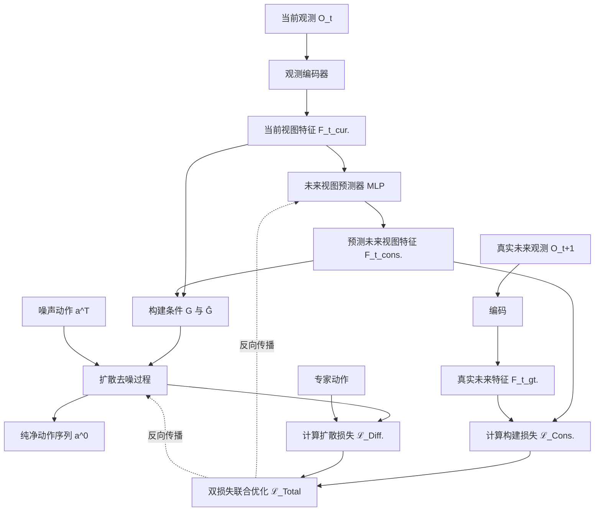

# ForeDiffusion: Foresight-Conditioned Diffusion Policy via Future View Construction for Robot Manipulation

**相关性评分**: 8.0/10

**排名**: #13

---

## 基本信息

- **arXiv ID**: [2601.12925v1](https://arxiv.org/abs/2601.12925v1)
- **发布时间**: 2026-01-19T10:28:42Z
- **相关性评分**: 8.0/10
- **是否相关**: 是

## 作者

Weize Xie, Yi Ding, Ying He, Leilei Wang, Binwen Bai, Zheyi Zhao, Chenyang Wang, F. Richard Yu

## 关键词

Diffusion, fine tune, world model

## 一句话总结

这篇论文提出了一种基于未来视图构建的预见性扩散策略（ForeDiffusion），通过注入预测的未来视图表示来改进机器人操作中的扩散策略，解决了现有方法在复杂任务中成功率下降的问题。

## 摘要

Diffusion strategies have advanced visual motor control by progressively denoising high-dimensional action sequences, providing a promising method for robot manipulation. However, as task complexity increases, the success rate of existing baseline models decreases considerably. Analysis indicates that current diffusion strategies are confronted with two limitations. First, these strategies only rely on short-term observations as conditions. Second, the training objective remains limited to a single denoising loss, which leads to error accumulation and causes grasping deviations. To address these limitations, this paper proposes Foresight-Conditioned Diffusion (ForeDiffusion), by injecting the predicted future view representation into the diffusion process. As a result, the policy is guided to be forward-looking, enabling it to correct trajectory deviations. Following this design, ForeDiffusion employs a dual loss mechanism, combining the traditional denoising loss and the consistency loss of future observations, to achieve the unified optimization. Extensive evaluation on the Adroit suite and the MetaWorld benchmark demonstrates that ForeDiffusion achieves an average success rate of 80% for the overall task, significantly outperforming the existing mainstream diffusion methods by 23% in complex tasks, while maintaining more stable performance across the entire tasks.

## 详细分析

## 论文摘要：ForeDiffusion: 通过未来视图构建实现前瞻性条件扩散策略的机器人操作

### 1. 研究背景和动机
基于扩散模型的策略通过逐步去噪高维动作序列，已成为视觉运动控制领域的一种先进方法。然而，随着任务复杂性增加，现有基线模型的成功率显著下降。分析表明，当前扩散策略面临两大局限：**首先**，它们仅依赖短期观测作为条件，缺乏对未来的预见性；**其次**，训练目标局限于单一的去噪损失，导致误差累积和抓取偏差。为解决这些问题，本文提出了**前瞻性条件扩散策略（ForeDiffusion）**。

### 2. 核心方法和技术创新
ForeDiffusion的核心创新在于将**预测的未来视图表示**注入扩散过程，引导策略具备前瞻性，从而纠正轨迹偏差。具体技术贡献包括：
- **未来视图构建**：利用多层感知机（MLP）从当前观测（包含相邻时间帧的3D点云和本体感知状态）中预测一个紧凑的未来场景表示。
- **前瞻性条件去噪**：在扩散模型的每一步去噪迭代中，同时以当前观测编码（全局条件 **G**）和预测的未来视图编码（未来条件 **Ĝ**）为条件，指导动作生成。
- **双损失机制**：提出一种联合优化目标，结合了传统的**去噪损失**和未来观测的**一致性损失**，以平衡局部动作精度与长时程任务连贯性，有效抑制误差累积。

### 3. 主要实验结果
在Adroit套件和MetaWorld基准上的广泛评估表明：
- **整体性能领先**：ForeDiffusion在全部任务上取得了**80.6%**的平均成功率，显著优于现有主流扩散方法。
- **复杂任务优势**：在MetaWorld的复杂任务（中、难、极难级别）中，平均成功率比最佳基线（3D Diffusion Policy）**提升高达23%**，尤其在极难任务上优势明显。
- **高效学习**：在低示范数据情况下（如仅10条示范），ForeDiffusion能更快达到高成功率，展现了卓越的样本效率。
- **消融实验验证**：实验证实，在扩散网络的中期阶段注入未来视图，以及使用固定权重的双损失策略，能带来最佳性能。

### 4. 研究意义和价值
本研究通过引入**前瞻性机制**和**双目标监督**，有效解决了扩散策略在长时程、接触密集型复杂操作任务中性能骤降的瓶颈问题。ForeDiffusion不仅提升了策略的鲁棒性和成功率，其模块化设计也为未来将更丰富的预测信息（如物理交互、多模态信号）集成到扩散框架中提供了新思路，推动了扩散策略向更智能、更可靠的机器人实际应用迈进。

## 问答对

### 问题 1

**Q**: 这篇论文的核心创新点是什么，他想解决什么问题，怎么解决的？

**A**: ## 论文核心分析：ForeDiffusion

### **一、 论文旨在解决的核心问题**
当前基于扩散模型的机器人视觉运动控制策略在**复杂、长时程、接触密集型**的操纵任务中面临两大关键瓶颈：
1.  **短视的观测条件**：现有方法仅以当前或短期的观测（如RGB图像或点云）作为扩散过程的生成条件，缺乏对未来场景演变的建模。这导致策略无法预见长期后果，在需要多步骤交互的任务中容易产生轨迹偏差。
2.  **单一的训练目标**：训练仅依赖于基础的**去噪损失**，该损失只保证单步动作的局部准确性，缺乏对完整任务轨迹的全局一致性监督。这会造成误差在任务执行过程中逐步累积，最终导致任务失败（如抓取不稳、物体错位）。

### **二、 核心创新点**
论文提出了 **ForeDiffusion** 框架，其创新性主要体现在以下三个紧密关联的方面：

1.  **前瞻性条件注入机制**
    - **核心思想**：在扩散模型的每一步去噪过程中，不仅注入当前的观测信息，还注入一个**预测的未来视图表示**。
    - **实现方式**：
        - **未来视图构建**：使用一个多层感知机，根据当前时刻 `t` 的观测（包含点云和机器人本体状态），预测出 `t+1` 时刻的紧凑场景表示 `F_t^{cons.`。
        - **条件融合**：将当前观测编码 `F_t^{cur.` 和预测的未来视图 `F_t^{cons.` 分别与时间戳编码结合，形成**全局条件 `G`** 和**未来条件 `Ĝ`**，共同指导去噪网络 `ϵ_θ`。

2.  **双损失联合优化目标**
    - **核心思想**：引入一个额外的损失项，与传统的去噪损失共同监督模型训练，以同时保证动作生成的局部准确性和长期轨迹的一致性。
    - **损失函数构成**：
        - **扩散损失 `ℒ_Diff.`**：标准的去噪损失，确保生成的动作接近专家演示。
        - **构建损失 `ℒ_Cons.`**：均方误差损失，强制要求预测的未来视图 `F_t^{cons.` 逼近真实的未来观测编码 `F_t^{gt.`。
        - **总损失 `ℒ_ForeDiffusion = ℒ_Diff. + β · ℒ_Cons.`**：通过超参数 `β` 平衡两项损失。

3.  **模块化与高效的架构设计**
    - **注入时机选择**：通过消融实验发现，将未来条件在U-Net的**中间阶段**注入，比在输入阶段注入效果更好。这能在保留早期特征学习的同时，更有效地利用未来信息修正生成轨迹。
    - **基于3D表示的感知**：沿用并改进了3D Diffusion Policy的骨干网络，使用点云编码器处理RGB-D输入，增强了空间理解能力。

### **三、 解决方案的运作逻辑**
ForeDiffusion的解决方案形成了一个完整的“**预见-规划-校正**”闭环：

**流程解释**：
1.  **感知与预测**：模型接收当前观测，并**即时预测**出下一步的场景表示。
2.  **条件化生成**：扩散模型在去噪生成动作序列时，同时受到“现在在哪里”和“预计会去哪里”两种信息的约束。
3.  **双重监督**：训练时，模型不仅学习模仿专家的动作，还被强制要求学会准确预测未来。这使得学到的策略**内在地**具备了向前看的能力，能够在动作生成早期就规避可能导致未来失败的轨迹。

### **四、 实际价值与效果**
- **性能提升**：在Adroit和MetaWorld基准测试中，ForeDiffusion取得了**80.6%** 的平均成功率。在最具挑战性的复杂任务上，相比当时最强的基线方法（如DP3），**成功率提升了23%**。
- **关键优势**：
    - **应对复杂任务**：在长时程、多接触的任务上表现尤为突出，成功解决了现有方法性能骤降的问题。
    - **高样本效率**：在演示数据极少的情况下，仍能快速学习并达到高成功率，证明了其强大的泛化与表征学习能力。
    - **稳定性强**：双损失设计和未来视图的引入有效抑制了误差累积，使策略在整个任务执行过程中更加稳定可靠。

**总结**：ForeDiffusion的核心创新在于为扩散策略引入了**显式的、通过学习获得的前瞻能力**。它通过一个简洁而巧妙的“预测未来-条件生成-双重监督”框架，将长时程规划的思想融入到了基于扩散模型的模仿学习之中，显著提升了机器人策略在复杂操纵任务中的鲁棒性和成功率。

### 问题 2

**Q**: 请用一段话总结这篇论文，明确说明：论文试图解决的核心问题；提出的主要方法或框架；最终取得的主要效果或结论。要求语言简洁、信息密度高，不要复述摘要原文。

**A**: ## 论文总结

这篇论文旨在解决现有基于扩散模型的机器人操作策略在复杂、长时程任务中性能显著下降的核心问题。其根本原因在于现有方法仅依赖短期观测作为条件，且训练目标单一（仅去噪损失），导致误差累积和轨迹偏差。

为此，论文提出了 **ForeDiffusion** 框架。其核心创新在于**前瞻性条件注入**：模型通过一个多层感知机（MLP）从当前观测中预测一个紧凑的未来场景表征，并将此“未来视图”作为额外条件注入到扩散模型的每一步去噪过程中，使策略具备前瞻性。同时，论文设计了**双重损失机制**，将标准的去噪损失与未来视图预测的一致性损失相结合进行联合优化，以抑制误差传播。

实验结果表明，该方法在Adroit和MetaWorld基准测试中取得了显著提升，**平均任务成功率达到了80.6%**，在最具挑战性的复杂任务上，其成功率比现有主流扩散方法（如3D Diffusion Policy）**高出23%**，有效证明了该方法在提升策略鲁棒性、数据效率和长时程规划能力方面的优越性。

### 问题 3

**Q**: 这篇论文相对于已有工作有哪些明确的创新点？请逐条列出，并对每一条说明：相比以往方法改进或不同之处在哪里，以及该创新解决了什么具体问题或带来了什么优势。

**A**: ## 论文创新点分析

这篇论文《ForeDiffusion: Foresight-Conditioned Diffusion Policy via Future View Construction for Robot Manipulation》针对现有基于扩散模型的机器人操作策略在复杂任务中性能下降的问题，提出了明确的创新点。其核心思想是**为扩散策略注入前瞻性**，以应对长时程、接触密集型任务中的误差累积问题。

以下是其相对于已有工作的主要创新点：

### 1. **前瞻性条件注入机制**
- **改进/不同之处**： 现有扩散策略（如Diffusion Policy, DP3）通常仅以**短期历史观测**（如当前及前一时刻的RGB-D和本体感知状态）作为条件来生成动作。ForeDiffusion则引入了一个**未来视图构建模块**，该模块通过一个MLP，基于当前观测预测一个紧凑的未来场景表征（`F_t^cons.`），并将此“未来视图”与当前观测一起作为条件注入到扩散模型的去噪过程中。
- **解决的问题与优势**： 这解决了现有方法因**缺乏对未来场景演变的显式建模**而导致的短视问题。在长时程任务中，微小的控制误差会随时间累积，最终导致任务失败。通过注入对未来状态的预测，策略具备了“前瞻”能力，能够在动作生成早期就考虑到未来可能的状态，从而**主动纠正轨迹偏差**，提高了在复杂、多阶段交互任务中的鲁棒性和成功率。

### 2. **双损失训练目标**
- **改进/不同之处**： 以往扩散策略的训练目标通常**单一**，主要集中于去噪损失（`L_Diffusion`），即让模型学会从噪声中重建专家动作。ForeDiffusion提出了一个**双损失机制**，将标准的去噪损失与一个**未来视图一致性损失**（`L_Construction`）相结合。总损失为 `L_ForeDiffusion = L_Diff. + β · L_Cons.`。
- **解决的问题与优势**： 单一的去噪损失只保证了**局部动作的准确性**，缺乏对**完整任务轨迹一致性**的全局引导。这容易导致动作序列在长时程任务中出现不连贯、抓取不稳或过渡不佳等问题。新增的一致性损失强制模型学习到的未来视图预测与真实的未来观测对齐，这为策略提供了**长时程的监督信号**。双目标联合优化确保了策略在生成准确单步动作的同时，也保持了与任务最终目标的长期一致性，从而**有效遏制了误差累积**。

### 3. **未来视图在扩散过程中的中阶段注入策略**
- **改进/不同之处**： 论文通过消融实验（RQ4）探索了未来视图信息的注入时机。对比了“无未来视图”、“早期注入”（在U-Net输入阶段融合）和“中阶段注入”（在U-Net中间层注入）三种方式。
- **解决的问题与优势**： 实验结果表明，“中阶段注入”效果最佳。早期注入可能导致未来上下文信息在漫长的前向传播中被稀释，而中阶段注入能**在扩散过程的关键决策阶段直接影响生成轨迹**，同时保留了早期层对基础特征的学习。这种设计使未来信息的利用**更高效、更具结构性**，是提升性能的关键架构细节。

### 4. **性能与效率的显著提升**
- **改进/不同之处**： 在Adroit和MetaWorld基准测试中，ForeDiffusion在**整体任务**上达到了80.6%的平均成功率，尤其在MetaWorld的**复杂任务**（Hard, Very Hard）上，相比之前最强的基线方法（如DP3），**成功率提升了23%**。同时，在**数据效率**方面，仅需少量专家示教（如10条）就能达到很高性能，收敛速度更快。
- **解决的问题与优势**： 这直接解决了引言中指出的现有扩散模型在**任务复杂度增加时成功率急剧下降**的核心问题。创新点1-3共同作用，使模型不仅**峰值性能更高**，而且在最具挑战性的任务上表现出**更优异的泛化能力和稳定性**。更高的数据效率也降低了机器人学习对大规模示教数据的依赖，更具实用价值。

---

### 总结：创新点之间的逻辑关系

这些创新点构成了一个连贯的技术体系：
1.  **核心思想（创新点1）**： 通过构建并注入未来视图，赋予策略前瞻能力。
2.  **训练保障（创新点2）**： 通过双损失机制，确保未来视图预测的准确性，并为策略提供长时程监督。
3.  **实现优化（创新点3）**： 通过中阶段注入的工程优化，最大化未来信息的利用效率。
4.  **最终体现（创新点4）**： 上述创新共同导致了在复杂机器人操作任务上**性能与鲁棒性的实质性突破**。

因此，ForeDiffusion的核心贡献在于**将显式的未来预测与世界模型思想，以一种紧凑、高效的方式融入到了扩散策略框架中**，从而显著提升了其在长时程、接触密集型操作任务中的决策质量。

### 问题 4

**Q**: 论文在实验或评估中最终实现了怎样的效果？请说明使用了哪些数据集和评价指标，与哪些基线方法进行了对比，以及在关键指标上的主要性能提升或结论。如果论文未给出明确的定量结果，也请说明原因。

**A**: ## 论文实验与评估效果总结

### 数据集与评价指标
- **数据集**：
    - **Adroit Suite**：专注于高自由度灵巧手操作的复杂运动控制任务（如Hammer、Pen、Door）。
    - **MetaWorld Benchmark**：基于MuJoCo物理模拟器的机器人操作任务库，任务按复杂度分为Easy、Medium、Hard、Very Hard四个等级。其中Medium、Hard、Very Hard被定义为**复杂任务**。
- **评价指标**：
    - **主要指标**：**平均成功率（Average Success Rate）**。
    - **评估协议**：每个实验使用3个随机种子（0, 1, 2）。在训练过程中，每200个epoch使用15次rollout进行评估，总计3000个episode。最终性能报告为3个种子的平均成功率及其标准差。
    - **辅助分析**：学习效率（随演示数据量增加的成功率曲线）、任务复杂度适应性、消融实验（注入位置、损失权重敏感性）。

### 对比的基线方法
论文与5种主流的基于扩散模型的机器人策略进行了全面对比：
1.  **Diffusion Policy (DP)**：基于RGB观测的单阶段条件动作生成方法。
2.  **3D Diffusion Policy (DP3)**：使用3D点云表征增强空间理解的扩散策略。
3.  **FlowPolicy**：通过隐式时间建模增强轨迹一致性的方法。
4.  **ManiCM**：将多模态输入集成到一致性驱动的3D扩散框架中的方法。
5.  **SDM Policy**：采用师生蒸馏进行加速推理的方法。

### 关键性能提升与结论
#### 1. 整体性能领先
在Adroit和MetaWorld的**所有任务类型**上，ForeDiffusion取得了最高的**平均成功率（80.56%）**，显著优于最强的基线SDM Policy（74.81%），提升了约5.75个百分点。

#### 2. 在复杂任务上表现尤为突出
这是论文的核心贡献。在MetaWorld的**Medium、Hard、Very Hard**复杂任务上，ForeDiffusion的优势更加明显：
- **平均成功率**：达到**71%**。
- **性能提升**：相比表现次优的基线DP3（48%），**绝对提升了23个百分点**。相比基础的Diffusion Policy（26%），提升幅度高达45个百分点。
- **具体任务表现**：在“Pick Place Wall (PPW)”和“Stick Push (SPh)”等极具挑战性的Very Hard任务上，成功率分别达到**92%**和**100%**，而基线方法在这些任务上表现大幅下滑（例如FlowPolicy在Very Hard任务上平均仅36%）。

#### 3. 学习效率高
- **低数据 regime 下优势明显**：在仅有10个专家演示的情况下，ForeDiffusion在多个任务上能达到90%以上的成功率，而DP3需要50个演示才能达到相近水平。
- **收敛速度快**：成功率曲线显示，ForeDiffusion比DP3收敛更快、更稳定。

#### 4. 方法设计的有效性验证（通过消融实验）
- **前瞻视图注入至关重要**：移除前瞻视图（`w/o Future view`）会导致性能大幅下降（平均成功率从70.3%跌至50.5%），证明了其核心价值。
- **注入位置有讲究**：在U-Net的**中期阶段（Mid-Stage）**注入未来视图条件，效果优于在早期输入阶段注入，说明在扩散过程的关键结构点引入前瞻信息最有效。
- **双损失机制有效且稳定**：采用**固定权重**的双损失（扩散损失 + 未来视图构建损失）取得了最佳性能（70.3%），优于动态权重或仅使用扩散损失，表明对未来预测的一致性监督能稳定提升长时程任务的性能。

### 结论
论文通过系统的实验评估，定量证明了**ForeDiffusion在解决复杂、长时程、接触密集的机器人操作任务上具有显著优势**。其核心创新——**通过构建并注入未来视图表征来赋予扩散策略前瞻能力，并结合双损失进行优化**——有效缓解了传统扩散策略在复杂任务中因短视决策和误差累积导致的性能骤降问题，实现了更鲁棒、更高效的视觉运动控制。

## 相关链接

- [arXiv 页面](https://arxiv.org/abs/2601.12925v1)
- [HTML 版本](https://arxiv.org/html/2601.12925v1)
