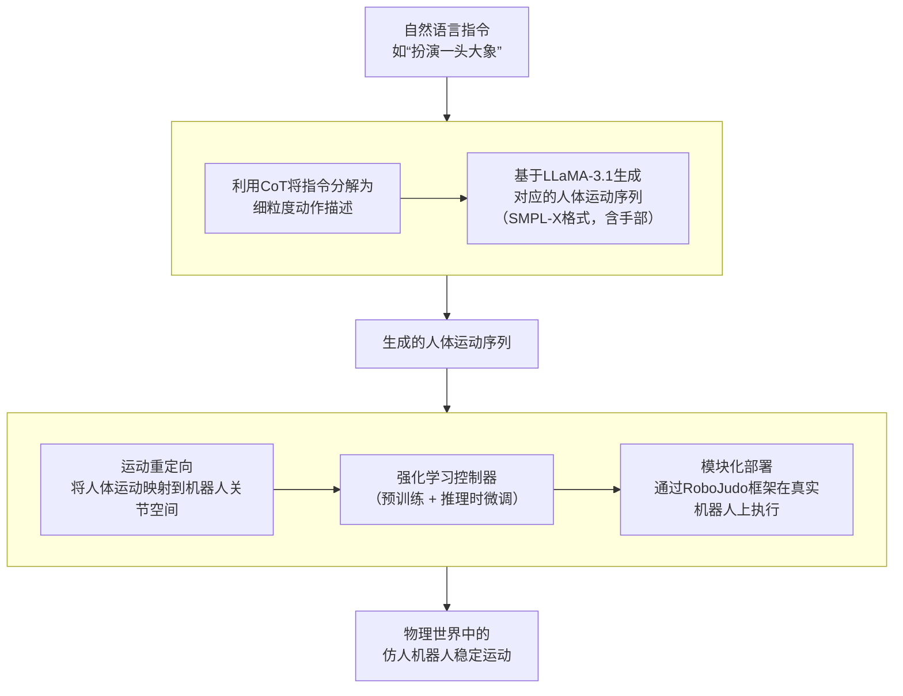

# FRoM-W1: Towards General Humanoid Whole-Body Control with Language Instructions

**相关性评分**: 7.0/10

**排名**: #23

---

## 基本信息

- **arXiv ID**: [2601.12799v1](https://arxiv.org/abs/2601.12799v1)
- **发布时间**: 2026-01-19T07:59:32Z
- **相关性评分**: 7.0/10
- **是否相关**: 是

## 作者

Peng Li, Zihan Zhuang, Yangfan Gao, Yi Dong, Sixian Li, Changhao Jiang, Shihan Dou, Zhiheng Xi, Enyu Zhou, Jixuan Huang, Hui Li, Jingjing Gong, Xingjun Ma, Tao Gui, Zuxuan Wu, Qi Zhang, Xuanjing Huang, Yu-Gang Jiang, Xipeng Qiu

## 关键词

Vision-Language-Action Model, VLA for Robotics, fine tune, offline Reinforcement Learning, goal conditioned reinforcement learning, world model

## 一句话总结

FRoM-W1是一个开源框架，通过语言指令实现通用人形机器人全身运动控制，结合大规模语言驱动运动生成和强化学习微调，并在真实机器人上部署。

## 摘要

Humanoid robots are capable of performing various actions such as greeting, dancing and even backflipping. However, these motions are often hard-coded or specifically trained, which limits their versatility. In this work, we present FRoM-W1, an open-source framework designed to achieve general humanoid whole-body motion control using natural language. To universally understand natural language and generate corresponding motions, as well as enable various humanoid robots to stably execute these motions in the physical world under gravity, FRoM-W1 operates in two stages: (a) H-GPT: utilizing massive human data, a large-scale language-driven human whole-body motion generation model is trained to generate diverse natural behaviors. We further leverage the Chain-of-Thought technique to improve the model's generalization in instruction understanding. (b) H-ACT: After retargeting generated human whole-body motions into robot-specific actions, a motion controller that is pretrained and further fine-tuned through reinforcement learning in physical simulation enables humanoid robots to accurately and stably perform corresponding actions. It is then deployed on real robots via a modular simulation-to-reality module. We extensively evaluate FRoM-W1 on Unitree H1 and G1 robots. Results demonstrate superior performance on the HumanML3D-X benchmark for human whole-body motion generation, and our introduced reinforcement learning fine-tuning consistently improves both motion tracking accuracy and task success rates of these humanoid robots. We open-source the entire FRoM-W1 framework and hope it will advance the development of humanoid intelligence.

## 详细分析

## 论文《FRoM-W1：迈向基于语言指令的通用人形机器人全身控制》详细摘要

### 1. 研究背景和动机
人形机器人能够执行问候、舞蹈甚至后空翻等多种动作，但这些动作通常依赖于硬编码或专门训练，限制了其通用性。为了实现自然的人机交互，核心挑战在于如何让机器人理解多样的自然语言指令，并在真实物理世界中稳定地执行相应的全身动作。现有方法面临两大难题：**缺乏大规模语言-机器人动作配对数据**，以及**生成的机器人动作在重力等动态因素下难以稳定执行**。

### 2. 核心方法和技术创新
本文提出了一个开源框架 **FRoM-W1**，通过两阶段流程解决上述问题：
- **H-GPT（语言到人体动作生成）**：利用大规模人体动作数据，基于LLaMA-3.1大语言模型训练了一个90亿参数的生成模型。创新性地引入**思维链（CoT）** 技术，将抽象指令分解为细粒度、有时序结构的动作描述，显著提升了模型对复杂指令的理解和泛化能力。模型使用VQ-VAE将人体动作（含手部）离散化为令牌，与语言令牌统一处理。
- **H-ACT（人体动作到机器人执行）**：首先将生成的人体动作（SMPL-X格式）通过逆向运动学和优化方法**重定向**到特定机器人形态。然后，在物理模拟器中采用**两阶段强化学习策略**：先在大规模人体动作数据集上进行**预训练**，得到一个通用的全身运动控制器；在推理时，针对特定生成动作进行**强化学习微调**，以提升跟踪精度和稳定性。最后，通过一个**模块化的仿真到现实部署框架**，将控制器部署到真实机器人上。

### 3. 主要实验结果
- **动作生成**：在构建的HumanML3D-X基准测试上，H-GPT的FID指标比基线T2M-GPT提升了2.5倍。在测试泛化能力的δ-HumanML3D-X基准上，CoT的引入进一步提升了模型对指令改写和加噪的理解能力。
- **机器人控制**：在Unitree H1和G1机器人上的仿真实验表明，所提出的强化学习微调策略能持续提升动作跟踪成功率，并将平均关节位置误差降低了15%。
- **现实部署**：框架成功在真实的H1和G1机器人上执行了由语言指令生成的多种动作（如“扮演大象”、“拉小提琴”），并展示了其部署框架能兼容HugWBC、TWIST等其他主流控制策略。

### 4. 研究意义和价值
FRoM-W1是首个**完全开源**的、实现从语言指令到人形机器人全身控制的全流程框架。其核心贡献在于：
- **技术整合与创新**：将大语言模型的推理能力、大规模人体动作数据与机器人强化学习控制相结合，通过CoT和两阶段RL训练策略，有效弥合了语言、人体动作与机器人稳定执行之间的鸿沟。
- **推动领域发展**：提供了完整的代码、模型、基准测试和轻量级部署模块，为语言引导的机器人全身控制研究建立了可复现的基线，降低了研究门槛。
- **迈向通用机器人智能**：该框架为实现能理解开放指令、并在物理世界中稳定执行复杂动作的通用人形机器人迈出了重要一步，为人机自然交互和机器人技能学习提供了新范式。

## 问答对

### 问题 1

**Q**: 这篇论文的核心创新点是什么，他想解决什么问题，怎么解决的？

**A**: ## 论文核心分析：FRoM-W1

### **一、 研究目标与核心问题**
这篇论文旨在解决一个关键挑战：**如何让仿人机器人理解开放式的自然语言指令，并在真实物理世界中稳定地执行对应的全身运动。**

当前仿人机器人（如Unitree H1/G1）虽然能完成复杂动作（如后空翻、跳舞），但这些动作通常是**硬编码**或**针对特定任务专门训练**的，缺乏通用性和灵活性。这限制了机器人在非结构化环境中与人类进行自然交互的能力。

### **二、 核心创新点**
论文提出了一个名为 **FRoM-W1** 的**开源、端到端框架**，其核心创新在于一个**两阶段、脑启发式的架构**，灵感来源于人类大脑的“大脑皮层”（负责语义理解与规划）和“小脑”（负责稳定运动执行）的分工协作。

#### **1. 技术创新**
- **双模块架构**：
    - **`H-GPT` (Human Motion Generator)**：负责“理解与规划”。这是一个基于LLaMA-3.1的90亿参数大模型，能够根据自然语言指令生成包含手部动作的全身人体运动序列。
    - **`H-ACT` (Humanoid Actor)**：负责“稳定执行”。它将`H-GPT`生成的人体运动**重定向**到特定机器人形态，并通过强化学习训练一个全身运动控制器，在物理仿真中预训练，并在推理时针对特定动作进行**微调**，以实现高精度、稳定的跟踪。

- **链式思维增强**：在`H-GPT`的训练和推理中引入**Chain-of-Thought**技术。利用大语言模型（如GPT-4o）将抽象或复杂的指令（如“扮演一头大象”）分解为具有明确时间结构的、细粒度的动作基元描述。这显著提升了模型对复杂和抽象指令的理解与泛化能力。

- **两阶段强化学习策略**：
    - **预训练**：在大规模人体运动数据集（AMASS）上训练一个通用的运动跟踪控制器。
    - **推理时微调**：在部署前，针对`H-GPT`生成的**特定目标动作**，在仿真中对该控制器进行短时间的强化学习微调。这使控制器能更精确地跟踪该动作，同时保持全身稳定性，**将运动跟踪成功率提升了约15%**。

- **模块化仿真到现实部署框架 (`RoboJudo`)**：设计了一个轻量级、通用的部署接口，不仅支持其默认控制器，还能无缝集成其他主流运动模仿控制器（如HugWBC, TWIST），实现了**策略无关**和**平台无关**的部署。

#### **2. 贡献与价值**
- **系统性贡献**：提供了一个**完整、开源**的解决方案，涵盖了从语言理解、运动生成、运动重定向、控制器训练到真实机器人部署的全链条。
- **基准贡献**：构建并开源了两个新的评估基准：
    - **HumanML3D-X**：扩展了原有基准，包含手部动作的全身运动生成评估。
    - **δ-HumanML3D-X**：用于评估模型对指令改写和加噪的**泛化能力**。
- **实践价值**：在真实的Unitree H1和G1机器人上成功验证了框架的可行性，展示了处理抽象指令、手部动作和移动后动作的能力。

### **三、 解决方案：技术路径详解**
FRoM-W1的完整工作流程如下图所示，其核心是将复杂问题分解为两个可管理的阶段：

#### **阶段一：H-GPT（从语言到人体运动）**
1.  **数据增强**：利用GPT-4o为现有人体运动数据集（HumanML3D-X, Motion-X）中的文本描述生成**链式思维**中间表示，桥接抽象语言与具体动作。
2.  **运动分词器**：使用VQ-VAE技术将连续的人体运动序列（SMPL-X格式）离散化为**运动token**，使其能够与语言token在同一个序列中被大模型处理。
3.  **运动生成器**：在LLaMA-3.1基础上，通过LoRA进行高效微调，使其能够根据指令自回归地生成CoT文本和运动token序列，再解码为连续运动。

#### **阶段二：H-ACT（从人体运动到机器人执行）**
1.  **运动重定向**：使用逆向运动学将生成的人体3D关键点转换为SMPL-X姿态参数，再通过优化算法将其映射到目标机器人（如H1, G1）的关节空间，考虑关节限位等物理约束。
2.  **控制器训练**：
    - **预训练**：在IsaacGym仿真中，使用教师-学生架构，在大规模重定向后的运动数据上训练一个通用的跟踪策略。
    - **微调**：在推理时，针对`H-GPT`生成的**单个目标动作**，快速微调预训练的策略，使其专门优化对该动作的跟踪精度和稳定性。
3.  **仿真到现实部署**：通过`RoboJudo`框架，将训练好的策略部署到真实机器人。该框架抽象了机器人硬件接口和策略接口，支持灵活的策略切换和组合。

### **四、 实验验证与关键结果**
1.  **运动生成质量**：在HumanML3D-X基准上，`H-GPT`的**FID指标（主要指标）达到0.229**，比基线T2M-GPT（0.677）提升了约2.5倍，表明生成运动更接近真实分布。
2.  **指令泛化能力**：在δ-HumanML3D-X基准上，**引入CoT的`H-GPT`模型在指令改写和加噪场景下，FID显著优于无CoT版本**，证明了其更好的语言理解鲁棒性。
3.  **控制性能提升**：**强化学习微调策略**使机器人在仿真中的运动跟踪误差（MPJPE）平均降低，**任务成功率（SR）提升约15%**。
4.  **真实世界演示**：在Unitree H1和G1机器人上成功执行了由语言生成的多种动作，包括抽象表演（如“扮演大象”）、手部动作（如“拉小提琴”）以及复合动作（如“走几步后接电话”）。

### **五、 总结**
**FRoM-W1** 的核心创新在于提出了一个**统一、开源、可泛化**的框架，首次将**大语言模型的语义理解能力**、**大规模人体运动数据的先验知识**以及**仿人机器人强化学习控制**紧密结合，实现了从开放语言指令到真实物理执行的闭环。其**两阶段脑启发设计**和**推理时强化学习微调**是关键的技术亮点，为迈向通用仿人机器人智能迈出了坚实的一步。论文开源的代码、模型和基准将极大地推动该领域的研究与发展。

### 问题 2

**Q**: 请用一段话总结这篇论文，明确说明：论文试图解决的核心问题；提出的主要方法或框架；最终取得的主要效果或结论。要求语言简洁、信息密度高，不要复述摘要原文。

**A**: 这篇论文旨在解决**人形机器人如何通过自然语言指令实现通用、稳定的全身运动控制**这一核心问题。针对语言理解与运动生成数据稀缺、以及生成动作在物理世界中执行易失稳两大挑战，论文提出了一个名为 **FRoM-W1** 的两阶段开源框架。该框架首先通过 **H-GPT** 模块（基于LLaMA大语言模型并引入思维链技术）将语言指令转化为包含手部动作的全身人体运动；然后通过 **H-ACT** 模块，将人体运动重定向到特定机器人，并采用**预训练与强化学习微调相结合**的策略，训练出一个能在物理仿真和真实世界中稳定、精确跟踪这些运动的控制器。实验表明，该框架在人体运动生成基准上取得了显著性能提升，其强化学习微调策略有效提高了机器人动作跟踪的准确性和成功率，并在Unitree H1和G1机器人上成功实现了从抽象语言指令到稳定物理执行的端到端验证。

### 问题 3

**Q**: 这篇论文相对于已有工作有哪些明确的创新点？请逐条列出，并对每一条说明：相比以往方法改进或不同之处在哪里，以及该创新解决了什么具体问题或带来了什么优势。

**A**: ## 论文《FRoM-W1: Towards General Humanoid Whole-Body Control with Language Instructions》的创新点分析

这篇论文提出了一个名为 **FRoM-W1** 的开源框架，旨在通过自然语言指令实现通用的人形机器人全身控制。其核心创新点主要体现在以下几个方面：

---

### 1. **引入两阶段框架，明确分离“语义理解/运动生成”与“物理执行”**
   - **改进/不同之处**：以往工作（如RobotMDM、Harmon、UH-1）通常将语言到机器人动作的映射设计为端到端模型，或使用小型专用模型生成机器人动作。FRoM-W1 则明确分为两个阶段：
     - **H-GPT**：基于大规模人类数据，训练语言驱动的**人类全身运动生成模型**。
     - **H-ACT**：将生成的人类运动重定向到特定机器人，并通过强化学习训练控制器在物理仿真中稳定执行。
   - **解决的问题/优势**：
     - **解决数据稀缺问题**：避免了直接需要“语言-机器人动作”配对的大规模数据集，转而利用丰富的人类运动数据（如HumanML3D-X、Motion-X）。
     - **提升泛化能力**：人类运动作为中间表示，使框架能轻松适配不同形态的机器人（如Unitree H1和G1）。
     - **增强稳定性**：物理执行阶段专门处理重力、动力学不确定性等现实挑战，避免直接执行生成动作导致的不稳定。

---

### 2. **在运动生成阶段引入链式思维（Chain-of-Thought, CoT）技术**
   - **改进/不同之处**：现有文本到运动生成模型（如T2M-GPT、MotionGPT）通常直接映射文本到运动。FRoM-W1 使用GPT-4o为每个指令生成**细粒度的、具有时间结构的动作描述（CoT）**，作为运动生成的中间步骤。
   - **解决的问题/优势**：
     - **提升对复杂/抽象指令的理解能力**：CoT 将抽象指令（如“扮演大象”）分解为具体的身体动作序列，使模型能更好地处理训练数据中未出现的指令。
     - **提高生成质量与泛化性**：在论文构建的 **δ-HumanML3D-X** 基准测试（包含指令改写和噪声干扰）上，引入CoT的模型在FID指标上显著优于基线（见表2），证明了其对语言变化的鲁棒性。

---

### 3. **提出两阶段强化学习策略：预训练 + 推理时微调**
   - **改进/不同之处**：现有运动模仿控制器（如OmniH2O、TWIST）通常只进行大规模预训练。FRoM-W1 在 **H-ACT** 模块中增加了 **推理时强化学习微调**：
     - **RPT**：使用大规模人类运动数据集（AMASS）预训练通用跟踪控制器。
     - **RFT**：在推理时，针对 **H-GPT** 生成的**特定目标运动**，在仿真中进行短时微调。
   - **解决的问题/优势**：
     - **提高跟踪精度与成功率**：微调使控制器能更好地适应目标运动的动力学特性。实验显示，RFT 使MPJPE（关节位置误差）提升约15%，成功率（SR）持续提高（见图9）。
     - **平衡通用性与特异性**：预训练提供通用运动能力，微调则针对特定动作优化，兼顾了效率与性能。

---

### 4. **设计并开源模块化的仿真到现实部署框架**
   - **改进/不同之处**：论文提出了 **RoboJudo** 框架，将控制器、环境抽象层和策略模块解耦，提供统一接口。它不仅支持其默认控制器，还能无缝集成其他主流控制策略（如HugWBC、TWIST）。
   - **解决的问题/优势**：
     - **提升部署灵活性与兼容性**：研究者可轻松切换或组合不同控制策略，无需重写底层通信代码。
     - **加速实验迭代**：统一的仿真/现实接口降低了从仿真迁移到实机的工程负担。
     - **促进社区复用**：开源完整的训练代码、模型检查点和部署模块，降低了研究门槛。

---

### 5. **构建并开源新的评估基准与数据集**
   - **改进/不同之处**：
     - **HumanML3D-X**：扩展了HumanML3D，将SMPL格式（无手部）升级为**包含手部动作的SMPL-X格式**，更适合全身运动生成评估。
     - **δ-HumanML3D-X**：进一步引入指令改写和噪声干扰，专门用于评估模型对**语言变化的泛化能力**。
   - **解决的问题/优势**：
     - **填补评估空白**：现有基准缺乏对手部动作和语言泛化的系统评估。新基准提供了更全面的测试环境。
     - **推动公平比较**：论文在相同基准上复现并比较了多个主流方法（T2M、MotionDiffuse、MLD、T2M-GPT），为后续研究树立了基准。

---

### 6. **大规模数据扩展与基于LLM的模型架构**
   - **改进/不同之处**：
     - **数据层面**：不仅使用HumanML3D-X，还尝试利用更大规模的 **Motion-X** 数据集（包含视频估计的人类动作），探索数据缩放对模型性能的影响。
     - **模型层面**：基于 **LLaMA-3.1** 大语言模型，通过LoRA微调，将运动令牌与文本令牌在统一词汇表中处理，使模型能直接利用LLM的强大语言理解与生成能力。
   - **解决的问题/优势**：
     - **探索数据驱动的性能上限**：实验表明，更多数据（Motion-X）有潜力提升泛化能力，尽管当前数据质量仍存挑战。
     - **利用现有LLM能力**：避免了从头训练小型专用模型，更高效地实现了语言到运动的复杂映射。

---

### 总结：核心创新价值
| 创新点 | 相比以往方法的改进 | 解决的具体问题/带来的优势 |
|--------|-------------------|--------------------------|
| **两阶段框架设计** | 从“端到端”或“机器人专用生成”变为“人类运动为中介” | 解决机器人运动数据稀缺问题；提升跨机器人平台的泛化能力；物理执行更稳定 |
| **CoT增强运动生成** | 增加中间推理步骤，而非直接映射 | 提升对复杂、抽象指令的理解与生成质量；增强对语言变化的鲁棒性 |
| **两阶段RL策略** | 在推理时增加针对特定运动的微调 | 显著提高运动跟踪精度和成功率；平衡通用性与特异性 |
| **模块化部署框架** | 统一接口，支持多策略插拔 | 提升部署灵活性和实验效率；降低仿真到现实的迁移成本 |
| **新基准与数据集** | 包含手部动作和语言泛化测试 | 提供更全面的评估标准；推动领域公平比较 |
| **LLM+大规模数据** | 利用现有LLM能力和更大规模数据 | 探索性能上限；更高效地实现复杂语言到运动映射 |

**实际价值**：FRoM-W1 作为一个**完全开源**的框架，不仅在人形机器人语言控制任务上取得了先进性能（在Unitree H1/G1上验证），更重要的是通过模块化设计、新基准和详细实验，为社区提供了一个可复现、可扩展的研究平台，有望加速通用人形机器人智能的发展。

### 问题 4

**Q**: 论文在实验或评估中最终实现了怎样的效果？请说明使用了哪些数据集和评价指标，与哪些基线方法进行了对比，以及在关键指标上的主要性能提升或结论。如果论文未给出明确的定量结果，也请说明原因。

**A**: ## 实验与评估效果总结

论文通过一系列实验全面评估了 **FRoM-W1** 框架在三个核心环节的效果：语言到人体动作生成（H-GPT）、仿真环境中的仿人机器人全身控制（H-ACT）以及整个框架在真实机器人上的部署性能。

### 1. 语言到人体全身动作生成 (H-GPT)

**目标**：评估模型根据自然语言指令生成高质量、多样化且语义对齐的全身人体动作（含手部）的能力。

#### 使用的数据集
1.  **HumanML3D-X**：论文扩展的基准数据集。在原始HumanML3D（基于SMPL模型，无手部）的基础上，将动作数据升级为包含手部的**SMPL-X**格式，保留了原始文本标签。用于训练和测试模型生成全身动作的能力。
2.  **δ-HumanML3D-X**：为评估模型**语言理解泛化能力**而构建的基准。在HumanML3D-X基础上进行两种变换：
    *   **指令重述**：改变原文本标签的风格（如口语化）。
    *   **指令加噪**：在原始文本标签中加入拼写错误等噪声。
3.  **Motion-X**：当前最大的公开全身人体动作数据集（含手部）。包含大量从视频中估计的动作和由视觉语言模型生成的文本标签。用于探索**数据扩展**对模型性能的影响。

#### 评价指标
采用文本驱动动作生成领域的标准评估指标：
*   **Fréchet Inception Distance (FID) ↓**：**核心指标**。衡量生成动作与真实动作在特征分布上的距离，值越低表示生成质量越高、越真实。
*   **检索精度 Top-k (R Top-k) ↑**：通过检索方法衡量文本与动作的匹配精度。
*   **多模态距离 (MM Dist) ↓**：衡量文本与生成动作特征之间的距离。
*   **多样性 (DIV) →**：衡量生成动作本身的多样性，值应接近真实数据。
*   **多模态性 (MModality) ↑**：衡量同一文本下生成不同动作的多样性。

#### 对比的基线方法
论文与四类主流文本到动作生成方法进行了对比：
*   **T2M**：基于自编码器和循环神经网络的模型。
*   **MotionDiffuse**：基于线性注意力扩散模型的模型。
*   **MLD**：基于潜在扩散模型的模型。
*   **T2M-GPT**：基于独立Transformer解码器的自回归模型。

#### 关键性能与结论
1.  **在HumanML3D-X基准上的卓越性能**：
    *   **H-GPT（无CoT）** 在核心指标**FID上取得了最佳成绩（0.229）**，相比最强的基线T2M-GPT（0.677）有**约2.5倍的显著提升**。这表明H-GPT能生成更接近真实数据分布的高质量动作。
    *   在动作**多样性（DIV）** 指标上也达到了最佳（9.674），接近真实数据（9.811）。
    *   论文指出，在追求更高FID（更好的分布拟合）时，**文本-动作匹配指标（R Top-1, MM Dist）可能会轻微下降**，因为模型更倾向于生成常见、区分度较低的动作。

2.  **Chain-of-Thought (CoT) 有效提升泛化能力**：
    *   在更具挑战性的 **δ-HumanML3D-X 基准**上，**引入CoT的H-GPT模型展现了更强的泛化能力**。
    *   在“指令重述”和“指令加噪”两种场景下，H-GPT（带CoT）的**FID均显著优于不带CoT的版本及其他所有基线**。例如，在指令加噪场景下，FID从0.830（无CoT）提升至0.602（有CoT）。
    *   在人工设计的50条复杂和50条抽象指令的定性评估中，带CoT的模型在多数情况下生成了更合理的动作。

3.  **数据扩展的探索与发现**：
    *   使用更大规模的Motion-X数据训练了`H-GPT++`模型。
    *   结果发现，在HumanML3D-X测试集上，`H-GPT++`的性能**并未超越**仅在HumanML3D-X上训练的`H-GPT`。
    *   **结论**：从视频估计的动作数据与精确动作捕捉数据存在**分布和质量上的差异**，当前利用海量视频数据提升模型泛化能力的方法仍有很大改进空间。

### 2. 仿人机器人全身控制在仿真环境中的表现 (H-ACT)

**目标**：评估生成的机器人动作能否被控制器在物理仿真中稳定、准确地跟踪执行。

#### 使用的数据集
*   **AMASS 动作数据集**：用于对Unitree H1和G1机器人进行**强化学习预训练（RPT）**，学习一个通用的动作跟踪控制器。

#### 评价指标
*   **平均每关节位置误差 (MPJPE) ↓**：机器人实际关节位置与参考动作目标位置之间的平均误差。**核心跟踪精度指标**。
*   **关节速度误差 (VEL) ↓** 与 **关节加速度误差 (ACCEL) ↓**：衡量动态跟踪的平滑度。
*   **成功率 (SR) ↑**：成功完成整个动作序列而不摔倒的比率。

#### 对比方法（训练策略）
*   **从头训练**：在目标动作上直接训练控制器。
*   **仅预训练**：使用预训练的通用控制器直接执行新动作。
*   **预训练 + 微调**：论文提出的**两阶段策略（RPT + RFT）**。

#### 关键性能与结论
1.  **强化学习微调 (RFT) 一致提升性能**：
    *   在30个从AMASS采样的动作测试中，**RFT策略在MPJPE和成功率上均稳定优于“从头训练”和“仅预训练”**。
    *   例如，对于H1机器人，RFT将MPJPE降低了约15%，并将成功率从~40-50%（仅预训练）提升至更高水平。
    *   **结论**：针对特定目标动作进行短时（约500步）的仿真微调，能显著提升控制器的跟踪精度和稳定性。

2.  **机器人结构差异影响性能**：
    *   Unitree G1机器人在所有指标上的表现普遍优于H1（例如成功率可达80-90%，而H1为40-50%），表明其机械设计更易于执行多样化动作。

### 3. 整个框架在真实世界中的部署性能

**目标**：验证从语言指令到真实机器人动作执行的端到端流程的可行性与效果。

#### 实验设置
*   **机器人平台**：Unitree H1 和 G1 机器人。
*   **部署框架**：**RoboJudo**，一个模块化的仿真到现实部署框架。
*   **测试内容**：
    1.  使用默认的H-ACT RL策略执行H-GPT生成的动作。
    2.  展示框架的兼容性，成功部署了其他先进的全身控制器（如**HugWBC**, **TWIST**），并执行生成的动作。

#### 关键结果与结论
1.  **成功案例展示**：
    *   框架成功使机器人完成了**抽象指令**（如“扮演一头大象”）、**包含手部动作的指令**（如“拉小提琴”）以及**先移动后模仿的复合指令**。
    *   证明了从语言理解、动作生成到跨平台、跨策略稳定执行的完整链条的可行性。

2.  **暴露的挑战与局限性**：
    *   **动作生成与指令对齐问题**：有时生成的动作与指令意图不完全匹配。
    *   **生成动作的物理可行性问题**：生成的动作本身可能不稳定或导致机器人自碰撞。
    *   **仿真到现实的差距**：对于某些极端动作（如深蹲、快速奔跑），即使在仿真中能稳定跟踪，在现实部署中仍容易因模型误差、传感器噪声等导致失败。
    *   **结论**：论文明确指出，要实现任意语言指令的可靠控制，仍需在**大规模高质量数据**、**生成动作的物理合理性**以及**通用跟踪控制器的鲁棒性**等方面进行持续改进。

### 总结
FRoM-W1框架在实验中系统地证明了其技术路线的有效性：**H-GPT在语言到动作生成任务上达到了SOTA水平，并通过CoT提升了泛化能力；H-ACT通过预训练-微调的两阶段RL策略显著提升了动作跟踪精度；整个系统能成功部署到真实机器人完成多种任务。** 同时，论文也通过实验坦诚地指出了当前领域在数据质量、物理仿真和Sim2Real迁移等方面面临的共同挑战，为后续研究提供了明确的方向。

## 相关链接

- [arXiv 页面](https://arxiv.org/abs/2601.12799v1)
- [HTML 版本](https://arxiv.org/html/2601.12799v1)
