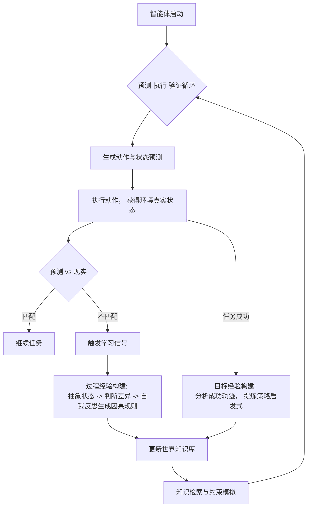

# Aligning Agentic World Models via Knowledgeable Experience Learning

**相关性评分**: 6.0/10

**排名**: #31

---

## 基本信息

- **arXiv ID**: [2601.13247v1](https://arxiv.org/abs/2601.13247v1)
- **发布时间**: 2026-01-19T17:33:31Z
- **相关性评分**: 6.0/10
- **是否相关**: 是

## 作者

Baochang Ren, Yunzhi Yao, Rui Sun, Shuofei Qiao, Ningyu Zhang, Huajun Chen

## 关键词

VLA for Robotics, fine tune, world model

## 一句话总结

该论文提出WorldMind框架，通过知识经验学习对齐智能体世界模型，以解决LLMs在物理世界中的程序性基础缺失问题，与机器人视觉语言动作模型、微调和世界模型相关。

## 摘要

Current Large Language Models (LLMs) exhibit a critical modal disconnect: they possess vast semantic knowledge but lack the procedural grounding to respect the immutable laws of the physical world. Consequently, while these agents implicitly function as world models, their simulations often suffer from physical hallucinations-generating plans that are logically sound but physically unexecutable. Existing alignment strategies predominantly rely on resource-intensive training or fine-tuning, which attempt to compress dynamic environmental rules into static model parameters. However, such parametric encapsulation is inherently rigid, struggling to adapt to the open-ended variability of physical dynamics without continuous, costly retraining. To bridge this gap, we introduce WorldMind, a framework that autonomously constructs a symbolic World Knowledge Repository by synthesizing environmental feedback. Specifically, it unifies Process Experience to enforce physical feasibility via prediction errors and Goal Experience to guide task optimality through successful trajectories. Experiments on EB-ALFRED and EB-Habitat demonstrate that WorldMind achieves superior performance compared to baselines with remarkable cross-model and cross-environment transferability.

## 详细分析

## 论文摘要：通过知识化经验学习对齐具身世界模型

**1. 研究背景和动机**
当前的大语言模型（LLMs）存在一个关键的模态鸿沟：它们拥有丰富的语义知识，但缺乏对物理世界不可变法则的程序性理解。这导致LLM作为智能体内部世界模型进行模拟时，常产生**物理幻觉**——生成逻辑上合理但物理上无法执行的计划。现有方法主要依赖资源密集的训练或微调，试图将动态的环境规则压缩到静态的模型参数中，但这种参数化封装方式僵化，难以适应物理动态的开放性变化。

**2. 核心方法和技术创新**
本文提出 **WorldMind** 框架，旨在以**免训练**的方式，通过经验学习自主对齐智能体的世界模型。其核心创新在于：
- **构建世界知识库**：框架通过与环境交互，自主构建一个符号化的世界知识库，该知识库包含两种经验：
    - **过程经验**：从预测错误中提炼，用于强制物理可行性，确保内部模拟遵守现实法则。
    - **目标经验**：从成功轨迹中提炼，作为程序性启发，引导模拟高效收敛至任务目标。
- **预测-执行-验证循环**：受**预测编码**理论启发，框架将执行失败视为纠正信号，通过“状态抽象-判断-自我反思”三步法，将预测与现实的差异转化为可复用的因果规则。
- **知识增强的MDP**：形式化地定义了世界知识增强的马尔可夫决策过程，使智能体在推理时能利用知识库进行约束模拟，减少幻觉。

**3. 主要实验结果**
在EB-ALFRED和EB-Habitat等具身基准测试上的实验表明：
- **性能领先**：WorldMind在任务成功率（SR）和目标条件成功率（GC）上均超越ReAct、SimuRA等基线方法。
- **减少物理错误**：显著降低了“无效动作”等物理违规错误，将致命错误转化为可管理的规划挑战（如超时）。
- **出色的可迁移性**：构建的世界知识展现出**跨模型**和**跨环境**的可迁移性。在不同骨干模型（如GPT-3.5-turbo与GPT-4.1-mini）间交换知识库，双方性能均获得显著提升，证明了所学知识的普适性。

**4. 研究意义和价值**
本研究的意义在于：
- **方法论创新**：提出了一种免参数更新的、基于经验学习的对齐范式，为克服LLM的物理幻觉问题提供了高效、灵活的新思路。
- **理论价值**：将预测编码理论应用于智能体对齐，为理解智能体如何通过交互修正内部世界模型提供了认知启发。
- **应用前景**：证明了构建显式、可迁移的世界知识库的可行性，为开发具有可复用常识、能进行稳健跨任务和跨具身协作的通用智能体系统开辟了新途径。

## 问答对

### 问题 1

**Q**: 这篇论文的核心创新点是什么，他想解决什么问题，怎么解决的？

**A**: ## 论文核心分析

### **核心问题**
论文旨在解决当前大语言模型（LLM）作为智能体世界模型时存在的 **“模态鸿沟”**：
- **知识丰富但缺乏物理基础**：LLM拥有海量语义知识，但缺乏对物理世界不可变法则（如物体交互、空间约束）的程序性理解。
- **导致物理幻觉**：智能体生成的计划在逻辑上合理，但在物理上不可执行（例如，试图在没有持刀的情况下切片物体）。
- **现有方法的局限性**：主流方法（如监督微调、强化学习）试图将动态的环境规则压缩到静态的模型参数中，这种方法**僵化且难以适应物理环境的开放可变性**，需要持续、昂贵的重新训练。

### **核心创新点**
论文提出了 **WorldMind** 框架，其核心创新在于一种 **“训练免费”的在线经验学习范式**，用于对齐智能体的世界模型。具体体现在：

1.  **范式转变：从参数化封装到显式知识库**
    - **传统方法**：将世界知识内化到模型参数中。
    - **WorldMind**：构建一个外部的、符号化的 **世界知识库**，将环境动态显式地存储在记忆中，而非仅依赖模型隐含的权重。

2.  **双经验驱动学习机制**
    WorldMind 通过自主构建两种经验来持续对齐世界模型：
    - **过程经验**：源自**预测误差**。当智能体的状态预测与环境实际反馈不符时，触发自我反思，生成一条纠正性的因果规则（如“要切片物体，必须先拿起刀”）。这确保了内部模拟严格遵守物理可行性。
    - **目标经验**：源自**成功轨迹**。从成功完成的任务中提炼出高级策略和启发式规则（如“寻找钥匙通常先检查床头柜”）。这引导智能体高效地向任务目标收敛。

3.  **基于预测编码理论的运行机制**
    框架的理论基础是**预测编码**，将执行失败视为宝贵的“认知信号”，而非需要丢弃的噪声。通过 **“预测-执行-验证”** 循环，智能体利用预测误差作为学习信号，在线激活并调整其内在的预测能力，而无需梯度更新。

4.  **卓越的可迁移性与通用性**
    - **跨模型可迁移**：构建的世界知识（因果规则和启发式策略）是符号化和语义化的，因此可以在不同骨干模型（如GPT-3.5-turbo和GPT-4.1-mini）之间**直接共享和迁移**，且能带来性能提升。这证明了所学知识捕捉的是**普适的物理法则**，而非模型特定偏差。
    - **跨环境泛化**：在EB-ALFRED（高阶交互）、EB-Habitat（导航与操作）乃至混合数字-物理的Embodied Web Agent任务上均表现优异，展示了框架对多样化任务和动作粒度的适应性。

### **解决方案架构**
WorldMind 通过以下核心流程解决问题：

1.  **知识构建**：在交互中，通过上述双经验机制，自主填充 **世界知识库**。
2.  **约束模拟**：在推理时，根据当前任务目标，从知识库中检索相关的**过程经验**（物理约束）和**目标经验**（策略指导），对行动进行**带约束的模拟**，从而生成既物理可行又目标导向的计划。
3.  **选择性预测**：为提高效率，仅当目标物体在观测或知识库中被“锚定”时，才进行详细的状态预测，否则跳过。

### **实际价值与意义**
- **提升智能体可靠性**：显著减少“物理幻觉”，使智能体在复杂、动态的物理环境中制定的计划更可靠、可执行。
- **降低对齐成本**：提供了一种无需重新训练或微调的**轻量级、可持续**的世界模型对齐方案，计算成本低，易于部署。
- **促进知识共享与协作**：证明了世界知识可以跨模型迁移，为构建**多智能体共享的世界模型**奠定了基础，使得智能体间能够传递经验、协同解决问题。
- **推动具身智能发展**：为构建能够真正理解并尊重物理规则、具备常识推理能力的通用具身智能体提供了新的技术路径。

**总结**：WorldMind 的核心贡献是提出并验证了一种通过**外部符号化知识库**和**双经验在线学习**来对齐智能体世界模型的新范式，有效桥接了LLM的语义知识与物理世界的程序性约束，且具备出色的可迁移性和实用性。

### 问题 2

**Q**: 请用一段话总结这篇论文，明确说明：论文试图解决的核心问题；提出的主要方法或框架；最终取得的主要效果或结论。要求语言简洁、信息密度高，不要复述摘要原文。

**A**: 这篇论文旨在解决大语言模型（LLM）作为智能体世界模型时存在的**模态割裂**问题，即模型虽拥有丰富的语义知识，但缺乏对物理世界不可变法则的程序性理解，导致其规划常出现“物理幻觉”（逻辑合理但物理上不可执行）。为此，论文提出了 **WorldMind** 框架，其核心创新在于**免训练地**构建一个符号化的世界知识库：通过“预测-执行-验证”循环从预测错误中提炼**过程经验**以强制物理可行性，并从成功轨迹中提炼**目标经验**以提供启发式任务指导。实验表明，该方法在EB-ALFRED和EB-Habitat等具身基准测试中取得了优于基线方法的性能，显著减少了物理幻觉，并展现出**卓越的跨模型和跨环境知识迁移能力**，证明了所构建的世界知识具有通用性。

### 问题 3

**Q**: 这篇论文相对于已有工作有哪些明确的创新点？请逐条列出，并对每一条说明：相比以往方法改进或不同之处在哪里，以及该创新解决了什么具体问题或带来了什么优势。

**A**: ## 论文《Aligning Agentic World Models via Knowledgeable Experience Learning》的创新点分析

这篇论文提出的 **WorldMind** 框架，在解决大语言模型（LLM）智能体“物理幻觉”和世界模型对齐问题上，相对于已有工作，提出了以下几个明确的创新点：

---

### 1. **提出“训练无关”的在线经验学习对齐范式**
- **相比以往方法的改进/不同之处**：
    - **传统方法**：主要依赖**监督微调（SFT）** 或**强化学习（RL）**，试图将动态、无穷的物理环境规则**压缩到静态的模型参数**中。这种方法本质上是刚性的，难以适应开放环境的可变性，且需要持续、昂贵的重新训练。
    - **WorldMind 的创新**：提出了一种**无需梯度更新（训练无关）** 的在线对齐方法。智能体在**推理（推断）过程**中，通过与环境交互产生的经验（成功与失败）来自主构建和更新其世界知识，实现对齐。
- **解决的具体问题/带来的优势**：
    - **解决了参数化方法的僵化问题**：无需重新训练模型，就能动态适应新环境或未知的物理约束。
    - **降低了计算成本和数据依赖**：避免了大规模收集标注数据或进行强化学习训练的高昂开销。
    - **实现了“在线校正”能力**：智能体能够根据实时遇到的预测错误，即时修正其内部世界模型，增强了在动态环境中的鲁棒性。

### 2. **构建双模态的、符号化的世界知识库**
- **相比以往方法的改进/不同之处**：
    - **传统方法**：智能体的世界知识通常是**隐式**的、与模型参数耦合的，或是单一类型的记忆（如仅存储成功轨迹）。
    - **WorldMind 的创新**：明确构建了一个外部化的、符号化的 **世界知识库**，并区分为两种核心经验：
        1.  **过程经验**：从**预测错误**中提炼，用于**强制物理可行性**。
        2.  **目标经验**：从**成功轨迹**中提炼，用于**引导任务最优性**。
- **解决的具体问题/带来的优势**：
    - **解决了“现实鸿沟”**：通过`过程经验`显式地捕获和编码物理定律（如“必须持有刀才能切片”），直接针对“物理幻觉”问题，确保计划在物理上是可执行的。
    - **提升了长视野规划的效率**：通过`目标经验`提供高层启发式策略，约束策略搜索空间，帮助智能体更快地收敛到最优解，而不仅仅是避免错误。
    - **实现了知识模块化与可解释性**：符号化的知识库独立于模型架构，更易于理解、分析和调试。

### 3. **基于“预测编码”理论的操作化：预测-执行-验证循环**
- **相比以往方法的改进/不同之处**：
    - **传统方法**：将执行失败视为需要避免的负面反馈或噪声。
    - **WorldMind 的创新**：受**预测编码**理论启发，将执行失败（预测与现实的差异）重新定义为**丰富的认知信号**。框架核心是一个 **“预测-执行-验证”** 循环：
        1.  **状态抽象**：将底层状态转化为高层语义描述。
        2.  **判断**：比较预测状态与实际状态，检测语义差异。
        3.  **自我反思**：当检测到差异（物理幻觉）时，触发反思模块，生成一条纠正性的因果规则，并存入`过程经验`库。
- **解决的具体问题/带来的优势**：
    - **激活了LLM的潜在预测能力**：论文认为LLM本身具备潜在的预测能力，无需从头训练，只需通过错误信号在推理过程中“激活”和“对齐”。
    - **将失败转化为学习机会**：系统性地利用失败经验来积极修正世界模型，使智能体能够从错误中持续学习，边界不断扩展。
    - **关注因果变量，过滤环境噪声**：通过状态抽象，确保学习到的是高层、通用的因果规则，而非对琐碎环境细节的过拟合。

### 4. **展示了卓越的跨模型和跨环境知识迁移能力**
- **相比以往方法的改进/不同之处**：
    - **传统方法**：通过微调获得的知识紧密绑定于特定模型架构和参数，难以迁移。
    - **WorldMind 的创新**：其实验表明，**WorldMind** 构建的符号化世界知识库具有**跨模型**和**跨环境**的可迁移性。例如，GPT-3.5-turbo 可以使用 GPT-4.1-mini 构建的知识库提升性能，反之亦然。
- **解决的具体问题/带来的优势**：
    - **解决了知识孤岛问题**：证明了其学习的物理规则和任务启发式是**通用**的，而非模型特定的。
    - **为多智能体协作和共享世界模型奠定基础**：这项创新为未来构建一个可被多个不同智能体实时共享、同步和使用的统一世界模型提供了可能性，是迈向通用具身智能的关键一步。
    - **提升了方法的实用性和经济性**：一次学习，多处复用，降低了为每个新模型或新环境从头对齐的成本。

### 5. **在推理阶段引入有约束的、选择性的模拟机制**
- **相比以往方法的改进/不同之处**：
    - **传统基于模拟的方法**：可能对每一步都进行耗时的内部模拟或多次采样，计算开销大。
    - **WorldMind 的创新**：在推理时，智能体根据当前观察和知识库**动态检索**相关经验来指导决策。关键创新在于，**对未来状态的预测生成是“门控”的**：仅当目标对象在当前观察或知识库中被明确“接地”时，才进行模拟预测；否则，直接执行动作而不更新内部世界模型。
- **解决的具体问题/带来的优势**：
    - **显著提高了推理效率**：避免了大量对未接地状态的无用模拟，减少了计算延迟。
    - **在保证效果的同时降低了开销**：与依赖重型外部世界模型或多重采样的方法相比，**WorldMind** 以更低的计算成本实现了优异的性能（如实验所示，在成功率SR和过程正确率GC上均超越基线）。

---

**总结**：**WorldMind** 的核心创新在于**范式转变**——从“**将世界压缩进参数**”变为“**将经验外化进符号知识库**”，并通过一个受认知理论启发的、训练无关的在线学习循环来构建和利用这个知识库。它系统性地解决了LLM智能体的物理幻觉问题，并额外带来了**可迁移性、可解释性和高效率**等显著优势，为构建更鲁棒、更通用的具身智能体提供了新的技术路径。

### 问题 4

**Q**: 论文在实验或评估中最终实现了怎样的效果？请说明使用了哪些数据集和评价指标，与哪些基线方法进行了对比，以及在关键指标上的主要性能提升或结论。如果论文未给出明确的定量结果，也请说明原因。

**A**: ## 论文实验与评估效果分析

### 数据集与评价指标
- **数据集**：
    - **EB-ALFRED**：基于ALFRED的具身任务基准，包含家庭环境中的复杂操作任务。
    - **EB-Habitat**：基于Habitat的具身导航与交互基准，侧重于空间导航和物体操作。
    - **EB-Navigation**（附录）：低级别导航任务基准，测试精细运动控制。
    - **Embodied Web Agent**：跨环境任务基准，要求智能体在网页界面（信息查询）和物理环境（执行）之间动态切换。

- **评价指标**：
    - **成功率**：严格二元指标，仅当最终目标完全达成时记为1。
    - **目标条件成功率**：过程依从性指标，对完成的子目标给予部分奖励，即使最终任务失败。

### 基线方法对比
论文与多种代表性基线方法进行了对比，包括：
- **经典方法**：ReAct、Best-of-N（BoN）
- **先进方法**：Synapse、SimuRA、ReasoningBank、AWM
- **开源与专有模型**：GPT-4o、Claude-3.7-Sonnet、Gemini-1.5-Pro、Llama-3.2-90B-Vis、InternVL2.5-78B等。

### 关键性能提升与结论

#### 1. **任务完成率显著提升**
- **EB-ALFRED**：使用GPT-3.5-turbo时，WorldMind的**成功率**达到48.0%，优于ReAct的44.4%和所有其他基线方法。
- **EB-Habitat**：使用GPT-4.1-mini时，WorldMind的**成功率**达到50.8%，显著高于ReAct的41.6%。
- **结论**：WorldMind通过减少物理幻觉和致命执行错误，更一致地达成最终目标状态。

#### 2. **过程正确性大幅改善**
- **EB-ALFRED**：使用GPT-3.5-turbo时，WorldMind的**目标条件成功率**达到54.1%，高于ReAct的50.4%。
- **EB-Habitat**：使用GPT-4.1-mini时，**目标条件成功率**达到57.2%，优于ReAct的47.4%。
- **结论**：即使最终任务失败，WorldMind也能执行更高比例的有效子目标，表明**目标经验**有效指导了长时程行为。

#### 3. **跨模型与跨环境鲁棒性**
- **跨模型可迁移性**：在GPT-3.5-turbo和GPT-4.1-mini之间交换构建的**世界知识库**，双方性能均获得显著提升（例如，GPT-4.1-mini使用GPT-3.5-turbo的经验后，在EB-Habitat上的成功率从41.6%提升至51.9%）。这证明了所构建的知识捕获了**普适的物理法则**，而非模型特定偏见。
- **跨环境泛化能力**：在**Embodied Web Agent**基准测试中，WorldMind显著提升了**完成率**（GPT-3.5-turbo从17.02%提升至39.99%），有效减少了物理幻觉，确保了在数字与物理环境间切换的鲁棒性。
- **低级别任务泛化**：在**EB-Navigation**上，WorldMind在基础子集上表现优异（GPT-3.5-turbo达到66.7%），证明了其从高级推理到精细物理执行的**有效落地能力**。

#### 4. **错误模式分析**
- **无效动作减少**：在EB-Habitat上，WorldMind将GPT-3.5-turbo的无效动作从105次减少到67次，表明**过程经验**作为物理过滤器是有效的。
- **错误类型转化**：WorldMind将致命的物理和逻辑失败（无效动作、错误终止）转化为可管理的规划挑战（超时），从而增强了整体鲁棒性。

#### 5. **消融实验结论**
- **过程经验**：主要驱动**成功率**的提升，通过内化物理边界，防止致命执行错误。
- **目标经验**：主要提升**目标条件成功率**，通过高级策略指导，防止导航漂移和过早终止。
- **协同效应**：完整模型性能最优，验证了**目标启发式与物理验证相结合**的必要性。

### 总结
WorldMind框架通过**无训练的在线经验学习**，在多个具身AI基准测试中实现了**最先进的性能**。其核心价值在于：
1.  **显著减少了物理幻觉**，提升了计划的物理可行性。
2.  **构建了可迁移的符号化世界知识**，独立于特定模型架构。
3.  **在任务完成率和过程正确性上均取得一致提升**，证明了**经验驱动对齐**的有效性。

这些结果验证了将环境动态**外部化为显式符号知识**，而非压缩到静态模型参数中，是开发通用、鲁棒具身智能体的一个有前景的方向。

## 相关链接

- [arXiv 页面](https://arxiv.org/abs/2601.13247v1)
- [HTML 版本](https://arxiv.org/html/2601.13247v1)
