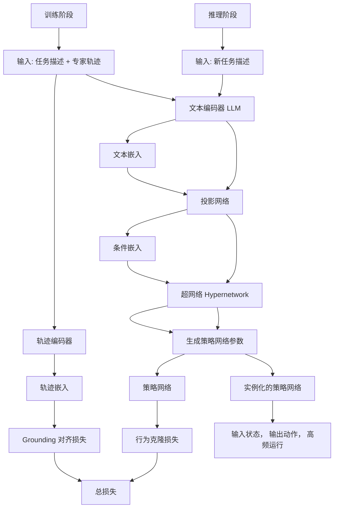

# TeNet: Text-to-Network for Compact Policy Synthesis

**相关性评分**: 6.0/10

**排名**: #32

---

## 基本信息

- **arXiv ID**: [2601.15912v1](https://arxiv.org/abs/2601.15912v1)
- **发布时间**: 2026-01-22T12:42:30Z
- **相关性评分**: 6.0/10
- **是否相关**: 是

## 作者

Ariyan Bighashdel, Kevin Sebastian Luck

## 关键词

Vision-Language-Action Model, VLA for Robotics, fine tune, world model

## 一句话总结

TeNet 是一个通过文本描述生成紧凑机器人策略的框架，利用预训练大语言模型和超网络实现高效控制，适用于资源受限的实时任务。

## 摘要

Robots that follow natural-language instructions often either plan at a high level using hand-designed interfaces or rely on large end-to-end models that are difficult to deploy for real-time control. We propose TeNet (Text-to-Network), a framework for instantiating compact, task-specific robot policies directly from natural language descriptions. TeNet conditions a hypernetwork on text embeddings produced by a pretrained large language model (LLM) to generate a fully executable policy, which then operates solely on low-dimensional state inputs at high control frequencies. By using the language only once at the policy instantiation time, TeNet inherits the general knowledge and paraphrasing robustness of pretrained LLMs while remaining lightweight and efficient at execution time. To improve generalization, we optionally ground language in behavior during training by aligning text embeddings with demonstrated actions, while requiring no demonstrations at inference time. Experiments on MuJoCo and Meta-World benchmarks show that TeNet produces policies that are orders of magnitude smaller than sequence-based baselines, while achieving strong performance in both multi-task and meta-learning settings and supporting high-frequency control. These results show that text-conditioned hypernetworks offer a practical way to build compact, language-driven controllers for ressource-constrained robot control tasks with real-time requirements.

## 详细分析

## 论文摘要：TeNet: Text-to-Network for Compact Policy Synthesis

**1. 研究背景和动机**
当前，让机器人遵循自然语言指令的方法存在两极化：要么依赖手工设计的高层规划接口，要么采用计算量大、难以实时部署的端到端大模型。同时，以决策变换器（DT）为代表的紧凑序列模型虽然高效，但缺乏直接的语言接口，通常需要演示轨迹来区分任务。因此，亟需一种既能利用语言表达的灵活性，又能生成轻量、高效、可实时执行策略的方法。

**2. 核心方法和技术创新**
本文提出了 **TeNet（Text-to-Network）** 框架，其核心创新在于利用**语言驱动的超网络**来合成紧凑的策略：
- **文本到网络生成**：使用预训练大语言模型（LLM）将任务描述编码为文本嵌入，并以此作为条件输入一个超网络，直接生成一个完全可执行的、任务特定的策略网络参数。执行时仅需低维状态输入，语言模型仅在策略实例化时使用一次。
- **行为中的语言接地**：在训练阶段，通过将文本嵌入与专家演示轨迹的嵌入进行对齐（采用对比学习或MSE损失），使语言表征蕴含行为语义，从而提升泛化能力。**关键的是，推理时无需任何演示**。

**3. 主要实验结果**
在MuJoCo和Meta-World基准测试上的实验表明：
- **性能强劲**：在多项多任务和元学习设置中，TeNet（尤其是使用对比接地的变体）达到或超越了需要演示提示的Prompt-DT基线，在任务多样性高的MT10/MT50上优势显著。
- **极致轻量与高效**：生成的策略仅包含约 **4万个参数**，并能支持超过 **9 kHz** 的控制频率，比基线模型（数百万参数，数百Hz）轻量和高效数个数量级。
- **泛化与鲁棒性**：模型能平滑泛化到未见过的任务指令（如目标速度），并对语言描述的复述（paraphrasing）展现出良好的鲁棒性，使用更强大的LLM编码器（如LLaMA）效果更佳。

**4. 研究意义和价值**
TeNet为资源受限的机器人实时控制任务提供了一种新颖且实用的范式。它成功地将预训练LLM的通用知识与轻量级策略的高效执行相结合，**填补了表达性语言系统与紧凑、可部署策略之间的空白**。这项工作证明了语言条件化超网络在构建紧凑、语言驱动的控制器方面的巨大潜力，为未来扩展到视觉-语言-动作（VLA）系统及现实机器人应用奠定了基础。

## 问答对

### 问题 1

**Q**: 这篇论文的核心创新点是什么，他想解决什么问题，怎么解决的？

**A**: ## 论文核心分析：TeNet: Text-to-Network for Compact Policy Synthesis

### **一、 核心问题**
论文旨在解决机器人领域的一个关键矛盾：**如何让机器人既能理解灵活的自然语言指令，又能运行轻量、高效、可实时部署的控制策略？**

- **现有方案的不足：**
    - **大型端到端模型**（如PaLM-E, RT-2）：虽然语言理解能力强，但模型庞大，计算成本高，难以部署在资源受限的机器人上或进行高频控制。
    - **紧凑序列模型**（如Decision Transformer, Prompt-DT）：模型小、效率高，但**缺乏直接的语言接口**。它们依赖轨迹提示（demonstration prompts）来区分任务，在测试时仍需提供演示，且任务多样性增加时性能下降。

### **二、 核心创新点**
论文提出了 **TeNet（Text-to-Network）框架**，其核心创新在于：

1. **文本到网络的策略生成范式**：首次提出并实现**直接使用自然语言描述作为条件信号，通过超网络（Hypernetwork）即时合成一个完全可执行的、任务专用的紧凑策略网络**。
    - **关键机制**：利用预训练大语言模型（LLM，如LLaMA）将任务描述编码为文本嵌入，然后输入一个超网络，该超网络**动态生成**目标策略网络的全部参数。
    - **执行时优势**：生成后的策略网络仅接收低维状态输入，独立运行，**完全脱离LLM**，从而实现高频控制。

2. **训练时行为 grounding（接地）**：为提高泛化能力，提出在训练阶段**将语言表征与专家演示轨迹的行为语义进行对齐**。
    - **方法**：引入轨迹编码器，并使用对比学习或MSE损失，使文本嵌入和对应轨迹嵌入在共享空间中接近。
    - **关键设计**：Grounding**仅在训练时使用**。在推理时，策略仅从文本描述实例化，**无需任何演示轨迹**，保持了使用的便捷性。

3. **实现了表达性与效率的统一**：
    - **继承LLM的知识与鲁棒性**：通过文本编码，继承了预训练LLM的常识和语言泛化（如对同义句的鲁棒性）。
    - **获得紧凑策略的实时性**：最终策略网络参数量极小（~40K），控制频率极高（>9 kHz），比基线模型（Prompt-DT）**快一个数量级以上**，且参数量少两个数量级。

### **三、 解决方案架构**
TeNet的工作流程清晰分为训练和推理两个阶段：

**核心组件**：
- **文本编码器**：冻结的预训练LLM（如LLaMA-3 8B），提供高质量语言表征。
- **（可选）轨迹编码器**：用于训练时 grounding。
- **投影网络**：将文本嵌入映射到超网络的条件空间。
- **超网络**：一个较小的网络，以条件嵌入为输入，输出目标策略网络的所有权重。
- **策略网络**：一个非常小的前馈网络（MLP），由超网络生成，执行实际控制。

### **四、 实际价值与意义**
1. **为资源受限机器人提供语言接口**：为计算能力有限的嵌入式系统或需要极高控制频率（如动态平衡、灵巧操作）的机器人场景，提供了可行的“语言指令->紧凑控制器”解决方案。
2. **部署友好**：彻底将计算密集的LLM推理与实时控制循环解耦，生成的政策轻量、高效，易于部署。
3. **推动新研究范式**：证明了“**语言作为策略生成条件**”这一范式的可行性，为后续结合视觉、强化学习微调等方向奠定了基础。
4. **实证指导**：通过大量实验（MuJoCo, Meta-World）系统性地回答了何时需要grounding、何种grounding方式更有效、模型规模与性能关系等关键问题，为后续研究提供了宝贵见解。

**总结**：TeNet的核心创新在于**利用“语言条件化超网络”这一巧妙架构，在训练阶段将LLM的语义知识“蒸馏”到一个极其紧凑的策略生成器中**，从而一举解决了语言指令机器人在表达性、效率和泛化能力之间的权衡难题。

### 问题 2

**Q**: 请用一段话总结这篇论文，明确说明：论文试图解决的核心问题；提出的主要方法或框架；最终取得的主要效果或结论。要求语言简洁、信息密度高，不要复述摘要原文。

**A**: 这篇论文旨在解决机器人自然语言指令跟随任务中，**大模型计算开销高、难以实时部署**与**轻量级策略模型缺乏语言接口**之间的核心矛盾。为此，作者提出了 **TeNet（Text-to-Network）框架**，其核心思想是利用预训练大语言模型（LLM）将任务描述编码为文本嵌入，并以此作为**超网络（Hypernetwork）的条件输入**，一次性生成一个完全可执行的、轻量级的任务专用策略网络。该方法在训练时可选地通过**对齐文本与专家轨迹的嵌入**来将语言“锚定”在行为上，以提升泛化能力，而在推理时仅需文本即可即时合成策略，无需任何演示。实验表明，TeNet生成的策略**参数量（约4万）比序列基线模型小几个数量级**，支持**超过9kHz的高频控制**，并在多任务和元学习基准上实现了强劲性能，证明了语言驱动的超网络为资源受限的实时机器人控制提供了一种紧凑、高效的解决方案。

### 问题 3

**Q**: 这篇论文相对于已有工作有哪些明确的创新点？请逐条列出，并对每一条说明：相比以往方法改进或不同之处在哪里，以及该创新解决了什么具体问题或带来了什么优势。

**A**: ## TeNet 论文创新点分析

这篇论文提出了一个名为 **TeNet (Text-to-Network)** 的新框架，旨在解决机器人领域语言指令跟随任务中“表达能力”与“部署效率”之间的矛盾。其核心创新点如下：

### 1. **首次将自然语言作为直接信号，通过超网络实例化紧凑策略**
   - **相比以往方法的改进/不同之处**：
     - **以往方法**：1) 大型端到端视觉-语言-动作模型（如RT-2, PaLM-E）将LLM置于控制循环中，计算开销大；2) 紧凑序列模型（如Decision Transformer, Prompt-DT）依赖轨迹提示或演示来区分任务，**并非直接使用语言**；3) 间接方法（如Code-as-Policies）将语言翻译为预定义的API或奖励函数，灵活性受限。
     - **TeNet的做法**：**直接**使用预训练大语言模型（LLM）产生的文本嵌入作为条件信号，输入到一个**超网络**中，由该超网络**生成**一个完整的、可执行的任务特定策略网络的参数。语言仅在策略实例化时使用一次。
   - **解决的具体问题/带来的优势**：
     - **解决了“轻量”与“语言驱动”不可兼得的问题**：生成的策略网络仅接收低维状态输入，参数量极小（~40K），可在资源受限的机器人上实现**高频实时控制**（>9 kHz），同时继承了预训练LLM的通用知识和语言理解能力。
     - **无需推理时演示**：与Prompt-DT等需要提供任务演示轨迹作为提示的方法不同，TeNet在推理时仅需自然语言指令，部署更便捷。

### 2. **提出在训练中“将语言在行为中接地”，以提升泛化能力**
   - **相比以往方法的改进/不同之处**：
     - **以往方法**：一些工作（如CLASP）专注于通过对比学习预训练语言-状态-动作的联合表示，但其主要目标是表示学习本身，而非策略生成。
     - **TeNet的做法**：引入一个**辅助性的接地模块**。在训练时，使用一个轨迹编码器，并通过对比学习或MSE损失，将文本嵌入与专家演示轨迹的嵌入在共享空间中对齐。**关键点在于，接地仅用于训练阶段**，以丰富语言表示的语义；在推理时，策略仍仅从文本实例化。
   - **解决的具体问题/带来的优势**：
     - **解决了语言到策略映射的模糊性和泛化瓶颈**：纯文本描述可能无法充分捕捉具体的行为语义。通过将其与真实行为轨迹对齐，语言嵌入能够编码更丰富的、与任务执行相关的信息。
     - **显著提升了元学习场景下的性能**：实验表明，在需要泛化到未见任务的元学习基准（如HalfCheetah-Vel）上，接地变体（尤其是使用对比学习的 `TeNet-Contrast`）性能显著优于不接地的 `Direct TeNet`，证明了该设计对提升跨任务泛化能力的有效性。

### 3. **实现了“任务特定参数化”与“模型紧凑性”的高效统一**
   - **相比以往方法的改进/不同之处**：
     - **以往方法**：1) 为每个任务训练独立策略，参数效率低；2) Prompt-DT等序列模型使用一个庞大的共享模型处理所有任务，在面对高度异构的多任务时（如Meta-World MT50），性能会严重下降，仅增加模型容量收效甚微。
     - **TeNet的做法**：利用超网络为**每个任务动态生成一个专属的、紧凑的策略网络**。模型的核心——超网络和文本编码器——是跨任务共享的，但生成的策略网络参数是针对每个任务实例化的。
   - **解决的具体问题/带来的优势**：
     - **解决了异构多任务场景下的性能衰减问题**：实验表明，在任务差异巨大的MT10/MT50基准上，TeNet（成功率~0.99）大幅优于Prompt-DT（成功率~0.6-0.7）。即使为Prompt-DT加上超网络（Prompt-DT-HN）以引入任务特定参数化，性能也能提升，但TeNet在保持相近性能的同时，**参数量少两个数量级，控制频率高一个数量级**。
     - **带来了极致的部署效率优势**：生成的策略网络极其小巧（40K参数），支持kHz级控制频率，这使得将复杂的语言指令理解能力部署到计算资源有限的实体机器人上进行实时控制成为可能。

### 4. **探索并验证了“语言条件化超网络”这一新范式在机器人控制中的可行性**
   - **相比以往方法的改进/不同之处**：
     - **以往方法**：超网络在RL中已被用于基于任务ID、演示轨迹、形态学等信号生成策略。在NLP中，也有工作用语言条件化超网络生成大模型的适配器权重。但**此前没有工作直接结合LLM文本编码器与超网络来合成紧凑的机器人控制策略**。
     - **TeNet的贡献**：首次系统性地将这一范式应用于机器人离线模仿学习，并进行了全面的实证研究（多任务学习、元学习、泛化性、鲁棒性、效率分析），证明了其潜力。
   - **解决的具体问题/带来的优势**：
     - **填补了研究空白**：在“表达性强的语言系统”和“紧凑高效但非语言驱动的策略”之间架起了一座桥梁。
     - **为未来研究指明了方向**：论文指出，当前工作集中于低维状态输入，未来可扩展至视觉-语言-动作场景，处理噪声演示，并结合强化学习进行微调，为后续研究提供了清晰的路线图。

---
**总结**：TeNet的核心创新在于**架构范式**的转变——它不运行大模型进行实时推理，也不依赖演示作为任务提示，而是**利用大模型的语言理解能力作为“一次性编译器”**，将自然语言指令“编译”成一个超轻量、高性能、专属于该指令的可执行策略。这为解决机器人领域长期存在的“智能”与“实时性”的权衡问题提供了一个新颖且极具潜力的解决方案。

### 问题 4

**Q**: 论文在实验或评估中最终实现了怎样的效果？请说明使用了哪些数据集和评价指标，与哪些基线方法进行了对比，以及在关键指标上的主要性能提升或结论。如果论文未给出明确的定量结果，也请说明原因。

**A**: ## 论文实验效果总结

### 一、 使用的数据集与评价指标
1.  **数据集**：
    - **MuJoCo**：用于连续控制任务。
        - `HalfCheetah-Dir`：控制前进/后退方向。
        - `HalfCheetah-Vel`：控制目标前进速度。
        - `Ant-Dir`：控制蚂蚁的移动方向。
    - **Meta-World**：用于机器人操作任务。
        - `ML1 Pick-Place`：元学习场景下的拾放任务。
        - `MT10`：包含10个不同操作任务的多任务基准。
        - `MT50`：包含50个不同操作任务的多任务基准。

2.  **评价指标**：
    - **性能指标**：
        - **MuJoCo**：报告**回合回报**。
        - **Meta-World**：报告**成功率**。
    - **部署效率指标**：
        - **控制器大小**：生成策略网络的参数量。
        - **控制频率**：策略网络每秒能执行的推理次数。

### 二、 对比的基线方法
论文主要与以下两类基线方法进行对比：
1.  **决策变换器及其变体**：
    - **DT**：标准决策变换器，无显式任务标识。
    - **Prompt-DT**：使用专家轨迹片段作为提示来标识任务。
    - **Prompt-DT-HN**：论文引入的变体，在Prompt-DT基础上增加超网络，根据轨迹提示生成策略参数。
2.  **TeNet的变体**：
    - **TeNet (Direct)**：直接使用文本嵌入生成策略，无行为对齐。
    - **TeNet-MSE**：使用均方误差损失对齐文本与轨迹嵌入。
    - **TeNet-Contrast**：使用对比学习损失对齐文本与轨迹嵌入。

### 三、 关键性能提升与结论
1.  **性能表现**：
    - **多任务场景**：在MT10和MT50上，**TeNet-Contrast**（成功率~0.99）**大幅优于** Prompt-DT（成功率0.73-0.65）。这表明在任务高度异构时，基于语言的超网络比基于轨迹提示的方法更具优势。
    - **元学习场景**：在HalfCheetah-Vel、Ant-Dir等任务上，**Grounded TeNet**（尤其是对比学习版本）**达到或超越了** Prompt-DT的性能，证明了行为对齐对于泛化到未见任务至关重要。
    - **直接文本到策略的可行性**：Direct TeNet在所有基准上都优于DT，证明了仅用语言作为任务信号是有效的，但在元学习场景下需要行为对齐来提升泛化能力。

2.  **部署效率的显著优势**：
    - **控制器尺寸**：TeNet生成的策略仅包含**约4万个参数**，比Prompt-DT（1M-39M参数）**小1-2个数量级**。
    - **控制频率**：TeNet策略的推理速度超过**9 kHz**，比Prompt-DT（190-600 Hz）**快一个数量级以上**。这使其非常适合资源受限的实时控制。

3.  **关键结论与发现**：
    - **行为对齐的价值**：对比学习对齐（`TeNet-Contrast`）通常优于直接MSE对齐，因为它能更好地分离不同任务的嵌入，提升任务判别力。
    - **任务特定参数化的必要性**：在MT10/MT50上，Prompt-DT性能不佳并非源于模型容量不足（增大模型帮助有限），而是缺乏任务特定的参数化。引入超网络（Prompt-DT-HN）后性能大幅提升，印证了TeNet核心设计的有效性。
    - **数据规模效应**：在ML1 Pick-Place任务上，随着训练任务数量从50增加到1600，TeNet的成功率从0.80提升至0.99，表明该方法受益于大规模、多样化的训练数据。
    - **语言鲁棒性**：使用LLaMA等大型语言模型作为文本编码器时，TeNet对任务描述的**复述表现出良好的鲁棒性**，性能下降平缓。
    - **定性验证**：在HalfCheetah-Vel任务中，TeNet能够**准确跟踪**文本指令中指定的目标速度，并平滑地泛化到训练分布外的速度指令。

**总结**：TeNet在保持与先进基线方法（Prompt-DT）相当甚至更优的任务性能的同时，实现了**极致的轻量化和高推理效率**，为在资源受限的机器人上进行实时、语言驱动的控制提供了一种切实可行的新范式。其成功关键在于**将大型语言模型的语义理解能力（一次性使用）与超网络生成紧凑、任务专用策略的能力相结合**，并通过行为对齐提升了泛化性能。

## 相关链接

- [arXiv 页面](https://arxiv.org/abs/2601.15912v1)
- [HTML 版本](https://arxiv.org/html/2601.15912v1)
