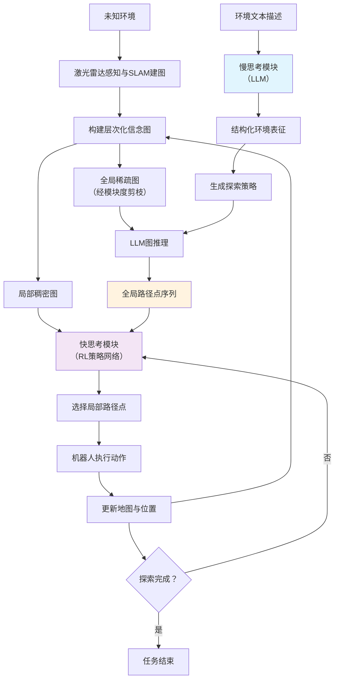

# FARE: Fast-Slow Agentic Robotic Exploration

**相关性评分**: 6.0/10

**排名**: #36

---

## 基本信息

- **arXiv ID**: [2601.14681v1](https://arxiv.org/abs/2601.14681v1)
- **发布时间**: 2026-01-21T05:56:24Z
- **相关性评分**: 6.0/10
- **是否相关**: 是

## 作者

Shuhao Liao, Xuxin Lv, Jeric Lew, Shizhe Zhang, Jingsong Liang, Peizhuo Li, Yuhong Cao, Wenjun Wu, Guillaume Sartoretti

## 关键词

VLA for Robotics, fine tune, offline Reinforcement Learning, world model

## 一句话总结

FARE是一个分层自主探索框架，通过结合大型语言模型进行全局语义推理和强化学习策略进行局部决策，提升机器人探索效率。

## 摘要

This work advances autonomous robot exploration by integrating agent-level semantic reasoning with fast local control. We introduce FARE, a hierarchical autonomous exploration framework that integrates a large language model (LLM) for global reasoning with a reinforcement learning (RL) policy for local decision making. FARE follows a fast-slow thinking paradigm. The slow-thinking LLM module interprets a concise textual description of the unknown environment and synthesizes an agent-level exploration strategy, which is then grounded into a sequence of global waypoints through a topological graph. To further improve reasoning efficiency, this module employs a modularity-based pruning mechanism that reduces redundant graph structures. The fast-thinking RL module executes exploration by reacting to local observations while being guided by the LLM-generated global waypoints. The RL policy is additionally shaped by a reward term that encourages adherence to the global waypoints, enabling coherent and robust closed-loop behavior. This architecture decouples semantic reasoning from geometric decision, allowing each module to operate in its appropriate temporal and spatial scale. In challenging simulated environments, our results show that FARE achieves substantial improvements in exploration efficiency over state-of-the-art baselines. We further deploy FARE on hardware and validate it in complex, large scale $200m\times130m$ building environment.

## 详细分析

## FARE: Fast-Slow Agentic Robotic Exploration 论文摘要

### 1. 研究背景和动机
自主探索是移动机器人在未知环境中高效获取几何信息的一项核心能力。现有方法主要分为传统规划器和基于学习的方法。传统方法依赖固定的启发式规则，难以适应不同环境特性；而基于强化学习的方法则因奖励稀疏，难以学习依赖长期信息的策略。两者均**难以有效利用长期结构信息并随环境演变调整策略**。本文旨在解决这一挑战，提出一种融合全局语义推理与局部快速决策的新型框架。

### 2. 核心方法和技术创新
本文提出 **FARE**，一个遵循**快-慢思维范式**的分层自主探索框架：
- **慢思维模块（全局推理）**：利用大语言模型（LLM）解析环境的文本描述，生成**环境条件化的探索策略**。该策略通过一个基于**模块度剪枝**构建的稀疏全局信念图进行落地，生成一系列全局路径点。模块度剪枝机制显著减少了冗余的图结构，提升了推理效率。
- **快思维模块（局部决策）**：采用基于注意力机制的图神经网络强化学习策略，根据密集的局部观测（如前沿、几何特征）选择动作。在训练中，通过引入一个**指令跟随奖励项**，鼓励策略遵循慢思维模块提供的全局路径点，从而协调长期目标与局部反应。
- **核心创新**：将**语义级全局推理**与**几何级局部决策**解耦，使二者在各自合适的时空尺度上运作，实现了环境自适应的、兼顾长远规划与实时反应的探索行为。

### 3. 主要实验结果
在Gazebo模拟的室内、森林和仓库三种代表性环境中，FARE与TARE、DSVP、ARiADNE、HEADER等前沿方法进行了对比。
- **性能表现**：在结构复杂的森林和仓库环境中，FARE在**探索距离和完成时间上均取得显著优势**。例如在仓库环境中，FARE的探索距离（441m）和用时（252s）均为最优。
- **行为分析**：轨迹可视化表明，FARE能更早地探索外围和角落区域，**减少了不必要的回溯**，而基线方法常会推迟探索这些区域导致效率降低。
- **实物验证**：在一座200m×130m的大型教学楼中，FARE成功部署于轮式机器人，仅依靠机载计算（Qwen3-14B LLM）即完成了全自主探索，验证了其从仿真到现实的迁移能力。

### 4. 研究意义和价值
FARE通过引入LLM进行高层语义推理，为机器人探索注入了**环境理解与策略自适应能力**，超越了传统基于几何或固定奖励的范式。其**分层快-慢架构**为结合符号推理与数据驱动决策提供了可扩展的范例。该工作不仅提升了复杂未知环境中探索的效率和鲁棒性，也为未来实现**多机器人协同、融入视觉语义感知**的智能探索系统奠定了重要基础。

## 问答对

### 问题 1

**Q**: 这篇论文的核心创新点是什么，他想解决什么问题，怎么解决的？

**A**: ## 论文核心分析：FARE: Fast-Slow Agentic Robotic Exploration

### **一、 拟解决的核心问题**
论文旨在解决**移动机器人在未知环境中进行自主探索时，难以有效利用长期结构信息并动态调整探索策略**的难题。具体表现为：
- **传统规划器**：依赖固定的启发式规则或超参数（如信息增益与路径长度的权衡），无法根据环境的结构特征（如开阔地、狭窄走廊）自适应调整行为，导致在复杂环境中效率低下（如在开放空间过于保守，在杂乱区域过度细化）。
- **基于学习的方法**：探索任务的回报信号极其稀疏（只有任务完成时才知道总耗时/距离），导致**长期信用分配困难**。现有方法通过设计密集奖励（如立即获得的信息增益）来缓解，但这会使策略偏向短视的、即时可见的收益，难以学习**长距离回溯**或**利用远期结构线索**等依赖长期后果的行为。

### **二、 核心创新点**
论文提出了 **FARE** 框架，其核心创新在于**将“快-慢思考”认知范式引入机器人自主探索**，实现了**语义级全局推理与几何级局部决策的层次化解耦与协同**。

1.  **“慢思考”全局语义推理模块**：
    - **技术创新**：利用**大语言模型**，根据对环境的简短文本描述，进行结构化环境表征（空间特征、障碍物特征、探索挑战），并生成**面向智能体层级的、可解释的探索策略**（涵盖空间、效率、安全、任务四个维度）。
    - **关键技术**：该模块基于一个通过**模块化社区检测并经过剪枝的全局信念图**进行推理。剪枝机制仅保留模块度贡献最高的社区，大幅减少了图的冗余结构，提升了LLM推理的效率和聚焦性。
    - **输出**：生成一系列指导长期探索的**全局路径点序列**，并随地图增量更新而动态调整。

2.  **“快思考”局部强化学习执行模块**：
    - **技术创新**：采用**基于注意力机制的图神经网络强化学习策略**，处理密集的局部观测（局部图、节点效用、前沿信息）。
    - **关键设计**：在策略训练中引入了一个**指令跟随奖励项**，鼓励策略选择的局部路径点与“慢思考”模块提供的全局指导路径点保持一致。这使RL策略能在遵循长期目标的同时，保持对局部条件的实时响应。
    - **作用**：负责基于局部信息进行快速决策和避障，同时接受全局路径点的“柔性”引导。

3.  **层次化协同架构的创新价值**：
    - **时空解耦**：让LLM在“慢”时间尺度和“粗”空间尺度上进行语义推理，让RL策略在“快”时间尺度和“细”空间尺度上进行几何决策，**各司其职**。
    - **解决长期信用分配**：通过全局路径点序列，将遥远的、语义上的长期目标（如“优先探索外围”）转化为一系列可逐步跟随的中间子目标，为RL策略提供了**稠密的、与长期目标对齐的学习信号**。
    - **环境自适应**：通过文本描述注入先验知识，使系统能根据环境类型（如仓库、森林、办公楼）**动态生成并调整探索策略**，而非使用固定参数。

### **三、 解决方案总结**
FARE通过一个**三层流水线**解决问题：
1.  **环境感知与建图**：使用激光雷达增量构建占据栅格地图，并从中生成**层次化机器人信念图**（稠密的局部图 + 稀疏的全局图）。
2.  **慢思考-策略生成与图推理**：
    - 输入环境文本描述 → LLM进行环境表征分析 → 生成结构化探索策略。
    - 基于剪枝后的全局图，LLM结合当前策略和探索记忆，推理出**全局路径点序列**。
3.  **快思考-策略执行与学习**：
    - RL策略接收**局部图、节点效用和全局路径点**作为观测。
    - 策略输出下一个局部路径点，驱动机器人移动。
    - **训练时**，通过“指令跟随奖励”使策略学习与全局指导协同；**部署时**，实现闭环的、兼顾全局方向与局部灵活性的探索行为。

### **四、 实际价值**
- **性能提升**：在仿真（室内、森林、仓库）和真实大规模建筑（200m x 130m）实验中，FARE相比前沿基线方法（如TARE, HEADER）**减少了不必要的回溯，产生了更高效的探索轨迹**，尤其在具有明显全局结构特征的环境中优势更大。
- **系统可行性**：成功在搭载Jetson AGX Orin的移动机器人上**实时运行**了LLM推理（Qwen3-14B）和RL策略，证明了该框架从仿真到现实的**可迁移性和工程可行性**。
- **方向性启示**：为结合**大型基础模型（LLM）的语义理解能力**与**传统/学习型机器人控制**提供了一个新颖且有效的范式，推动了具身智能在复杂长程任务中的应用。

### 问题 2

**Q**: 请用一段话总结这篇论文，明确说明：论文试图解决的核心问题；提出的主要方法或框架；最终取得的主要效果或结论。要求语言简洁、信息密度高，不要复述摘要原文。

**A**: 这篇论文旨在解决现有自主探索方法难以有效利用长期环境结构信息并动态调整策略的问题。针对传统方法依赖固定启发式规则、学习型方法受限于稀疏奖励和短视行为的局限性，论文提出了 **FARE** 框架。该框架的核心创新在于采用**快慢思维分层架构**：慢思维模块利用大语言模型（LLM）解析环境文本描述，进行语义推理并生成全局探索策略与路径点序列；快思维模块则是一个强化学习（RL）策略，它基于局部观测实时决策，同时通过专门设计的奖励项来遵循全局引导。这种设计将**高层语义推理与底层几何决策解耦**。实验表明，FARE在多种仿真和真实大规模场景中显著提升了探索效率，减少了不必要的回溯，其性能优于多种前沿基线方法。

### 问题 3

**Q**: 这篇论文相对于已有工作有哪些明确的创新点？请逐条列出，并对每一条说明：相比以往方法改进或不同之处在哪里，以及该创新解决了什么具体问题或带来了什么优势。

**A**: ## FARE论文创新点分析

这篇论文提出了一种名为FARE的机器人自主探索框架，其核心创新在于将**大语言模型（LLM）的语义推理能力**与**强化学习（RL）的局部决策能力**相结合，并采用**快-慢思维（Fast-Slow Thinking）** 的层次化架构。以下是其相对于已有工作的明确创新点：

### 1. **引入基于LLM的“慢思维”全局语义推理模块**
   - **改进/不同之处**：
     - **以往方法**：传统的分层规划器依赖于**固定的启发式规则**或**预定义的超参数**（如信息增益与路径长度的权衡）来生成全局引导。学习型方法则主要基于**局部几何观测**进行决策，缺乏对**环境高层语义和长期结构**的利用。
     - **FARE的做法**：利用LLM，根据对环境的**简洁文本描述**（如“具有长走廊的现代办公楼”），生成一个**结构化、可解释的探索策略**。该策略通过分析空间特征、障碍物特征和探索挑战等维度，动态指导全局路径点的生成。
   - **解决的问题/带来的优势**：
     - **解决了**：传统方法无法根据环境语义特征（如开阔度、连通性）**自适应调整探索策略**的问题，以及学习型方法因奖励稀疏而难以进行**长期信用分配**的问题。
     - **优势**：使机器人能够理解环境的高层特性（如“优先探索边界”、“谨慎处理死胡同”），从而做出更符合环境结构的长期决策，减少不必要的回溯和低效探索。

### 2. **提出基于模块度的全局信念图剪枝机制**
   - **改进/不同之处**：
     - **以往方法**：构建用于全局规划的稀疏图时，通常基于几何距离或固定规则进行简化，可能保留冗余结构，增加LLM推理的计算负担和复杂度。
     - **FARE的做法**：在构建全局信念图时，应用**模块度（Modularity）社区检测**，并**仅保留模块度贡献最高的前k个社区**作为全局图的节点。这本质上是一种**基于图结构信息的智能剪枝**。
   - **解决的问题/带来的优势**：
     - **解决了**：在动态、增量构建的图中进行高效全局推理的挑战。直接使用原始或简单稀疏化的图会给LLM带来大量无关信息。
     - **优势**：**显著降低了全局图的复杂度**，使LLM能够更快速、更聚焦地对环境的**关键拓扑结构**进行推理，提高了系统的实时性和可扩展性。

### 3. **设计“指令跟随”奖励项，实现全局引导与局部执行的紧密耦合**
   - **改进/不同之处**：
     - **以往方法**：在分层架构中，全局规划与局部执行往往是**松耦合**的。局部RL策略通常只优化即时信息增益，缺乏明确激励去遵循全局指导，容易导致局部最优和偏离长期目标。
     - **FARE的做法**：在训练局部RL策略（快思维模块）时，在奖励函数中引入了一个**指令跟随奖励项**。该奖励项惩罚智能体选择的局部路径点与LLM生成的全局指导路径点之间的偏差。
   - **解决的问题/带来的优势**：
     - **解决了**：全局语义策略与局部几何决策**脱节**的问题。它确保了高层策略能够被有效地“落地”执行。
     - **优势**：使局部策略在保持对**即时观测（如前沿、障碍物）快速反应**的同时，**始终对齐长期探索目标**。这种设计实现了**闭环的、连贯的探索行为**，是提升整体效率的关键。

### 4. **构建了融合语义、几何与任务信息的层次化决策框架**
   - **改进/不同之处**：
     - **以往方法**：要么是纯几何/优化的分层规划（无语义），要么是端到端的RL策略（难以融入先验知识）。两者在**时空尺度**和**信息抽象层次**上未能清晰解耦。
     - **FARE的做法**：明确采用**快-慢思维范式**进行解耦：
       - **慢思维（LLM）**：工作在**长时域、粗空间尺度**，处理**语义和拓扑信息**。
       - **快思维（RL）**：工作在**短时域、细空间尺度**，处理**稠密的局部几何和效用信息**。
   - **解决的问题/带来的优势**：
     - **解决了**：单一模块同时处理多尺度、多模态信息带来的决策冲突和效率低下问题。
     - **优势**：**架构清晰，各司其职**。LLM专注于需要常识和推理的**战略制定**，RL专注于需要快速感知和反应的**战术执行**。这种分离使得系统既能利用**先验知识**，又能保持**实时响应能力**，并具有良好的**可解释性**（LLM生成的策略可读）。

### 总结
FARE的核心创新在于**创造性地将LLM作为高级“战略家”引入机器人自主探索回路**，并通过**模块度剪枝**和**指令跟随奖励**两项关键技术，解决了LLM与机器人控制系统高效、鲁棒集成的难题。其实验表明，该框架在复杂结构化环境（如仓库、森林）中能显著减少探索距离和时间，优势明显，并成功通过了大规模真实场景的硬件验证，展现了强大的实际应用潜力。

### 问题 4

**Q**: 论文在实验或评估中最终实现了怎样的效果？请说明使用了哪些数据集和评价指标，与哪些基线方法进行了对比，以及在关键指标上的主要性能提升或结论。如果论文未给出明确的定量结果，也请说明原因。

**A**: ## 论文实验与评估效果分析

根据论文内容，FARE 在模拟环境和真实硬件上进行了全面的实验评估，证明了其在自主探索任务中的高效性和鲁棒性。

### 一、 评估环境与数据集
论文使用了**两类环境**进行评估，均基于机器人操作系统（ROS）框架：
1.  **Gazebo 模拟环境**：构建了三个具有不同结构特征的基准环境：
    *   **室内环境**：现代办公楼，包含长走廊、会议室和隔间区域。
    *   **森林环境**：户外森林，包含自然障碍物、树木和不平坦地形。
    *   **仓库环境**：室内仓库，由密集排列的货箱堆形成狭窄通道。
2.  **真实世界硬件验证环境**：
    *   一个规模为 **200m × 130m** 的校园室内教学楼，包含长走廊、房间和交叉路口，对全局推理和长时程探索构成挑战。

### 二、 评价指标
论文采用自主探索领域两个最核心的指标来衡量性能：
*   **总旅行距离**：机器人完成探索所行驶的总路径长度（单位：米）。**目标是最小化此距离**。
*   **总探索时间**：机器人完成探索所需的总时间（单位：秒）。**目标是最小化此时间**。
这两个指标直接反映了探索的**效率**。

### 三、 对比的基线方法
论文选择了四种具有代表性的先进探索规划器作为基线进行对比：
1.  **TARE**：一种经典的分层探索框架，使用稀疏全局图进行引导。
2.  **DSVP**：一种基于动态扩展的双阶段视点规划器。
3.  **ARiADNE**：一种基于注意力深度网络的强化学习探索方法。
4.  **HEADER**：一种结合专家引导奖励的分层注意力深度强化学习探索方法（与FARE作者团队相关的前期工作）。

**对比的公平性设置**：所有图相关的设置（如图稀疏化策略）在不同方法间保持一致。FARE 仅调整节点分辨率参数，而基线方法通常需要调整多个参数以达到最佳性能。

### 四、 关键性能结果与结论
在 Gazebo 模拟的三个环境中，每个方法各运行10次，结果总结如下表（数据来自论文表 I 及正文描述）：

| 环境 | 方法 | 平均距离 (m) | 平均时间 (s) | 性能结论 |
| :--- | :--- | :--- | :--- | :--- |
| **室内** | DSVP | 1511 (±75) | 931 (±61) | FARE 在距离和时间上均达到**最佳或相当水平**。室内环境结构紧凑，全局结构特征不明显，因此FARE的优势未完全显现。 |
| | TARE | 1209 (±42) | 658 (±23) | |
| | ARiADNE | 1053 (±63) | 610 (±24) | |
| | HEADER | 1030 (±40) | 576 (±26) | |
| | **FARE** | **1048 (±13)** | **590 (±10)** | |
| **森林** | DSVP | 2058 (±92) | 1083 (±60) | FARE 在**距离上显著领先**所有基线，时间上也达到最优。表明其在复杂、非结构化的户外环境中能有效利用全局语义指导。 |
| | TARE | 1363 (±43) | 711 (±21) | |
| | ARiADNE | 1320 (±81) | 790 (±62) | |
| | HEADER | 1230 (±72) | 725 (±36) | |
| | **FARE** | **1090 (±21)** | **680 (±10)** | |
| **仓库** | DSVP | 869 (±42) | 582 (±32) | FARE 在**距离和时间上均取得最大优势**。在具有明显全局结构（狭窄通道、规律布局）的环境中，FARE的慢思考模块能生成更优的全局策略，避免不必要的回溯。 |
| | TARE | 652 (±31) | 366 (±22) | |
| | ARiADNE | 521 (±16) | 362 (±40) | |
| | HEADER | 492 (±17) | 286 (±16) | |
| | **FARE** | **441 (±15)** | **252 (±8)** | |

**主要性能提升与结论**：
1.  **环境自适应性带来效率提升**：FARE 的性能优势随着环境**全局结构复杂性**的增加而扩大。在结构简单的室内环境中与最佳基线相当，在复杂的森林和高度结构化的仓库环境中则显著领先。这证明了其**慢思考模块**（LLM）根据环境描述生成自适应策略的有效性。
2.  **减少冗余回溯**：通过轨迹可视化（论文图3）观察到，基线方法倾向于推迟探索边界和角落区域，导致后期额外的回溯。而FARE能更早地系统性地完成这些区域的探索，从而生成更连贯、高效的轨迹。
3.  **成功实现从仿真到真实的迁移**：在大型真实教学楼中的硬件实验表明，FARE 能够**完全自主**地完成探索任务，无需人工干预。系统保持了稳定的运行时性能，证明了其框架在现实场景中的可行性和鲁棒性。
4.  **关键成功因素**：论文将FARE的性能提升归因于两点：
    *   **分层设计**：实现了环境自适应的规划，慢思考模块提供基于语义的长期方向。
    *   **有效协调**：通过“指令跟随”奖励项，使快思考模块（RL策略）能在遵循全局引导的同时，保持对局部信息的灵活响应，平衡了长期目标与局部反应性。

**总结**：FARE 通过引入基于LLM的语义推理层，显著提升了自主机器人在复杂未知环境中探索的长期效率和策略适应性，在模拟和真实世界实验中均验证了其相对于现有先进方法的优越性，尤其是在环境具有显著可推理的全局结构时。

## 相关链接

- [arXiv 页面](https://arxiv.org/abs/2601.14681v1)
- [HTML 版本](https://arxiv.org/html/2601.14681v1)
