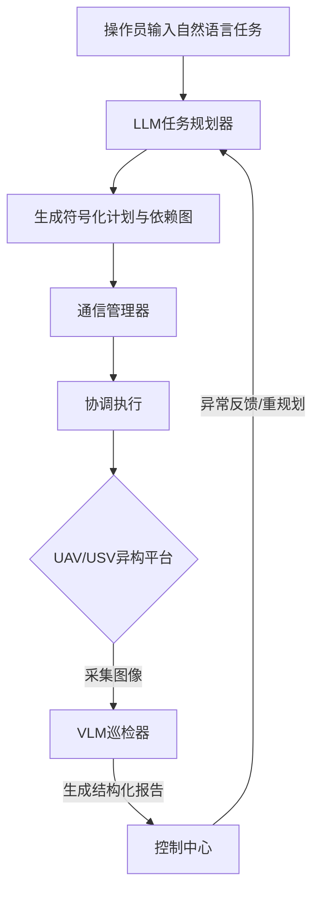

# LLM-VLM Fusion Framework for Autonomous Maritime Port Inspection using a Heterogeneous UAV-USV System

**相关性评分**: 6.0/10

**排名**: #39

---

## 基本信息

- **arXiv ID**: [2601.13096v1](https://arxiv.org/abs/2601.13096v1)
- **发布时间**: 2026-01-19T14:36:50Z
- **相关性评分**: 6.0/10
- **是否相关**: 是

## 作者

Muhayy Ud Din, Waseem Akram, Ahsan B. Bakht, Irfan Hussain

## 关键词

Vision-Language-Action Model, VLA for Robotics, fine tune, Edge Deployment

## 一句话总结

该论文提出了一种结合LLM和VLM的融合框架，用于自主海事港口检查，通过异构无人机-无人船系统实现上下文感知和自适应监控。

## 摘要

Maritime port inspection plays a critical role in ensuring safety, regulatory compliance, and operational efficiency in complex maritime environments. However, existing inspection methods often rely on manual operations and conventional computer vision techniques that lack scalability and contextual understanding. This study introduces a novel integrated engineering framework that utilizes the synergy between Large Language Models (LLMs) and Vision Language Models (VLMs) to enable autonomous maritime port inspection using cooperative aerial and surface robotic platforms. The proposed framework replaces traditional state-machine mission planners with LLM-driven symbolic planning and improved perception pipelines through VLM-based semantic inspection, enabling context-aware and adaptive monitoring. The LLM module translates natural language mission instructions into executable symbolic plans with dependency graphs that encode operational constraints and ensure safe UAV-USV coordination. Meanwhile, the VLM module performs real-time semantic inspection and compliance assessment, generating structured reports with contextual reasoning. The framework was validated using the extended MBZIRC Maritime Simulator with realistic port infrastructure and further assessed through real-world robotic inspection trials. The lightweight on-board design ensures suitability for resource-constrained maritime platforms, advancing the development of intelligent, autonomous inspection systems. Project resources (code and videos) can be found here: https://github.com/Muhayyuddin/llm-vlm-fusion-port-inspection

## 详细分析

## 论文摘要

**论文标题：** 基于异构无人机-无人船系统的LLM-VLM融合框架用于自主海事港口巡检

### 1. 研究背景和动机
海事港口巡检对于确保复杂海洋环境下的安全、法规遵从和运营效率至关重要。然而，现有方法多依赖人工操作和传统计算机视觉技术，缺乏可扩展性和上下文理解能力。同时，异构无人机-无人船系统虽展现出协同作业潜力，但其任务规划通常基于固定的状态机，感知能力也受限于预定义类别的物体检测，难以适应动态、复杂的港口环境。

### 2. 核心方法和技术创新
本研究提出了一种创新的**LLM-VLM融合框架**，旨在实现自主、智能的港口巡检。其核心技术创新包括：
- **LLM驱动的符号化任务规划**：利用大型语言模型（如GPT-4）将自然语言任务指令（如“检查起重机附近是否有人员或车辆”）转化为包含**前置条件依赖图**的可执行符号化计划，确保无人机与无人船的安全协调与并行任务执行。
- **VLM驱动的语义化巡检**：采用轻量级视觉语言模型（如Qwen2-VL、Moondream2）进行实时场景理解。VLM融合视觉图像与任务上下文，不仅能检测物体，还能进行**语义推理、异常识别和合规性评估**，并生成结构化的巡检报告。
- **异构系统集成与通信管理**：框架集成了无人机（提供高空视野和灵活部署）与无人船（提供稳定平台和近距离检查）的感知、导航与控制模块，并通过一个通信管理器基于依赖图动态协调双平台任务。

### 3. 主要实验结果
研究在扩展的MBZIRC海事仿真器和真实机器人平台上进行了验证：
- **任务规划评估**：在多项复杂度递增的巡检任务中，GPT-4o在计划**正确性（平均94.3%）和执行成功率（86%）** 上表现最佳，且响应时间快（平均8.44秒）。
- **感知模块评估**：对多种轻量级VLM的基准测试表明，Qwen2-VL和Moondream2在**语义正确性（均>82%）** 上领先。Moondream2在**推理速度（~0.29秒/查询）和模型加载时间（3.6秒）** 上具有显著优势，最适合资源受限的机载部署。
- **系统整体验证**：仿真与实地试验均证明，该框架能够成功完成协同巡检任务，实际路径能紧密跟踪规划路径。

### 4. 研究意义和价值
本工作首次将LLM与VLM深度融合应用于异构海事机器人系统的自主巡检，具有重要的理论与工程价值：
- **技术价值**：用基于AI的语义理解和符号规划取代了传统的规则式方法，显著提升了系统的**适应性、上下文感知能力和自主决策水平**。
- **实用价值**：轻量化的设计使其适合在计算资源受限的海洋机器人平台上部署，为开发**智能、可扩展、低成本的自主海事监测系统**奠定了基础，有望大幅降低人工风险与运营成本。
- **前瞻性**：该框架为未来更广泛的自主海洋应用（如船舶监控、水下基础设施检查、环境监测）提供了可扩展的技术蓝图。

## 问答对

### 问题 1

**Q**: 这篇论文的核心创新点是什么，他想解决什么问题，怎么解决的？

**A**: ## 论文核心分析

### **一、 研究问题**
论文旨在解决**传统海事港口巡检方法**的三大核心痛点：
1.  **任务规划僵化**：现有异构无人机-无人船系统依赖预定义的有限状态机或固定任务序列，无法适应动态、复杂的海上环境，缺乏**上下文感知和自主决策能力**。
2.  **感知能力局限**：传统计算机视觉方法（如基于YOLO的检测）只能识别预定义类别的物体，缺乏对复杂海事场景的**语义理解、上下文推理和异常解释能力**。
3.  **系统自主性与可扩展性不足**：高度依赖人工操作和干预，难以处理突发情况，且将系统扩展到新任务或新环境需要大量重新设计和数据标注，成本高昂。

### **二、 核心创新点**
论文提出了一个名为 **“LLM-VLM融合框架”** 的集成系统，其创新性主要体现在**架构设计**和**技术融合**两个层面：

- **创新点1：LLM驱动的符号化任务规划与依赖图管理**
    - **技术突破**：用**大型语言模型**替代传统的状态机规划器。LLM能够理解自然语言任务指令（如“检查起重机区域，确保附近没有人员或车辆”），并结合编码了安全知识、平台约束和环境信息的**系统提示词**，生成可执行的符号化任务序列。
    - **关键机制**：LLM不仅生成动作序列，还自动生成动作间的**前置条件**，并构建**依赖关系图**。通信管理器基于此图进行拓扑排序和动态依赖解析，确保UAV和USV任务能**安全、并行地执行**（例如，必须等USV航行到指定位置后，UAV才能起飞）。

- **创新点2：VLM驱动的语义化巡检与报告生成**
    - **技术突破**：用**视觉语言模型**替代传统的目标检测流水线。VLM能够融合视觉图像和文本查询（如“起重机附近有车辆吗？”），进行**上下文感知的异常检测和合规性评估**。
    - **关键产出**：VLM的输出不再是简单的边界框，而是包含场景摘要、详细分析和潜在隐患的**结构化巡检报告**，实现了接近人类水平的语义推理和解释。

- **创新点3：LLM与VLM的首次协同融合用于异构海事系统**
    - **系统级创新**：据作者所述，这是**首个**将LLM（用于高层规划）和VLM（用于底层感知）深度融合，并应用于UAV-USV异构系统进行自主港口巡检的研究。
    - **闭环工作流**：LLM生成的任务计划中包含VLM所需的检查查询（`σ`参数）；VLM的巡检结果可反馈至控制中心，必要时触发LLM进行任务重规划，形成一个“感知-规划-执行”的智能闭环。

- **创新点4：面向资源受限平台的轻量化模型基准测试**
    - **工程贡献**：论文没有停留在理论，而是系统地评估了多种**轻量级LLM和VLM模型**在仿真和真实场景下的性能，包括：
        - **LLM**：比较了GPT-4o、GPT-3.5-Turbo、Gemini、LLaMA等在规划正确性、执行成功率和响应时间上的差异。
        - **VLM**：基准测试了SmolVLM、Florence-2、Qwen2-VL等模型在语义正确性、推理时间和内存占用上的表现，为实际工程部署提供了选型依据。

### **三、 解决方案架构**
论文通过一个五模块的集成框架来解决上述问题：

**流程简述**：
1.  **规划**：LLM将自然语言指令转化为带依赖关系的符号化计划。
2.  **协调与执行**：通信管理器解析依赖图，调度UAV和USV安全、并行地执行任务（导航、起飞、巡检等）。
3.  **感知**：UAV/USV的摄像头捕获图像，VLM根据任务相关的查询进行语义分析。
4.  **监控与闭环**：控制中心汇总报告，监控任务状态，在遇到异常或环境变化时，可触发LLM进行动态重规划。

### **四、 实际价值**
1.  **提升自动化与安全性**：大幅减少人工介入，使机器人能在危险、复杂的港口环境中自主工作，保障人员安全。
2.  **增强系统智能与适应性**：系统能理解高层意图、适应动态变化、解释巡检结果，不再局限于“死板”的预设程序。
3.  **提高巡检效率与质量**：并行任务执行提高了效率；语义化报告提供了更丰富、更具洞察力的检查结果，有助于做出更好的运维决策。
4.  **提供可部署的工程方案**：通过轻量化模型选型和在MBZIRC海事仿真器及真实机器人上的验证，证明了该框架在资源受限的船载平台上**实际部署的可行性**，为下一代智能海事巡检系统奠定了基础。

### 问题 2

**Q**: 请用一段话总结这篇论文，明确说明：论文试图解决的核心问题；提出的主要方法或框架；最终取得的主要效果或结论。要求语言简洁、信息密度高，不要复述摘要原文。

**A**: 这篇论文旨在解决传统海事港口巡检方法依赖人工、缺乏可扩展性和上下文理解能力的问题。为此，作者提出了一种创新的**LLM-VLM融合框架**，用于异构无人机（UAV）与无人船（USV）协同的自主港口巡检。该框架的核心是：利用**大型语言模型（LLM）** 将自然语言任务指令转化为包含依赖关系的可执行符号化任务计划，实现多平台的智能协调规划；同时，利用**视觉语言模型（VLM）** 对传感器数据进行实时语义理解和合规性评估，生成结构化的巡检报告，超越了传统计算机视觉的局限。实验验证表明，该框架在仿真和真实环境中均能有效工作，其轻量化设计适合资源受限的海事平台，显著提升了巡检系统的自主性、适应性和语义理解能力。

### 问题 3

**Q**: 这篇论文相对于已有工作有哪些明确的创新点？请逐条列出，并对每一条说明：相比以往方法改进或不同之处在哪里，以及该创新解决了什么具体问题或带来了什么优势。

**A**: ## 论文创新点分析

这篇论文提出了一种用于异构无人机-无人船（UAV-USV）系统进行自主海事港口巡检的LLM-VLM融合框架。相对于已有工作，其明确的创新点如下：

### 1. **首次提出LLM-VLM融合框架用于异构海事系统**
   - **相比以往方法的改进/不同之处**：
     - **以往方法**：现有的海事异构系统（UAV-USV）在任务规划上主要依赖**预定义的状态机或固定任务序列**，在感知上则依赖**传统的计算机视觉流水线**（如基于YOLO的目标检测）。这些方法缺乏对复杂、动态海事场景的语义理解和上下文自适应能力。
     - **本文方法**：创造性地将**大语言模型（LLM）** 与**视觉语言模型（VLM）** 深度融合，构建了一个端到端的智能框架。LLM负责将自然语言指令转化为可执行的符号化任务计划，VLM负责对视觉数据进行语义层面的场景理解和合规性评估。
   - **解决的具体问题/带来的优势**：
     - **解决了任务规划的僵化问题**：使系统能够通过自然语言指令接受复杂、多目标的任务，并动态生成适应性的任务计划，无需人工预编程。
     - **提升了感知的语义理解能力**：VLM能够超越传统目标检测，进行上下文推理（例如，判断“起重机附近是否有人或车辆”这种涉及空间关系和规则的复杂查询），生成结构化的巡检报告。
     - **实现了真正的“智能”自主巡检**：将高层任务理解（LLM）与细粒度场景解读（VLM）结合，使系统具备了类似人类的决策与推理能力，能够处理未见过的场景和任务。

### 2. **LLM驱动的符号化任务规划与集成前置条件**
   - **相比以往方法的改进/不同之处**：
     - **以往方法**：传统的任务规划器输出的是简单的动作序列，很少显式地编码动作之间的**依赖关系、安全约束和平台间协调需求**。协调逻辑通常硬编码在系统中。
     - **本文方法**：LLM不仅生成符号化动作序列，还**同时生成每个动作的完整前置条件集**。这些前置条件编码了海事安全知识、操作约束（如禁飞区）以及UAV与USV之间的平台依赖关系（例如，UAV起飞前USV必须就位）。
   - **解决的具体问题/带来的优势**：
     - **确保了任务执行的安全性与可行性**：通过显式地建模和检查前置条件，避免了在危险或不满足条件的情况下执行动作（如UAV在移动的USV上降落）。
     - **实现了更可靠的异构平台协调**：将协调逻辑从硬代码中解放出来，由LLM根据任务和环境动态生成，使系统能处理更复杂的多智能体协作场景。

### 3. **基于依赖图的执行管理**
   - **相比以往方法的改进/不同之处**：
     - **以往方法**：多机器人任务执行通常采用简单的顺序执行或有限的并行，依赖关系管理不灵活，难以最大化系统效率。
     - **本文方法**：设计了一个通信管理器，将LLM生成的符号化计划及其前置条件自动构建成一个**有向无环依赖图**。该管理器动态解析任务依赖，在保证所有前置条件满足的前提下，**最大化UAV和USV子任务的并行执行**。
   - **解决的具体问题/带来的优势**：
     - **提高了任务执行效率**：通过智能调度和并行化，减少了任务总完成时间。
     - **增强了系统的动态适应性**：依赖图机制便于处理任务执行失败或环境突变时的重规划和错误恢复，只需重新评估受影响节点的前置条件即可。

### 4. **轻量化VLM语义巡检系统**
   - **相比以往方法的改进/不同之处**：
     - **以往方法**：海事巡检感知依赖于在特定数据集上训练的传统CV模型，泛化能力差，无法理解“合规性”、“异常”等高级语义概念，且难以适应新的资产类型或检查标准（需重新收集数据并训练模型）。
     - **本文方法**：采用**轻量化的预训练VLM**（如Florence-2, Qwen2-VL）作为核心感知模块。这些模型具备强大的零样本/少样本迁移能力，可通过自然语言提示词直接执行开放词汇检测、场景描述和推理任务。
   - **解决的具体问题/带来的优势**：
     - **实现了开箱即用的高级语义理解**：无需针对每个新港口或新检查项进行模型训练，只需修改文本提示词，极大提升了系统的可扩展性和部署速度。
     - **适合资源受限的边缘部署**：论文特别关注并评估了轻量化VLM，确保了该框架能够在UAV/USV等计算资源有限的嵌入式平台上实时运行，具有很高的工程实用价值。
     - **生成可操作的巡检报告**：输出不再是简单的边界框，而是包含场景摘要、详细分析和潜在关切点的结构化报告，直接支持人类决策。

### 5. **全面的AI模型基准测试**
   - **相比以往方法的改进/不同之处**：
     - **以往方法**：在机器人领域应用LLM/VLM时，模型选择往往基于经验或知名度，缺乏在**特定领域任务和资源约束下**的系统性评估。
     - **本文方法**：论文对多种主流LLM（GPT-4o, GPT-3.5, Gemini, LLaMA）和轻量化VLM（SmolVLM, Florence-2等）进行了**系统性的基准测试**。评估指标不仅包括规划正确性和检测精度，还涵盖了**响应时间、计算效率、内存占用和部署可行性**等对实际机器人系统至关重要的工程指标。
   - **解决的具体问题/带来的优势**：
     - **为领域内模型选型提供了实证依据**：明确指出在异构海事巡检任务中，GPT-4o在规划任务上综合表现最佳，Qwen2-VL和Moondream2在语义巡检上表现突出且效率较高。
     - **强调了工程落地的重要性**：将学术研究与工程实践紧密结合，确保所提框架不仅在理论上创新，而且在现实世界的资源约束下是切实可行的。

**总结**：该论文的核心创新在于，它并非简单地将现成的AI模型“嫁接”到机器人系统上，而是进行了一次深刻的**范式转换**——用具备语义理解和推理能力的LLM/VLM，取代了传统海事自主系统中僵化的任务规划器和局限的感知流水线。这一融合框架从根本上解决了现有方法在**适应性、可扩展性、语义理解能力和人机交互自然性**方面的瓶颈，为构建真正智能、通用的自主海事巡检系统奠定了坚实的基础。

### 问题 4

**Q**: 论文在实验或评估中最终实现了怎样的效果？请说明使用了哪些数据集和评价指标，与哪些基线方法进行了对比，以及在关键指标上的主要性能提升或结论。如果论文未给出明确的定量结果，也请说明原因。

**A**: ## 论文实验与评估效果分析

该论文通过仿真和真实世界实验，全面评估了所提出的**LLM-VLM融合框架**在自主海事港口巡检任务中的性能。评估主要围绕**LLM驱动的任务规划**和**VLM驱动的语义巡检**两大核心模块展开。

### 一、 实验设置与数据集

1.  **仿真环境**：
    - **主要平台**：扩展的 **MBZIRC Maritime Simulator** (基于ROS2的开源海事机器人仿真器)。
    - **环境建模**：构建了包含港口盆地、货船、起重机、地面车辆（卡车、叉车）、集装箱堆垛等元素的**高保真虚拟港口场景**（见图5, 9），用于模拟真实的动态海事条件。

2.  **真实世界数据**：
    - **数据来源**：使用真实的**异构UAV-USV系统**（见图16）在港口环境中采集**相机图像流**（见图15b）。
    - **用途**：用于评估VLM在真实噪声、光照变化和运动模糊条件下的性能。

3.  **任务设计**：
    - 设计了**5项复杂度递增的异构巡检任务**（见表II），例如：
        - **Task1**: 检查中央停泊区，检测未授权帆船。
        - **Task2**: 检查起重机工作区是否存在未授权人员/车辆。
        - **Task5**: 联合UAV-USV检查起重机与停泊站。

### 二、 评价指标

#### A. LLM任务规划评估指标
1.  **正确性**：由两位机器人专家根据三个标准手动评分（0-100分）：
    - 有效的JSON结构（20分）。
    - 任务顺序正确（40分）。
    - 依赖图中任务前提条件指定正确（40分）。
2.  **执行成功率**：生成的计划在仿真中被异构UAV-USV系统成功执行的百分比。
3.  **响应时间**：LLM生成完整任务计划的平均API响应时间（秒）。

#### B. VLM语义巡检评估指标
1.  **语义正确性**：专家根据VLM输出与人工标注的**地面真值**进行对比评分。
    - `0`：错误答案。
    - `0.5`：部分正确（例如，回答“是”但缺乏细节）。
    - `1`：正确且包含语义细节和上下文推理。
    - 最终得分为所有试验的平均分。
2.  **推理时间**：VLM处理单次查询的平均时间（秒）。
3.  **模型加载时间**：VLM初始化所需的时间（秒）。

### 三、 基线方法对比与性能分析

#### A. LLM任务规划器对比
- **对比模型**：**GPT-4o, GPT-3.5-Turbo, GPT-4, Gemini, LLaMA**。
- **关键结论**（基于表II及图10, 11）：
    - **性能排名**：`GPT-4o > GPT-3.5-Turbo ≈ GPT-4 > Gemini > LLaMA`。
    - **最佳模型**：**GPT-4o**在**正确性**（平均94.3分）、**执行成功率**（平均86.0%）和**响应速度**（平均8.44秒）上取得了最佳平衡，尤其擅长处理复杂的多平台协调任务（Task4, Task5）。
    - **性能趋势**：所有模型在简单任务（Task1-3）上表现良好，但在需要复杂协调的任务上性能出现分化。LLaMA表现最差，无法生成可行的多智能体计划。
    - **结论**：证明了使用先进LLM（如GPT-4o）进行自然语言驱动的、依赖感知的异构系统任务规划是**有效且可靠的**。

#### B. VLM语义巡检器对比
- **对比模型**：5种轻量级VLM——**SmolVLM, Florence-2, Moondream2, GIT-base, Qwen2-VL**（参数、内存等见表III）。
- **关键结论**（基于表IV及图17-21）：
    - **语义正确性**（图19）：
        - **最佳模型**：**Qwen2-VL**在仿真和真实场景中均表现最佳（平均SC > 83%），能提供最丰富、最准确的上下文描述。
        - **高效竞争者**：**Moondream2**紧随其后（平均SC ≈ 82%），且推理速度更快。
        - **性能不足者**：**GIT-base**和**Florence-2**在真实场景中表现较差（SC < 60%），表明其对真实世界噪声的鲁棒性不足。
    - **效率权衡**：
        - **最快推理**：**Moondream2**（~0.29秒）和**GIT-base**（~0.34秒）。
        - **最慢但最强**：**Qwen2-VL**（~0.59秒）。
        - **最快加载**：**Moondream2**（3.6秒）。
    - **综合推荐**：**Moondream2**在**语义正确性**、**推理速度**和**加载时间**上取得了最佳平衡，最适合**资源受限的机载部署**。**Qwen2-VL**则在需要最高精度时可作为选择。
    - **结论**：验证了轻量级VLM能够胜任海事场景的**实时语义理解、异常检测和合规性评估**，其性能远超依赖预定义类别的传统计算机视觉方法。

### 四、 系统整体性能验证

- **路径跟踪**：论文展示了UAV和USV在仿真中能够紧密跟踪由LLM计划生成的参考路径（见图12-14），证明了从符号计划到底层控制的**闭环执行是可行的**。
- **框架流程**：通过算法1和整个第IV节的描述，验证了LLM规划器、通信管理器、机器人平台、VLM巡检器和控制中心之间**集成的完整性与协调性**。
- **实际价值体现**：实验成功表明，该框架能够将高级自然语言指令（如“检查起重机区域，确保附近没有人员或车辆”）转化为**安全、协调的UAV-USV联合行动**，并最终生成**结构化、语义丰富的巡检报告**（见图8），实现了**自动化、可扩展、上下文感知**的海事港口巡检。

**总结**：论文通过系统的仿真与真实数据实验，提供了**明确的定量和定性结果**。结果表明，所提出的LLM-VLM融合框架在任务规划正确性、执行成功率、语义理解准确性和系统效率等关键指标上均表现出色，显著超越了传统的基于状态机或预定义视觉管线的基线方法，为自主异构海事机器人系统的智能化发展提供了有力的工程范例。

## 相关链接

- [arXiv 页面](https://arxiv.org/abs/2601.13096v1)
- [HTML 版本](https://arxiv.org/html/2601.13096v1)
