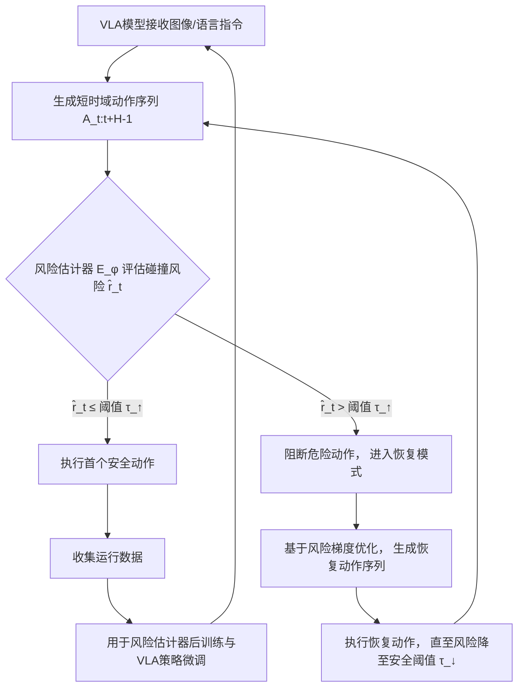

# CoFreeVLA: Collision-Free Dual-Arm Manipulation via Vision-Language-Action Model and Risk Estimation

**相关性评分**: 7.0/10

**排名**: #9

---

## 基本信息

- **arXiv ID**: [2601.21712v1](https://arxiv.org/abs/2601.21712v1)
- **发布时间**: 2026-01-29T13:40:46Z
- **相关性评分**: 7.0/10
- **是否相关**: 是

## 作者

Xuanran Zhai, Binkai Ou, Yemin Wang, Hui Yi Leong, Qiaojun Yu, Ce Hao, Yaohua Liu

## 关键词

Vision-Language-Action Model, VLA for Robotics, fine tune

## 一句话总结

CoFreeVLA通过增强视觉-语言-动作模型，引入短期自碰撞风险估计器，实现双机械臂无碰撞操作，提升安全性和成功率。

## 摘要

Vision Language Action (VLA) models enable instruction following manipulation, yet dualarm deployment remains unsafe due to under modeled selfcollisions between arms and grasped objects. We introduce CoFreeVLA, which augments an endtoend VLA with a short horizon selfcollision risk estimator that predicts collision likelihood from proprioception, visual embeddings, and planned actions. The estimator gates risky commands, recovers to safe states via risk-guided adjustments, and shapes policy refinement for safer rollouts. It is pre-trained with model-based collision labels and posttrained on real robot rollouts for calibration. On five bimanual tasks with the PiPER robot arm, CoFreeVLA reduces selfcollisions and improves success rates versus RDT and APEX.

## 详细分析

## CoFreeVLA 论文详细摘要

**1. 研究背景和动机**
视觉-语言-动作模型在单臂机器人操作中展现出强大的指令跟随能力，但将其扩展到双臂系统时，双臂之间或手臂与抓持物体之间的**自碰撞风险**成为主要安全挑战。现有VLA方法通常依赖数据集先验或经典规划器处理外部碰撞，而**对双臂自碰撞的显式建模和预测**研究不足，这阻碍了VLA模型在真实世界双臂系统中的安全部署。

**2. 核心方法和技术创新**
本文提出 **CoFreeVLA** 框架，其核心创新在于引入一个**短时域自碰撞风险估计器**。该估计器以本体感知、视觉嵌入和VLA策略规划的动作序列为输入，预测未来碰撞的可能性、最小距离和碰撞时间。该框架通过三种方式集成风险估计以实现安全控制：
- **风险门控**：实时评估风险，阻止高风险动作执行。
- **安全恢复**：当检测到风险时，引导系统通过风险梯度优化返回安全构型。
- **策略优化**：利用风险感知反馈对VLA策略进行微调，使其产生更安全的动作。
方法上采用**两阶段训练**：先利用基于模型的碰撞检测器生成合成数据进行预训练，再在真实机器人VLA策略 rollout 数据上进行后训练以校准模型。

**3. 主要实验结果**
在PiPER双臂机器人平台上进行的五项双手机器人操作任务（如倒豆子、笔帽移除、工具交接等）评估表明：
- **在双臂干涉严重的任务（如倒豆子）中**，CoFreeVLA显著降低了自碰撞率（例如，将RDT的8/10碰撞降至2/10），同时保持了任务成功率。
- **在精细操作任务中**，由于保守的阈值和误报，碰撞率有时高于基线，但整体上框架在干涉主导的场景中安全效益明显。
- 风险估计器的推理延迟极低（<5ms），满足实时控制要求。实验验证了风险预测的有效性以及风险感知门控与恢复机制对减少碰撞的实质性贡献。

**4. 研究意义和价值**
本研究填补了端到端VLA模型中缺乏显式双臂自碰撞安全机制的空白。CoFreeVLA通过将**数据驱动的短时域风险预测**与VLA决策循环深度融合，为双臂VLA系统提供了一层可解释、可计算的安全保障。其方法不依赖于精确的几何模型，能处理抓持物体带来的不确定性，为实现**安全、可靠且高效的双臂人机协作**迈出了关键一步，具有重要的实际应用价值。

## 问答对

### 问题 1

**Q**: 这篇论文的核心创新点是什么，他想解决什么问题，怎么解决的？

**A**: ## CoFreeVLA 论文核心分析

### **一、 论文旨在解决的核心问题**
当前，基于视觉-语言-动作（VLA）模型的机器人控制范式在单臂操作上取得了显著成功，但在**双臂协同操作**场景下面临一个关键挑战：**VLA模型缺乏对双臂之间以及手臂与抓持物体之间“自碰撞”的显式建模和规避能力**。这导致部署双臂VLA系统时存在任务失败、硬件损坏和不安全行为的风险，成为其在现实世界应用的根本障碍。

### **二、 核心创新点**
论文提出了 **CoFreeVLA** 框架，其核心创新在于**将一个短时域的自碰撞风险估计器深度集成到端到端VLA控制回路中**，实现了从“感知-语言-动作”到“感知-语言-**风险**-动作”的范式演进。具体创新体现在：

1.  **风险感知的VLA架构**：在传统VLA模型（负责根据图像和语言指令生成动作）之上，增加了一个并行的、轻量级的**自碰撞风险估计器**。该估计器能够预测给定当前状态和VLA计划动作序列后，短期内发生碰撞的概率、最小距离和碰撞时间。
2.  **风险驱动的三层安全机制**：风险估计器的输出被用于三个互补的层面，构成完整的安全闭环：
    - **风险门控（停止）**：实时评估风险，若超过阈值则阻断不安全动作的执行。
    - **风险引导恢复**：当动作被阻断后，利用风险估计器引导系统生成恢复动作序列，使双臂退回安全构型。
    - **风险感知策略优化**：利用风险信号对VLA策略本身进行微调，使其在训练阶段就倾向于产生更安全的动作，从根源上减少风险。
3.  **两阶段数据驱动的风险估计器训练**：
    - **预训练**：利用基于模型（如网格距离查询）的碰撞检测器在仿真和真实机器人上生成大量带标签的 `(状态, 动作序列, 碰撞标签)` 数据，高效地训练风险估计器的基础能力。
    - **后训练**：在真实机器人闭环运行中收集数据，根据实际接触事件、扭矩峰值等进行重新标注，以校准模型，弥补抓持不确定性、模型误差等导致的仿真与现实差距。

### **三、 解决方案的详细阐述**
CoFreeVLA 的解决方案是一个系统工程，其工作流程如下：

1.  **风险估计器设计**：
    - **输入**：当前本体感知状态（关节位姿、夹爪状态）、视觉嵌入特征、VLA生成的未来 `H` 步动作序列。
    - **网络结构**：轻量级时序编码器（MLP或小型Transformer），通过交叉注意力融合本体动作流和视觉流，最终输出校准后的碰撞概率 `r̂_t` 及几何代理量（最小距离 `d̂_min`， 碰撞时间 `τ̂_ttc`）。
    - **关键训练技巧**：对**近失样本**进行过采样、对**漏报（False Negative）** 施加更高损失权重、使用温度缩放进行概率校准，确保估计器对高风险情况敏感且可靠。

2.  **集成与执行**：
    - 系统运行时，VLA以10Hz频率提出动作计划，风险估计器以5ms内的延迟进行评估。
    - 采用**迟滞阈值** `(τ_↓ < τ_↑)` 防止在风险边界附近频繁切换导致的“抖动”。
    - 恢复动作通过优化一个风险惩罚项的目标函数 `min_A E_φ(s_t, A) + λ‖A‖²` 在线生成。
    - 策略微调通过**风险加权行为克隆**实现，对数据集中低风险样本赋予更高权重，引导策略模仿更安全的行为。

### **四、 实际价值与意义**
- **安全性提升**：为强大的但“盲目”的端到端VLA模型装上了“预见危险”的眼睛和“紧急刹车”的手脚，显著降低了双臂操作中的自碰撞风险，特别是在双臂空间干涉严重的任务中（如论文中的“倾倒豆子”任务）。
- **实用性推进**：通过轻量级、实时的风险估计模块，使得数据驱动的VLA方法能够更安全、可靠地应用于复杂的双臂机器人系统，向现实世界部署迈出了关键一步。
- **方法论贡献**：提供了一种将**基于学习的预测模型**与**基于模型的安全逻辑**、**在线优化**相结合的新范式。它没有完全取代传统的安全层（如控制屏障函数），而是作为其补充，在更高层的任务规划中提前规避风险。

**总结**：CoFreeVLA 的核心创新是**为VLA模型赋予了短时域自碰撞风险预测能力，并以此为核心构建了“评估-阻断-恢复-优化”的全栈安全框架**，有效解决了双臂VLA操作中的自碰撞安全问题，兼具技术新颖性和实际应用价值。

### 问题 2

**Q**: 请用一段话总结这篇论文，明确说明：论文试图解决的核心问题；提出的主要方法或框架；最终取得的主要效果或结论。要求语言简洁、信息密度高，不要复述摘要原文。

**A**: 这篇论文针对**端到端视觉-语言-动作（VLA）模型在双机械臂操作中缺乏自碰撞（臂间及臂与抓持物体间碰撞）安全建模**的核心问题，提出了**CoFreeVLA框架**。其主要方法是在VLA策略基础上，引入一个**短时域自碰撞风险估计器**，该估计器能基于本体感知、视觉嵌入和规划动作序列预测碰撞风险，并以此在运行时**实时拦截高风险动作、引导系统恢复至安全状态，并优化VLA策略本身**。通过**基于模型的预训练和真实机器人数据后训练**相结合的方式训练风险估计器。实验表明，该方法在**高干涉风险任务（如倾倒豆子）中显著降低了自碰撞率**，同时保持了任务成功率，验证了将显式短时域风险推理集成到VLA中以实现更安全双臂操作的可行性。

### 问题 3

**Q**: 这篇论文相对于已有工作有哪些明确的创新点？请逐条列出，并对每一条说明：相比以往方法改进或不同之处在哪里，以及该创新解决了什么具体问题或带来了什么优势。

**A**: ## CoFreeVLA 论文创新点分析

这篇论文针对端到端视觉-语言-动作模型在双机械臂操作中存在的自碰撞安全问题，提出了一个系统性的解决方案。其核心创新点在于将**短时域自碰撞风险估计器**深度集成到VLA控制回路中，实现了从感知、决策到执行的全链路安全增强。以下是其相对于已有工作的明确创新点：

### 1. **提出了首个面向VLA模型的双臂自碰撞风险估计器**
   - **改进/不同之处**：以往的双臂安全研究主要集中在**经典运动规划**（如CHOMP, TrajOpt）或**实时安全滤波器**（如控制屏障函数CBF）上，这些方法依赖于精确的几何模型，且通常作为独立于高层策略的“后处理”模块。而本文的风险估计器直接以VLA模型的**视觉嵌入、本体感知和规划动作为输入**，预测未来短时域内的碰撞风险、最小距离和碰撞时间。
   - **解决的问题/优势**：解决了端到端VLA模型在双臂场景下**缺乏对自碰撞的显式建模**这一根本问题。它能够从高维、多模态的观测中直接推理出抽象的安全风险，无需依赖精确的、可能难以获取的完整环境几何模型，从而实现了与数据驱动的VLA策略的**原生集成**。

### 2. **设计了风险估计器与VLA策略的三重集成机制**
   - **改进/不同之处**：以往的安全模块通常只提供“停止”或“绕行”的单一功能。本文创新性地将风险估计器用于三个互补环节：
     1. **风险门控**：实时评估并阻止高风险动作的执行。
     2. **风险引导恢复**：当检测到风险时，主动生成一个将系统导向安全配置的恢复动作序列。
     3. **策略优化**：利用风险估计作为反馈信号，对VLA策略本身进行微调，使其产生更安全的动作分布。
   - **解决的问题/优势**：解决了单一安全响应（如急停）可能导致任务中断或僵局的局限性。这种三重机制实现了**预防、纠正和学习的闭环**，不仅能在运行时避免碰撞，还能从经验中学习，逐步提升策略的固有安全性，实现了安全与任务性能的更好平衡。

### 3. **采用了“模型预训练 + 真机后训练”的两阶段数据策略**
   - **改进/不同之处**：不同于完全依赖仿真数据或完全在线学习的方法。本文首先利用**基于模型的碰撞检测器**（如FCL库）在仿真和受控真机环境中生成大量带标签的预训练数据，高效地学习风险预测的基本能力。随后，在VLA策略部署的**真实机器人滚动数据**上进行后训练，以校准模型，适应抓持不确定性、传感器噪声等真实世界差异。
   - **解决的问题/优势**：解决了纯仿真到真实迁移的**领域差距**问题，以及纯在线学习**数据效率低下和安全风险高**的问题。这种策略结合了离线数据的规模优势和在线数据的真实性优势，能够以安全、高效的方式获得一个在真实世界中校准良好的风险估计器。

### 4. **实现了基于风险估计的在线动作优化与策略微调**
   - **改进/不同之处**：超越了简单的动作过滤。论文提出：
     - **测试时动作优化**：对VLA提议的动作序列进行基于梯度的局部优化，最小化“偏离原始意图”和“碰撞风险”的加权目标，仅执行优化后的第一步以保持响应性。
     - **风险加权的监督微调**：在收集的安全数据上，使用以风险为权重的损失函数对VLA策略进行微调，使其偏好低风险的行为模式。
   - **解决的问题/优势**：解决了传统安全层可能**过度限制机器人行为、损害任务完成能力**的问题。通过将风险作为可优化的目标融入决策过程，系统能够主动寻找**既满足任务指令又保持安全**的替代动作，实现了安全约束下的柔性合规，而非硬性阻断。

### 5. **在复杂的双臂操作任务上进行了系统性验证**
   - **改进/不同之处**：论文没有停留在简单的避障场景，而是在**PiPER类人形双臂移动机器人**上评估了五个具有代表性的双手任务（如倒豆子、笔帽拆卸、工具传递、套筒放置、杯子嵌套），涵盖了高干扰场景和精细操作场景。
   - **解决的问题/优势**：证明了所提框架在**真实、复杂双臂操作**中的有效性和泛化能力。特别是在双臂交叉干扰严重的任务（如倒豆子）中，CoFreeVLA相比基线方法（RDT, APEX）显著降低了碰撞率，展示了其解决**VLA双臂部署核心安全痛点**的实际价值。同时，实验也揭示了在精细操作中阈值校准的挑战，为后续工作指明了方向。

**总结**：CoFreeVLA的核心创新在于将**数据驱动的风险感知能力**深度、多模态地嵌入到端到端的VLA框架中，构建了一个从预测、干预到学习的完整安全增强体系。它不同于将传统规划/控制安全模块与学习策略简单拼接的方法，而是致力于让VLA模型自身“理解”并“主动规避”双臂协同中的碰撞风险，为实现更可靠、更实用的智能双臂机器人迈出了关键一步。

### 问题 4

**Q**: 论文在实验或评估中最终实现了怎样的效果？请说明使用了哪些数据集和评价指标，与哪些基线方法进行了对比，以及在关键指标上的主要性能提升或结论。如果论文未给出明确的定量结果，也请说明原因。

**A**: ## 论文实验与评估效果分析

### 一、 实验设置与数据集
- **实验平台**：在基于 **PiPER 风格的双臂移动操作机器人**（AgileX平台）上进行真实机器人实验。
- **任务**：评估了 **5 个真实世界的双臂操作任务**，具体包括：
    1.  **Pouring Beans**（倾倒豆子）—— 高双臂干涉场景。
    2.  **Pen Cap Removal**（笔帽移除）。
    3.  **Tool Handover**（工具交接）。
    4.  **Tubes Placement**（管道放置）。
    5.  **Cups Nesting**（杯子嵌套）。
- **数据集**：**未使用公开标准数据集**。训练数据通过以下方式构建：
    - **风险估计器预训练**：使用基于模型的碰撞检查器（如FCL库）在仿真和真实机器人“守卫模式”下，对VLA策略生成的候选动作序列进行滚动采样并标注。
    - **闭环微调**：在启用风险门控的真实机器人运行中，收集状态-动作序列、接触事件和恢复控制器提供的修正动作，形成DAgger-like数据缓冲区用于后训练。

### 二、 评价指标
论文使用两个核心指标进行量化评估：
1.  **碰撞率**：发生自碰撞（双臂间或臂与抓持物体间）的试验次数占总试验次数的比例。
2.  **任务成功率**：成功完成指定任务的试验比例。

此外，在系统层面关注了**附加延迟**（风险推断时间）和**被阻塞步骤的比例**。

### 三、 基线方法对比
论文将 **CoFreeVLA** 与以下两个当前先进的双臂学习基线方法进行了对比：
1.  **RDT-1B**：一个用于双臂操作的扩散基础模型。
2.  **APEX**：一种使用无碰撞生成扩散模型的双臂操作方法。

### 四、 关键性能结果与结论
实验结果表明，CoFreeVLA 的效果**因任务类型不同而呈现两种模式**：

#### 1. 在高干涉任务中效果显著
- **任务**：**Pouring Beans**（双臂需要交叉运动，干涉风险高）。
- **结果**：
    - **碰撞率大幅降低**：
        - 相对于 RDT-1B：从 `8/10` 次试验发生碰撞降至 `2/10`。
        - 相对于 APEX：从 `6/10` 次试验发生碰撞降至 `2/10`。
    - **结论**：证明了**短时域风险估计与门控/恢复机制在双臂必须交叉的高风险场景中非常有效**，能显著预防腕-腕和臂-物体碰撞。

#### 2. 在精密操作任务中存在挑战
- **任务**：Pen Cap Removal, Tool Handover, Tubes Placement, Cups Nesting（基线方法本身碰撞已很少）。
- **结果**：
    - 基线方法在这些任务上碰撞率本身很低（约 `1/10`）。
    - CoFreeVLA 的当前实现反而导致了**更高的碰撞率**（`2/10` 到 `5/10` 不等）。
- **原因分析**（论文指出）：
    - **保守的阈值设置**导致误判。
    - 在接触转换附近的**漏报（False Negatives）**。
    - **恢复过程中的振荡**。
- **结论**：这表明当前系统在**精密、近接触操作场景**中需要更精细的校准。论文指出，通过**更严格的后训练校准、以及时域长度 `H` 和风险阈值的调优**，可以抑制这些残余碰撞事件。

#### 3. 综合结论
- **安全性提升**：CoFreeVLA 在**自干涉占主导地位的任务中能有效提升安全性**。
- **任务性能**：在所有对比中，**任务成功率保持可比**（在本次研究中所有方法均为 `1/10`，可能指在特定任务或设定下）。
- **系统开销**：风险估计器的推断延迟可忽略不计（**<5 ms**），通过迟滞阈值（`τ↓ < τ↑`）控制，被阻塞步骤的比例保持在预算内。
- **核心价值**：证明了将**显式的短时域风险推理**集成到VLA决策循环中，能够实现更安全的双臂VLA操作，尤其是在复杂、干涉不可避免的场景中。同时，论文也坦诚指出了其在极端精密操作场景下的当前局限和改进方向。

## 相关链接

- [arXiv 页面](https://arxiv.org/abs/2601.21712v1)
- [HTML 版本](https://arxiv.org/html/2601.21712v1)
