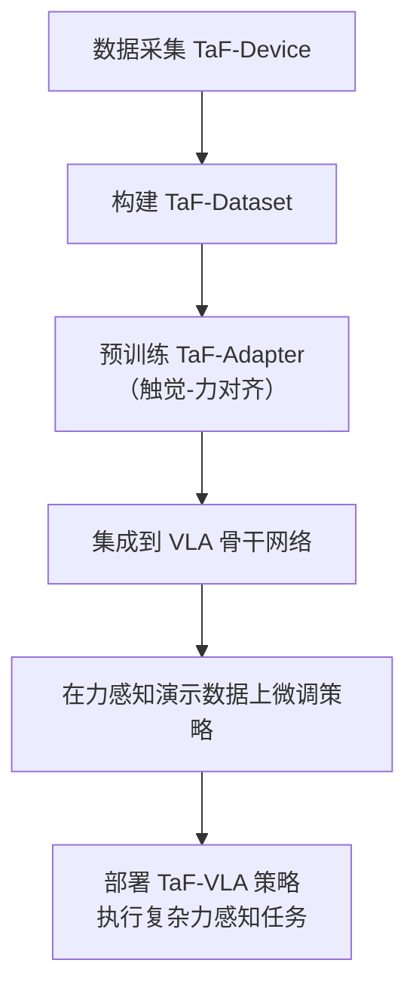

# Tactile-Force Alignment in Vision-Language-Action Models for Force-aware Manipulation

**相关性评分**: 8.0/10

**排名**: #4

---

## 基本信息

- **arXiv ID**: [2601.20321v1](https://arxiv.org/abs/2601.20321v1)
- **发布时间**: 2026-01-28T07:34:41Z
- **相关性评分**: 8.0/10
- **是否相关**: 是

## 作者

Yuzhe Huang, Pei Lin, Wanlin Li, Daohan Li, Jiajun Li, Jiaming Jiang, Chenxi Xiao, Ziyuan Jiao

## 关键词

Vision-Language-Action Model, VLA for Robotics, fine tune

## 一句话总结

该论文提出了一种通过触觉-力对齐增强视觉-语言-动作模型的方法，用于实现力感知的机器人操作，显著提升了接触密集型任务的性能。

## 摘要

Vision-Language-Action (VLA) models have recently emerged as powerful generalists for robotic manipulation. However, due to their predominant reliance on visual modalities, they fundamentally lack the physical intuition required for contact-rich tasks that require precise force regulation and physical reasoning. Existing attempts to incorporate vision-based tactile sensing into VLA models typically treat tactile inputs as auxiliary visual textures, thereby overlooking the underlying correlation between surface deformation and interaction dynamics. To bridge this gap, we propose a paradigm shift from tactile-vision alignment to tactile-force alignment. Here, we introduce TaF-VLA, a framework that explicitly grounds high-dimensional tactile observations in physical interaction forces. To facilitate this, we develop an automated tactile-force data acquisition device and curate the TaF-Dataset, comprising over 10 million synchronized tactile observations, 6-axis force/torque, and matrix force map. To align sequential tactile observations with interaction forces, the central component of our approach is the Tactile-Force Adapter (TaF-Adapter), a tactile sensor encoder that extracts discretized latent information for encoding tactile observations. This mechanism ensures that the learned representations capture history-dependent, noise-insensitive physical dynamics rather than static visual textures. Finally, we integrate this force-aligned encoder into a VLA backbone. Extensive real-world experiments demonstrate that TaF-VLA policy significantly outperforms state-of-the-art tactile-vision-aligned and vision-only baselines on contact-rich tasks, verifying its ability to achieve robust, force-aware manipulation through cross-modal physical reasoning.

## 详细分析

## 论文摘要：Tactile-Force Alignment in Vision-Language-Action Models for Force-aware Manipulation

### 1. 研究背景和动机
当前主流的**视觉-语言-动作模型**在机器人操作中展现出强大的泛化能力，但其主要依赖视觉模态，本质上缺乏对**接触力**的感知与推理能力，导致在需要精确力控的接触密集型任务（如处理易碎物品、精密装配）中表现不佳。现有将视觉触觉传感器融入VLA模型的方法，通常将触觉输入视为辅助的视觉纹理，忽略了**表面形变与物理交互力**之间的内在关联。因此，本文旨在解决VLA模型的“力盲”问题，提出从“触觉-视觉对齐”到“**触觉-力对齐**”的范式转变。

### 2. 核心方法和技术创新
本文提出了**TaF-VLA**框架，其核心创新在于通过**触觉-力对齐**，将高维触觉观测显式地锚定在物理交互力上。具体包括：
- **数据与设备**：设计并构建了自动化触觉-力数据采集设备（TaF-Device），并创建了包含超过1000万帧同步触觉图像、六维力/力矩和矩阵压力图的大规模**TaF-Dataset**。
- **对齐模块**：提出了**TaF-Adapter**模块，它采用对比学习，将时序触觉观测映射到一个与真实力信号对齐的共享隐空间。该模块使用因果Transformer处理历史触觉帧，并通过向量量化码本学习离散、鲁棒的力动力学表征，而非静态视觉纹理。
- **策略集成**：将预训练好的TaF-Adapter集成到预训练的VLA骨干模型中，使策略能够基于语言指令和力对齐的触觉反馈生成动作。

### 3. 主要实验结果
在7个真实的接触密集型操作任务（如镊子取重物、擦白板、切果冻）上进行评估：
- **性能领先**：TaF-VLA策略的平均成功率达到**64.8%**，显著优于最先进的仅视觉基线（37.1%）和触觉-视觉对齐基线（47.6%），在力敏感任务上优势尤其明显。
- **泛化性强**：TaF-Adapter展现出优秀的**跨传感器泛化能力**，在未见过的触觉传感器上性能远超显式力回归方法。
- **数据高效**：集成TaF-Adapter后，模型仅需一半的演示数据即可达到与视觉基线相当或更优的性能。
- **消融验证**：实验证实了使用时序上下文、分离的码本和向量量化等设计对性能提升至关重要。

### 4. 研究意义和价值
本研究通过提出触觉-力对齐的新范式，有效弥补了通用VLA模型在物理交互直觉上的关键短板。其贡献不仅在于提出了高性能的TaF-VLA模型和配套的大规模数据集，更在于证明了**将触觉感知显式地锚定在物理量上是实现力感知操作的关键**。这项工作推动了机器人向更精细、更鲁棒、更类人的力控操作能力发展，并为实现真正意义上的**多模态物理推理**奠定了基础。

## 问答对

### 问题 1

**Q**: 这篇论文的核心创新点是什么，他想解决什么问题，怎么解决的？

**A**: ## 论文核心分析

### **一、 研究问题：VLA模型的“力盲”困境**
当前主流的**视觉-语言-动作模型**虽然在开放任务上表现出色，但其**严重依赖视觉模态**，导致在需要精确力感知和物理推理的**接触密集型任务**中表现不佳。例如：
- 处理易碎物体、精密装配、操作薄形可变形物体等。
- 视觉信息易受遮挡，且**无法直接感知交互力**，而力是安全、鲁棒操作的关键。

现有尝试将基于视觉的触觉传感融入VLA模型的方法，通常只是将触觉输入视为**辅助的视觉纹理**，忽略了**表面形变与交互动力学之间的内在关联**。

### **二、 核心创新：从“触觉-视觉对齐”到“触觉-力对齐”的范式转变**
论文提出了 **TaF-VLA** 框架，其核心创新在于**将高维触觉观测显式地“锚定”在物理交互力上**，而非仅仅对齐到视觉特征。这解决了传统方法将触觉当作“更多视觉”而丢失物理语义的根本问题。

具体而言，创新点体现在三个层面，对应解决三个关键挑战：

| 挑战 | 创新解决方案 | 核心贡献 |
| :--- | :--- | :--- |
| **Q1: 对齐数据稀缺** | **TaF-Device 与 TaF-Dataset** | 设计自动化数据采集设备，高效（10万帧/小时）收集超过1000万帧的**同步触觉图像、六维力/力矩、矩阵压力图**数据。 |
| **Q2: 表征差异大** | **TaF-Adapter 模块** | 提出触觉-力适配器，使用**对比学习**在共享潜空间中对齐**时序触觉观测**与**物理力信号**，并采用**向量量化**获得离散、抗噪的力感知表征。 |
| **Q3: 策略集成困难** | **TaF-VLA 策略集成** | 将预训练好的TaF-Adapter作为**冻结模块**，集成到预训练的VLA骨干网络中，通过插入**力对齐的触觉标记**，使策略能基于语言和触觉反馈生成动作。 |

### **三、 技术解决方案详解**
整个TaF-VLA框架分为三个阶段，如下图所示：

**1. TaF-Adapter 的工作原理：**
- **力量化编码器**：使用VQ-VAE将时序的6维力/力矩和压力图分别量化到两个独立的离散码本中，形成稳定的“物理锚点”。
- **时序触觉编码器**：使用ViT提取单帧特征，再通过因果Transformer聚合历史观测，以捕捉**历史依赖的动态力交互**（如滑移初现）。
- **跨模态对齐**：通过**InfoNCE对比损失**，迫使触觉编码器的输出与对应的量化力编码在潜空间中相似，而与批次内其他力的编码不相似。这样，触觉表征就学会了“推断”力动力学。

**2. 策略集成：**
- 将TaF-Adapter提取的力对齐触觉标记 `z_tac`，与VLA骨干提取的视觉-语言特征 `φ` 以及机器人本体感知 `q` 一起，输入到**动作专家**（如基于流匹配的生成器）中。
- 这使得策略在遵循高层语言指令的同时，能根据实时的触觉-力反馈**闭环调整**末端执行器的动作。

### **四、 实际价值与实验验证**
- **性能显著提升**：在7个力关键型日常操作任务（如管件插入、镊子取重物、擦白板、切果冻等）上，TaF-VLA平均成功率**64.8%**，比最好的触觉-视觉对齐基线高出约**22%**，比纯视觉VLA基线性能翻倍。
- **卓越的泛化与鲁棒性**：
    - **即插即用**：将TaF-Adapter接入其他策略骨架（如ACT、Diffusion Policy）能立即带来性能提升。
    - **跨传感器泛化**：在**未见过的**触觉传感器上，TaF-Adapter的零样本性能远优于显式力回归方法，证明了其学习的是**本质的物理特征**，而非传感器特定的映射。
- **提升数据效率**：使用预训练的TaF-Adapter，仅需一半的演示数据就能达到纯视觉基线使用全量数据的性能。
- **支持语言力控制**：通过与**力感知语言指令**（如“轻轻抓握”）配合，首次使VLA模型能够理解和执行精细的力调节命令。

### **五、 总结**
本文的核心创新在于**首次系统性地提出了“触觉-力对齐”范式**，并构建了从数据、表征到策略的完整解决方案。它**从根本上解决了当前通用机器人策略在物理交互中的“力盲”问题**，为机器人实现更灵巧、更鲁棒、更类人的力感知操作开辟了新路径。其贡献不仅是一个高性能模型，更包括一个可扩展的数据采集平台和一个大规模多模态数据集，对社区有重要价值。

### 问题 2

**Q**: 请用一段话总结这篇论文，明确说明：论文试图解决的核心问题；提出的主要方法或框架；最终取得的主要效果或结论。要求语言简洁、信息密度高，不要复述摘要原文。

**A**: 这篇论文旨在解决当前视觉-语言-动作模型在接触密集型操作任务中因缺乏物理力觉感知而表现不佳的核心问题。为此，作者提出了一个范式转变：从“触觉-视觉对齐”转向“触觉-力对齐”。其核心方法是构建了一个名为**TaF-VLA**的框架，该框架通过一个专门的**TaF-Adapter**模块，利用对比学习将高维时序触觉图像编码到与物理力信号对齐的离散化潜在空间中，从而学习到对噪声鲁棒且能捕捉动态接触物理的表示。为了训练该模块，作者还开发了自动化数据采集设备并构建了大规模同步触觉-力数据集。实验表明，该方法在多种需要精确力控的真实世界操作任务中，其策略性能显著超越了仅依赖视觉或传统触觉-视觉对齐的基线模型，验证了显式力对齐对于实现鲁棒、力感知操作的有效性。

### 问题 3

**Q**: 这篇论文相对于已有工作有哪些明确的创新点？请逐条列出，并对每一条说明：相比以往方法改进或不同之处在哪里，以及该创新解决了什么具体问题或带来了什么优势。

**A**: ## 论文核心创新点分析

这篇论文《Tactile-Force Alignment in Vision-Language-Action Models for Force-aware Manipulation》针对现有视觉-语言-动作模型在接触密集型操作任务中的“力盲”问题，提出了一套完整的解决方案。其核心创新点可归纳为以下三个方面，每个创新点都对应解决了现有方法中的一个关键瓶颈。

---

### 1. **范式转变：从“触觉-视觉对齐”到“触觉-力对齐”**
   - **相比以往方法的改进/不同之处**：
     - **以往方法**：现有将视觉触觉传感器集成到VLA模型中的工作（如FreeTacMan, Octopi），通常将触觉图像视为**辅助的视觉纹理**，通过标准的视觉Transformer将其与场景图像和语言进行对齐。这本质上是将触觉数据当作“另一种视觉模态”来处理。
     - **本文方法**：提出**触觉-力对齐**的新范式。核心思想是**将高维触觉观测显式地“锚定”在物理交互力上**，而不是视觉外观上。通过对比学习，在共享的潜在空间中，使触觉表征与真实的6轴力/力矩和压力分布图对齐。
   - **解决的具体问题/带来的优势**：
     - **问题**：将触觉当作视觉处理，无法提取对力感知操作至关重要的接触力信息。模型学到的是表面的**静态纹理特征**，而非**动态的物理交互动力学**。
     - **优势**：
       1. **获得物理直觉**：使模型能够真正理解接触动力学（如力的历史依赖性、粘滑转换），而不仅仅是看到接触。
       2. **实现力感知操作**：这是完成需要精确力调节任务（如抓取易碎物、精密装配）的基础。实验证明，该范式在力关键任务上的成功率显著高于触觉-视觉对齐基线（平均提升约22%）。

### 2. **大规模触觉-力对齐数据采集设备与数据集**
   - **相比以往方法的改进/不同之处**：
     - **以往方法**：缺乏大规模、同步的触觉图像与真实力信号配对数据。现有数据集要么缺少密集的力标签，要么采集效率低下、成本高昂（依赖高精度腕部F/T传感器）。
     - **本文方法**：设计并构建了**全自动的触觉-力数据采集设备**，并发布了**TaF-Dataset**。
       - **设备核心**：采用**并联驱动结构**和**双平台设计**，确保触觉传感器和力传感器受到**完全相同**（大小和方向）的作用力，实现了高保真的同步。
       - **数据集规模**：包含超过**1000万帧**同步数据（触觉图像、6轴力/力矩、矩阵压力图），涵盖了6种不同的视觉触觉传感器和60多种不同形状/硬度的压头。
   - **解决的具体问题/带来的优势**：
     - **问题**：缺乏高质量、大规模的配对数据，是训练能够进行触觉-力对齐的通用模型的主要障碍。
     - **优势**：
       1. **解决数据稀缺性**：为触觉-力对齐预训练提供了必要的大规模监督信号。
       2. **保证数据对齐质量**：机械同步设计从根本上避免了信号传输路径不同带来的失真，提供了可靠的“地面真值”力信号。
       3. **促进泛化**：多样的传感器和接触场景使学习到的表征对硬件差异和接触变化更具鲁棒性。

### 3. **TaF-Adapter模块：基于离散化与历史感知的触觉-力对齐编码器**
   - **相比以往方法的改进/不同之处**：
     - **以往方法**：
       1. **显式力回归**：训练网络直接从触觉图像回归出力值。这种方法对传感器噪声、老化以及跨传感器泛化不鲁棒。
       2. **简单时序处理**：可能忽略力的动态和历史依赖特性。
     - **本文方法**：提出**TaF-Adapter**，其设计包含三个关键特性：
       1. **隐式潜在空间对齐**：使用对比学习（InfoNCE损失）将触觉序列嵌入与**量化后的力编码**在共享潜在空间中对齐，而非直接回归力值。
       2. **向量量化**：使用两个独立的VQ-VAE码本分别对压力分布图和6轴力/力矩进行**离散化编码**。这抑制了高频噪声，并产生了稳定、可解释的物理“锚点”。
       3. **历史感知的因果Transformer**：触觉编码器处理一个时间窗口的序列，通过因果Transformer聚合历史信息，以捕捉力的动态过程（如蠕变、滑移）。
   - **解决的具体问题/带来的优势**：
     - **问题**：
       1. **模态差异**：触觉图像（高维、空间）与力信号（低维、动态）之间存在巨大差异。
       2. **噪声与泛化**：触觉传感器信号易受噪声影响，且不同传感器间存在差异。
       3. **力的动态性**：接触力是历史依赖的，单帧静态图像无法准确表征。
     - **优势**：
       1. **卓越的跨传感器泛化能力**：实验表明，TaF-Adapter在**未见过的**传感器上性能下降远小于显式力回归方法。这是因为潜在空间对齐学习的是**力相关的语义特征**，而非对像素级映射的过拟合。
       2. **鲁棒性**：离散量化能有效过滤传感器噪声，学习到更本质的物理动力学。
       3. **捕捉动态接触**：时序建模使模型能区分稳定抓握和初始滑移等关键状态。
       4. **即插即用**：预训练好的TaF-Adapter可以轻松集成到不同的策略骨干网络中（如ACT、Diffusion Policy），并立即带来性能提升，证明了其作为通用力感知模块的有效性。

---

### **总结：创新点的递进关系**
这三个创新点构成了一个完整的闭环：**新范式**指明了方向，**新数据**提供了燃料，**新模块**实现了核心算法。它们共同解决了当前VLA模型在物理交互中的根本缺陷，使其从“看到做什么”进阶到“感知如何做”，为实现鲁棒、精细的力感知操作奠定了坚实基础。

### 问题 4

**Q**: 论文在实验或评估中最终实现了怎样的效果？请说明使用了哪些数据集和评价指标，与哪些基线方法进行了对比，以及在关键指标上的主要性能提升或结论。如果论文未给出明确的定量结果，也请说明原因。

**A**: ## 论文实验与评估效果分析

该论文通过一系列精心设计的实验，全面评估了所提出的 **TaF-VLA** 框架的有效性。其实验效果显著，验证了“触觉-力对齐”范式的核心价值。

### 一、 使用的数据集
1.  **TaF-Dataset (自建)**：
    - **目的**：用于预训练 **TaF-Adapter**，实现触觉观测与物理力的对齐。
    - **内容**：包含超过 **1000万** 个同步数据帧，每个帧包含：
        - 视觉触觉传感器图像
        - 6轴力/力矩测量值
        - 矩阵式压力分布图
    - **采集设备**：使用自研的自动化 **TaF-Device**，确保触觉与力信号在时空上的精确同步。
    - **传感器多样性**：覆盖了6种不同的视觉触觉传感器（包括4种自研传感器和2种GelSight Mini），以增强模型的泛化能力。

2.  **力感知操作数据集 (自建)**：
    - **目的**：用于微调和评估最终的 **TaF-VLA** 策略。
    - **内容**：包含超过 **10,000** 个真实世界操作演示片段，涵盖20多种不同的接触密集型任务。
    - **特点**：每个演示都配有**力感知语言指令**（例如，“轻轻抓握”、“施加稳定压力”），这些指令通过LLM提示框架自动生成，弥合了高层语义与底层力控制的鸿沟。

### 二、 评价指标
- **核心指标**：**任务成功率**。
- **定义**：在每项任务上，每个模型进行15次试验，成功率 = 成功次数 / 总试验次数。
- **成功标准**：针对每项任务明确定义了二进制完成条件（例如，物体无损坏运输到目标位置、完全插入、完整切片等）。

### 三、 对比的基线方法
论文与5个开源的代表性基线方法进行了全面对比，涵盖了不同的架构范式：

1.  **ACT**：仅使用RGB图像和本体感觉的标准动作分块Transformer策略。
2.  **FreeTacMan**：在ACT架构上实现的**视觉-触觉对齐**基线，将触觉数据视为辅助视觉纹理。
3.  **ACT + TaF-Adapter**：在标准ACT策略上集成预训练的TaF-Adapter，用于验证触觉-力对齐相对于触觉-视觉对齐的优势。
4.  **Diffusion Policy (DP)**：基于去噪扩散的生成式行为克隆策略，仅使用视觉输入。
5.  **DP + TaF-Adapter**：在标准DP上集成TaF-Adapter，展示适配器的泛化能力。
6.  **π₀.₅**：一个最先进的VLA基础模型，仅在作者的数据集上使用视觉观察进行微调，作为TaF-VLA的**纯视觉骨干网络**。

### 四、 关键性能提升与结论
实验在7个接触密集型的日常操作任务上进行（如管件插入、镊子取重物、移动电源拔出、白板擦除、果冻切片等）。主要结论如下：

#### 1. **整体性能大幅领先**
- **TaF-VLA** 在7项任务上的**平均成功率高达64.8%**。
- 相比最强的纯视觉基线 **π₀.₅** (37.1%)，**绝对提升27.7个百分点**。
- 相比现有的触觉-视觉对齐最佳基线 **FreeTacMan** (42.8%)，**绝对提升22个百分点**。
- **结论**：显式的触觉-力对齐显著优于将触觉视为“更多视觉”的方法，证明了其解决VLA模型“力盲”问题的有效性。

#### 2. **在力关键任务中优势尤为显著**
- 在需要动态力调制的任务上，提升幅度最大。例如：
    - **镊子取重物**：TaF-VLA (33.3%) vs. 所有视觉基线 (0%)。视觉策略无法感知微滑移，导致物体掉落。
    - **白板擦除**：TaF-VLA (60.0%) vs. π₀.₅ (33.3%)。TaF-VLA能通过触觉反馈调节接触压力，防止轨迹漂移。
    - **果冻切片**：TaF-VLA (53.3%) vs. π₀.₅ (13.3%)。TaF-VLA能检测到刀片从果冻切入气球的刚度突变。
- **结论**：对于几何约束主导的任务，视觉基线表现尚可；但对于**力关键**任务，触觉-力对齐是成功的必要条件。

#### 3. **TaF-Adapter的“即插即用”与泛化能力**
- **即插即用**：将预训练的TaF-Adapter集成到ACT和DP等不同骨干网络上，均能带来**即时且一致的性能提升**（例如，DP在果冻切片任务上从13.3%提升至33.3%）。
- **跨传感器泛化**：在**未见过的**触觉传感器上进行零样本评估时，TaF-Adapter的表现（平均成功率~60.3%）远优于**显式力回归**方法（平均成功率~30.0%）。
    - **原因**：对比学习在潜在空间中对齐，学习了对低级传感器噪声（如光照、凝胶磨损）不变的力相关特征；而显式回归对像素级映射的微小漂移非常敏感。
- **结论**：TaF-Adapter是一个通用模块，能向策略注入物理直觉，且其离散化、潜在空间对齐的设计对跨硬件泛化至关重要。

#### 4. **提升数据效率**
- 在有限演示数据下（100-200条），**TaF-VLA** 的性能显著优于 **π₀.₅**。
- TaF-VLA仅用100条演示就能达到π₀.₅用200条演示才能达到的性能水平。
- **结论**：力对齐的触觉编码本提供了结构化的物理先验，**大幅减少了学习复杂力敏感技能所需的示范数据量**。

#### 5. **消融研究验证核心设计**
- **时序上下文**：移除历史观测（`N=1`）导致性能大幅下降，证明捕捉历史依赖的动态力是必要的。
- **离散化与双码本**：使用“小码本”或“共享码本”（将压力图与6维力向量合并）均导致性能劣化，验证了**充足容量的离散化**和**解耦不同力模态**的重要性。
- **数据质量**：在带噪声的力标签上训练会严重损害性能，凸显了高质量、同步数据采集系统（TaF-Device）的必要性。

### 总结
论文通过系统性的实验给出了**明确的定量结果**，强有力地证明了 **TaF-VLA** 框架的优越性。其核心贡献在于通过**触觉-力对齐**这一范式转变，使通用VLA模型获得了真正的物理直觉，从而在接触密集、力敏感的操作任务上实现了**性能的飞跃**，并为实现更精细的语言引导力控制开辟了道路。

## 相关链接

- [arXiv 页面](https://arxiv.org/abs/2601.20321v1)
- [HTML 版本](https://arxiv.org/html/2601.20321v1)
