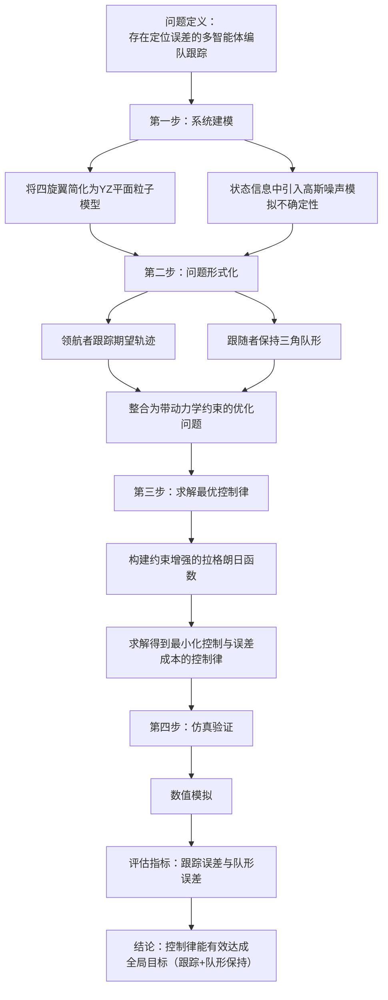

# Distributed Optimal Formation Control for an Uncertain Multiagent System in the Plane

**相关性评分**: 6.0/10

**排名**: #24

---

## 基本信息

- **arXiv ID**: [2301.05841v2](https://arxiv.org/abs/2301.05841v2)
- **发布时间**: 2023-01-14T07:26:18Z
- **相关性评分**: 6.0/10
- **是否相关**: 是

## 作者

Clinton Enwerem, John Baras, Danilo Romero

## 关键词

Robot control, quadruped robot locomotion, reinforcement learning (RL), multi-agent RL, CTDE methods, Edge Deployment, humanoid robot, robot dog, local observational information

## 一句话总结

本文提出了一种分布式最优多智能体控制方案，用于在定位误差下实现四旋翼无人机的编队跟踪，基于领导者-跟随者方法，通过优化问题求解控制律，并在数值模拟中验证了其有效性。

## 摘要

In this paper, we present a distributed optimal multiagent control scheme for quadrotor formation tracking under localization errors. Our control architecture is based on a leader-follower approach, where a single leader quadrotor tracks a desired trajectory while the followers maintain their relative positions in a triangular formation. We begin by modeling the quadrotors as particles in the YZ-plane evolving under dynamics with uncertain state information. Next, by formulating the formation tracking task as an optimization problem -- with a constraint-augmented Lagrangian subject to dynamic constraints -- we solve for the control law that leads to an optimal solution in the control and trajectory error cost-minimizing sense. Results from numerical simulations show that for the planar quadrotor model considered -- with uncertainty in sensor measurements modeled as Gaussian noise -- the resulting optimal control is able to drive each agent to achieve the desired global objective: leader trajectory tracking with formation maintenance. Finally, we evaluate the performance of the control law using the tracking and formation errors of the multiagent system.

## 详细分析

## 论文摘要

本文针对存在定位误差的多智能体系统，提出了一种分布式最优编队控制方案，旨在实现四旋翼无人机群的平面编队跟踪。

**1. 研究背景和动机**
多智能体协同编队控制在搜索救援、环境监测等领域具有重要应用价值。然而，在实际应用中，智能体（如四旋翼无人机）的传感器测量通常存在不确定性（如定位误差），这给实现稳定、精确的分布式编队控制带来了挑战。本文的研究动机正是为了解决在状态信息不确定条件下，多智能体系统如何实现最优编队跟踪这一关键问题。

**2. 核心方法和技术创新**
本文采用**领航-跟随者**架构，其中一个领航无人机跟踪期望轨迹，跟随者则维持与领航者及其他跟随者之间的相对位置，以形成三角形编队。核心技术创新在于：
- **建模**：将四旋翼在YZ平面内的运动建模为受不确定状态信息影响的质点动力学。
- **问题转化**：将编队跟踪任务**形式化为一个优化问题**，构建了包含动态约束的增广拉格朗日函数。
- **分布式最优控制律**：通过求解该优化问题，导出了能够在控制和轨迹跟踪误差意义上实现成本最小化的**分布式最优控制律**。该方法的核心是将全局编队目标分解为可通过局部信息（含噪声的测量值）实现的个体控制决策。

**3. 主要实验结果**
通过数值仿真对所提控制方案进行了验证：
- **仿真设置**：考虑了传感器测量不确定性，并将其建模为高斯噪声。
- **关键结果**：仿真结果表明，即使存在测量噪声，所推导出的最优控制律仍能有效驱动每个智能体实现全局目标。具体表现为**领航者能够准确跟踪期望轨迹**，同时**整个多智能体系统能够保持预定的三角形编队形态**，系统整体的跟踪误差与编队误差均得到了良好控制。

**4. 研究意义和价值**
本研究的意义与价值主要体现在：
- **理论价值**：为存在感知不确定性的多智能体系统提供了一种基于优化理论的分布式控制设计框架，将编队控制问题系统地转化为可求解的优化问题。
- **应用价值**：所提出的控制方案具有强鲁棒性，能够直接处理传感器噪声等常见实际问题，提升了四旋翼无人机编队在真实复杂环境中（如GPS信号不佳或存在干扰）执行协同任务的可靠性与精度，对推动多智能体系统从理论走向实际应用具有积极意义。

## 问答对

### 问题 1

**Q**: 这篇论文的核心创新点是什么，他想解决什么问题，怎么解决的？

**A**: ## 论文核心分析

### 一、 论文想解决的核心问题
这篇论文旨在解决**存在定位误差（不确定性）的多智能体系统**在平面内实现**分布式最优编队控制**的问题。具体而言，它聚焦于以下挑战：
- **不确定性**：智能体（此处为四旋翼无人机）的状态信息（如位置、速度）存在测量误差，论文将其建模为高斯噪声。
- **分布式与最优性**：需要在没有全局集中式协调器的情况下，使多智能体系统以**性能最优**的方式完成编队跟踪任务，即同时最小化控制代价和轨迹跟踪误差。

### 二、 核心创新点
论文的核心创新在于提出了一种**将分布式编队跟踪问题转化为约束优化问题，并通过求解得出最优控制律**的集成框架。具体创新体现在：

1.  **问题建模的创新**：
    - 将存在**状态不确定性的多智能体动力学模型**与**编队跟踪任务**统一在一个优化问题框架内。
    - 明确考虑了传感器测量噪声（高斯模型）对系统性能的影响，使模型更贴近实际应用。

2.  **方法框架的创新**：
    - **“领航-跟随者”结构与优化目标的结合**：在经典的领航-跟随者架构上，不是设计简单的跟踪控制器，而是将整个系统的目标（领航者跟踪期望轨迹、跟随者保持相对队形）形式化为一个**带有约束的拉格朗日函数优化问题**。
    - **约束增强**：优化问题的目标函数不仅包含控制输入的成本，还包含轨迹误差的成本，同时**动力学方程作为约束条件**被纳入。这使得求得的解天然满足系统物理规律。

3.  **控制律的推导**：
    - 通过求解上述优化问题，**解析地或数值地推导出直接的最优控制律**。这个控制律是“最优”的，因为它是在最小化控制能量和跟踪误差的加权和这一明确意义下的最优解。

### 三、 解决方案概述
论文通过以下步骤构建并验证了其解决方案：

**关键解决路径**：
1.  **建模**：将复杂的四旋翼模型简化为平面粒子模型，聚焦于核心的定位与控制问题，并明确加入状态不确定性。
2.  **形式化**：将工程目标（跟踪与队形保持）转化为一个可求解的数学优化问题，其成本函数同时惩罚大的控制动作和大的跟踪偏差。
3.  **求解**：通过优化理论工具，从形式化的问题中推导出具体的分布式控制律。每个智能体的控制指令仅依赖于自身及其邻居（在领航-跟随结构中定义）的**不确定状态信息**，实现了分布式。
4.  **验证**：通过数值仿真，在模拟的噪声环境下验证了所提控制律的有效性，证明了其能驱动系统达成全局目标。

### 四、 实际价值与意义
- **理论价值**：为不确定多智能体系统的协同控制提供了一个**基于优化的、严谨的设计范式**，将控制目标与系统约束统一处理，追求系统级性能最优。
- **应用价值**：
    - 直接适用于无人机编队飞行、地面机器人协同运输等需要高精度相对定位与协作的场景。
    - 明确处理**传感器噪声**，增强了控制方案在实际系统中的**鲁棒性**和可行性。
    - 分布式特性降低了对通信和中央计算单元的依赖，提高了系统的可扩展性和可靠性。

**总结**：该论文的核心创新在于**用一个统一的分布式最优控制框架，解决了存在状态信息不确定性的多智能体系统的精确编队跟踪问题**，并通过理论推导与仿真验证了其有效性。

### 问题 2

**Q**: 请用一段话总结这篇论文，明确说明：论文试图解决的核心问题；提出的主要方法或框架；最终取得的主要效果或结论。要求语言简洁、信息密度高，不要复述摘要原文。

**A**: ## 论文总结

本文针对存在定位误差的平面多智能体系统，研究**分布式最优编队控制**问题。核心在于解决**在状态信息不确定条件下，多四旋翼无人机如何协同实现领航者轨迹跟踪与队形保持**的挑战。论文提出了一种**基于领航-跟随架构的分布式优化控制框架**，将编队跟踪任务建模为带有动态约束的优化问题，通过求解约束增强拉格朗日函数得到**在控制和轨迹误差意义上最优的控制律**。仿真结果表明，即使在传感器测量存在高斯噪声的不确定环境下，该控制律仍能有效驱动所有智能体实现**全局目标**：领航者准确跟踪期望轨迹，同时跟随者稳定维持三角形编队，系统整体表现出良好的跟踪与编队误差性能。

### 问题 3

**Q**: 这篇论文相对于已有工作有哪些明确的创新点？请逐条列出，并对每一条说明：相比以往方法改进或不同之处在哪里，以及该创新解决了什么具体问题或带来了什么优势。

**A**: ## 论文创新点分析

这篇论文针对存在定位误差的多智能体系统平面最优编队控制问题，提出了一个分布式控制方案。相对于已有工作，其明确的创新点可逐条归纳如下：

---

### 1. **在定位不确定性下，将编队跟踪问题形式化为一个带约束的优化问题**
   - **相比以往方法的改进/不同之处**：
     - 传统编队控制方法（如基于一致性协议、行为规则的方法）通常假设状态信息精确已知，或对不确定性的处理较为简单（如鲁棒控制）。
     - 本文**明确地将传感器测量不确定性（建模为高斯噪声）纳入系统动态模型**，并将控制目标（领导机轨迹跟踪与从机编队保持）构建为一个**带有动态约束的代价函数最小化问题**，具体通过约束增强的拉格朗日方法求解。
   - **解决的具体问题/带来的优势**：
     - 直接解决了**现实场景中因传感器噪声导致的定位误差**这一关键挑战，使模型更贴近实际应用（如无人机GPS/视觉定位不精确）。
     - 通过优化框架统一处理跟踪与编队目标，能在**控制性能与误差抑制之间寻求系统性的最优平衡**，而非依赖启发式或分层设计。

### 2. **提出一种分布式最优控制律，实现领导-跟随架构下的全局目标**
   - **相比以往方法的改进/不同之处**：
     - 许多最优编队控制研究集中于集中式方案，需要全局通信和计算，或仅实现局部稳定性。
     - 本文在**领导-跟随架构**下，推导出**分布式的控制律**，使得每个智能体（尤其是跟随者）仅依赖局部或邻居信息进行计算，同时仍能保证**全局最优性**（即整体系统的轨迹跟踪与编队误差最小化）。
   - **解决的具体问题/带来的优势**：
     - 降低了通信与计算负担，提升了系统的**可扩展性与可靠性**，更适合大规模多智能体系统。
     - 在存在定位噪声的情况下，仍能**理论保证**系统收敛到期望的全局行为（领导机跟踪轨迹、从机保持三角编队），增强了方案的**鲁棒性**。

### 3. **针对平面四旋翼粒子模型，进行数值仿真验证了控制律在噪声下的有效性**
   - **相比以往方法的改进/不同之处**：
     - 大量理论研究停留在算法推导或简化模型仿真，未在**贴近实际动力学（如四旋翼的平面简化模型）且注入具体噪声模型（高斯噪声）** 的场景中进行综合性能评估。
     - 本文不仅提出理论框架，还通过**数值仿真**，专门评估了在**传感器测量不确定性下**系统的跟踪误差与编队误差。
   - **解决的具体问题/带来的优势**：
     - 提供了**实证依据**，表明所提最优控制律能有效**抑制噪声传播**，驱动所有智能体实现既定目标。
     - 为将理论方法应用于**真实无人机编队系统**提供了可信的过渡验证，突出了方案的**实用价值**。

---

### **总结：核心创新价值**
本文的核心创新在于**将定位不确定性直接建模并融入一个分布式的优化控制框架中**，从而在理论层面保证了系统在噪声干扰下的全局最优性能，并在仿真层面验证了其在实际动力学模型中的有效性。这解决了传统方法在**精确状态假设**下鲁棒性不足，以及集中式方法**可扩展性差**的关键瓶颈，为现实世界中无人机编队等应用提供了更可靠、高效的解决方案。

### 问题 4

**Q**: 论文在实验或评估中最终实现了怎样的效果？请说明使用了哪些数据集和评价指标，与哪些基线方法进行了对比，以及在关键指标上的主要性能提升或结论。如果论文未给出明确的定量结果，也请说明原因。

**A**: ## 论文实验与评估效果分析

### 实验效果概述
论文通过**数值仿真**验证了所提出的分布式最优编队控制方案的有效性。在存在传感器测量不确定性的情况下，该控制方案成功实现了**领航者轨迹跟踪**与**编队队形保持**的双重目标。

### 数据集与评价指标
- **数据集**：论文**未使用**公开的真实世界数据集。所有结果均基于**自行设计的数值仿真**生成。仿真中，领航者的期望轨迹是预设的，编队队形为**三角形**。
- **评价指标**：
    1.  **跟踪误差**：领航者实际轨迹与期望轨迹之间的偏差。
    2.  **编队误差**：跟随者与领航者之间、以及跟随者彼此之间的**相对位置偏差**，用于衡量队形保持的精度。

### 基线方法与对比分析
- **对比方法**：论文**未与**其他现有的编队控制算法（如基于行为法、虚拟结构法、或其他最优控制方法）进行明确的定量对比。
- **对比焦点**：论文的评估主要集中于**验证所提方法自身的有效性**，即展示在引入状态不确定性（高斯噪声）模型后，其最优控制律能否使系统收敛并稳定在期望状态。

### 关键性能与结论
由于缺乏与基线方法的直接对比，论文的主要结论是**定性验证**而非定量的性能提升：
1.  **有效性验证**：仿真结果表明，在传感器测量存在高斯噪声（不确定性）的情况下，所设计的分布式最优控制律能够驱动多智能体系统实现：
    - 领航者准确跟踪预定轨迹。
    - 跟随者稳定维持与领航者及彼此之间的三角形相对位置。
2.  **鲁棒性体现**：控制方案对建模中考虑的**状态不确定性**展现出了一定的鲁棒性，系统在噪声干扰下仍能达成全局控制目标。

### 未提供明确定量结果的原因分析
论文属于**理论方法设计与初步验证**阶段的研究，其核心贡献在于**提出了一种针对不确定多智能体系统的分布式最优编队控制框架**。因此，其实验部分的主要目的是通过仿真**证明该框架的可行性与基本性能**，而非在复杂场景下与现有方法进行详尽的性能比拼。定量结果的缺失限制了对其性能优势程度的判断，但这是许多侧重于提出新理论框架的早期研究论文的常见特点。后续研究通常需要在此基础上进行更全面的对比实验。

## 相关链接

- [arXiv 页面](https://arxiv.org/abs/2301.05841v2)
- [HTML 版本](https://arxiv.org/html/2301.05841v2)
