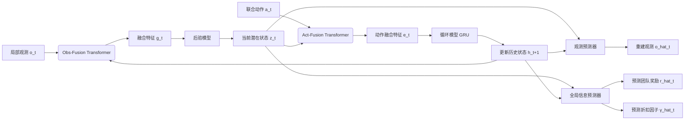

# GAWM: Global-Aware World Model for Multi-Agent Reinforcement Learning

**相关性评分**: 8.0/10

**排名**: #1

---

## 基本信息

- **arXiv ID**: [2501.10116v1](https://arxiv.org/abs/2501.10116v1)
- **发布时间**: 2025-01-17T11:01:56Z
- **相关性评分**: 8.0/10
- **是否相关**: 是

## 作者

Zifeng Shi, Meiqin Liu, Senlin Zhang, Ronghao Zheng, Shanling Dong, Ping Wei

## 关键词

reinforcement learning (RL), multi-agent RL, CTDE methods, local observational information

## 一句话总结

GAWM是一种基于模型的多智能体强化学习方法，通过Transformer融合局部观测信息提升全局状态表示能力，在复杂多智能体环境中实现高效稳定训练。

## 摘要

In recent years, Model-based Multi-Agent Reinforcement Learning (MARL) has demonstrated significant advantages over model-free methods in terms of sample efficiency by using independent environment dynamics world models for data sample augmentation. However, without considering the limited sample size, these methods still lag behind model-free methods in terms of final convergence performance and stability. This is primarily due to the world model's insufficient and unstable representation of global states in partially observable environments. This limitation hampers the ability to ensure global consistency in the data samples and results in a time-varying and unstable distribution mismatch between the pseudo data samples generated by the world model and the real samples. This issue becomes particularly pronounced in more complex multi-agent environments. To address this challenge, we propose a model-based MARL method called GAWM, which enhances the centralized world model's ability to achieve globally unified and accurate representation of state information while adhering to the CTDE paradigm. GAWM uniquely leverages an additional Transformer architecture to fuse local observation information from different agents, thereby improving its ability to extract and represent global state information. This enhancement not only improves sample efficiency but also enhances training stability, leading to superior convergence performance, particularly in complex and challenging multi-agent environments. This advancement enables model-based methods to be effectively applied to more complex multi-agent environments. Experimental results demonstrate that GAWM outperforms various model-free and model-based approaches, achieving exceptional performance in the challenging domains of SMAC.

## 详细分析

## GAWM论文详细摘要

### 1. 研究背景和动机
近年来，基于模型的多智能体强化学习（MB-MARL）通过构建环境动态模型来生成伪数据样本，在样本效率上展现出优势。然而，在部分可观测环境中，现有世界模型对全局状态的表征能力不足且不稳定，导致生成的伪数据样本与真实样本分布不匹配，进而影响了最终收敛性能和训练稳定性，尤其在复杂多智能体环境中问题更为突出。这使得基于模型的方法在收敛性能上仍落后于无模型方法。

### 2. 核心方法和技术创新
本文提出了**全局感知世界模型（GAWM）**，其核心创新在于：
- **局部观测融合表征**：引入一个基于Transformer的观测融合模块，将不同智能体的局部观测信息进行融合，显著增强了世界模型对全局状态信息的统一、准确表征能力。
- **团队奖励趋势建模**：采用高斯平滑对团队奖励进行趋势建模，而非精确预测，降低了奖励建模的复杂度，增强了在线学习的鲁棒性，且不影响策略收敛。
- **严格的CTDE范式**：将世界模型与策略模型解耦，策略模型在训练和执行时均直接使用局部观测，实现了简洁、轻量级的“集中训练、分散执行”范式。
- **双重经验回放缓冲区**：引入伪轨迹缓冲区，与真实轨迹缓冲区结合使用，减少了样本相关性，稳定了训练过程中的目标分布。

### 3. 主要实验结果
在StarCraft多智能体挑战（SMAC）的多个地图（从简单到超难）上进行实验，结果表明：
- **性能领先**：GAWM在固定的真实环境交互步数内，其最终胜率和收敛速度均显著优于主流的模型基方法（如MAMBA、MAG）和无模型方法（如MAPPO、QMIX）。
- **稳定性高**：GAWM在不同随机种子下的训练曲线方差更小，表现出更优的稳定性和一致性。
- **消融验证**：移除观测融合模块会导致世界模型训练损失剧烈波动，策略收敛性能显著下降，验证了该模块对稳定性和全局一致性的关键作用。
- **模型分析**：通过新提出的**全局一致性指数（GCI）**和**全局预测误差（GPE）**指标进行离线测试，证明GAWM生成的数据样本具有更好的全局一致性和预测准确性。

### 4. 研究意义和价值
GAWM通过增强世界模型的全局感知与表征能力，有效解决了MB-MARL中数据样本全局一致性不足和分布不稳定的核心瓶颈。它不仅**大幅提升了样本效率和最终收敛性能**，还**保证了训练过程的稳定性**，使得基于模型的方法能够更可靠地应用于复杂的多智能体协同决策场景。这项工作为在部分可观测、高维度的多智能体环境中有效应用MBRL提供了新的思路和强有力的基线方法。

## 问答对

### 问题 1

**Q**: 这篇论文的核心创新点是什么，他想解决什么问题，怎么解决的？

**A**: ## 论文核心分析：GAWM

### **研究背景与核心问题**
这篇论文旨在解决**基于模型的多智能体强化学习（MB-MARL）** 中的一个关键瓶颈：在部分可观测环境中，现有世界模型对全局状态的**表征能力不足且不稳定**。这导致：
1.  **全局一致性缺失**：各智能体的局部观测信息无法有效融合，导致重建的全局状态（如团队奖励、折扣因子）存在矛盾。
2.  **样本分布失配**：世界模型生成的伪样本分布与真实样本分布之间存在时变且不稳定的差异，尤其在复杂环境中更为严重。
3.  **范式冲突**：先前方法通常将世界模型与策略模型耦合，要么违背了“集中训练，分散执行”（CTDE）范式，要么带来了高昂的计算开销。

这些问题共同导致基于模型的方法在**最终收敛性能和稳定性**上仍落后于无模型方法。

### **核心创新点**
GAWM 通过三项关键技术革新来解决上述问题：

#### **1. 局部观测融合表征**
- **问题**：传统方法（如MAMBA, MAG）仅依赖单个智能体的当前局部观测和历史潜在状态来表征其当前状态，缺乏跨智能体的即时观测融合，难以重建准确的全局信息。
- **解决方案**：引入一个新颖的 **“观测融合”模块**。
    - 该模块使用 **Transformer 架构**，以所有智能体的历史潜在状态和当前局部观测作为输入。
    - 通过跨智能体的信息提取与融合，输出**全局一致且更准确**的当前潜在状态表示。
    - **效果**：显著增强了世界模型对多智能体系统全局状态的表征能力，确保了数据样本的全局一致性。

#### **2. 团队奖励趋势建模**
- **问题**：在复杂、稀疏奖励的多智能体环境中，精确建模瞬时团队奖励非常困难，预测偏差会严重干扰策略收敛。
- **解决方案**：放弃对奖励的精确建模，转而进行**奖励趋势建模**。
    - 采用**高斯平滑**对每个回合内的团队奖励进行时序平滑处理（公式4, 5）。
    - 使用平滑后的奖励来训练奖励模型，使其拟合奖励的总体趋势而非瞬时值。
    - **效果**：降低了奖励建模的复杂度，增强了世界模型在线学习的鲁棒性，且不影响策略的最优性。

#### **3. 纯粹的CTDE范式实现**
- **问题**：先前基于模型的方法（CTCE范式）直接使用世界模型产生的集中式特征作为策略网络的输入，导致模型与策略耦合。
- **解决方案**：**将世界模型与策略模型解耦**。
    - **策略模型**在训练和执行时，都直接以各智能体的**局部观测**作为输入。
    - 训练时，局部观测由集中式世界模型重建；执行时，直接从环境获取。
    - 策略网络采用 **MAPPO** 框架，并集成了GRU以利用历史信息。
    - **效果**：实现了轻量级、可扩展的CTDE范式，符合实际部署需求。

### **辅助技术创新：双重经验回放缓冲区**
为了缓解世界模型训练过程中的过拟合和样本分布剧变问题，GAWM引入了双重缓冲区结构：
- **真实轨迹缓冲区**：存储智能体与环境交互的真实数据。
- **伪轨迹缓冲区**：存储世界模型生成的伪轨迹数据。
- **作用**：聚合多轨迹样本，增加样本多样性，稳定训练过程中的目标分布，提升策略泛化能力。

### **技术实现架构概览**
GAWM的世界模型基于改进的RSSM结构，其核心流程如下：

### **实际价值与总结**
1.  **性能提升**：在SMAC等多个挑战性环境中，GAWM在**样本效率、最终收敛性能和训练稳定性**上均显著超越了现有的基于模型和无模型的SOTA方法。
2.  **稳定性增强**：通过提升全局一致性，确保了生成的伪样本不会将策略优化导向矛盾的方向，训练曲线方差更小。
3.  **范式进步**：提供了一种符合CTDE范式的、高效的基于模型MARL框架，推动了MBRL在更复杂多智能体场景中的实际应用。
4.  **可验证的改进**：论文设计了**全局一致性指数（GCI）** 和**全局预测误差（GPE）** 两个定量指标，证实了GAWM在生成全局一致且准确的样本方面的优越性。

**局限性**：引入额外的Transformer模块略微增加了世界模型每次迭代的训练时间。然而，其带来的样本效率提升和性能优势足以抵消这部分开销。

### 问题 2

**Q**: 请用一段话总结这篇论文，明确说明：论文试图解决的核心问题；提出的主要方法或框架；最终取得的主要效果或结论。要求语言简洁、信息密度高，不要复述摘要原文。

**A**: 这篇论文针对**基于模型的多智能体强化学习（MB-MARL）** 中，世界模型对全局状态表征能力不足、导致生成的数据样本全局一致性差和训练不稳定的核心问题，提出了 **GAWM（Global-Aware World Model）** 框架。其主要创新在于：1）引入一个基于Transformer的**观测融合模块**，在状态重构阶段集中融合所有智能体的局部观测，以生成全局一致且准确的潜在状态表征；2）采用**团队奖励趋势建模**（高斯平滑）替代精确奖励预测，降低建模复杂度并提升鲁棒性；3）通过将世界模型与策略模型解耦，并让策略模型直接使用重构的局部观测，实现了**简洁的CTDE范式**。实验表明，GAWM在SMAC等复杂多智能体环境中，在样本效率、最终收敛性能和训练稳定性上均显著优于现有的模型无关及模型基方法，证明了其增强全局表征能力对提升MB-MARL性能的有效性。

### 问题 3

**Q**: 这篇论文相对于已有工作有哪些明确的创新点？请逐条列出，并对每一条说明：相比以往方法改进或不同之处在哪里，以及该创新解决了什么具体问题或带来了什么优势。

**A**: ## GAWM论文创新点分析

这篇论文针对基于模型的多智能体强化学习（MB-MARL）中世界模型存在的**全局状态表征能力不足**和**训练不稳定性**两大核心问题，提出了GAWM方法。其创新点明确且具有递进性，具体如下：

---

### 1. 局部观测融合表征
- **改进/不同之处**：
    - **以往方法**：如MAMBA、MAG等，采用“集中式状态转移预测 + 分布式状态重建”范式。每个智能体的当前潜在状态 `z_t^i` 仅由其自身的局部观测 `o_t^i` 和全局历史状态 `h_t` 决定，缺乏对**所有智能体瞬时局部观测信息的统一融合**。
    - **GAWM**：在RSSM架构中，除了动作融合模块外，**新增了一个观测融合模块**。该模块使用Transformer，以所有智能体的局部观测 `o_t` 和历史状态 `h_t` 为输入，进行跨智能体的信息提取与融合，输出增强后的潜在状态 `z_t^i`。
- **解决的问题/带来的优势**：
    - **解决**：在部分可观测环境中，单个智能体的局部观测信息碎片化，导致重建的全局状态（如奖励、折扣因子）存在**内部不一致性**，进而引发优化冲突和不稳定。
    - **优势**：显著提升了世界模型对多智能体系统**全局状态表征的一致性和准确性**。这使得生成的伪数据样本具有更好的全局一致性，为策略学习提供了更可靠、更稳定的训练信号。

### 2. 团队奖励趋势建模
- **改进/不同之处**：
    - **以往方法**：世界模型中的奖励预测器试图对团队奖励 `r_t` 进行精确建模。在复杂、稀疏奖励环境中，这非常困难且容易产生较大偏差。
    - **GAWM**：放弃对奖励的精确预测，转而进行**奖励趋势建模**。采用高斯平滑函数对每个时间步的真实奖励进行平滑处理（使用一个时间窗口内的奖励加权平均），用平滑后的奖励来训练奖励预测器。
- **解决的问题/带来的优势**：
    - **解决**：精确奖励建模的复杂性高，预测偏差会严重误导策略网络的优化方向。
    - **优势**：**降低了奖励建模的复杂度**，使奖励预测器能更稳健地拟合奖励的总体趋势。在保持策略收敛最优性不变的前提下，**增强了世界模型在线学习的稳定性**，减少因奖励预测不准带来的训练波动。

### 3. 严格的CTDE范式实现
- **改进/不同之处**：
    - **以往方法**：许多基于模型的MARL方法（如MAMBA, MAG）属于CTCE范式，它们在训练和执行时都使用世界模型产生的集中式特征 `(h_t, z_t)` 作为策略网络的输入。这要么与主流的CTDE范式冲突，要么（如MACD）需要为每个智能体部署一个世界模型，计算成本高且缺乏统一观测融合。
    - **GAWM**：**将世界模型与策略模型解耦**。策略模型 `π` 在**训练和执行时都只使用各智能体的局部观测 `o_t^i`** 作为输入。训练时，这些观测由集中式世界模型重建；执行时，直接从环境中获取。
- **解决的问题/带来的优势**：
    - **解决**：CTCE范式限制了方法的可扩展性和实际部署能力，而现有的一些CTDE尝试则牺牲了性能或引入了过高复杂度。
    - **优势**：实现了一个**简洁、轻量级的标准CTDE范式**。这保证了方法在**训练时可以利用全局信息，执行时完全分布式**，更具实用性和可扩展性，同时避免了因模型耦合带来的计算开销或范式冲突。

### 4. 双经验回放缓冲区
- **改进/不同之处**：
    - **以往方法**：通常只使用一个存储真实轨迹的经验池。
    - **GAWM**：引入了**双经验回放缓冲区**结构，包含一个真实轨迹缓冲区 `B_r` 和一个伪轨迹缓冲区 `B_p`。世界模型用 `B_r` 的数据训练，并生成伪轨迹存入 `B_p`，策略模型则从 `B_p` 中采样进行训练。
- **解决的问题/带来的优势**：
    - **解决**：在线学习过程中，数据分布动态变化，可能导致世界模型进入预测严重偏离真实分布的“异常迭代阶段”，产生具有误导性的伪样本，破坏策略收敛。
    - **优势**：**增强了样本多样性，减少了样本间的相关性**。通过聚合多个轨迹的样本，**稳定了训练过程中的目标分布**，缓解了过拟合，提高了策略的泛化能力和训练稳定性。

---

### 总结
这些创新点相互协同，共同应对了MB-MARL的核心挑战：
1.  **观测融合**和**奖励趋势建模**从**模型架构**和**学习目标**上提升了世界模型生成样本的**质量**（一致性、稳健性）。
2.  **CTDE范式设计**和**双缓冲区**从**训练框架**和**数据管理**上保障了方法的**实用性**和**稳定性**。

最终，GAWM在保持高样本效率（模型方法优势）的同时，在**最终收敛性能**和**训练稳定性**上超越了以往的模型方法和模型无关方法，特别是在复杂的多智能体环境中优势更为明显，如论文在SMAC挑战性场景上的实验所充分验证。

### 问题 4

**Q**: 论文在实验或评估中最终实现了怎样的效果？请说明使用了哪些数据集和评价指标，与哪些基线方法进行了对比，以及在关键指标上的主要性能提升或结论。如果论文未给出明确的定量结果，也请说明原因。

**A**: ## 论文实验与评估效果分析

### 数据集与评价指标
- **数据集**：论文在**StarCraft Multi-Agent Challenge (SMAC)** 基准测试的8张地图上进行实验，涵盖从简单到超难的场景，包括：
  - `2s_vs_1sc`、`3s_vs_3z`、`2s3z`、`3s_vs_4z`、`3s_vs_5z`、`1c3s5z`、`8m`、`corridor`。
- **主要评价指标**：
  1. **胜率 (Win Rate)**：在SMAC环境中，通过1000轮独立测试计算的平均胜率。
  2. **全局一致性指数 (Global Consistency Index, GCI)**：衡量世界模型生成的伪数据样本中，各智能体对全局状态、奖励和折扣因子预测的一致性（值越低越好）。
  3. **全局预测误差 (Global Prediction Error, GPE)**：衡量世界模型预测的观察、奖励和折扣因子与真实值之间的误差（值越低越好）。
  4. **训练稳定性**：通过不同随机种子下胜率曲线的方差（阴影区域）和世界模型损失函数的波动性进行评估。

### 对比的基线方法
论文将GAWM与以下代表性方法进行对比：
- **模型基方法**：
  - **MAMBA**：基于DreamerV2的多智能体世界模型。
  - **MAG**：通过局部模型优化多步预测的改进方法。
- **模型无关方法**：
  - **MAPPO**：基于PPO的多智能体策略梯度方法。
  - **QMIX**：基于值分解的经典合作MARL算法。

### 关键性能提升与结论
#### 1. **收敛性能与样本效率**
- **结果**：GAWM在**所有测试地图上均取得最高胜率**（见表1），尤其在复杂场景（如`3s_vs_5z`、`corridor`）中优势显著。
- **示例数据**：
  - 在`corridor`（超难地图）上，GAWM胜率达**86%**，显著高于MAG（27%）和MAMBA（39%）。
  - 在`3s_vs_5z`上，GAWM胜率为**93%**，而MAG和MAMBA分别为55%和53%。
- **结论**：GAWM在**有限环境交互步数内实现了更高的样本效率和最终收敛性能**，证明了其世界模型生成高质量伪样本的能力。

#### 2. **训练稳定性**
- **结果**：GAWM的胜率曲线方差（图3阴影区域）**明显小于其他基线**，表明其对随机种子不敏感，训练过程更稳定。
- **世界模型损失**：GAWM的损失曲线（图4）波动更小，而移除观测融合模块（GAWM*）会导致损失剧烈震荡。
- **结论**：**观测融合模块和奖励趋势建模显著提升了训练稳定性**，减少了策略优化中的冲突方向。

#### 3. **世界模型质量评估**
- **GCI与GPE结果**（表2、表3）：
  - GAWM的GCI和GPE值**均低于所有基线**，表明其生成的伪样本具有更高的全局一致性和预测准确性。
  - 例如在`3s_vs_5z`上，GAWM的GCI为**0.63**，而MAG和MAMBA分别为2.43和2.91。
- **结论**：**Transformer-based的观测融合模块和全局感知预测器有效提升了世界模型的全局表示能力**，减少了多智能体部分可观性带来的不一致性。

#### 4. **消融实验验证**
- **移除观测融合模块（GAWM*）**：
  - 胜率下降且波动增大（图5），世界模型损失不稳定（图4）。
  - GCI和GPE值显著上升（表2、表3），例如在`1c3s5z`上GCI从1.23升至2.73。
- **结论**：**观测融合模块是提升全局一致性和稳定性的关键创新**。

#### 5. **范式优势**
- **CTDE兼容性**：GAWM成功将世界模型与策略模型解耦，实现了**标准的CTDE范式**，而MAMBA/MAG仍依赖CTCE（集中训练集中执行），限制了实际部署的扩展性。

### 总结
GAWM通过**全局感知的世界模型设计**，在SMAC基准测试中全面超越了现有模型基和模型无关方法，主要体现在：
- **更高的样本效率和最终胜率**。
- **更稳定的训练过程**。
- **更准确的全局状态表示与预测**。
- **对CTDE范式的完整支持**，增强了方法的实用性和可扩展性。

这些结果验证了GAWM在复杂多智能体环境中解决**部分可观性**和**非平稳性**挑战的有效性，为模型基MARL在现实场景中的应用提供了有力支持。

## 相关链接

- [arXiv 页面](https://arxiv.org/abs/2501.10116v1)
- [HTML 版本](https://arxiv.org/html/2501.10116v1)
