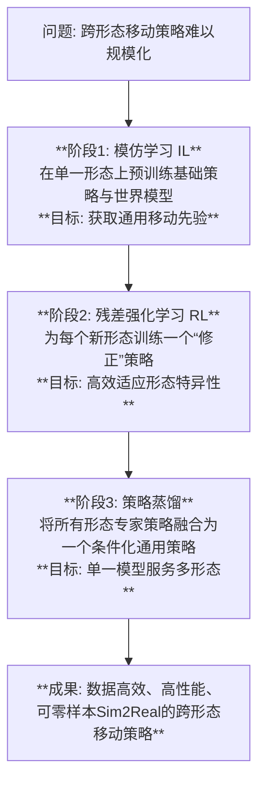

# COMPASS: Cross-embodiment Mobility Policy via Residual RL and Skill Synthesis

**相关性评分**: 6.0/10

**排名**: #19

---

## 基本信息

- **arXiv ID**: [2502.16372v3](https://arxiv.org/abs/2502.16372v3)
- **发布时间**: 2025-02-22T22:26:30Z
- **相关性评分**: 6.0/10
- **是否相关**: 是

## 作者

Wei Liu, Huihua Zhao, Chenran Li, Yuchen Deng, Joydeep Biswas, Soha Pouya, Yan Chang

## 关键词

Robot control, quadruped robot locomotion, multi-agent RL, CTDE methods, Edge Deployment, mujoco, local observational information

## 一句话总结

COMPASS是一个通过残差强化学习和技能合成实现跨机器人平台通用移动策略的框架，但未直接涉及多智能体RL、CTDE方法、边缘部署或Mujoco。

## 摘要

As robots are increasingly deployed in diverse application domains, enabling robust mobility across different embodiments has become a critical challenge. Classical mobility stacks, though effective on specific platforms, require extensive per-robot tuning and do not scale easily to new embodiments. Learning-based approaches, such as imitation learning (IL), offer alternatives, but face significant limitations on the need for high-quality demonstrations for each embodiment.
  To address these challenges, we introduce COMPASS, a unified framework that enables scalable cross-embodiment mobility using expert demonstrations from only a single embodiment. We first pre-train a mobility policy on a single robot using IL, combining a world model with a policy model. We then apply residual reinforcement learning (RL) to efficiently adapt this policy to diverse embodiments through corrective refinements. Finally, we distill specialist policies into a single generalist policy conditioned on an embodiment embedding vector. This design significantly reduces the burden of collecting data while enabling robust generalization across a wide range of robot designs. Our experiments demonstrate that COMPASS scales effectively across diverse robot platforms while maintaining adaptability to various environment configurations, achieving a generalist policy with a success rate approximately 5X higher than the pre-trained IL policy on unseen embodiments, and further demonstrates zero-shot sim-to-real transfer.

## 详细分析

## 论文摘要：COMPASS：通过残差强化学习和技能合成的跨具身移动策略

### 1. 研究背景和动机
随着机器人在多样化应用场景中的部署，实现跨不同机器人**具身形态**的鲁棒移动能力成为一个关键挑战。传统的移动技术栈虽然对特定平台有效，但需要针对每个机器人进行大量调优，难以扩展到新形态。基于学习的方法（如模仿学习）则面临为每个新机器人收集高质量演示数据的巨大瓶颈。本文旨在解决这一难题，提出一种**数据高效**的框架，仅需单个机器人的演示数据，即可实现跨多种具身形态的通用移动策略。

### 2. 核心方法和技术创新
本文提出了 **COMPASS**，一个统一的三阶段工作流：
- **阶段一：模仿学习**：在单个机器人（如轮式机器人）上，利用现成的专家策略（如经典移动栈）进行模仿学习，预训练一个包含**世界模型**和策略模型的基策略，以捕获通用的移动先验知识。
- **阶段二：残差强化学习**：针对每个新机器人具身（如双足、四足机器人），**冻结**预训练的基策略，并训练一个**残差策略**来对基策略输出的动作进行微小的修正调整。这种方法能高效适应不同机器人的动力学和传感器配置，避免了从头开始训练RL的低效性。
- **阶段三：策略蒸馏**：将训练好的多个具身**专家策略**的数据进行收集，通过最小化KL散度，将它们**蒸馏**成一个单一的**通用策略**。该通用策略以一个**具身嵌入向量**为条件，从而能够根据输入的机器人标识符，生成适合该机器人的动作。

**主要技术创新**在于将模仿学习、残差RL和策略蒸馏系统性地结合，构建了一个端到端的跨具身移动策略学习管道，显著降低了数据收集负担并提升了泛化能力。

### 3. 主要实验结果
实验在模拟环境中对四种机器人（Nova Carter, Unitree H1/G1, Spot Mini）和四种复杂环境进行了评估：
- **有效性**：与仅使用模仿学习的基策略相比，经过残差RL微调后的专家策略在**成功率上平均提升约5倍**，在旅行效率上提升约3倍。
- **泛化性**：蒸馏后的单一通用策略性能与各专家策略相当，成功实现了“一个策略适应多形态”。
- **效率**：残差RL相比从零开始的RL训练，**收敛速度显著更快**。
- **零样本Sim2Real**：将模拟中训练的通用策略直接部署到真实的Carter和Unitree G1机器人上，无需微调即可实现约80%的成功率，证明了其强大的跨现实迁移能力。

### 4. 研究意义和价值
COMPASS 为解决机器人跨具身移动的规模化部署提供了切实可行的方案。其核心价值在于：
- **数据高效性**：大幅减少了对昂贵专家演示数据的依赖，仅需一个机器人的数据即可启动。
- **强泛化与实用性**：生成的单一策略能鲁棒地适应形态各异的机器人平台和复杂环境，并实现了零样本的从模拟到现实的迁移，具备很高的实用价值。
- **方法论贡献**：为结合模仿学习与强化学习、融合专家知识以适应多样化物理形态提供了一个新颖且有效的框架范式，对机器人通用移动能力的研究具有重要启发意义。

## 问答对

### 问题 1

**Q**: 这篇论文的核心创新点是什么，他想解决什么问题，怎么解决的？

**A**: ## 论文核心分析：COMPASS

### **一、 想解决的核心问题**
论文旨在解决**机器人跨形态（Cross-embodiment）移动策略的规模化部署难题**。具体挑战包括：
1.  **数据效率低下**：传统的模仿学习（IL）方法需要为每种新机器人形态收集大量高质量演示数据，成本高昂且不切实际（例如，为人形机器人收集数据非常困难）。
2.  **泛化能力差**：基于规则的经典移动栈（Classical mobility stacks）虽然对特定平台有效，但无法轻松迁移到具有不同传感器、动力学和形态的机器人上，需要大量手动调整。
3.  **领域迁移与形态多样性**：不同机器人的形态、动力学和感知配置差异巨大，导致策略难以通用。

### **二、 核心创新点**
COMPASS 提出了一种**统一的三阶段工作流程**，其核心创新在于**系统性地结合了三种技术，以极低的数据收集成本实现跨形态的鲁棒移动**。

1.  **创新的三阶段框架设计**：
    - **阶段1（模仿学习）**：仅在**单一机器人形态**（如轮式机器人）上使用IL预训练一个基础策略和世界模型，捕获通用的移动先验知识（如环境理解、避障）。
    - **阶段2（残差强化学习）**：针对**每一种新机器人形态**，**冻结**预训练的基础策略，通过**残差RL**仅学习一个小的“修正项”来调整基础动作，以适应新形态的特定动力学和约束。这避免了从头开始训练RL，极大提升了数据效率和训练速度。
    - **阶段3（策略蒸馏）**：将所有形态的专家（“ specialist”）策略**蒸馏**成一个**单一的通用策略**。该策略接收一个**形态嵌入向量**作为条件输入，从而能够根据不同的机器人自动调整其行为。

2.  **关键技术组合的协同效应**：
    - **残差RL + 预训练世界模型**：利用IL阶段学到的**世界模型**提供丰富的潜在状态表示，为残差RL提供了结构化、信息丰富的输入，显著缓解了视觉RL中常见的稀疏奖励和采样效率问题。
    - **形态条件化蒸馏**：通过简单的**独热编码（one-hot）形态嵌入**，使单个策略网络具备了区分并适应不同机器人形态的能力，实现了“一个模型，多种机器人”的部署范式。

3.  **验证的卓越性能与泛化能力**：
    - **数据高效**：仅需单一形态的演示数据，即可泛化到多种未见过的形态（人形、四足）。
    - **性能大幅提升**：相较于直接应用预训练IL策略（X-Mobility），最终蒸馏出的通用策略在**未见形态上的成功率提升了约5倍**，旅行效率提升了3倍。
    - **零样本模拟到现实迁移**：在仿真中训练的COMPASS策略，无需微调即可成功部署到真实的Carter（轮式）和Unitree G1（人形）机器人上，证明了其现实世界实用性。

### **三、 解决方案总结**
COMPASS 通过一个**分而治之、再融合统一**的路径解决了跨形态移动的规模化问题：

**实际价值**：该框架显著降低了为多种机器人开发智能移动能力的工程和数据成本，为在多样化现实场景（仓库、办公室）中快速部署异构机器人车队提供了可行的技术方案。论文还展示了其策略可作为基础，轻松扩展至**开放词汇物体导航**和生成数据以**微调大型视觉-语言-动作模型**，展现了广泛的应用潜力。

### 问题 2

**Q**: 请用一段话总结这篇论文，明确说明：论文试图解决的核心问题；提出的主要方法或框架；最终取得的主要效果或结论。要求语言简洁、信息密度高，不要复述摘要原文。

**A**: ## 论文总结

这篇论文旨在解决机器人领域的一个核心挑战：如何为形态各异的机器人（如轮式、双足、四足）开发一个**通用且鲁棒的移动策略**，而无需为每个新平台收集大量高质量的专家演示数据。传统方法需要针对每个机器人进行大量手动调优或重新收集数据，难以规模化。

为此，论文提出了 **COMPASS** 框架，其核心是一个**三阶段流程**：1）**模仿学习**：仅在一个机器人（如轮式平台）上利用现有专家策略预训练一个基础策略和世界模型，以获取通用的移动先验知识。2）**残差强化学习**：针对每个新机器人，冻结基础策略，仅训练一个轻量的“残差”策略来对基础动作进行微调，从而高效地适应不同机器人的动力学和传感器约束。3）**策略蒸馏**：将多个针对特定机器人的专家策略的知识，蒸馏到一个**单一的通才策略**中，该策略通过一个“机器人形态嵌入向量”来区分不同的机器人。

该方法取得了显著效果：最终得到的通才策略在未见过的机器人平台上，其任务**成功率比仅使用模仿学习的基础策略提高了约5倍**，旅行效率提升了3倍。更重要的是，该策略成功实现了**零样本的从仿真到真实世界的迁移**，证明了其强大的泛化能力和实际应用价值。

### 问题 3

**Q**: 这篇论文相对于已有工作有哪些明确的创新点？请逐条列出，并对每一条说明：相比以往方法改进或不同之处在哪里，以及该创新解决了什么具体问题或带来了什么优势。

**A**: ## COMPASS 论文创新点分析

这篇论文提出了一种名为 COMPASS 的跨具身移动策略学习框架。其核心创新在于通过一个三阶段流程，解决了为不同形态机器人（具身）开发通用、鲁棒移动策略时面临的数据收集负担重、训练效率低和泛化能力差等关键挑战。

以下是其相对于已有工作的明确创新点：

### 1. **提出“单演示源 + 残差RL + 策略蒸馏”的三阶段统一框架**
   - **相比以往方法的改进/不同之处**：
     - **传统方法**：经典移动栈需要为每个机器人平台进行大量手动调整；纯模仿学习（IL）方法则需要为每个新机器人收集高质量演示数据，成本高昂。
     - **COMPASS 的创新**：它系统性地结合了三个阶段：1) 仅在**单个**机器人上通过IL预训练一个基础策略和世界模型；2) 使用**残差强化学习（Residual RL）** 为每个新机器人高效微调出专家策略；3) 通过**策略蒸馏**将所有专家策略合并为一个通用的、以具身嵌入为条件的策略。
   - **解决的具体问题/带来的优势**：
     - **大幅降低数据收集成本**：核心突破在于，只需一个机器人（如轮式机器人Carter）的演示数据，即可通过该框架泛化到多种形态迥异的机器人（人形H1/G1、四足Spot）。
     - **实现高效跨具身适应**：避免了为每个新机器人从头收集演示或从头训练RL策略的巨大开销，解决了跨具身学习的数据效率瓶颈。

### 2. **将残差RL与预训练IL策略及世界模型结合，用于跨具身策略微调**
   - **相比以往方法的改进/不同之处**：
     - **传统RL方法**：在复杂的移动任务上从零开始训练RL策略，面临样本效率极低、探索困难、难以收敛的问题。
     - **COMPASS 的创新**：它**冻结**了从IL预训练中得到的基础策略和世界模型。残差RL策略不是学习完整的动作，而是学习一个**小的校正项**，叠加在基础策略输出的动作之上。世界模型提供了丰富的潜在状态表示，作为残差策略的输入。
   - **解决的具体问题/带来的优势**：
     - **显著提升训练效率和性能**：基础策略提供了强大的先验和安全的动作基线，使得残差RL可以快速、稳定地收敛，专注于学习适应特定机器人动力学和传感器配置的校正。实验表明，相比从零开始的RL，该方法收敛速度快得多，且最终性能远超纯IL基线（成功率提升5-40倍）。
     - **保持基础策略的通用知识**：冻结基础策略确保了在第一阶段学到的通用移动先验（如环境理解、避障）不会被破坏。

### 3. **引入并验证了基于具身嵌入的策略蒸馏，以构建单一通用策略**
   - **相比以往方法的改进/不同之处**：
     - **传统多任务/多机器人策略**：通常为每个任务或机器人维护一个独立的策略，部署时需切换，不够紧凑和灵活。
     - **COMPASS 的创新**：在得到多个具身专家策略后，论文采用**策略蒸馏**技术，将这些专家的“知识”融合进一个**单一神经网络**。该网络以**具身嵌入向量**（如one-hot编码）为条件，从而能根据输入的机器人标识符，在内部切换行为模式。
   - **解决的具体问题/带来的优势**：
     - **实现紧凑、可扩展的部署**：最终得到一个统一的策略模型，可以部署到不同机器人上，只需更改输入中的具身嵌入即可，无需维护多个模型文件，简化了系统部署和管理。
     - **验证了跨具身知识融合的可行性**：实验证明，蒸馏后的通用策略性能与各个专家策略相当，有时甚至更优，表明该方法能有效整合不同形态机器人的专业知识，而不会产生严重的性能损失。

### 4. **实现了从仿真到现实的零样本迁移，并展示了扩展应用潜力**
   - **相比以往方法的改进/不同之处**：
     - **许多学习策略的局限**：严重依赖于训练环境，仿真到现实的差距（Sim2Real Gap）明显，通常需要复杂的域随机化或在线微调。
     - **COMPASS 的创新**：得益于其使用的**高质量世界模型**（X-Mobility）和物理精确的仿真器（Isaac Lab），以及残差RL在仿真中对物理约束的充分探索，训练出的策略展示了**零样本Sim2Real转移**能力。论文成功在真实Carter和G1机器人上进行了部署。
     - **展示了工作流的扩展性**：论文不仅完成了点对点导航，还展示了COMPASS可以轻松与物体定位模型（如Locate3D）集成，实现**开放词汇物体导航**。此外，COMPASS专家策略生成的高质量数据可用于**微调大型视觉-语言-动作模型**（如Gr00t），快速赋予其导航能力，并实现更复杂的移动操作任务。
   - **解决的具体问题/带来的优势**：
     - **验证了方法的实用性和鲁棒性**：零样本迁移证明了该框架产生的策略对现实世界的不确定性和外观变化具有较好的鲁棒性，迈向了实际应用。
     - **提供了数据生成和模型赋能的新途径**：表明COMPASS不仅是一个导航策略生成器，其工作流和产出（专家策略、数据集）还能作为工具，加速其他相关领域（如VLA模型）的研究和应用开发。

**总结**：COMPASS的核心创新在于其**系统性的、数据高效的三阶段框架设计**。它巧妙地将IL的数据驱动先验学习、RL的闭环优化能力以及蒸馏的模型压缩技术结合起来，创造性地解决了跨具身移动策略开发中的核心矛盾——**对通用性的需求与对特定平台数据/调优的依赖**。其实验结果（性能大幅提升、零样本迁移、扩展应用）有力地支撑了这些创新点的有效性和实用价值。

### 问题 4

**Q**: 论文在实验或评估中最终实现了怎样的效果？请说明使用了哪些数据集和评价指标，与哪些基线方法进行了对比，以及在关键指标上的主要性能提升或结论。如果论文未给出明确的定量结果，也请说明原因。

**A**: ## 论文实验与评估效果分析

### 一、 核心实验效果总结
COMPASS框架成功实现了**数据高效、可扩展的跨具身移动策略**。其核心效果体现在：
1.  **跨平台泛化能力强**：仅需在**单个机器人（Nova Carter）**上收集专家演示数据，即可通过提出的三阶段流程，训练出一个能泛化到多种未见机器人平台（包括人形、四足机器人）的通用策略。
2.  **性能显著提升**：最终蒸馏得到的**通用策略（Generalist）**在未见机器人上的任务成功率（Success Rate, SR）比仅使用模仿学习（IL）的基线策略（X-Mobility）**平均提升约5倍**，旅行效率（Weighted Travel Time, WTT）**平均提升约3倍**。
3.  **实现零样本仿真到现实迁移**：训练于仿真环境的策略，无需额外微调即可部署到真实机器人（Carter和Unitree G1）上，在杂乱环境中成功导航。

### 二、 使用的数据集与评价指标

#### 1. 数据集
*   **模仿学习（IL）预训练**：使用在**Carter机器人**上收集的**Carter数据集**预训练X-Mobility模型作为基础策略。这是**唯一需要的专家演示数据源**。
*   **强化学习（RL）与蒸馏**：在**NVIDIA Isaac Lab仿真环境**中生成数据。使用四种机器人 embodiment 进行训练和评估：
    *   Nova Carter (轮式)
    *   Unitree H1 (人形)
    *   Unitree G1 (人形)
    *   Spot Mini (四足)

#### 2. 评价指标
论文采用两个关键指标来综合评估策略的**安全性**和**效率**：
*   **成功率（Success Rate, SR）**：在多次试验中，机器人无碰撞、未超时地成功到达目标区域的比例。
*   **加权旅行时间（Weighted Travel Time, WTT）**：在成功的试验中，到达目标所需的总旅行时间，**除以成功率**。该指标同时考虑了成功率和效率，值越低越好。

#### 3. 评估场景
在四个复杂度递增的仿真环境中进行评估（如图5所示），以测试泛化能力：
1.  **单货架仓库**：稀疏的低矮障碍物。
2.  **多货架仓库**：需要长视野导航。
3.  **办公室**：包含高大家具等障碍物。
4.  **组合场景**：包含多货架的大型环境。
每个环境进行640次随机初始化和目标位置的试验。

### 三、 对比的基线方法与关键性能结果

#### 1. 主要基线：X-Mobility (纯模仿学习)
*   **对比目的**：验证**残差RL微调**和**策略蒸馏**的必要性与有效性。
*   **关键结果（见表1）**：
    *   **跨平台性能暴跌**：X-Mobility在Carter上表现尚可，但直接零样本迁移到其他机器人（H1, Spot, G1）时，**成功率急剧下降（最低至1.8%）**，证明纯IL无法处理形态差异。
    *   **COMPASS显著提升**：经过COMPASS流程得到的**专家策略（Specialist）和通用策略（Generalist）在所有机器人、所有环境上均大幅超越X-Mobility**。
        *   **成功率提升**：对于非Carter机器人，SR提升倍数从**5倍（Spot）到超过40倍（G1）**。
        *   **旅行效率提升**：WTT平均改善约**3倍**。
    *   **蒸馏有效性**：通用策略的性能与各专家策略**相当甚至略有超越**，证明蒸馏成功整合了多平台知识而未导致明显性能损失。

#### 2. 消融对比：从零开始的RL (RL-from-scratch)
*   **对比目的**：验证**基于IL预训练策略进行残差学习**相对于**从零开始训练RL**的数据效率优势。
*   **关键结果（见图7）**：
    *   不使用IL先验、仅用相同RL设置从零开始训练的策略，**即使在1000个训练周期后仍难以收敛**，性能远低于残差RL。
    *   这证明了**IL提供的先验知识有效缓解了RL的稀疏奖励和探索难题**，使残差RL能快速收敛到高性能策略。

#### 3. 其他对比与分析
*   **不同训练环境**（消融研究）：仅在仓库环境中训练的策略，在仓库测试中表现稍好，但在办公室和组合场景中**泛化性能下降**，证明了**多样化训练环境对提升策略鲁棒性至关重要**。
*   **不同蒸馏损失函数**：使用KL散度损失（保留动作分布方差）进行蒸馏，性能**略优于**仅使用MSE损失（只模仿均值）的方法，表明建模分布更为有效。
*   **Sim2Real零样本迁移**：在真实Carter和G1机器人上的测试取得了约**80%的成功率**，证明了仿真训练的有效性和策略的实用性。**推理延迟仅约30毫秒**，满足实时性要求。

### 四、 主要结论
1.  **方法论有效性**：COMPASS的三阶段流程（IL → 残差RL → 策略蒸馏）是解决跨具身移动问题的有效路径，在**数据效率**和**泛化性能**上取得了最佳平衡。
2.  **性能飞跃**：最终得到的通用策略，相较于仅依赖单一平台演示的IL基线，在**跨平台任务成功率上实现了数量级的提升（~5倍）**。
3.  **实用价值**：该框架**大幅降低了为每个新机器人平台收集专家数据的成本**，并通过成功的零样本Sim2Real转移，展示了其应用于现实世界机器人部署的潜力。

## 相关链接

- [arXiv 页面](https://arxiv.org/abs/2502.16372v3)
- [HTML 版本](https://arxiv.org/html/2502.16372v3)
