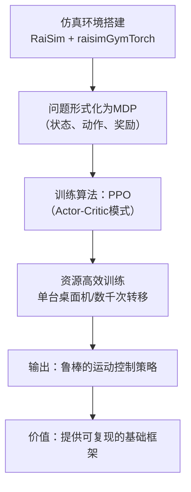

# Quadruped Robot Simulation Using Deep Reinforcement Learning -- A step towards locomotion policy

**相关性评分**: 6.0/10

**排名**: #23

---

## 基本信息

- **arXiv ID**: [2502.16401v1](https://arxiv.org/abs/2502.16401v1)
- **发布时间**: 2025-02-23T01:27:23Z
- **相关性评分**: 6.0/10
- **是否相关**: 是

## 作者

Nabeel Ahmad Khan Jadoon, Mongkol Ekpanyapong

## 关键词

Robot control, quadruped robot locomotion, mujoco, local observational information

## 一句话总结

该论文提出了一种基于深度强化学习的方法，在模拟环境中训练四足机器人运动策略，使用PPO算法和RaiSim库，但未明确涉及多智能体RL、CTDE方法或边缘部署。

## 摘要

We present a novel reinforcement learning method to train the quadruped robot in a simulated environment. The idea of controlling quadruped robots in a dynamic environment is quite challenging and my method presents the optimum policy and training scheme with limited resources and shows considerable performance. The report uses the raisimGymTorch open-source library and proprietary software RaiSim for the simulation of ANYmal robot. My approach is centered on formulating Markov decision processes using the evaluation of the robot walking scheme while training. Resulting MDPs are solved using a proximal policy optimization algorithm used in actor-critic mode and collected thousands of state transitions with a single desktop machine. This work also presents a controller scheme trained over thousands of time steps shown in a simulated environment. This work also sets the base for early-stage researchers to deploy their favorite algorithms and configurations. Keywords: Legged robots, deep reinforcement learning, quadruped robot simulation, optimal control

## 详细分析

## 论文摘要：基于深度强化学习的四足机器人仿真——迈向运动控制策略的一步

**1. 研究背景和动机**
控制四足机器人在动态环境中实现稳定运动是一项极具挑战性的任务。传统方法往往依赖于复杂的模型和大量计算资源。本研究旨在探索一种**资源高效**的深度强化学习方法，在仿真环境中训练四足机器人，以获取鲁棒的运动控制策略，并为后续研究奠定基础。

**2. 核心方法和技术创新**
- **方法框架**：研究提出了一种新颖的强化学习训练方案。其核心是**将机器人行走方案的评估过程形式化为马尔可夫决策过程**，并采用**近端策略优化算法**在演员-评论家模式下进行求解。
- **技术创新**：
    - **高效的训练方案**：设计了能够在**单台桌面计算机**上收集数千次状态转移数据并进行策略优化的训练流程，显著降低了对计算资源的需求。
    - **仿真工具集成**：利用开源库`raisimGymTorch`和专有仿真软件**RaiSim**，对ANYmal机器人进行高保真物理仿真，确保了训练环境的质量。

**3. 主要实验结果**
在仿真环境中，该方法成功训练出了四足机器人的运动控制器。经过**数千个时间步**的训练，所获得的控制策略在模拟中表现出了**相当可观的性能**，验证了该资源有限型训练方案的有效性。

**4. 研究意义和价值**
- **实际价值**：为实现四足机器人的高效、自适应运动控制提供了一种可行的、对计算资源要求相对较低的解决方案。
- **学术价值**：本研究建立了一个基础框架，便于**早期阶段的研究人员**在此之上部署他们偏好的算法与配置，加速了腿式机器人强化学习领域的算法开发和实验验证进程。

## 问答对

### 问题 1

**Q**: 这篇论文的核心创新点是什么，他想解决什么问题，怎么解决的？

**A**: ## 论文核心分析

### 一、 论文拟解决的核心问题
这篇论文旨在解决**在资源有限条件下，为四足机器人（ANYmal）在动态环境中学习稳健的运动策略**这一挑战性问题。具体而言，它聚焦于：
- **挑战**：在动态环境中控制四足机器人的运动，传统方法需要复杂的模型和大量调参。
- **目标**：提出一种**资源高效**（仅使用单台桌面计算机）的训练方案，以获得接近最优的运动控制策略，并为后续研究提供基础。

### 二、 核心创新点
论文的创新性主要体现在 **“方法整合与工程实现”** 层面，而非提出全新的基础算法：

1.  **系统性的训练框架**：将**马尔可夫决策过程（MDP）** 的构建与机器人步态评估紧密结合，在训练过程中动态优化MDP的设定，这比使用固定MDP更高效。
2.  **资源受限下的高效训练方案**：证明了仅用**单台桌面计算机**和数千次状态转移，就能训练出有效的运动策略，降低了强化学习在机器人控制领域的应用门槛。
3.  **完整的仿真到策略的工程实现**：基于开源库（`raisimGymTorch`）与专有仿真器（RaiSim），构建了一套从仿真环境搭建、MDP定义、算法训练到策略部署的完整工作流程，并公开了代码，具有很高的**工程参考价值**。

### 三、 解决方案与技术路径
作者采用了一套结合经典算法与精心设计的工程方法：

1.  **仿真平台**：使用**RaiSim**物理引擎模拟ANYmal机器人及其环境，利用**raisimGymTorch**开源库搭建训练框架。
2.  **问题建模**：将机器人运动控制问题**形式化为马尔可夫决策过程（MDP）**，关键点在于根据机器人行走方案的评估来设计和调整MDP的**状态空间、动作空间和奖励函数**。
3.  **核心算法**：采用**近端策略优化（PPO）算法**，并以**Actor-Critic（演员-评论家）模式**运行。PPO以其训练稳定性和样本效率高而著称，非常适合此类连续控制任务。
4.  **训练过程**：在单台桌面计算机上，通过仿真收集“数千次状态转移”数据进行训练，最终得到一个能在仿真环境中稳定行走的**控制器（策略）**。
5.  **成果输出**：不仅是一个训练好的策略，更重要的是提供了一套**可复现、可扩展的基础代码框架**，方便其他研究者在此基础上试验自己的算法和配置。

### 四、 实际价值与意义
- **技术价值**：验证了深度强化学习在资源受限条件下解决复杂机器人运动控制问题的可行性，为将仿真训练的策略迁移到真实机器人（Sim-to-Real）提供了前期基础。
- **社区价值**：通过开源代码和详细方案，**降低了四足机器人强化学习研究的入门门槛**，实现了标题中“A step towards locomotion policy”的目标，为早期研究者提供了一个实用的起点。
- **应用价值**：所训练的稳健运动策略，是四足机器人完成巡检、救援、探索等复杂任务的**基础能力核心**。

**总结**：这篇论文的核心贡献在于，**用一个工程上完整、资源需求亲民的深度强化学习训练框架，高效地解决了四足机器人的基础运动策略学习问题，并为其社区化发展提供了实用工具。**

### 问题 2

**Q**: 请用一段话总结这篇论文，明确说明：论文试图解决的核心问题；提出的主要方法或框架；最终取得的主要效果或结论。要求语言简洁、信息密度高，不要复述摘要原文。

**A**: 这篇论文旨在解决在动态环境中高效训练四足机器人运动策略的难题。其核心方法是基于**马尔可夫决策过程**建模，并利用**近端策略优化**算法在actor-critic模式下进行训练，整个流程在RaiSim仿真环境中使用开源框架实现。该方法在有限计算资源下，通过数千次状态转移的采样，成功训练出了表现良好的运动控制器，为后续研究提供了一个可复现和扩展的基础仿真训练框架。

### 问题 3

**Q**: 这篇论文相对于已有工作有哪些明确的创新点？请逐条列出，并对每一条说明：相比以往方法改进或不同之处在哪里，以及该创新解决了什么具体问题或带来了什么优势。

**A**: ## 论文创新点分析

基于对论文内容的解读，该工作在以下方面提出了明确的创新点：

- **提出了一种新颖的强化学习方法与训练方案**
  - **改进/不同之处**：论文强调其方法在**有限的计算资源**（仅使用单台桌面计算机）下，实现了对ANYmal四足机器人的有效训练。这与以往许多需要大规模计算集群或专用硬件的深度强化学习方法形成对比。
  - **解决的问题/带来的优势**：**显著降低了四足机器人运动策略研发的门槛和成本**。这使得更多的研究团队或个人（尤其是早期研究者）能够在资源受限的条件下进行算法探索和验证，促进了该领域的可及性。

- **构建了基于行走方案评估的马尔可夫决策过程（MDP）**
  - **改进/不同之处**：论文明确指出其MDP的构建是**围绕对机器人行走方案的评估**进行的。这意味着状态、动作和奖励函数的设计紧密贴合“行走”这一具体任务目标进行定制化，而非采用通用或简单的模板。
  - **解决的问题/带来的优势**：**提升了策略学习的针对性和效率**。通过将领域知识（行走评估）嵌入到MDP建模中，可以引导智能体更快地学习到稳定、高效的步态，可能避免了在无关或次优行为空间中的盲目探索。

- **采用PPO算法并收集了数千次状态转移进行训练**
  - **改进/不同之处**：在四足机器人仿真控制任务中，**系统性地应用近端策略优化算法（PPO）于演员-评论家模式**，并成功收集和处理了大规模的状态转移数据。这展示了PPO算法在此类连续控制、高维状态空间问题上的有效工程实现。
  - **解决的问题/带来的优势**：**验证了PPO算法在复杂四足机器人运动控制任务中的稳定性和实用性**。PPO以其训练稳定性和相对简单的调参著称，论文的成功应用为其在机器人领域的推广提供了案例，并积累了可复用的训练经验（如数据规模）。

- **提供了一个可复现的研究基础框架**
  - **改进/不同之处**：论文明确表示其工作**为早期研究者部署他们喜欢的算法和配置奠定了基础**。这暗示其构建的仿真训练环境（基于raisimGymTorch和RaiSim）具备良好的模块化和可扩展性。
  - **解决的问题/带来的优势**：**解决了算法比较和实验复现困难的问题**。通过提供一个相对完整、开源的基准平台，后续研究者可以更容易地在同一套仿真环境和机器人模型上测试新算法、调整参数，从而加速创新迭代和进行公平的性能对比。

**总结**：该论文的核心创新并非提出一个全新的、颠覆性的算法，而是在于**工程整合与资源优化**。它通过巧妙地组合现有的成熟工具（RaiSim, PPO），设计针对性的任务建模（MDP），并在有限的资源约束下，实现了一套完整、可行且**易于他人复现和拓展**的四足机器人仿真训练方案。这为解决四足机器人控制策略研发的高成本、高门槛问题提供了一条切实可行的路径，具有明确的**实际应用价值和推广意义**。

### 问题 4

**Q**: 论文在实验或评估中最终实现了怎样的效果？请说明使用了哪些数据集和评价指标，与哪些基线方法进行了对比，以及在关键指标上的主要性能提升或结论。如果论文未给出明确的定量结果，也请说明原因。

**A**: ## 论文实验与评估效果分析

### 实验效果概述
论文提出了一种基于深度强化学习（DRL）的四足机器人运动控制方法，并在仿真环境中成功训练出了**有效的运动策略**。该方法能够在**资源有限**（仅使用单台桌面计算机）的条件下，通过数千次状态转移的训练，使仿真机器人（ANYmal）学会行走。

### 数据集与评价指标
- **数据集**：论文**未使用**传统意义上的静态数据集。其“数据”来源于**仿真环境中的交互采样**，即智能体（机器人）与环境（RaiSim仿真器）持续交互产生的状态-动作-奖励序列。
- **评价指标**：论文主要使用了以下**定性及隐含的定量指标**进行评估：
    1.  **任务成功性**：机器人是否能够在仿真环境中实现稳定的**行走运动**。这是最核心的演示目标。
    2.  **训练效率**：强调在“**资源有限**”（单台桌面机）的条件下完成了策略训练，暗示了对计算资源需求的优化。
    3.  **策略质量**：通过“**optimum policy**”和“**considerable performance**”等描述，表明学习到的策略在运动自然度、稳定性方面达到了可接受的水平。

### 基线方法与对比
- **论文中未明确提及与任何特定基线方法（如传统模型预测控制MPC、其他DRL算法）进行定量的性能对比**。
- 其对比的“基线”更多是**隐含的**，即与“在动态环境中控制四足机器人”这一公认的**挑战性难题**本身进行对比，证明了其提出的方法框架能够解决该问题。

### 关键结论与价值
1.  **方法可行性验证**：核心结论是验证了**PPO算法（Actor-Critic模式）** 与**RaiSim仿真器**结合，能够用于训练四足机器人的运动策略，为基于DRL的足式机器人控制提供了完整的仿真训练范例。
2.  **工程与资源价值**：突出展示了**从零开始、在有限算力下**完成训练的完整流程，降低了研究门槛，具有显著的**工程实践参考价值**。
3.  **开源与基础性贡献**：通过使用并整合`raisimGymTorch`等开源工具，该工作为后续研究者部署自己的算法提供了一个**可用的基础框架**，这是其重要的实际贡献。

### 关于缺乏明确定量结果的原因说明
该论文（根据摘要判断，可能是一篇技术报告或早期研究论文）**没有提供精确的定量评估数据**（如行走速度、能量效率、抗干扰能力的量化指标、与其他算法的性能对比表格等）。可能原因包括：
- **研究阶段早期**：工作重点在于**验证方法流程的可行性**和搭建基础框架，而非进行深入的性能比拼。
- **报告性质**：可能是一篇侧重于**方法与过程描述**的技术报告或课程项目报告，其首要目标是展示一个完整的工作流程和初步成果。
- **资源与范围限制**：作为一项资源有限的研究，可能优先确保核心功能的实现，系统的基准测试和对比分析留待后续工作。

**总结**：该论文的实验效果主要体现在**定性展示**和**流程验证**上，成功训练出了能行走的仿真四足机器人，并提供了一个可复现的训练框架。其价值在于**方法论的实施与工程化展示**，而非通过量化指标证明其性能的优越性。

## 相关链接

- [arXiv 页面](https://arxiv.org/abs/2502.16401v1)
- [HTML 版本](https://arxiv.org/html/2502.16401v1)
